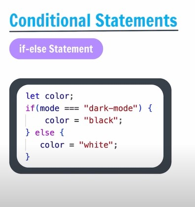
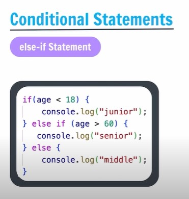
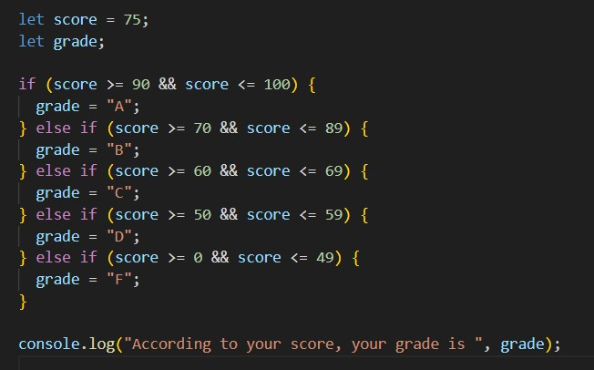
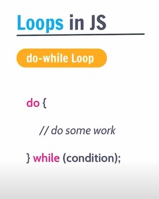
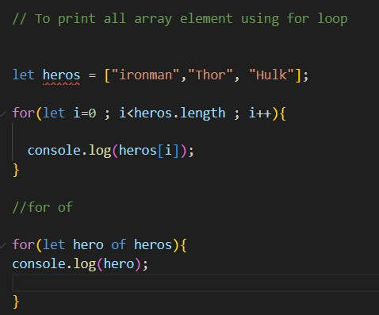

- [JAVASCRIPT](#javascript)
  - [What is JavaScript?](#what-is-javascript)
  - [How to write JS in browser chrome?](#how-to-write-js-in-browser-chrome)
  - [VS Code Installation](#vs-code-installation)
- [Chapter 1:  Variable Data Types](#chapter-1--variable-data-types)
  - [Console.log](#consolelog)
  - [Variables in JS](#variables-in-js)
  - [Variable Rules in JS](#variable-rules-in-js)
  - [let, const \& var](#let-const--var)
    - [var](#var)
    - [let](#let)
    - [const](#const)
- [Data Types in JS (Primitive \& NonPrimitive)](#data-types-in-js-primitive--nonprimitive)
  - [Primitive DataTypes (7)](#primitive-datatypes-7)
  - [NonPrimitive](#nonprimitive)
    - [Objects (Arrays, Functions)](#objects-arrays-functions)
- [Chapter 2: Operators and Conditional Statements](#chapter-2-operators-and-conditional-statements)
  - [Comments in JS](#comments-in-js)
  - [Operators in JS](#operators-in-js)
    - [Arithmetic Opeators](#arithmetic-opeators)
    - [Unary Operators **++** and **--**](#unary-operators--and---)
    - 
    - [Assignment Operators](#assignment-operators)
    - [Comparison Operators](#comparison-operators)
    - [Logical Operators](#logical-operators)
  - [Conditional Statements in JS](#conditional-statements-in-js)
      - [if Statement](#if-statement)
      - [if-else Statement](#if-else-statement)
      - [else-if Statement](#else-if-statement)
      - [Ternary Operators in JS](#ternary-operators-in-js)
      - [Switch Statement](#switch-statement)
      - [Practice Que](#practice-que)
- [Chapter 3: Loops \& Strings](#chapter-3-loops--strings)
- [Loops](#loops)
  - [for Loop](#for-loop)
  - [for Loop](#for-loop-1)
  - [while Loop](#while-loop)
  - [do-while Loop](#do-while-loop)
  - [for-of Loop \& for-in Loop](#for-of-loop--for-in-loop)
  - [for-in Loop](#for-in-loop)
      - [Practice Que](#practice-que-1)
- [Strings](#strings)
  - [Template Literals in JS](#template-literals-in-js)
  - [String Methods in JS](#string-methods-in-js)
      - [Practice Que](#practice-que-2)
- [Arrays](#arrays)
  - [Array Indices](#array-indices)
    - [Looping over an Array](#looping-over-an-array)
      - [Practice Que](#practice-que-3)
  - [Array Methods](#array-methods)

**Project**
https://github.com/codewithsadee/grilli

**MDN**
https://developer.mozilla.org/en-US/docs/Web/JavaScript/Reference/Statements/switch

# JAVASCRIPT

## What is JavaScript?
- JS is programming language used to give instructions to the computer.
- Input(code) -> Computer -> Output

## How to write JS in browser chrome?
- Open Chrome > Right Click > Open Inspect > Console > Ctrl+K (To Clean the Console)
- eg. alert("Hello JS"); -> Press Enter

##  VS Code Installation
- Its free & Popular code editor by Microsoft
- Link to Download - https://code.visualstudio.com/download

<a href="#top-of-page">(^)</a>

# Chapter 1:   Variable Data Types

## Console.log 

- IT is used to print a message to the console.
- console.log("This is console example");
- console.log('This is console example');

- To Create JS file in VS we also need html file to display in browser.
- **Shift + !**  Used to generate bydefault html code structure.
  
## Variables in JS

- Variables are containers for data.
- Dynamically typed language.
  
    - Numbers
    - String
    - Boolean (true & false)

- To print Variable we do not require "" double quote.
- eg.
        radius = 14;
        console.log(radius);

 

## Variable Rules in JS

- Variable names are case sensitive; "a" & "A" is different.
- Only letters, digits, underscore( _ ) and $ is allowed. (not even space)
- Only a letter, underscore( _ ) and $ should be 1st character.
- Reserved words can't be Variable names.
- We use Camel Case for variable declaration.
- eg. 
    - fullName (Camel Case)
    - full_name (Snake Case)
    - fill-name (Kabab Case)
    - FullName (Pascal Case)
    - fullname (Dont use)
  
 

## let, const & var

### var 
- Variable can re-declared & updated. 
- A global scope variable.
- Now we don not use in JS because ECMAScript 6 (ES6) published in 2015.
  
### let 
- Variable cannot be re-declared but can be updated. 
- A block scope variable.
  
### const 
- Variable cannot be re-declared or updated. 
- A block scope variable.
- block scope means {} 

- eg.
    - let fullName = "tony stark"; 
      let age = 24; 
      console.log(fullName); 

# Data Types in JS (Primitive & NonPrimitive)

 

## Primitive DataTypes (7)
- Number 
  - eg.  
        let age = 24;
- String
  - eg.  
        let fullName = "Tony Stark";
- Boolean
  - eg.  
        isFollow = true;
- Undefined 
  - eg.  
        let x = x;
- Null 
  - eg.  
        let x =  null;
- BigInt 
  - eg.  
        let x = BigInt("123") ;
- Symbol 
  - eg.  
        let y =  symnbol("Hello !");

## NonPrimitive 

###  Objects (Arrays, Functions)
- Its a collection of values
- Key value pair stored
  - eg. 
        age : 24  
        name : "Rahul";
  - eg. 
        const student = { 
        fullName : "Rahul Kumar",  
        age : 20,  
        cgpa = 8.2,  
        isPass : True 
        }; 

- How to access 
  - obj.key 
  - obj["key"] 
- How to update Object key value 
  - student["name"] = "Abhishek";

- **Note :** 
  1. We can Update **let** value  
  2. We cannot upate const value. 
  3. We can update const obj -> Key 
  
- eg. 
    const product = { 
title: "Ball Pen", 
offer: 5, 
price: 270, 
 }; 

- eg. 
    const profile = { 
            userName: "Anjali", 
            isfollow: false, 
            followers: 123; 
            following: 112 
    }; 

# Chapter 2:  Operators and Conditional Statements

## Comments in JS

- Part of Code which is not executed.

  
 

## Operators in JS

- Used to perform some operation on data. 

 

###  Arithmetic Opeators
- eg.  
    let a = 5; 
    let b = 6; 
    
    console.log("a + b =", a + b); 
    console.log("a - b =", a - b); 
    console.log("a * b =", a * b); 
    console.log("a / b =", a / b);  
    console.log("a % b =", a % b);  Modulus
    console.log("a ** b =", a ** b);  Exponential //5^5 = 25

### Unary Operators **++** and **--**

- eg.  
    let a = 5; 
    let b = 2; 

    a = a + 1; // 6
    a++;
    
###
- 
    a++   and   a-- (Post) 
    ++a   and   --a (Pre) 

### Assignment Operators

- To assign value 
- left = right
  - Value goes right to left
- a += 1 means a = a+1
- 
 

### Comparison Operators

- Used to compare two values.

 

### Logical Operators

- Logical AND &&  :   (all values will be true then it will return true)
- Logical OR || : (all values will be False then it will return False)
- Logical NOT ! :

 

- eg. 
    // Logical Operators 
let a = 6; 
let b = 5; 

let cond1 = a > b; //true 
let cond2 = a === 6; //true 
console.log("cond1 && cond2", cond1 && cond2); 

- //if both cond are true then it will return true 
//if one cond is false then it will return false 
/*  cond1   cond2   Result(&&)  Result(||) 
    True    True    True        True 
    True    False   False       True 
    False   True    False       True 
    False   False   False       False  
*/ 

## Conditional Statements in JS
- To implement some condition in the code.
  
#### if Statement

 

#### if-else Statement

 

#### else-if Statement
- Used to check multiple conditions
  
 

#### Ternary Operators in JS
- Used to check  with 3 Operands  
- eg.  a ? b : c  
 

#### Switch Statement

 

- Example
  
 

#### Practice Que 
1. 
 

- Ans : 

 

2.  
 
- Ans : 

 

# Chapter 3:  Loops & Strings
# Loops
## for Loop

- Loops are used to execute a piece of code again & again.

 

- Example

 

## for Loop
 - A loop that never ends.
 - Never do it in programe.
 - Stopping condition is always true.
 - It takes all memory in system.

## while Loop
- Condition will check in start ofthe loop.
  
 

- Example

 

## do-while Loop
- Condition will check in last of the loop
- We have to add Semicolon in last
- minimum it will run for 1 time.

 

- Example - It will run for 1 time

 

## for-of Loop & for-in Loop

- It help to iterate(loop) on special datatype

 

- Example - It will run for 1 time

 

- Output 

 

- Example - 

 

- Output 

 

## for-in Loop
- It returns Key of an Object and array.
- Iterator used with Object and arrays.
  
 

- Example - 

 

#### Practice Que 
1. To Print Even number from 0 to 100.
 

- Ans : 

 

2. Create a game where you start with any random game number. Ask the user to keep
guessing the game number until the user enters correct value. 

 

- Ans : 

 

# Strings
- inbuilt Properties: length

 

## Template Literals in JS
- A way to have embeded expressions in strings.
- backticks `` used to denote template literals

**String Interpolation** 
- To create string by doing substitution of placeholders

 

- Example

 

**Escape Characters** 
- \n used to move line to the **next line**
- \t used to give **tab** space 
  
## String Methods in JS

- It will not change original string. 
- It will store in variable with new string.
- Stings are **Immutable** in JS.
- str.trim is used to remove tart and end space whitespaces from string.

 

 

#### Practice Que 

1. Prompt the user to enter their full name. Generate a username for them based on the input.
Start username with @, followed by their full name and ending with the fullname length.
eg: user name = "shradhakhapra" , username should be "@shradhakhapra13"

 

- Ans : 

 

# Arrays

- Its a collection of items.
- Its linear
- Arrays are **Mutable**. Arrays we can change with index
- index/position start with 0 zero.
- Array prints undefined when there is no value present in the array.

 

## Array Indices

 

### Looping over an Array

To print all the elements in an Array.
 
Loops -> Iterable (Strings, Objects, Array) 
 
for Loop : length 
 
for(let idx=0 ; idx < arr.length ; idx++ ){ 
 
} 

1. **for Loop & for Of Loop :**

 

.jpg

#### Practice Que 

1. Qs. For a given array with marks of students -> [85, 97, 44, 37, 76, 60]
Find the average marks of the entire class.

 

- Ans : 

 

2. Qs. For a given array with prices of 5 items -> [250, 645, 300, 900, 50]
All items have an offer of 10% OFF on them. Change the array to store final price after
applying offer.

 

- Ans : 

 

## Array Methods

 
