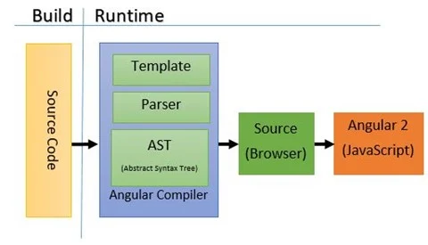
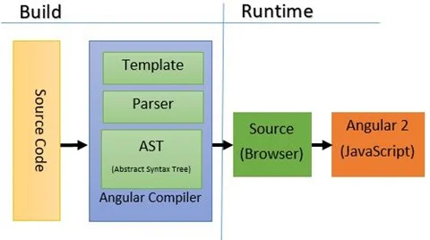
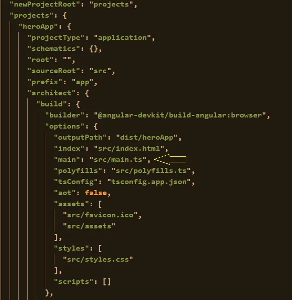
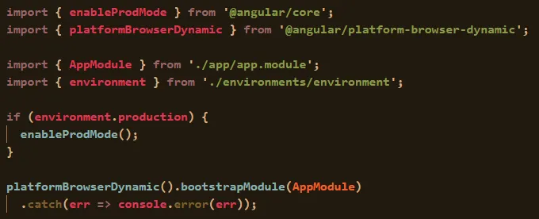
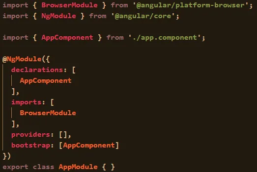
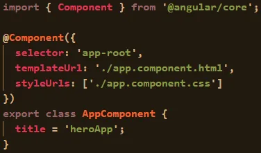
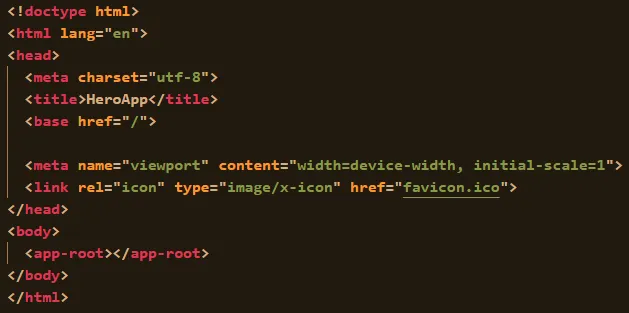
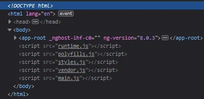

<div id="top"></div>

- [Introduction to Angular](#introduction-to-angular)
  - [How does angular work?](#how-does-angular-work)
    - [JIT vs AOT compiler?](#jit-vs-aot-compiler)
    - [Ivy and V8 engine](#ivy-and-v8-engine)
    - [Bootstrapping process](#bootstrapping-process)
    - [Entry point](#entry-point)
    - [Load Environment and Bootstrap Module](#load-environment-and-bootstrap-module)
    - [Bootstrap component](#bootstrap-component)
    - [Initialize component](#initialize-component)
    - [Render component](#render-component)


<br />

# Introduction to Angular

## How does angular work?
- Let’s understand what the angular compiler does when we run the command `ng serve` by following a step-by-step process:

<br />

### JIT vs AOT compiler?
- `JIT (Just-In-Time)` and `AOT (Ahead-of-Time)` are two different compilation modes used in Angular to convert your application's TypeScript code and templates into executable JavaScript code.

- **Just-In-Time (JIT)**
  - In the JIT compiler`(aka dynamic translation / run-time compilations)`, the compilation happens during runtime in the browser.
  - JIT compilation is suitable for development environments because it allows developers to make changes to their applications and see the changes immediately without having to recompile the entire application.<br /><br />
    <br />

<br />

- **Ahead-Of-Time (AOT)**
  - In the AOT compiler, the compilation process usually occurs during build time.
  - AOT compilation is suitable for production environments because it offers faster startup times, smaller bundle sizes, and better security.<br /><br />
  <br />

<br />

- **Differenece between JIT and AOT**

    |JIT|AOT|
    |:----|:----|
    |The JIT compilation happens during runtime in the browser.|The AOT compilation process happens during build time.|
    |Loading in JIT is slower than the AOT because it needs to compile your application at runtime.|Loading in AOT is much quicker than the JIT because it already has compiled your code at build time.|
    |JIT is more suitable for development mode.|AOT is much suitable for production mode.|
    |Bundle size is higher compare to AOT.|Bundle size optimized in AOT, in results AOT bundle size is half the size of JIT bundles.|
    |You can run your app in JIT with this command: `ng build` OR `ng serve`|To run your app in AOT you have to provide –aot at the end like: `ng build --aot` OR `ng serve --aot`|
    |You can catch template binding error at display time.|You can catch the template error at building your application.|

<p align="right">(<a href="#top">˄</a>)</p>

### Ivy and V8 engine
- **Ivy**
  - Ivy is the codename for the next-generation compilation and rendering pipeline of the Angular framework.
  - Ivy is responsible for compiling and optimizing the application code
  - **Benefits of Ivy**:
    - Smaller bundle size with tree shaking process(remove unused code).
    - Improved debugging and error info instead of `zone.js` tracing out particular component lines or template names.
    - Using incremental Dom instead of Virtual Dom for change comparison.
    - Enhanced Type checking instead of runtime check.

<br />

- **V8 engine**
  - The V8 engine is an open-source JavaScript engine developed by Google.
  - V8 engine executes the generated JavaScript code and handles the rendering and updating of the application's user interface in the browser.

<br />

- **How Ivy and V8 Work Together:**
  - **Compilation Phase:** 
    - Ivy takes your Angular application's TypeScript code and templates and transforms them into optimized JavaScript code.
  - **Execution Phase**
    - The V8 engine compiles the JavaScript code further into machine code and executes it.
    - During execution, the V8 engine interacts with the browser's Document Object Model (DOM) to render the UI based on the generated code.
  - **Change Detection and Rendering**
    - When data changes in the application, Ivy's change detection system identifies the changes and triggers the necessary updates to the DOM. 
    - The V8 engine plays a role in executing the change detection and rendering logic, ensuring that the updated UI is displayed to the user.

<p align="right">(<a href="#top">˄</a>)</p>

### Bootstrapping process
- Bootstrapping is the process of initializing or loading our Angular application.
  - With the help of the `TypeScript compiler(TSC)`, the compilation of application Javascript code starts.
  - `Webpack` is used for bundling and minification of javascript files.
  - The deployment and bootstrapping process take place.
  - Run the `JIT compiler` for all components, directives and pipes.
  - Render `index.html` in the browser.

<br />

- Angular takes the following steps to load our first view:
    - Loads Angular, Third-party libraries and Application
    - Executes application entry point (angular.json)
    - Load environment & Bootstrap Module (main.ts)
    - Bootstrap Component (app.module.ts)
    - Initialize component (app.component.ts)
    - Render component (index.html)

<p align="right">(<a href="#top">˄</a>)</p>

### Entry point
- To find the entry point, angular looks into the main property of the `angular.json` file.
- The main property defines the entry point of the application.<br /><br />
    <br />

<p align="right">(<a href="#top">˄</a>)</p>

### Load Environment and Bootstrap Module
- The `main.ts` file creates a browser environment and loads the module.
- All angular applications require a browser environment to run 
- To create an angular application, we require a module.<br />
- `platformBrowserDynamic()` creates a browser environment and, `bootstrapModule()` loads the module.<br /><br />
  ```ts
  platformBrowserDynamic().bootstrapModule(AppModule)
  ```
  <br />
    <br />

<p align="right">(<a href="#top">˄</a>)</p>

### Bootstrap component
- The angular compiler looks inside the bootstrap property of the AppModule.
- `AppModule` declared inside the `app.module.ts` file, consists of all the declarations of components, services, and other modules that are required by the application.
- We see that `AppComponent` is the component used for bootstrapping the application.<br />
    <br />

<p align="right">(<a href="#top">˄</a>)</p>

### Initialize component
- The angular compiler looks into the `AppComponent` and initializes it.
- Every component consists of three properties:
    - **selector**: used for accessing the component.
    - **template/templateUrl**: contains the view (HTML) of the component.
    - **style/styleUrls**: contains styles for the view.<br />
    <br />

<p align="right">(<a href="#top">˄</a>)</p>

### Render component
- The compiler renders the `index.html` file.
- The `index.html` file is the file used by the angular compiler to render our application inside the browser.
- This file loads the root component of the application (`AppComponent`) by using the selector (`<app-root>`).<br />
    <br />

<br />

- The compiler dynamically adds all the required JavaScript files before the enclosing body tag (`</body>`) when the application gets rendered:<br />
    <br />

<p align="right">(<a href="#top">˄</a>)</p>