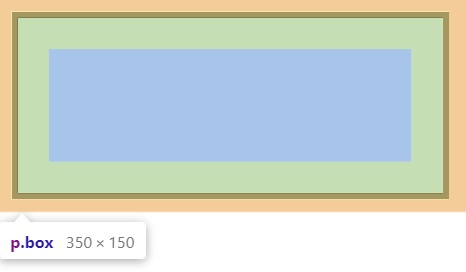

<div id="top"></div>

- [Introduction](#introduction)
  - [How CSS works?](#how-css-works)
  - [What is CSS?](#what-is-css)
  - [CSS syntax](#css-syntax)
  - [CSS modules](#css-modules)
  - [Getting started with CSS](#getting-started-with-css)
  - [Changing the default behavior of elements](#changing-the-default-behavior-of-elements)
  - [Adding a class](#adding-a-class)
  - [Styling things based on their location in a document](#styling-things-based-on-their-location-in-a-document)
  - [Styling things based on state](#styling-things-based-on-state)
  - [Combining selectors and combinators](#combining-selectors-and-combinators)
  - [Applying CSS to HTML](#applying-css-to-html)
  - [Selectors](#selectors)
  - [Specificity or cascade](#specificity-or-cascade)
  - [Properties and values](#properties-and-values)
  - [Functions](#functions)
  - [The calc function](#the-calc-function)
  - [Transform functions](#transform-functions)
  - [@rules](#rules)
    - [@import](#import)
    - [@media](#media)
  - [Shorthands](#shorthands)
  - [Comments](#comments)
  - [White space](#white-space)
  - [How CSS works](#how-css-works-1)
  - [What happens if a browser encounters CSS it does-not understand?](#what-happens-if-a-browser-encounters-css-it-does-not-understand)
- [CSS building blocks](#css-building-blocks)
  - [Cascade](#cascade)
  - [Specificity](#specificity)
  - [Inheritance](#inheritance)
    - [Resetting all property values](#resetting-all-property-values)
    - [Inline styles](#inline-styles)
    - [Important](#important)
  - [Selector](#selector)
  - [Type, class, and ID selectors](#type-class-and-id-selectors)
  - [Attribute selectors](#attribute-selectors)
  - [Pseudo-classes and pseudo-elements](#pseudo-classes-and-pseudo-elements)
  - [Combinators](#combinators)
  - [The box model](#the-box-model)
  - [The standard CSS box model](#the-standard-css-box-model)
  - [The alternative CSS box model](#the-alternative-css-box-model)
  - [Margin](#margin)
  - [Borders](#borders)
  - [Padding](#padding)
  - [Inline boxes](#inline-boxes)
  - [Backgrounds](#backgrounds)
    - [Background colors](#background-colors)
    - [Background images](#background-images)
  - [Controlling background-repeat](#controlling-background-repeat)
  - [Sizing the background image](#sizing-the-background-image)
  - [Positioning the background image](#positioning-the-background-image)
  - [Gradient backgrounds](#gradient-backgrounds)
  - [Multiple background images](#multiple-background-images)
  - [Background attachment](#background-attachment)
  - [Using the background shorthand property](#using-the-background-shorthand-property)
  - [Borders](#borders-1)
    - [Border rounded corners](#border-rounded-corners)
  - [Text directions](#text-directions)
  - [Writing mode](#writing-mode)
  - [Overflow](#overflow)
    - [Overflow visible](#overflow-visible)
    - [Overflow hidden](#overflow-hidden)
    - [Overflow scroll](#overflow-scroll)
    - [Overflow auto](#overflow-auto)
  - [CSS values and units](#css-values-and-units)
  - [Numbers, lengths, and percentages](#numbers-lengths-and-percentages)
  - [Length](#length)
  - [Content](#content)
  - [Content](#content-1)
- [ContentHead](#contenthead)
  - [Content](#content-2)
- [ContentHead](#contenthead-1)
  - [Content](#content-3)


<br />

# Introduction

## How CSS works?
- The browser loads the HTML (e.g. receives it from the network).
- It converts the HTML into a DOM (Document Object Model). The DOM represents the document in the computer's memory.
- **HTML and CSS Rendering**: 
  - The browser then fetches most of the resources that are linked to by the HTML document, such as embedded images, videos, and even linked CSS!
  - CSS is render-blocking.
- **Parse HTML/CSS**: 
  - The browser parses the fetched CSS, and sorts the different rules by their selector types into different "buckets", e.g. element, class, ID, and so on. 
- **Render tree**:
  - Based on the selectors it finds, it works out which rules should be applied to which nodes in the DOM, and attaches style to them as required (this intermediate step is called a render tree).
- **Layout**: 
  - The render tree is laid out in the structure it should appear in after the rules have been applied to it.
- **Paiting**: 
  - The visual display of the page is shown on the screen.<br /><br />
  <br />

<p align="right">(<a href="#top">˄</a>)</p>

## What is CSS?

- CSS (Cascading Style Sheets) allows you to create great-looking web pages.
- CSS is a language for specifying how documents are presented to users — how they are styled, laid out, etc.
- CSS can be used for very basic document text styling — for example, for changing the color and size of headings and links.

<p align="right">(<a href="#top">˄</a>)</p>

## CSS syntax

- Syntax:<br />

  ```css
  selector {
    property: value;
  }
  ```

- Example:<br />
  ```css
  h1 {
    color: red;
    font-size: 5em;
  }
  ```

<p align="right">(<a href="#top">˄</a>)</p>

## CSS modules

- CSS files in which all class names and animation names are scoped locally by default.
- CSS modules do not have an official specification nor are they a browser feature. They are part of a compilation process that executes against your project to convert scoped classes and selectors into CSS files that the browser can parse and understand.
- Tools such as Webpack are used to perform this compilation process.

- List of modules

  - Compositing and Blending
  - CSS Animations
  - CSS Backgrounds and Borders
  - CSS Basic User Interface
  - CSS Box Model
  - CSS Charsets
  - CSS Colors
  - CSS Multi-column Layout
  - CSS Conditional Rules
  - CSS Counter Styles
  - DeprecatedCSS Device Adaptation
  - CSS Display
  - CSS Flexible Box Layout
  - CSS Fonts
  - CSS Fragmentation
  - CSS Generated Content
  - CSS Grid Layout
  - ExperimentalCSS Houdini
  - CSS Images
  - CSS Lists
  - CSS Logical Properties and Values
  - CSS Masking
  - CSS Miscellaneous
  - CSS Motion Path
  - CSS Namespaces
  - CSS Paged Media
  - CSS Positioned Layout
  - CSS Ruby Layout
  - CSS Scroll Snap
  - CSS Scroll Snap Points
  - CSS Scrollbars
  - CSS selectors
  - CSS Shapes
  - CSS Table
  - CSS Text
  - CSS Text Decoration
  - CSS Transforms
  - CSS Transitions
  - CSS data types
  - CSS Custom Properties for Cascading Variables
  - CSS Writing Modes
  - CSSOM View
  - Filter Effects

- Example:<br />
  - A class is applied in HTML:
  ```html
  <h1 class="title">An example heading</h1>
  ```
  - And that class is styled in CSS:
  ```css
  .title {
    background-color: red;
  }
  ```

<p align="right">(<a href="#top">˄</a>)</p>

## Getting started with CSS

- HTML: index.html

  ```html
  <!DOCTYPE html>
  <html lang="en">
    <head>
      <meta charset="utf-8" />
      <title>Getting started with CSS</title>
    </head>

    <body>
      <h1>I am a level one heading</h1>

      <p>
        This is a paragraph of text. In the text is a
        <span>span element</span> and also a
        <a href="https://example.com">link</a>.
      </p>

      <p>
        This is the second paragraph. It contains an
        <em>emphasized</em> element.
      </p>

      <ul>
        <li>Item <span>one</span></li>
        <li>Item two</li>
        <li>Item <em>three</em></li>
      </ul>
    </body>
  </html>
  ```

- Adding CSS to our document: Inside head tag
  ```html
  <!DOCTYPE html>
  <html lang="en">
    <head>
      ...
      <link rel="stylesheet" href="styles.css" />
    </head>
    ...
  </html>
  ```
- CSS: styles.css

  ```css
  /* Styling heading element */
  h1 {
    color: red;
  }

  /* Styling HTML elements */
  p {
    color: green;
  }

  /* Styling multiple target */
  p,
  li {
    color: green;
  }
  ```

- Output:<br />
  <br />

<p align="right">(<a href="#top">˄</a>)</p>

## Changing the default behavior of elements

- If you don't want those bullets, you can remove them like so:

  ```css
  li {
    list-style-type: none;
  }
  ```

- Output:<br />
  <br />

<p align="right">(<a href="#top">˄</a>)</p>

## Adding a class

- Add class attribute
  ```html
  <ul>
    <li>Item one</li>
    <li class="special">Item two</li>
    <li>Item <em>three</em></li>
  </ul>
  ```
- Add css

  ```css
  /* class is selected by "." sign*/
  .special {
    color: orange;
    font-weight: bold;
  }

  /* selector along with class */
  li.special {
    color: orange;
    font-weight: bold;
  }
  ```

- Output:<br />
  <br />

<p align="right">(<a href="#top">˄</a>)</p>

## Styling things based on their location in a document

- css

  ```css
  /* This selector will select any <em> element that is inside (a descendant of) an <li> */
  li em {
    color: rebeccapurple;
  }

  /* styling a paragraph when it comes directly after a heading at the same hierarchy level */
  h1 + p {
    font-size: 200%;
  }
  ```

- Output:<br />
  <br />
  <br />
  <br />

## Styling things based on state

- css

  ```css
  a:link {
    color: pink;
  }

  a:hover {
    text-decoration: none;
  }

  a:visited {
    color: green;
  }
  ```

- Output:<br />
  Link:<br />
  <br /><br />
  Hover:<br />
  <br /><br />
  Visited:<br />
  <br />
  <br />
  <br />

<p align="right">(<a href="#top">˄</a>)</p>

## Combining selectors and combinators

- Example:<br />

  ```css
  /* selects any <span> that is inside a <p>, which is inside an <article>  */
  article p span {
  }

  /* selects any <p> that comes directly after a <ul>, which comes directly after an <h1>  */
  h1 + ul + p {
  }

  /* combine multiple types together */
  body h1 + p .special {
    color: yellow;
    background-color: black;
    padding: 5px;
  }
  ```

<p align="right">(<a href="#top">˄</a>)</p>

## Applying CSS to HTML

1.  External stylesheet:

- Reference a file on your file system

  ```html
  <!-- Inside current directory -->
  <link rel="stylesheet" href="style.css" />

  <!-- Inside a subdirectory called styles inside the current directory -->
  <link rel="stylesheet" href="styles/style.css" />

  <!-- Inside a subdirectory called general, which is in a subdirectory called styles, inside the current directory -->
  <link rel="stylesheet" href="styles/general/style.css" />

  <!-- Go up one directory level, then inside a subdirectory called styles -->
  <link rel="stylesheet" href="../styles/style.css" />
  ```

- Example:<br />
  - index.html<br />
    ```html
    <!DOCTYPE html>
    <html lang="en-GB">
      <head>
        <meta charset="utf-8" />
        <title>My CSS experiment</title>
        <link rel="stylesheet" href="styles.css" />
      </head>
      <body>
        <h1>Hello World!</h1>
        <p>This is my first CSS example</p>
      </body>
    </html>
    ```
  - styles.css<br />
    ```css
    h1 {
      color: blue;
      background-color: yellow;
      border: 1px solid black;
    }
    p {
      color: red;
    }
    ```

<p align="right">(<a href="#top">˄</a>)</p>

2.  Internal stylesheet

- Example: <br />

  ```html
  <!DOCTYPE html>
  <html lang="en-GB">
    <head>
      <meta charset="utf-8" />
      <title>My CSS experiment</title>
      <style>
        h1 {
          color: blue;
          background-color: yellow;
          border: 1px solid black;
        }

        p {
          color: red;
        }
      </style>
    </head>
    <body>
      <h1>Hello World!</h1>
      <p>This is my first CSS example</p>
    </body>
  </html>
  ```

<p align="right">(<a href="#top">˄</a>)</p>

3. Inline styles

- Example:<br />
  ```html
  <!DOCTYPE html>
  <html lang="en-GB">
    <head>
      <meta charset="utf-8" />
      <title>My CSS experiment</title>
    </head>
    <body>
      <h1 style="color: blue;background-color: yellow;border: 1px solid black;">
        Hello World!
      </h1>
      <p style="color:red;">This is my first CSS example</p>
    </body>
  </html>
  ```

<p align="right">(<a href="#top">˄</a>)</p>

## Selectors

- A selector targets HTML to apply styles to content.
- Example:<br />
  ```css
  h1
  a:link
  .manythings
  #onething
  *
  .box p
  .box p:first-child
  h1, h2, .intro
  ```

<p align="right">(<a href="#top">˄</a>)</p>

## Specificity or cascade

- The CSS language has rules to control which selector is stronger in the event of a conflict. These rules are called cascade and specificity
- Example:<br />

  - html

    ```html
    <p class="special">What color am I?</p>
    ```

  - css<br />
    ```css
    .special {
      color: red;
    }
    p {
      color: blue;
    }
    ```
    <br />
  - Which color will apply?<br/>
  - Output:<br />
    
  - Here there is a conflict between the class selector and the element selector.
  - A class is rated as being more specific, as in having more specificity than the element selector, so it cancels the other conflicting style declaration.

<p align="right">(<a href="#top">˄</a>)</p>

## Properties and values

- Properties:
  - These are human-readable identifiers that indicate which stylistic features you want to modify.
  - Example: font-size, width, background-color.
- Values:
  - Each property is assigned a value. This value indicates how to style the property.
  - Example: 11px, 1rem, yellow

<p align="right">(<a href="#top">˄</a>)</p>

## Functions

- There are some values that take the form of a function.

<p align="right">(<a href="#top">˄</a>)</p>

## The calc function

- Can do simple math within CSS.

- Example:

  ```html
  <div class="outer"><div class="box">The inner box is 90% - 30px.</div></div>
  ```

  ```css
  .outer {
    border: 5px solid black;
  }

  .box {
    padding: 10px;
    width: calc(90% - 30px);
    background-color: rebeccapurple;
    color: white;
  }
  ```

- Output:<br />
  

<p align="right">(<a href="#top">˄</a>)</p>

## Transform functions

- Example:

  ```html
  <div class="box"></div>
  ```

  ```css
  .box {
    margin: 30px;
    width: 100px;
    height: 100px;
    background-color: rebeccapurple;
    transform: rotate(0.8turn);
  }
  ```

- Output:<br />
  

<p align="right">(<a href="#top">˄</a>)</p>

## @rules

- CSS @rules (pronounced "at-rules") provide instruction for what CSS should perform or how it should behave.

<p align="right">(<a href="#top">˄</a>)</p>

### @import

```css
@import "styles2.css";
```

<p align="right">(<a href="#top">˄</a>)</p>

### @media

```css
body {
  background-color: pink;
}

@media (min-width: 30em) {
  body {
    background-color: blue;
  }
}
```

<p align="right">(<a href="#top">˄</a>)</p>

## Shorthands

- Some properties like font, background, padding, border, and margin are called shorthand properties.
- Example:<br />

  ```css
  /* top, right, bottom, left (clockwise from the top) */
  padding: 10px 15px 15px 5px;

  /* is equivalent to these four lines of code: */
  padding-top: 10px;
  padding-right: 15px;
  padding-bottom: 15px;
  padding-left: 5px;
  ```

  ```css
  background: red url(bg-graphic.png) 10px 10px repeat-x fixed;

  /* is equivalent to these five lines:: */
  background-color: red;
  background-image: url(bg-graphic.png);
  background-position: 10px 10px;
  background-repeat: repeat-x;
  background-attachment: fixed;
  ```

<p align="right">(<a href="#top">˄</a>)</p>

## Comments

- CSS comments begin with /_ and end with _/.
- Example:<br />

  ```css
  /* Handle basic element styling */
  /* ---------------------------- */
  body {
    font: 1em/150% Helvetica, Arial, sans-serif;
    padding: 1em;
    margin: 0 auto;
    max-width: 33em;
  }

  /*.special {
    color: red;
  }*/
  ```

<p align="right">(<a href="#top">˄</a>)</p>

## White space

```css
/* valid */
margin: 0 auto;
padding-left: 10px;


/* invalid */
margin: 0auto;
padding- left: 10px;
```

<p align="right">(<a href="#top">˄</a>)</p>

## How CSS works

- Simple view of the process:<br />
  <br />

<p align="right">(<a href="#top">˄</a>)</p>

## What happens if a browser encounters CSS it does-not understand?

- Html
  ```html
  <p>I want this text to be large, bold and blue.</p>
  ```
  ```css
  p {
    font-weight: bold;
    colour: blue; /* incorrect spelling of the color property */
    font-size: 200%;
  }
  ```
- Output:<br />
  <br />


<p align="right">(<a href="#top">˄</a>)</p>


# CSS building blocks

<br />

## Cascade

- When two rules from the same cascade layer apply and both have equal specificity, the one that is defined last in the stylesheet is the one that will be used.
- Example:<br />
  ```html
  <h1>This is my heading.</h1>
  ```
  ```css
  h1 {
    color: red;
  }
  h1 {
    color: blue;
  }
  ```
- Output:<br />
  <br />

<p align="right">(<a href="#top">˄</a>)</p>

## Specificity

- Specificity is the algorithm that the browser uses to decide which property value is applied to an element.
- Specificity is basically a measure of how specific a selector's selection will be
- Example:<br />

  - html

    ```html
    <p class="special">What color am I?</p>
    ```

  - css<br />
    ```css
    .special {
      color: red;
    }
    p {
      color: blue;
    }
    ```
    <br />
  - Which color will apply?<br/>
  - Output:<br />
    
  - Here there is a conflict between the class selector and the element selector.
  - A class is rated as being more specific, as in having more specificity than the element selector, so it cancels the other conflicting style declaration.

<p align="right">(<a href="#top">˄</a>)</p>

## Inheritance

- Some CSS property values set on parent elements are inherited by their child elements, and some aren't. ex. color and font-family
- Some properties do not inherit — for example, if you set a width of 50% on an element, all of its descendants do not get a width of 50% of their parent's width.
- CSS provides five special universal property values for controlling inheritance.
  1. inherit
     - element to be the same as that of its parent element
  2. initial
     - element to the initial value of that property
  3. revert
     - Resets the property value
  4. revert-layer
     - Resets the property value applied to a selected element to the value established in a previous cascade layer.
  5. unset
     - Resets the property to its natural value
- Example:<br />

  - html

    ```html
    <ul class="main">
      <li>Item One</li>
      <li>
        Item Two
        <ul>
          <li>2.1</li>
          <li>2.2</li>
        </ul>
      </li>
      <li>
        Item Three
        <ul class="special">
          <li>
            3.1
            <ul>
              <li>3.1.1</li>
              <li>3.1.2</li>
            </ul>
          </li>
          <li>3.2</li>
        </ul>
      </li>
    </ul>
    ```

  - css<br />
    ```css
    .main {
      color: rebeccapurple;
      border: 2px solid #ccc;
      padding: 1em;
    }
    .special {
      color: black;
      font-weight: bold;
    }
    ```
    <br />
  - Output:<br />
    

<p align="right">(<a href="#top">˄</a>)</p>

### Resetting all property values

- html

  ```html
  <blockquote>
    <p>This blockquote is styled</p>
  </blockquote>

  <blockquote class="fix-this">
    <p>This blockquote is not styled</p>
  </blockquote>
  ```

- css<br />
  ```css
  blockquote {
    background-color: red;
    border: 2px solid green;
  }
  .fix-this {
    all: unset;
  }
  ```
  <br />
- Output:<br />
  

<p align="right">(<a href="#top">˄</a>)</p>

### Inline styles

- Inline styles, that is, the style declaration inside a style attribute, take precedence over all normal styles, no matter the specificity.

<p align="right">(<a href="#top">˄</a>)</p>

### Important

- overrule all css using !important
- html

  ```html
  <p class="better" style="color:red">This is a paragraph.</p>
  ```

- css<br />
  ```css
  p {
    color: green !important;
  }
  ```
  <br />
- Output:<br />
  

<p align="right">(<a href="#top">˄</a>)</p>

## Selector

- A CSS selector is the first part of a CSS Rule.

<p align="right">(<a href="#top">˄</a>)</p>

## Type, class, and ID selectors

```css
/* type select by tag name */
h1 {
}

/* class select by . keyword */
.box {
}

/* id select by # keyword */
#unique {
}
```

<p align="right">(<a href="#top">˄</a>)</p>

## Attribute selectors

```css
/* Attribute select by [attribute-name] */
a[title] {
}

/* Select attribute with value */
a[href="https://example.com"]
{
}
```

<p align="right">(<a href="#top">˄</a>)</p>

## Pseudo-classes and pseudo-elements

```css
/* Pseudo-classes */
a:hover {
}

/* pseudo-elements */
p::first-line {
}
```

<p align="right">(<a href="#top">˄</a>)</p>

## Combinators

```css
article > p {
}
```

<p align="right">(<a href="#top">˄</a>)</p>

## The box model

- Everything in CSS has a box around it

- Parts:

  - Content box
    - The area where your content is displayed
  - Padding box
    - The padding sits around the content as white space
  - Border box
    - The border box wraps the content and any padding
  - Margin box
    - The margin is the outermost layer, wrapping the content, padding, and border

- Box Model:<br />
  

<p align="right">(<a href="#top">˄</a>)</p>

## The standard CSS box model

- Assume that a box has the following CSS:
  ```html
  <div class="box"></div>
  ```
  ```css
  .box {
    width: 350px;
    height: 150px;
    margin: 10px;
    padding: 25px;
    border: 5px solid black;
  }
  ```
- Output:<br />
  
- The actual space taken up by the box will be 410px wide (350 + 25 + 25 + 5 + 5) and 210px high (150 + 25 + 25 + 5 + 5).

<p align="right">(<a href="#top">˄</a>)</p>

## The alternative CSS box model

- Any width and height is the same width and height of the visible box.
  ```html
  <div class="box"></div>
  ```
  ```css
  .box {
    box-sizing: border-box; /* alternative css box model */
    width: 350px;
    height: 150px;
    margin: 10px;
    padding: 25px;
    border: 5px solid black;
  }
  ```
- Output:<br />
  

- To use the alternative box model for all of your elements (which is a common choice among developers)
  ```css
  html {
    box-sizing: border-box;
  }
  *,
  *::before,
  *::after {
    box-sizing: inherit;
  }
  ```

<p align="right">(<a href="#top">˄</a>)</p>

## Margin

- The margin is an invisible space around your box.
- Example:<br />
  ```html
  <div class="container">
    <div class="box">This is a box.</div>
    This is a container
  </div>
  ```
  ```css
  .container {
    border: 1px solid red;
    height: 10rem;
    width: 18rem;
    /* Apply margin to all sides */
    margin: 2rem;
  }
  .box {
    margin-top: -15px;
    margin-right: 30px;
    margin-bottom: 40px;
    margin-left: 4em;
    border: 1px solid blue;
  }
  ```
- Output:<br />
  

<p align="right">(<a href="#top">˄</a>)</p>

## Borders

- The border is drawn between the margin and the padding of a box.

- To set the properties of each side individually
  - border-top
  - border-right
  - border-bottom
  - border-left
- To set the width, style, or color of all sides
  - border-width
  - border-style
  - border-color
- To set the width, style, or color of a single side

  - border-top-width
  - border-top-style
  - border-top-color
  - border-right-width
  - border-right-style
  - border-right-color
  - border-bottom-width
  - border-bottom-style
  - border-bottom-color
  - border-left-width
  - border-left-style
  - border-left-color

- Example:<br />

  ```html
  <div class="container">
    <div class="box">This is a box.</div>
    This is a container
  </div>
  ```

  ```css
  .container {
    border-top: 5px dotted green;
    border-right: 1px solid black;
    border-bottom: 20px double rgb(23, 45, 145);
    width: 15rem;
  }

  .box {
    border: 1px solid #333333;
    border-top-style: dotted;
    border-right-width: 20px;
    border-bottom-color: hotpink;
  }
  ```

- Output:<br />
  

<p align="right">(<a href="#top">˄</a>)</p>

## Padding

- The padding sits between the border and the content area and is used to push the content away from the border.
- Example:<br />

  ```html
  <div class="container">
    <div class="box">This is a box.</div>
  </div>
  ```

  ```css
  .container {
    border: 1px solid red;
    padding: 10px;
    width: 15rem;
  }
  .box {
    padding-top: 10px;
    padding-right: 20px;
    padding-bottom: 5px;
    padding-left: 15px;
    border: 1px solid cyan;
  }
  ```

- Output:<br />
  

<p align="right">(<a href="#top">˄</a>)</p>

## Inline boxes

- "display: inline-block" is a special value of display, which provides a middle ground between inline and block.
- Example:<br />

  ```html
  <p>
    I am a paragraph and this is a <span>span</span> inside that paragraph. A
    span is an inline element and so does not respect width and height.
  </p>
  ```

  ```css
  p {
    width: 15rem;
  }
  span {
    margin: 20px;
    padding: 20px;
    width: 80px;
    height: 50px;
    background-color: lightblue;
    border: 2px solid blue;
    display: inline-block;
  }
  ```

- Output:<br />
  

<p align="right">(<a href="#top">˄</a>)</p>

## Backgrounds

### Background colors

- Example:<br />
  ```html
  <div class="box">
    <h2>Background Colors</h2>
    <p>Try changing the background <span>colors</span>.</p>
  </div>
  ```
  ```css
  .box {
    background-color: #567895;
    width: 15rem;
    padding: 1rem;
  }
  h2 {
    background-color: black;
    color: white;
  }
  span {
    background-color: rgba(255, 255, 255, 0.5);
  }
  ```
- Output:<br />
  

<p align="right">(<a href="#top">˄</a>)</p>

### Background images

- Example:<br />
  ```html
  <div class="box"></div>
  ```
  ```css
  .box {
    background: url(images/star.png);
    padding: 3rem;
    width: 15rem;
  }
  ```
- Output:<br />
  

<p align="right">(<a href="#top">˄</a>)</p>

## Controlling background-repeat

- background-repeat values

  - no-repeat: stop the background from repeating altogether.
  - repeat-x: repeat horizontally.
  - repeat-y: repeat vertically.
  - repeat: the default; repeat in both directions.

- Example:<br />
  ```html
  <div class="box"></div>
  ```
  ```css
  .box {
    background: url(images/star.png);
    background-repeat: no-repeat;
    padding: 3rem;
    width: 15rem;
  }
  ```
- Output:<br />
  

<p align="right">(<a href="#top">˄</a>)</p>

## Sizing the background image

- background-size values

  - length or percentage
    - 15px or 10%
  - cover
    - the browser will make the image just large enough so that it completely covers the box area
  - contain
    - the browser will make the image the right size to fit inside the box.

- Example:<br />
  ```html
  <div class="box"></div>
  ```
  ```css
  .box {
    background: url(images/balloons.jpg);
    background-repeat: no-repeat;
    background-size: 100px 10em;
    padding: 3rem;
    width: 15rem;
  }
  ```
- Output:<br />
  

<p align="right">(<a href="#top">˄</a>)</p>

## Positioning the background image

- background-position values

  - background-position-y: top 20px;
  - background-position-x: right 10px;

- Example:<br />
  ```html
  <div class="box"></div>
  ```
  ```css
  .box {
    background: url(images/star.png);
    background-repeat: no-repeat;
    background-position: top 20px right 10px; /* top right */
    padding: 3rem;
    width: 15rem;
  }
  ```
- Output:<br />
  

<p align="right">(<a href="#top">˄</a>)</p>

## Gradient backgrounds

- <a href="https://developer.mozilla.org/en-US/docs/Web/CSS/gradient">Gradient type</a>

- Example:<br />
  ```html
  <div class="box"></div>
  ```
  ```css
  .box {
    background-image: linear-gradient(105deg, cyan 39%, black 96%);
    /* background-image: radial-gradient(circle, cyan 39%, black 96%); */
    padding: 3rem;
    width: 15rem;
  }
  ```
- Output:<br />
  

  <br />
  <br />

## Multiple background images

- The background-\* properties can also have comma-separated values in the same way as background-image

  ```css
  background-image: url(image1.png), url(image2.png), url(image3.png),
    url(image4.png);
  background-repeat: no-repeat, repeat-x, repeat;
  background-position: 10px 20px, top right;
  ```

- Example:<br />
  ```html
  <div class="wrapper">
    <div class="box"></div>
  </div>
  ```
  ```css
  .box {
    background-image: url(images/star.png), url(images/big-star.png);
    padding: 3rem;
    width: 15rem;
  }
  ```
- Output:<br />
  

<p align="right">(<a href="#top">˄</a>)</p>

## Background attachment

- On scroll how image should behave
- The background-attachment values

  - scroll
  - fixed
  - local

- Example:<br />
  ```html
  <div class="wrapper">
    <div class="box"></div>
  </div>
  ```
  ```css
  .box {
    background: url(images/star.png);
    background-attachment: fixed;
    height: 50px;
  }
  ```
- Output:<br />
  

<p align="right">(<a href="#top">˄</a>)</p>

## Using the background shorthand property

- This shorthand lets you set all of the different properties at once.

- Example:<br />
  ```html
  <div class="wrapper">
    <div class="box"></div>
  </div>
  ```
  ```css
  .box {
    background: linear-gradient(
          105deg,
          rgba(255, 255, 255, 0.2) 39%,
          rgba(51, 56, 57, 1) 96%
        ) center center / 100px 50px no-repeat, url(images/big-star.png) center
        no-repeat, rebeccapurple;
    padding: 3rem;
    width: 15rem;
  }
  ```
- Output:<br />
  

<p align="right">(<a href="#top">˄</a>)</p>

## Borders

- We can set a border for all four sides of a box with border:

  ```css
  .box {
    border: 1px solid black;
  }
  ```

  Or we can target one edge of the box, for example:

  ```css
  .box {
    border-top: 1px solid black;
  }
  ```

  The individual properties for these shorthands would be:

  ```css
  .box {
    border-width: 1px;
    border-style: solid;
    border-color: black;
  }
  ```

  And for the longhands:

  ```css
  .box {
    border-top-width: 1px;
    border-top-style: solid;
    border-top-color: black;
  }
  ```

- Example:<br />

  ```html
  <div class="container">
    <div class="box">This is a box.</div>
    This is a container
  </div>
  ```

  ```css
  .container {
    border-top: 5px dotted green;
    border-right: 1px solid black;
    border-bottom: 20px double rgb(23, 45, 145);
    width: 15rem;
  }

  .box {
    border: 1px solid #333333;
    border-top-style: dotted;
    border-right-width: 20px;
    border-bottom-color: hotpink;
  }
  ```

- Output:<br />
  

<p align="right">(<a href="#top">˄</a>)</p>

### Border rounded corners

- Example:<br />

  ```html
  <div class="container">
    <div class="box">This is a box.</div>
    This is a container
  </div>
  ```

  ```css
  .box {
    border: 10px solid rebeccapurple;
    border-radius: 1em;
    border-top-right-radius: 10% 30%;
    padding: 3rem;
    width: 15rem;
  }
  ```

- Output:<br />
  

<p align="right">(<a href="#top">˄</a>)</p>

## Text directions

<p align="right">(<a href="#top">˄</a>)</p>

## Writing mode

- A writing mode in CSS refers to whether the text is running horizontally or vertically.
- writing-mode property are:

  - horizontal-tb: Top-to-bottom. Sentences run horizontally.
  - vertical-rl: Right-to-left. Sentences run vertically.
  - vertical-lr: Left-to-right. Sentences run vertically.

- Example:<br />

  ```html
  <h1>Play with writing modes</h1>
  ```

  ```css
  h1 {
    writing-mode: vertical-rl;
  }
  ```

- Output:<br />
  

<p align="right">(<a href="#top">˄</a>)</p>

## Overflow

- Everything in CSS is a box. You can constrain the size of these boxes by assigning values of "width" and "height" (or "inline-size" and "block-size")

- Overflow values:

  - visible
  - hidden
  - scroll
  - auto

<p align="right">(<a href="#top">˄</a>)</p>

### Overflow visible

- Example:<br />

  ```html
  <div class="box">
    This box has a height and a width. This means that if there is too much
    content to be displayed within the assigned height, there will be an
    overflow situation. If overflow is set to hidden then any overflow will not
    be visible.
  </div>
  <p>This content is outside of the box.</p>
  ```

  ```css
  .box {
    border: 1px solid #333333;
    width: 200px;
    height: 100px;
    overflow: visible;
  }
  ```

- Output:<br />
  

<p align="right">(<a href="#top">˄</a>)</p>

### Overflow hidden

- Example:<br />

  ```html
  <div class="box">
    This box has a height and a width. This means that if there is too much
    content to be displayed within the assigned height, there will be an
    overflow situation. If overflow is set to hidden then any overflow will not
    be visible.
  </div>
  <p>This content is outside of the box.</p>
  ```

  ```css
  .box {
    border: 1px solid #333333;
    width: 200px;
    height: 100px;
    overflow: hidden;
  }
  ```

- Output:<br />
  

<p align="right">(<a href="#top">˄</a>)</p>

### Overflow scroll

- Example:<br />

  ```html
  <div class="box">
    This box has a height and a width. This means that if there is too much
    content to be displayed within the assigned height, there will be an
    overflow situation. If overflow is set to hidden then any overflow will not
    be visible.
  </div>
  <p>This content is outside of the box.</p>
  ```

  ```css
  .box {
    border: 1px solid #333333;
    width: 200px;
    height: 100px;
    overflow: scroll;
  }
  ```

- Output:<br />
  

<p align="right">(<a href="#top">˄</a>)</p>

### Overflow auto

- Example:<br />

  ```html
  <div class="box">
    This box has a height and a width. This means that if there is too much
    content to be displayed within the assigned height, there will be an
    overflow situation. If overflow is set to hidden then any overflow will not
    be visible.
  </div>
  <p>This content is outside of the box.</p>
  ```

  ```css
  .box {
    border: 1px solid #333333;
    width: 200px;
    height: 100px;
    overflow: auto;
  }
  ```

- Output:<br />
  

<p align="right">(<a href="#top">˄</a>)</p>

## CSS values and units

- Every property used in CSS has a value type defining the set of values that are allowed for that property.

<p align="right">(<a href="#top">˄</a>)</p>

## Numbers, lengths, and percentages

<table>
  <tr>
    <th>Data type</th>
    <th>Example</th>
  </tr>
  <tr>
    <td>Integer</td>
    <td>1024 or -55</td>
  </tr>
  <tr>
    <td>Number</td>
    <td>0.255, 128, or -1.2</td>
  </tr>
  <tr>
    <td>Dimension</td>
    <td>45deg, 5s, or 10px.</td>
  </tr>
  <tr>
    <td>Percentage</td>
    <td>50%</td>
  </tr>
</table>

<p align="right">(<a href="#top">˄</a>)</p>

## Length

- Absolute length units
  <table>
    <tr>
      <th>Unit</th>
      <th>Name</th>
    </tr>
    <tr>
      <td>cm</td>
      <td>Centimeters</td>
    </tr>
    <tr>
      <td>mm</td>
      <td>Millimeters</td>
    </tr>
    <tr>
      <td>Q</td>
      <td>Quarter-millimeters</td>
    </tr>
    <tr>
      <td>in</td>
      <td>Inches</td>
    </tr>
    <tr>
      <td>pc</td>
      <td>Picas</td>
    </tr>
    <tr>
      <td>pt</td>
      <td>Points</td>
    </tr>
    <tr>
      <td>px</td>
      <td>Pixels</td>
    </tr>
  </table>

<p align="right">(<a href="#top">˄</a>)</p>

## Content

<p align="right">(<a href="#top">˄</a>)</p>

## Content

<p align="right">(<a href="#top">˄</a>)</p>


<p align="right">(<a href="#top">˄</a>)</p>


# ContentHead

<br />

## Content

<p align="right">(<a href="#top">˄</a>)</p>


<p align="right">(<a href="#top">˄</a>)</p>


# ContentHead

<br />

## Content

<p align="right">(<a href="#top">˄</a>)</p>


<p align="right">(<a href="#top">˄</a>)</p>

