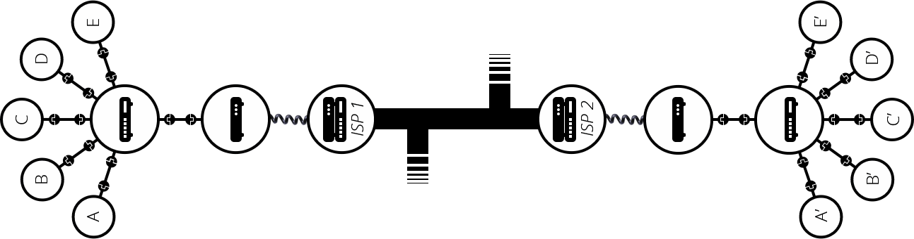
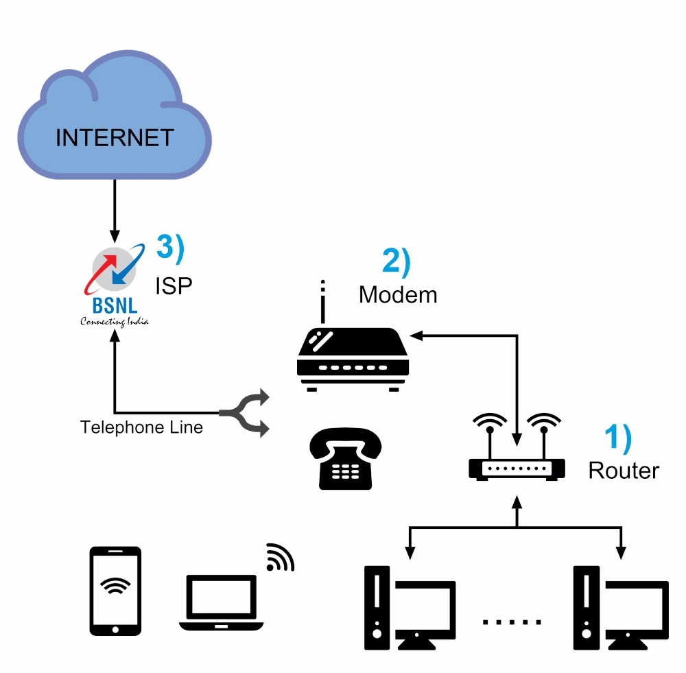
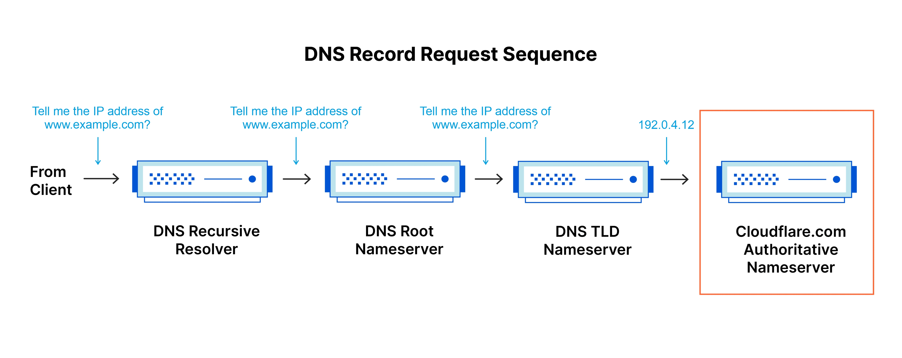
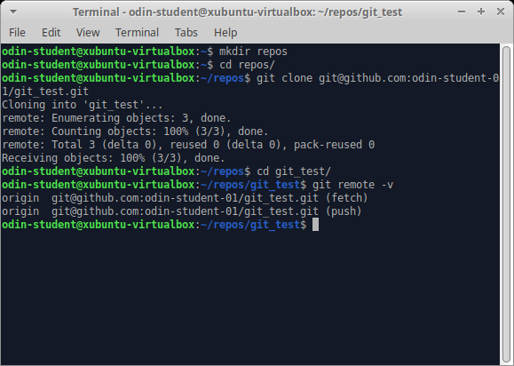
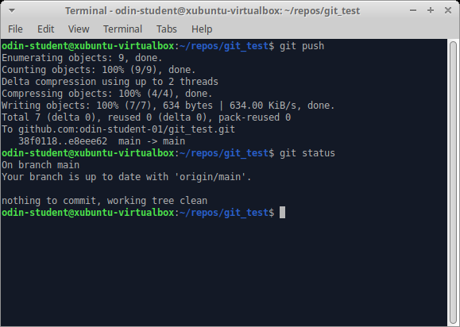
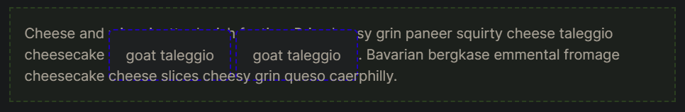
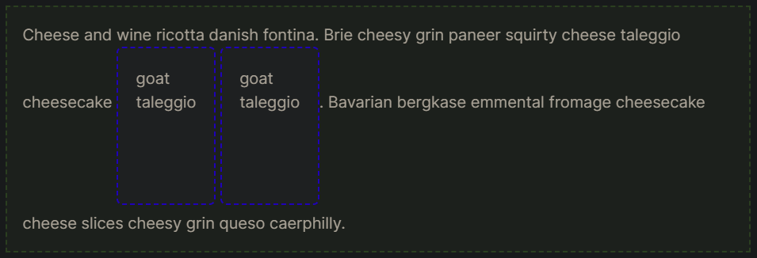

<div id="top"></div><br />

- [Introduction](#introduction)
  - [Introduction to Web Development](#introduction-to-web-development)
  - [Motivation and Mindset](#motivation-and-mindset)
  - [Growth mindset](#growth-mindset)
  - [The learning process](#the-learning-process)
  - [What to do when you’re stuck](#what-to-do-when-youre-stuck)
  - [Pitfalls to avoid](#pitfalls-to-avoid)
- [Prerequisites](#prerequisites)
  - [Computer Basics](#computer-basics)
  - [How Does the Web Work?](#how-does-the-web-work)
  - [Installations](#installations)
  - [Command Line Basics](#command-line-basics)
- [Git Basics](#git-basics)
  - [Setting up Git](#setting-up-git)
  - [Git Basics](#git-basics-1)
- [HTML Foundations](#html-foundations)
  - [Introduction to HTML](#introduction-to-html)
  - [Elements and Tags](#elements-and-tags)
  - [HTML Boilerplate](#html-boilerplate)
  - [Working with Text](#working-with-text)
  - [Lists](#lists)
  - [Links](#links)
  - [Images](#images)
- [CSS](#css)
  - [Introduction to CSS](#introduction-to-css)
    - [Selectors](#selectors)
      - [Universal selector](#universal-selector)
      - [Type selectors or element selector](#type-selectors-or-element-selector)
      - [Class selectors](#class-selectors)
      - [ID selectors](#id-selectors)
      - [The grouping selector](#the-grouping-selector)
      - [Chaining selectors](#chaining-selectors)
      - [Descendant combinator](#descendant-combinator)
    - [Properties](#properties)
      - [Color and background-color](#color-and-background-color)
      - [Typography basics and text-align](#typography-basics-and-text-align)
      - [Height and width](#height-and-width)
    - [Adding CSS to HTML](#adding-css-to-html)
      - [External CSS](#external-css)
      - [Internal CSS](#internal-css)
      - [Inline CSS](#inline-css)
  - [The Cascade](#the-cascade)
    - [Specificity](#specificity)
    - [Inheritance](#inheritance)
    - [Rule order](#rule-order)
  - [Inspecting HTML and CSS](#inspecting-html-and-css)
  - [The Box Model](#the-box-model)
  - [Block and Inline](#block-and-inline)

<p align="right">(<a href="#top">˄</a>)</p>

# Introduction
- [Reference link](https://www.theodinproject.com/paths/foundations/courses/foundations)

## Introduction to Web Development
- What do web developers do? 
  - They build and maintain websites.

<br />

- **Types of Web Developers**
  - Backend
  - Frontend
  - Full-stack

<p align="right">(<a href="#top">˄</a>)</p>

## Motivation and Mindset
- Why you have decided to learn
  - Do you want to have a fulfilling career that pays well?
  - Are you excited by the creative outlet programming provides?
  - Are you determined to develop the skills and abilities to build any app you can think of?
  - Do you want to start your own company by turning an app idea into reality?

<p align="right">(<a href="#top">˄</a>)</p>

## Growth mindset
- Believe you can get better
- Grit: passion and perseverance
- You can learn anything

<p align="right">(<a href="#top">˄</a>)</p>

## The learning process
- Learning concepts and Practicing them.

<p align="right">(<a href="#top">˄</a>)</p>

## What to do when you’re stuck
- Google it
- Take a break
- AI code generation
- Ask for help in stack-overflow

<p align="right">(<a href="#top">˄</a>)</p>

## Pitfalls to avoid
- `Procrastination`
  - `Pomodoro Technique`: Focus on 1 task for 25min then take a break of 5min. After 4 cycles take longer breaks.
- `Not taking breaks`
  - Listen to music.
  - Journal
  - Doodle
  - Meditate
  - Play a quick game.
  - Go for a short walk outside.
- `Digital distractions`
  - Turn off notifications and add a blocker to your internet to limit your time on distracting sites.
- `Physical distractions`
  - Like a TV in the background or other people talking. Find a quiet place to study.
- `Comparing yourself to others`
  - Only compare yourself to your past self.
- `Counter productive note-taking`
  - Instead of taking notes to use as direct references, make notes that can serve as prompts for further research. 
  - It is important to get comfortable with reading documentation, which essentially acts as pre-existing notes made by someone else.

<p align="right">(<a href="#top">˄</a>)</p>

# Prerequisites

## Computer Basics
- Computer software and hardware.
- Operating System.
- Open-source and closed-source software
- How to take screenshots or record screens.
- Example of a weak and a strong password.

<br />

- `Questions`:
  - Is Windows an operating system or an application?
  - What’s the difference between open-source and closed-source software?
  - What are some use cases of a screenshot?
  - Give an example of a weak and a strong password.

<p align="right">(<a href="#top">˄</a>)</p>

## How Does the Web Work?
- What is a web server?
  - **webserver**: A computer that hosts a website on the Internet.
  - **website**: A collection of web pages that are grouped together.
  - **web page**: A document which can be displayed in a web browser.

<br />

- What is a client?
  - Clients are the typical web user's internet-connected devices.

<br />

- What is a server?
  - Servers are computers that store webpages, sites, or apps.
  - When a client device wants to access a webpage, a copy of the webpage is downloaded from the server onto the client machine to be displayed in the user's web browser.

<br />

- What is a network?
  - When two computers need to communicate, you have to link them, either `physically` (usually with an Ethernet cable) or `wirelessly` (for example with Wi-Fi or Bluetooth systems). This way we can create a small `network`.
  
    <br />

  - If you're trying to connect, say, ten computers, you need 45 cables, with nine plugs per computer!
    
    <br />

  - To solve this problem, each computer on a network is connected to a special tiny computer called a `router`.
  
    <br />

  - There are other networks out there: your friends, your neighbors, anyone can have their network of computers. But it's not possible to set cables up between your house and the rest of the world, so how can you handle this? Well, there are already cables linked to your house, for example, electric power and telephone. The telephone infrastructure already connects your house with anyone in the world so it is the perfect wire we need. To connect our network to the telephone infrastructure, we need a special piece of equipment called a `modem`.

    <br />

  - So we are connected to the telephone infrastructure. The next step is to send the messages from our network to the network we want to reach. To do that, we will connect our network to an Internet Service Provider(`ISP`). The `Internet` consists of this whole infrastructure of `networks`.
  
    <br />

<br />

- What is the Internet?
  - The Internet is a large network of computers which communicate all together.

<br />

- How the internet works?
  - Clients send a request to access `www.example.com`, It travels through the `router` to the `modem`. Then `modem` to `ISP`. ISP finds the website `IP address` inside the `DNS servers`. Once the IP address of the website is found small chuck of `packets` are sent back to the client.

    <br />

<br />

- What is an IP address?
  - If you want to send a message to a computer, you have to specify which one. Thus any computer linked to a network has a unique address that identifies it, called an `IP address` (Internet Protocol address). 
  - It's an address made of a series of four numbers separated by dots, for example: *192.0.2.172*.

<br />

- What is a router?
  - A router allows us to connect multiple computers with each other.

<br />

- What is an ISP?
  - Internet Service Provider(ISP) which helps in sending messages from one computer to another in any network.

<br />

- What are packets and how are they used to transfer data?
  - When data is sent across the web, it is sent in thousands of small chunks.
  - The packets can be routed along different paths, making the exchange faster and allowing many different users to download the same website at the same time.

<br />

- What is a web browser?
  - A web browser is a program on your computer that allows you to visit websites.

<br />

- What is a search engine?
  - A web service that helps you find other web pages, such as `Google`, `Bing`, `Yahoo`, or `DuckDuckGo`.

<br />

- What is a DNS request?
  - The Domain Name System (DNS) is the phonebook of the Internet.
  - DNS translates domain names to IP addresses so browsers can load Internet resources.

  <br />

  - How does DNS work?
    - The process of DNS resolution involves converting a hostname (such as www.example.com) into a computer-friendly IP address (such as 192.168.1.1).<br />
    <br />
<br />

- Which browser are you currently using?
  - [Check current browser](https://www.whatsmybrowser.org/)

<p align="right">(<a href="#top">˄</a>)</p>

## Installations
- Install operating system (os)
  - Windows, Mac, Ubuntu

<br />

- Install web browser
  - Chrome, Mozilla, Safari

<br />

- Install Text Editor
  - VsCode, Notepad++

<br />

- Install Version control application
  - Git, GitHub

<p align="right">(<a href="#top">˄</a>)</p>

## Command Line Basics
- What is the command line?
  - That blank screen or window with a prompt and blinking cursor is the command line interface (CLI), where you’re able to enter commands that your computer will run for you.

<br />

- How do you open the command line on your computer?
  - `Win + r` then in open type `cmd`

<br />

- How can you navigate to a particular directory?
  - `cd DIRECTORY_NAME` command

<br />

- Where will `cd` on its own navigate you to?
  - Home Directory

<br />

- Where will `cd ..` navigate you to?
  - Back from the current directory

<br />

- How do you display the name of the directory you are currently in?
  - `pwd` command displays the present Working Directory

<br />

- How do you display the contents of the directory you are currently in?
  - `ls` command displays the list of files and directories

<br />

- How do you create a new directory?
  - `mkdir foo` command creates *foo* named directory

<br />

- How do you create, display, edit, and remove a new file?
  - `echo "Hello" > draft.txt` command create a file with the content "Hello".
  - `type draft.txt` command shows the file content.
  - `copy con draft.txt` command edit the file. You can exit editing mode with the `ctrl + x` button.
  - `rm draft.txt` command will remove the file.

<br />

- How do you destroy a directory or file?
  - `rm draft.txt` command will remove the file.
  - `rmdir draft` command will remove a directory.

<br />

- How do you rename a directory or file?
  - `rename draft.txt d.txt` command will rename *draft.txt* to *t.txt*.

<p align="right">(<a href="#top">˄</a>)</p>

# Git Basics

## Setting up Git
- **Git**
  - Git is a very popular version control system.
  - A save in a text editor records all of the words in a document as a single file. However, a save in Git records differences in the files and folders AND keeps a **historical record of each save**.

<br />

- **GitHub**
  - GitHub is a service that allows you to upload, host, and manage your code using Git with a nice web interface.

<br />

- **Install Git**
  - [Download Git](https://git-scm.com/downloads)

<br />

- **Configure Git and GitHub**
  - Create a GitHub account
  - Setup Git
    ```js
    git config --global user.name "Your Name"
    git config --global user.email "yourname@example.com"
    ```
  - Create an SSH key
  - Link your SSH key with GitHub

<br />

<p align="right">(<a href="#top">˄</a>)</p>

## Git Basics

- Cheat-sheet
    ```js
    > git --version
    > git clone git@github.com:USER-NAME/REPOSITORY-NAME.git
    > cd git_test
    > git remote -v
    > git config --global init.defaultBranch main
    ```
    <br />
    <br />
    
    ```js
    > touch hello_world.txt
    > git status
    > git add hello_world.txt // or git add .
    ```
    <br />
    <br />
    
    ```js
    > git commit -m "Add hello_world.txt"
    ```
    <br />
    <br />
    
    ```js
    > git push origin main
    > git log
    ```
    <br />

<br />

- `Questions`:
  - What kind of program is Git?
    - Version control
  
  <br />

  - Does Git work at a local or remote level?
    - Yes
  
  <br />

  - Why are Git and GitHub useful for a team of developers?
    - To synchronize our work with other developers.
  
  <br />

  - How do you copy a repository onto your local machine from GitHub?
    - `git clone git@github.com:USER-NAME/REPOSITORY-NAME.git` command

  <br />

  - What is the default name of your remote connection? Explain what `origin` is in `git push origin main`?
    - The name `origin` is both the default and the convention for the remote repository.

  <br />

  - Explain what `main` is in `git push origin main`.
    - `main` branch

  <br />

  - Explain the two-stage system that Git uses to save files.
    1. Adding files: `git add .` command
    2. Commit: `git commit -m "message"` command

  <br />

  - How do you check the status of your current repository?
    - `git status` command

  <br />

  - How do you look at the history of your previous commits?
    - `git log` command

<p align="right">(<a href="#top">˄</a>)</p>

# HTML Foundations
- HTML is the raw data that a webpage is built out of. 
- All the text, links, cards, lists, and buttons are created in HTML.
- CSS is what adds style to those plain elements. 
- HTML puts information on a webpage, and CSS positions that information, gives it color, changes the font, and makes it look great!
- JavaScript is a programming language, it’s used to make webpages do things.

<p align="right">(<a href="#top">˄</a>)</p>

## Introduction to HTML
- HTML (HyperText Markup Language) defines the structure and content of webpages. 
- We use HTML elements to create all of the paragraphs, headings, lists, images, and links that make up a typical webpage.

<p align="right">(<a href="#top">˄</a>)</p>

## Elements and Tags
- Almost all elements on an HTML page are just pieces of content wrapped in opening and closing HTML tags.
- Opening tags tell the browser this is the start of an HTML element. Closing tags tell the browser where an element ends.
- Ex:
    ```html
    <p>some text</p>
    ```
  - `<p>` is the opening tag.
  - `some text` represents content.
  - `</p>` is the closing tag.

<br />

- **Void Elements**
  - Some HTML elements do not have a closing tag. These elements just have a single tag, like: `<br />` or ``

<br />

- `Questions`
  - What is an HTML tag?
    - HTML tags are like keywords that define how a web browser will format and display the content. 

  <br />

  - What are the three parts of an HTML element?
    - Opening tag, Content, Closing tag

<p align="right">(<a href="#top">˄</a>)</p>

## HTML Boilerplate
- All HTML documents have the same basic structure or boilerplate that needs to be in place before anything useful can be done.

<br />

- **Creating an HTML file**
  - create `index.html` file.
  - We should always name the HTML file that will contain the homepage of our website `index.html`. This is because web servers will by default look for an `index.html` page when users land on our websites.

<br />

- **The DOCTYPE**
  - The doctype’s purpose is to tell the browser what version of HTML it should use to render the document.
  - Ex: doctype declaration for HTML4
    ```html
    <!DOCTYPE HTML PUBLIC "-//W3C//DTD HTML 4.01 Transitional//EN" "http://www.w3.org/TR/html4/loose.dtd">
    ```

<br />

- **HTML element**
  - `<html>` is what’s known as the root element of the document.
    ```html
    <!DOCTYPE html>
    <html lang="en">
    </html>
    ```

<br />

- **Head element**
  - The `<head>` element is where we put important meta-information about our webpages, and stuff required for our webpages to render correctly in the browser.
    ```html
    <!DOCTYPE html>

    <html lang="en">
      <head>
        <meta charset="UTF-8">
        <title>My First Webpage</title>
      </head>
    </html>
    ```

<br />

- **Body element**
  - The `<body>` element is where all the content that will be displayed to users will go - the text, images, lists, links, and so on.
    ```html
    <!DOCTYPE html>

    <html lang="en">
      <head>
        <meta charset="UTF-8">
        <title>My First Webpage</title>
      </head>

      <body>
      </body>
    </html>
    ```

<br />

- **Viewing HTML files in the browser**
  - Open the `index.html` file in the browser.
    ```html
    <!DOCTYPE html>
    <html lang="en">
      <head>
        <meta charset="UTF-8">
        <title>My First Webpage</title>
      </head>

      <body>
        <h1>Hello World!</h1>
      </body>
    </html>
    ```

<br />

- `Questions`
  - What is the purpose of the doctype declaration?
  - What is the HTML element?
  - What is the purpose of the head element?
  - What is the purpose of the body element?

<p align="right">(<a href="#top">˄</a>)</p>

## Working with Text

- How to create paragraphs.
  - Using `<p>content</p>` tag.

<br />

- How to create headings.
  - Using `<h1>content</h1>` tag.

<br />

- How to create bold text.
  - Using `<b>content</b>` tag.

<br />

- How to create italicized text.
  - Using `<i>content</i>` tag.
  
<br />

- The relationships between nested elements.
  - When we nest elements within other elements, we create a parent-and-child relationship between them. The nested elements are the children and the element they are nested within is the parent.

<br />

- How to create HTML comments.
  - Using `<!-- comment-message -->` syntax.

<p align="right">(<a href="#top">˄</a>)</p>

## Lists
- What HTML element is used to create an unordered list?
  ```html
  <ul>
    <li>Item 1</li>
    <li>Item 2</li>
    <li>Item 3</li>
  </ul>
  ```

<br />

- What HTML element is used to create an ordered list?
  ```html
  <ol>
    <li>Item 1</li>
    <li>Item 2</li>
    <li>Item 3</li>
  </ol>
  ```

<br />

- What HTML element is used to create list items within both unordered and ordered lists?
  - `<li>content</li>` 
<br />


<p align="right">(<a href="#top">˄</a>)</p>

## Links
- **Anchor elements**
  - `<a href="https://www.theodinproject.com/about">click me</a>`

<br />

- **Opening links in a new tab**
  - `<a href="https://www.theodinproject.com/about" target="_blank" rel="noopener noreferrer">click me</a>`
  - **Why do we need this added behavior for opening links in new tabs?**
    - Security reasons. 
    - The prevention of access that is caused by `noopener` prevents `phishing attacks` where the opened link may change the original webpage to a different one to trick users. This is referred to as `tabnabbing`. Adding the `noreferrer` value can be done if you wish to not let the opened link know that your webpage links to it.

<br />

- **Absolute links**
  - Links to pages on other websites on the internet are called absolute links. 
  - Ex: `<a href="https://www.theodinproject.com/about">About</a>`

<br/>

- **Relative links**
  - Links to other pages within our website are called relative links. 
  - Relative links do not include the domain name.
  - Ex: `<a href="pages/about.html">About</a>`

<br />

- `Questions`
  - What element is used to create a link?
  - What is an attribute?
  - What attribute tells links where to go to?
  - What security considerations must be taken if you wish to use the target attribute to open links in a new tab/window?
  - What is the difference between an absolute and relative link?
  
<p align="right">(<a href="#top">˄</a>)</p>

## Images
- To display an image in HTML we use the `` element. 
- Unlike the other elements we have encountered, the `` element is self-closing. 
- Empty, self-closing HTML elements do not need a closing tag.
- Ex: ``

<br />

- `Questions`
  - Which element is used to display an image?
  - What two attributes do images always need to have?
  - How do you access a parent directory in a file path?
  - What are the four main image formats that you can use for images on the web?

<p align="right">(<a href="#top">˄</a>)</p>

# CSS

## Introduction to CSS

- HTML puts information on a webpage, and CSS positions that information, gives it color, changes the font, and makes it look great!

<br />

- **Syntax**:<br />
  <br />

<p align="right">(<a href="#top">˄</a>)</p>

### Selectors
- Selectors refer to the HTML elements to which CSS rules apply

<br />

#### Universal selector
- The universal selector will select elements of any type.
    ```css
    * {
      color: purple;
    }
    ```

<br />

#### Type selectors or element selector
- A type selector will select all elements of the given element type.
    ```html
    <!-- index.html -->
    <div>Hello, World!</div>
    <div>Hello again!</div>
    <p>Hi...</p>
    <div>Okay, bye.</div>
    ```
    ```css
    /* styles.css */
    div {
      color: white;
    }
    ```

<br />


#### Class selectors
- Class selectors will select all elements with the given attribute class.
  ```html
  <div class="alert-text">Please agree to our terms of service.</div>
  ```
  ```css
  .alert-text {
    color: red;
  }
  ```

<br />


#### ID selectors
- They select an element with the given attribute ID.
  ```html
  <div id="title">My Awesome 90's Page</div>
  ```
  ```css
  #title {
    background-color: red;
  }
  ```

<br />


#### The grouping selector
- What if we have two groups of elements that share some of their style declarations?
  ```css
  .read, .unread {
    color: white;
    background-color: black;
  }
  ```

<br />


#### Chaining selectors
- Another way to use selectors is to chain them as a list without any separation. 
  ```html
  <div>
    <div class="subsection header">Latest Posts</div>
    <p class="subsection preview">This is where a preview for a post might go.</p>
  </div>
  ```
  ```css
  .subsection.header {
    color: red;
  }
  ```

<br />


#### Descendant combinator
- Combinators allow us to combine multiple selectors differently than either grouping or chaining them, as they show a relationship between the selectors.
  ```html
  <div class="ancestor">
    <!-- A -->
    <div class="contents">
      <!-- B -->
      <div class="contents"><!-- C --></div>
    </div>
  </div>
  <!-- D -->
  <div class="contents"></div>
  ```
  ```css
  .ancestor .contents {
    /* some declarations */
  }
  ```
- In the above example, the first two elements with the contents class (B and C) would be selected, but that last element (D) wouldn’t be.

<br />

<p align="right">(<a href="#top">˄</a>)</p>

### Properties

#### Color and background-color
```css
p {
  /* hex example: */
  color: #1100ff;
}

p {
  /* rgb example: */
  color: rgb(100, 0, 127);
}

p {
  /* hsl example: */
  color: hsl(15, 82%, 56%);
}
```

#### Typography basics and text-align
```css
div {
  /* Font style */
  font-family: "Times New Roman", serif;
  font-size: 22px;
  font-weight: bold;
  text-align: center;
}
```

#### Height and width
```css
img {
  height: auto;
  width: 500px;
}
```

<p align="right">(<a href="#top">˄</a>)</p>

### Adding CSS to HTML

#### External CSS
- creating a separate file for the CSS and linking it inside `<link>`
  ```html
  <head>
    <link rel="stylesheet" href="styles.css">
  </head>
  ```

#### Internal CSS
- Internal CSS (or embedded CSS) involves adding the CSS within the HTML file itself
  ```html
  <head>
    <style>
      div {
        color: white;
        background-color: black;
      }
    </style>
  </head>
  ```

#### Inline CSS
- Inline CSS makes it possible to add styles directly to HTML elements
  ```html
  <body>
    <div style="color: white; background-color: black;">...</div>
  </body>
  ```

- `Questions`
  - What is the syntax for class and ID selectors?
  - How would you apply a single rule to two different selectors?
  - Given an element that has an id of `title` and a class of `primary`, how would you use both attributes for a single rule?
  - What does the descendant combinator do?
  - What are the names of the three ways to add CSS to HTML?
  - What are the main differences between the three ways of adding CSS to HTML?

<p align="right">(<a href="#top">˄</a>)</p>

## The Cascade
- The cascade is what determines which rules get applied to our HTML.

<br />

### Specificity
- **More class precedence**
  - Ex:
    ```html
    <div class="main">
      <div class="list subsection">Red text</div>
    </div>
    ```
    ```css
    /* rule 1 */
    .subsection {
      color: blue;
    }
    /* rule 2 */
    .main .list {
      color: red;
    }
    ```
  - Here rule 2 is more specific because it uses *more class selectors*, so the `color: red` declaration would take precedence.

<br />

- **Id vs class precedence**
  - Ex:
    ```html
    <div class="main">
      <div class="list" id="subsection">Blue text</div>
    </div>
    ```
    ```css
    /* rule 1 */
    #subsection {
      color: blue;
    }
    /* rule 2 */
    .main .list {
      color: red;
    }
    ```
  - Rule 2 has more class selectors than ID selectors, but rule 1 is more specific because *ID beats class*.


<br />

- **Id with class precedence**
  - Ex:
    ```html
    <div class="main">
      <div class="list" id="subsection">Blue text</div>
    </div>
    ```
    ```css
    /* rule 1 */
    #subsection {
      background-color: yellow;
      color: blue;
    }
    /* rule 2 */
    .main #subsection {
      color: red;
    }
    ```
  - Rule 2 has a class selector in addition to the ID selector, so rule 2 has a higher specificity!

<br />

### Inheritance
- Typography-based properties (color, font-size, font-family, etc.) are usually inherited, while most other properties aren’t.
- Ex:
  ```html
  <div id="parent">
    <div class="child">text</div>
  </div>
  ```
  ```css
  #parent {
    color: red;
  }
  .child {
    color: blue;
  }
  ```
  - Here, Id has more precedence but class is directly applied to the target so `color: blue` will be applied.

<br />

### Rule order
- Ex:
  ```css
  .alert {
    color: red;
  }
  .warning {
    color: yellow;
  }
  ```
  - Here, the warning class is applied after the alert class so `color: yellow` will be applied.

<p align="right">(<a href="#top">˄</a>)</p>

## Inspecting HTML and CSS

- **The inspector**
  - To open up the inspector, you can right-click on any element of a webpage and click “Inspect” or press F12.

<br />

- **Inspecting elements**
  - In the Elements pane, you can see the entire HTML structure of your page. <br />
    <br />

<br />

- **Inspecting styles**
  - In the Elements pane, you can see the entire style structure of your page. <br />
    <br />

<p align="right">(<a href="#top">˄</a>)</p>

## The Box Model
- Every single thing on a webpage is a rectangular box. These boxes can have other boxes in them and can sit alongside one another.
  ```css
  * {
    outline: 2px solid red;
  }
  ```
  <br />
  <br />

<br />

- Box model consists of Content, Padding, Border and Margin<br />
  <br />

<br />

- `Questions`
  - From inside to outside, what is the order of box-model properties?
  - What does the box-sizing CSS property do?
  - What is the difference between the standard and alternative box-model?
  - Would you use margin or padding to create more space between 2 elements?
  - Would you use margin or padding to create more space between the contents of an element and its border?
  - Would you use margin or padding if you wanted two elements to overlap each other?
  - How do you set the alternative box model for all of your elements?
  - How do you center an element horizontally?

<p align="right">(<a href="#top">˄</a>)</p>

## Block and Inline

- **Block** 
  - Most of the elements that you have learned about so far are block elements. In other words, their default style is `display: block`.
  - Block-level elements take 100% width.
  - By default, block elements will appear on the page stacked atop each other, each new element starting on a new line.
  - Ex: `<div>`, `<h1>`, `<p>`, ...<br/>

<br />

- **Inline**
  - Inline elements, Do not start on a new line. 
  - They appear in line with whatever elements they are placed beside.
  - Ex: `<a>`, `<span>`<br/>
    ```css
    span.box {
      display: inline; /* the default for span */
      width: 100px;
      height: 160px;
      padding: 18px;
    }
    ```
    <br />

<p align="right">(<a href="#top">˄</a>)</p>

- **Inline-block**
  - Inline-block elements behave like inline elements, but with block-style padding and margin.<br/>
    ```css
    span.box {
      display: inline-block;
      width: 100px;
      height: 160px;
      padding: 18px;
    }
    ```
    <br />

<p align="right">(<a href="#top">˄</a>)</p>

<p align="right">(<a href="#top">˄</a>)</p>

<p align="right">(<a href="#top">˄</a>)</p>

<p align="right">(<a href="#top">˄</a>)</p>

<p align="right">(<a href="#top">˄</a>)</p>

<p align="right">(<a href="#top">˄</a>)</p>

<p align="right">(<a href="#top">˄</a>)</p>

<p align="right">(<a href="#top">˄</a>)</p>

<p align="right">(<a href="#top">˄</a>)</p>

<p align="right">(<a href="#top">˄</a>)</p>

<p align="right">(<a href="#top">˄</a>)</p>

<p align="right">(<a href="#top">˄</a>)</p>

<p align="right">(<a href="#top">˄</a>)</p>

<p align="right">(<a href="#top">˄</a>)</p>
