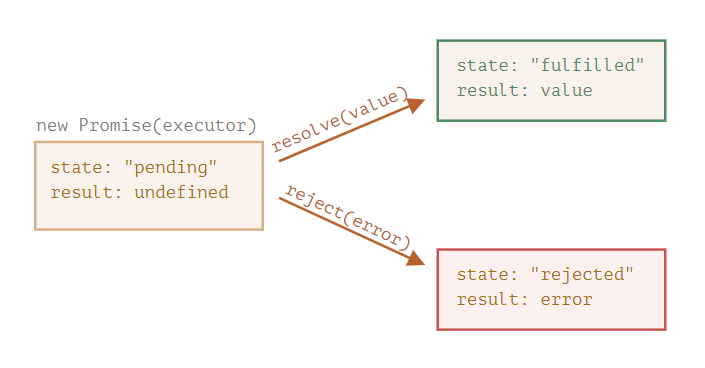
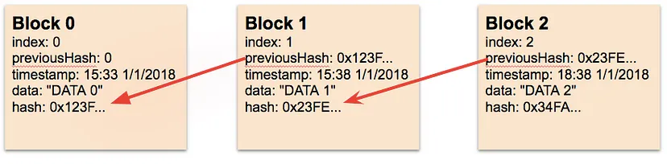

<div id="top"></div><br />

- [Basics](#basics)
  - [Way to create object](#way-to-create-object)
  - [Hoisting](#hoisting)
  - [Scope and Closure](#scope-and-closure)
  - [State management in Javascript](#state-management-in-javascript)
  - [Event Flow: Bubbling, Capturing, and Delegation](#event-flow-bubbling-capturing-and-delegation)
  - [Null vs Undefined](#null-vs-undefined)
  - [Callback](#callback)
  - [Promise](#promise)
  - [Async await](#async-await)
  - [Double exclamation (!!)](#double-exclamation-)
  - [Shallow vs Deep Copy](#shallow-vs-deep-copy)
  - [Spread(...) operator and Rest(...) operator](#spread-operator-and-rest-operator)
  - [Map vs Filter](#map-vs-filter)
  - [Prototype](#prototype)
  - [Arrow function or Lambda Functions](#arrow-function-or-lambda-functions)
  - [Immediately invoked function expression (IIFE function)](#immediately-invoked-function-expression-iife-function)
  - [Generators function](#generators-function)
  - [Bind vs Call vs Apply](#bind-vs-call-vs-apply)
  - [Splice vs Slice vs Split](#splice-vs-slice-vs-split)
  - [Freeze and Seal](#freeze-and-seal)
  - [Blockchain: Genesis Block](#blockchain-genesis-block)
- [Programs](#programs)
  - [Code: Reverse string](#code-reverse-string)
  - [Code: Fetch 2nd last array element program](#code-fetch-2nd-last-array-element-program)
  - [Concatenation program](#concatenation-program)
  - [Code: Closure program: Get Output 1,2 without let](#code-closure-program-get-output-12-without-let)
  - [Code: How to remove the element from array n'th index](#code-how-to-remove-the-element-from-array-nth-index)
  - [Code: Print even number till 10](#code-print-even-number-till-10)
  - [Code: Remove duplicates from array](#code-remove-duplicates-from-array)
  - [Code: Remove duplicates from object](#code-remove-duplicates-from-object)
  - [Code: Scope output](#code-scope-output)
  - [Code: Prototype output](#code-prototype-output)
  - [Code: Get typeof variable data](#code-get-typeof-variable-data)
  - [Code: Var Output](#code-var-output)
  - [Code: Count string length](#code-count-string-length)
  - [Code: Create own map function](#code-create-own-map-function)
  - [Code: Object assignment](#code-object-assignment)
  - [Code: Deep copy of object](#code-deep-copy-of-object)
  - [Code: Flat array - Inherited array to single](#code-flat-array---inherited-array-to-single)
  - [Code: Operator](#code-operator)
  - [Code: Destructuring rest operator](#code-destructuring-rest-operator)
  - [Code: Output map](#code-output-map)
  - [Code: Callback](#code-callback)

<br />

# Basics

## Way to create object
  - **Using Object Literal**
    ```js
    const person = {firstName:"John", lastName:"Doe", age:50, eyeColor:"blue"};
    ```
  - **Using Keyword new**
    ```js
    const person = new Object();
    person.firstName = "John";
    ```
  - **Using Object.create()**
    ```js
    const person = {
      isHuman: false,
    };
    const me = Object.create(person);
    ```
  - **Using Object.assign()**
    ```js
    const orgObject = { company: 'ABC Corp' }
    const carObject = { carName: 'Ford' }
    const employee = Object.assign({}, orgObject, carObject);
    console.log(employee); // { carName: "Ford", company: "ABC Corp" }
    ```
  - **Using ES6 classes to create objects**
    ```js
    class Person {
      constructor(fname, lname) {
      this.firstName = fname;
      }
    }
    const person = new Person('test');
    console.log(person.firstName); // test
    ```
<br />
<br />

## Hoisting
- Hoisting is JavaScript's default behavior of moving declarations to the top.
- Javascript runs in 2 phases - `compilation` and `execution` phrase
- **Value hoisting**
  - Being able to use a variable's value in its scope before the line it is declared.
- **Declaration hoisting**
  - Being able to reference a variable in its scope before the line it is declared, without throwing a ReferenceError, but the value is always undefined.
- Hoisting will automatically assign values to variables before code is being executed.
- Hoisting will assign values to vars and function in global object.
- For let and const it will get assign outside global object.
  
<br />
<br />

## Scope and Closure

- **Lexical scope**
  - Nested functions have access to variables declared in their outer scope.
    ```js
    function init() {
      var name = "Mozilla"; // name is a local variable created by init
      function displayName() {
        // displayName() is the inner function, that forms the closure
        console.log(name); // use variable declared in the parent function
      }
      displayName();
    }
    init(); //  Output: Mozilla
    ```
<br />

- **Scoping with let and const**
  - JavaScript only had two kinds of scopes: 
    1. Function scope 
    2. Global scope


  - Scoping with var
    - `var` are either function-scoped or global-scoped
    - Blocks with curly braces do not create scopes
      ```js
      if (Math.random() > 0.5) {
        var x = 1;
      } else {
        var x = 2;
      }
      console.log(x); // Output: 1
      // Blocks don't create scope for vars, so here it is inside global scope
      ```
      ```js
      function varScope() {
        var y = 1;
      }
      console.log(y); // Output: ReferenceError: y is not defined
      // Here y is inside function-scope, so it is giving error outside
      ```
    <br />

  - Scoping with let and const
    - let and const allow you to create block-scoped variables
      ```js
      if (Math.random() > 0.5) {
        const x = 1;
      } else {
        const x = 2;
      }
      console.log(x); // ReferenceError: x is not defined
      ```
<br />

- **Closure**
  - A closure is a function having access to the parent scope, even after the parent function has closed.
  - Accessing the variables/function from outside
  - Closures are created every time a function is created, at function creation time.
    ```js
    function makeFunc() {
      const name = "Mozilla";
      function displayName() {
        console.log(name);
      }
      return displayName;
    }

    const myFunc = makeFunc();
    myFunc(); // Output: Mozilla
    ```
<br />
<br />

## State management in Javascript
- State can be categorized into four main types:
  - Simple state
  - Complex state
  - Static state
  - Dynamic state

  <br />

- **Simple State**
  - Storing a single value
    ```js
    let name = "John";
    ```
  <br />

- **Complex state**
  - Complex state refers to state that consists of multiple values and can be more difficult to manage.
    ```js
    let user: User = {
      name: "John",
      age: 32,
      address: "123 Main St."
    };
    ```
  <br />

- **Static State**
  - State that remains constant and does not change over time.
    ```js
    const birthYear = 1990;
    birthYear = 1991;  // Output: "TypeError: Assignment to constant variable."
    ```
  <br />

- **Dynamic State**
  - State that can change over time.
    ```js
    let age: number = 32;
    age = 33; // value of age can be updated
    ```
  <br />

<br />
<br />

## Event Flow: Bubbling, Capturing, and Delegation

- When an event occurs on a specific DOM element it travels through the DOM hierarchy in three phases: `Capture`, `Target`, and `Bubbling`.

1. **Bubbling Phase**
     - The event bubbles up from the target element back to the outermost ancestor. 
     - It allows handling events on the bubbling phase (from bottom to top).
     - Ex:
       ```html
       <div id="parent"> 
         <button id="child">Click me!</button> 
       </div>
       ```
       ```js
       const parent = document.getElementById('parent'); 
       const child = document.getElementById('child'); 

       child.addEventListener('click', () => { 
         console.log('Child clicked!'); 
       });

       parent.addEventListener('click', () => { 
         console.log('Parent clicked!');
       });

       // Output: Child clicked! 
       //         Parent clicked!     
       ```
     - The event first bubbles up from the child to the parent.
       ```js
       child.addEventListener('click', (e) => { 
         e.stopPropagation();
         console.log('Child clicked!'); 
       });
       // Output: Child clicked!
       ```
     - By calling `e.stopPropagation()`, you prevent the event from continuing its propagation to the parent. 
     - The event is stopped at the child, and the parent's event listener doesn't get triggered.

  <br />

2. **Event Capturing**
     - Before the bubbling phase, there's capturing! Events descend from the root to the target.
       ```js
       // Example of Event Capturing 
       const container = document.getElementById('myContainer'); 

       container.addEventListener('click', () => { 
         console.log('Event Capturing Phase'); 
       }, true);  
       ```

  <br />

3. **Event Delegation**
     - Efficiently handle events for multiple elements by delegating the handling to a common ancestor. 
     - A game-changer for dynamic content!
       ```js
       // Example of Event Delegation
       const container = document.getElementById('myContainer'); 
       container.addEventListener('click', (e) => { 
         if (e.target.tagName === 'BUTTON') { 
           console.log('Button Clicked!'); 
         } 
       });
       ```

<br />
<br />

## Null vs Undefined

- **Undefined**
  - When a variable is declared but not initialized
  - Ex:
      ```js
      let x; // variable declared but not initialized
      console.log(x); // Output: undefined
      
      function doSomething() {
        // no return statement, so the function returns undefined
      }
      console.log(doSomething()); // Output: undefined
      
      let obj = {};
      console.log(obj.property); // Output: undefined
      ```
  <br />

- **Null**
  - Variable or object property should have no value or no reference to any object.
  - Ex:
    ```js
    let y = null; // variable intentionally set to null
    console.log(y); // Output: null
    
    let obj = { property: null }; // property intentionally set to null
    console.log(obj.property); // Output: null

    null == undefined // Output: true
    null === undefined // Output: false
    ```

<br />
<br />

## Callback
- A callback is a function that is passed as an argument to another function, and is called after the main function has finished its execution.
- Callbacks allow you to handle the results of an asynchronous operation in a non-blocking manner
    ```js
    function mainFunction(callback) {
      console.log("Performing operation...");
      // Use setTimeout to simulate an asynchronous operation
      setTimeout(function() {
        callback("Operation complete");
      }, 1000);
    }
    
    // Define the callback function
    function callbackFunction(result) {
      console.log("Result: " + result);
    }
    
    // Call the main function with the callback function
    mainFunction(callbackFunction);
    ```

<br />
<br />

## Promise
- Promise lets asynchronous methods returns a promise to supply the value at some point in the future.
- **Why to use?** 
  - Promises give us the ability to write cleaner code and removes call-back hell problem caused by nested callbacks.
- Promise Statements
  1. **Pending**: initial state
  2. **Fulfilled**: operation was completed successfully.
  3. **Rejected**: operation failed
  4. **settled**: The promise has either resolved or rejected, either way this callback gets called <br /><br />
    <br /><br />
- Ex:
    ```js
    let myPromise = new Promise(function(resolve, reject) {
      let x = 0;
      // The producing code (this may take some time)
      if (x == 0) {
        resolve("OK");
      } else {
        reject(new Error("Whoops!"));
      }
    });

    myPromise.then(
      function(value) { console.log(value); },
      function(error) { console.log(error); }
    ); 
    // Output: OK
    ```
    <br />
- Promise methods
  - **then()**
    - invoked when a promise is either resolved or rejected
    - It takes two functions as parameters, first `resolvedFunction` second `errorFunction`
      ```js
      let promise = new Promise(function (resolve, reject) {
        resolve('Promise Rejected');
      });
      promise
        .then(function (successMessage) {
          console.log(successMessage);
        }, function (errorMessage) {
          console.log(errorMessage);
        });
      ```
  - **catch()**
    - invoked when a promise is either rejected or some error has occurred
    - It takes one function as a parameter, error function
      ```js
      let promise = new Promise(function (resolve, reject) {
        reject('Promise Rejected')
      })
      promise
        .then(function (successMessage) {
          console.log(successMessage);
        })
        .catch(function (errorMessage) {
          console.log(errorMessage);
        });
      ```
  - **finally()**
    - The promise has either resolved or rejected, either way this callback gets called
      ```js
      let promise = new Promise(function (resolve, reject) {
        reject('Promise Rejected')
      })
      promise
        .then(function (successMessage) {
          console.log(successMessage);
        })
        .catch(function (errorMessage) {
          console.log(errorMessage);
        })
        .finally((info) => console.log("All done"));
      ```
<br />
<br />

## Async await
- **Async**
  - Async simply allows us to write promises-based code as if it was synchronous and it checks that we are not breaking the execution thread.
  - Async functions will always return a value.
- **Await**
  - Await function is used to wait for the promise. It could be used within the async block only.
- Ex:
  ```js
  const getData = async () => {
    let data = await "Hello";
    return data;
  }
  getData().then(data => console.log(data)); // Hello
  ```
  ```js
  function resolveAfter2Seconds() {
    return new Promise((resolve) => {
      setTimeout(() => {
        resolve('resolved');
      }, 2000);
    });
  }
  async function asyncCall() {
    console.log('calling');
    const result = await resolveAfter2Seconds();
    console.log(result);
  }
  asyncCall(); // calling resolved

  ```
<br />
<br />

## Double exclamation (!!)
- Way to cast a variable to be a Boolean (true or false) value.
- Checks the truthiness of a value
  ```js
  let value;
  if (!!value) {
    console.log("Value is defined");
  } else {
    console.log("Value is undefined");
  }
  ```

<br />
<br />

## Shallow vs Deep Copy

- **Shallow copy**
  - Shallow copy method creates a copy where the source and the copied variable reference remain the same. 
    ```js
    let emp1 = { id: 1 };
    let emp2 = emp1;  // Shallow copy
    console.log("emp2: ", emp2); // Output: emp2: { id: 1 }
    // Modifications made in one place would affect both places.
    emp2.id = 2;
    console.log("emp1: ", emp1); // Output: emp1: { id: 2 }
    console.log("emp2: ", emp2); // Output: emp2: { id: 2 }
    ```

- **Deep copy**
  - Deep copy method creates a copy where the source and the copied variable reference are completely different.
  <br /><br />
  - **Using JSON.parse & JSON.stringify**
    - It has limitation in converting `Date objects` to strings.
    - Completely ignores things like `undefined` or `functions`.
    ```js
    let emp1 = { id: 1 };
    let emp2 = JSON.parse(JSON.stringify(emp1));  // Deep copy
    console.log("emp2: ", emp2); // Output: emp2: { id: 1 }
    // Modifications made in one place would only affect the variable where we are making a change.
    emp2.id = 2;
    console.log("emp1: ", emp1); // Output: emp1: { id: 1 }
    console.log("emp2: ", emp2); // Output: emp2: { id: 2 }
    ```
    ```js
    // Problem with JSON.stringify
    const kitchenSink = {
      set: new Set([1, 3, 3]),
      map: new Map([[1, 2]]),
      regex: /foo/,
      deep: { array: [ new File(someBlobData, 'file.txt') ] },
      error: new Error('Hello!')
    }
    console.log(JSON.parse(JSON.stringify(kitchenSink)));
    /* Output: {
      "set": {},
      "map": {},
      "regex": {},
      "deep": { "array": [{}] },
      "error": {},
    } */
    ```
    <br />
  - **Using Spread operator**
    - It will be useful only for *single level object*
    ```js
    let emp1 = { id: 1, info: { name: 'John' } };
    let emp2 = { ...emp1 };  // Deep copy
    console.log("emp2: ", emp2.info.name); // Output: John
    // Modifications made in one place would affect the second level of original variable.
    emp2.info.name = 'doe';
    console.log("emp1: ", emp1.info.name); // Output: Doe
    console.log("emp2: ", emp2.info.name); // Output: Doe
    ```
    <br />
  - **Using structuredClone**
    - It will be useful for *all level object*
    ```js
    let emp1 = { id: 1, info: { name: 'John' } };
    let emp2 = structuredClone(emp1);  // Deep copy
    console.log("emp2: ", emp2.info.name); // Output: John
    // Modifications made in one place would not affect the original variable where.
    emp2.info.name = 'doe';
    console.log("emp1: ", emp1.info.name); // Output: John
    console.log("emp2: ", emp2.info.name); // Output: Doe
    ```
    ```js
    const kitchenSink = {
      set: new Set([1, 3, 3]),
      map: new Map([[1, 2]]),
      regex: /foo/,
      deep: { array: [ new File(someBlobData, 'file.txt') ] },
      error: new Error('Hello!')
    }
    console.log(structuredClone(kitchenSink));
    /* Output: {
      "set": Set{1, 3},
      "map": Map{1 -> 2},
      "regex": /foo/,
      "deep": { "array": [ new File(someBlobData, 'file.txt') ] },
      "error": 'Error: Hello!',
    } */
    ```
<br />
<br />

## Spread(...) operator and Rest(...) operator
- **Spread:** 
  - Creates variable by expanding array data.
    ```js
    const myName = ["Sofela", "is", "my"];
    const aboutMe = ["Oluwatobi", ...myName, "name."];
    ```
  <br />
- **Rest:** 
  - Used for function argument when we dont know how many arguments we have
    ```js
    function abc(arg1, arg2, ...arg3) {
      console.log(arg3);
    }
    abc(1,2,3,4,5)
    // Output: [3,4,5]
    ```

<br />
<br />

## Map vs Filter
- **Map**
  - Creates a new array with the same length as the original array, but with each element transformed by the callback function.
    ```js
    const n = [5, 10, 15, 20, 25, 30];
    const multiplied = n.map(num => num * 3); 
    console.log(multiplied); // Output: [ 15, 30, 45, 60, 75, 90 ]
    ```
    <br />
- **Filter**
  - Creates a new array with only the elements that pass the conditions implemented by the callback function.
    ```js
    const n = [5, 10, 15, 20, 25, 30]; 
    const multiplied = n.filter(num => num > 20); 
    console.log(multiplied); // Output: [ 25, 30 ]
    ```

<br />
<br />

## Prototype
- All JavaScript objects inherit properties and methods from a prototype
- JavaScript is a prototype based language, so, whenever we create a function using JavaScript, JavaScript engine adds a prototype property inside a function.
- Prototype property is basically an object, where we can attach methods and properties in a prototype object, which enables all the other objects to inherit these methods and properties.
- Ex:
  ```js
  function Person(yearOfBirth){
      this.yearOfBirth= yearOfBirth; 
  } 
  console.log(Person.prototype); 
  /* Output: { 
    constructor: f Person(yearOfBirth), 
    __proto__: Object 
  } */
  ```
  <br />
- Add a method calculateAge() to the Prototype property
  ```js
  // function constructor 
  function Person(yearOfBirth){    
      this.yearOfBirth= yearOfBirth; 
  } 
  Person.prototype.calculateAge= function(){ 
      console.log('The current age is: '+(2019- this.yearOfBirth)); 
  }
  console.log(Person.prototype);
  /* Output: {
    calculateAge: f ()
    constructor: f Person(yearOfBirth), 
    __proto__: Object
  } */
  let Person1= new Person(1986);
  Person1.calculateAge(); // Output: 33
  ```
<br />
<br />

## Arrow function or Lambda Functions
- Arrow functions are anonymous functions i.e. functions without a name
- Arrow functions do not have the prototype property.
- Arrow functions don't have their own bindings to `this`, `arguments`, or `super`, and should not be used as `methods`.
- Arrow functions cannot be used as `constructors`. Calling them with `new` throws a `TypeError`.
  ```js
  const gfg = () => { 
    console.log( "Hi" ); 
  } 
  gfg(); // Output: Hi
  ```
<br />
<br />

## Immediately invoked function expression (IIFE function)
- Runs as soon as it is defined.
- Also known as a Self-Executing Anonymous Function
- Can defined like anonymous IIFE function
  ```js
  (function greeting() {
    return "Hello";
  })();
  // "Hello"

  (function (a, b) { // "or with arrow-function" ((a,b) => {
    return a + b;
  })(2, 3);
  // 5
  ```
<br />
<br />


## Generators function
- A generator-function is defined like a normal function, but whenever it needs to generate a value, it does so with the yield keyword rather than return.
- The yield statement suspends the function’s execution and sends a value back to the caller, but retains enough state to enable the function to resume where it is left off. When resumed, the function continues execution immediately after the last yield run. 
- Ex:
  ```js
  function* fun() { 
    yield 10; 
    yield 20; 
    yield 30; 
  } 
  let gen = fun(); 
  console.log(gen.next().value); // 10
  console.log(gen.next().value); // 20
  console.log(gen.next().value); // 30
  console.log(gen.next().value); // undefined
  ```
<br />
<br />

## Bind vs Call vs Apply
- **Bind**
  - Used to create a new function with the same body as the original function, but with a different `this` value.
  <br />
- **Call**
  - Used to call a function and specify the “this” value for the function.
  - It takes two arguments: the value to be used as the “this” value inside the function, and an optional list of arguments to be passed to the function.
  <br />
- **Apply**
  - Similar to the call method, but instead of specifying the arguments to the function individually, it takes an array of arguments to be passed to the function.
  ```js
  function greet(msg) {
    console.log(msg + ' ' + this.name);
  }
  let person1 = {
    name: 'Alice'
  }
  greet.call(person1, 'Hello'); // Output: Hello Alice
  greet.apply(person1, ['Hi']); // Output: Hi Alice
  var greetPerson1 = greet.bind(person1);
  greetPerson1('Hey'); // Output: Hey Alice
  ```
<br />
<br />

## Splice vs Slice vs Split
- **Splice**
  - The splice( ) method changes an array, by adding or removing elements from it.
    > array.splice(index, number of elements);
  <br />
- **Slice**
  - The slice( ) method copies a given part of an array and returns that copied part as a new array. It doesn’t change the original array.
    > array.slice(from, until);
  <br />
- **Split**
  - Slice( ) and splice( ) methods are for arrays. The split( ) method is used for strings.
  - It divides a string into substrings and returns them as an array.
    > string.split(separator, limit);
  <br />
  ```js
  // Splice
  let arr1 = ['a','b','c','d'];
  let arr2 = arr1.splice(1, 3); 
  console.log(arr1); // Output: ['a']
  console.log(arr2); // Output: ['b', 'c', 'd']

  // Slice
  let arr1 = ['a','b','c','d'];
  let arr2 = arr1.slice(1, 3); 
  console.log(arr1); // Output: ['a', 'b', 'c', 'd']
  console.log(arr2); // Output: ['b', 'c']

  // Split
  var str = 'H,e,l,l,o';
  str.split(',', 3); // Output: ['H', 'e', 'l']
  ```

<br />
<br />

## Freeze and Seal
- **Freeze**
  - Does not allow any changes or deletion. 
  - It makes an object immune to everything even little changes cannot be made. 
- **Seal**
  - Allows changes to the existing properties of an object
  - It prevents from deletion of existing properties but cannot prevent them from external changes. 
- Ex:
  ```js
  let obj = {value: 10}; // creates an object
  Object.seal(obj); // creates a non-extensible object
  obj.value = 20; // the value gets updated to 20
  console.log(obj.value); // 20

  Object.freeze(obj);
  obj.value = 30; // try to update but cannot change
  console.log(obj.value); // 20 
  ```
<br />
<br />

## Blockchain: Genesis Block

- A Blockchain on its basic concept refers to a distributed database that maintains a continuously growing list of ordered records that anyone can read but that are immutable.
- Once a block has been added to the chain, it cannot be changed anymore without invalidating the rest of the chain.<br /><br />
- **Blockchain data structure**
  <br /><br />
- Ex:
  ```js
  // Building a Block
  class Block {
    constructor(index, timestamp, data, previousHash) {
      this.index = index;
      this.timestamp = timestamp;
      this.data = data;
      this.previousHash = previousHash;
      this.hash = this.calculateHash();
    }
    
    // Block Hash: crypto-js library to calculate hash
    calculateHash() {
        return SHA256(this.index + this.previousHash + this.timestamp + JSON.stringify(this.data)).toString();
    }
  }
  class Blockchain {
    constructor() {
      this.chain = [this.createGenesisBlock()];
    }
    // The Genesis Block: To initialize our chain array with values for the genesis block
    createGenesisBlock() {
      return new Block(0, Date.now(), "Genesis Block", "0");
    }
    getLatestBlock() {
      return this.chain[this.chain.length— 1];
    }
    // Generating a Block
    addBlock(newBlock) {
      newBlock.previousHash = this.getLatestBlock().hash;
      newBlock.hash = newBlock.calculateHash();
      this.chain.push(newBlock);
    }
    // Validate the Chain
    isChainValid() {
      for (let i = 1; i < this.chain.length; i++) {
        const currentBlock = this.chain[i];
        const previousBlock = this.chain[i - 1];
        if (currentBlock.hash !== currentBlock.calculateHash()) {
          return false;
        }
        if (currentBlock.previousHash !== previousBlock.hash) {
          return false;
        }
      }
      return true;
    }
  }
  ```
  ```js
  // Add some block
  let demo = new Blockchain();
  demo.addBlock(new Block(1, "20/07/2017", { blockValue:3}));
  demo.addBlock(new Block(2, "15/08/2017", { blockValue:1}));

  // Print
  console.log(JSON.stringify(demo, null, 3));
  ```

<br />
<br />

# Programs

## Code: Reverse string
```js
function reverseString(str) {
  let output = "";
  for (let i=str.length-1; i>=0; i--) {
    output += str[i]
  }
  return output;
}
console.log(reverseString("javascript")); // Output: tpircsavaj
```

<br />
<br />

## Code: Fetch 2nd last array element program
```js
let arr = ['a','b','c','d'];
console.log(arr[arr.length-2]); // Output: c
```

<br />
<br />

## Concatenation program
```js
console.log(3+'3'); // 33
console.log(3-'3'); // 0
console.log('A'-'B'+2) // NaN
```

<br />
<br />

## Code: Closure program: Get Output 1,2 without let
- **Problem**
  ```js
  for (var i=1; i<=2; i++) {
    setTimeout(function() {
      console.log(i)
    },1000);
  }
  // Output: 3
- **Solution**
  ```js
  for (var i=1; i<=2; i++) {
    print(i);
  }
  function print(i) {
    setTimeout(function() {
      console.log(i)
    },1000);
  }
  // Output: 1,2
  ```

<br />
<br />

## Code: How to remove the element from array n'th index
- **First**: array.shift()
- **Last**: array.pop()
- **2nd index**: delete array[1]
  ```js
  let a = [1,2,3,4,5];
  a.shift();
  console.log(a); // [2, 3, 4, 5]

  let b = [1,2,3,4,5];
  b.pop();
  console.log(b); // [1, 2, 3, 4]

  let c = [1,2,3,4,5];
  delete c[1];
  console.log(c); // [1, empty, 3, 4, 5]
  c = c.filter((a) => a); // Remove empty element
  console.log(c); // [1, 3, 4, 5]
  
  let d = [1,2,3,4,5];
  d.splice(1,1);
  console.log(d); // [1, 3, 4, 5]
  ```

<br />
<br />

## Code: Print even number till 10
```js
let number = 10;
let arr = [];
for(var i=1; i<=number; i++) {
  if (i%2===0){
    arr.push(i);
  }
}
console.log(arr); // [2, 4, 6, 8, 10]
```

<br />
<br />

## Code: Remove duplicates from array
```js
let arr = [1,2,3,4,5,4];

function rmDup(data) {
  let unique = [];
  data.forEach((e,i) => {
    if(!unique.includes(e)) unique.push(e);
    // ...or... if(data.indexOf(e)==i) unique.push(e);
  });
  return unique;
}
console.log("1) Filter: ", arr.filter((v,i) => arr.indexOf(v) == i));
console.log("2) Set: ", [...new Set(arr)]);
console.log("3) ForEach: ", rmDup(arr)); // Output All: [1,2,3,4,5]
```

<br />
<br />

## Code: Remove duplicates from object
```js
let data = [
  { id: "1", name: "Michael" },
  { id: "2", name: "Gob" },
  { id: "1", name: "Michael" },
  { id: "3", name: "Buster" },
  { id: "2", name: "Gob" },
];
/*
* "accumulator": 1) [], 2) [first_unique], 3) [second_unique], ...
* "current": 1) first-obj, 2) second-obj,...
*/
let unique = data.reduce((accumulator, current) => {
  if (!accumulator.find((item) => item.id === current.id)) {
    accumulator.push(current);
  }
  return accumulator;
}, []);
console.log("1. Reduce", unique);
console.log("2. Map", [...new Map(data.map(v => [v.id, v])).values()]);
let uni = data.filter((item, index) =>
  index === data.findIndex((d) => (d.id === item.id))
);
console.log("3. Fiter+findIndex", uni);
/* Output All : [{"id": "1","name": "Michael"},
                 {"id": "2","name": "Gob"},
                 {"id": "3","name": "Buster"}] */
```

<br />
<br />

## Code: Scope output
```js
if (true) {
  var a = 1;
  let b = 2;
}
console.log(a); // 1 (because of global scope)
console.log(b); // ReferenceError: b is not defined (because of let has function scope)
```

<br />
<br />

## Code: Prototype output
```js
let first = { name: 'neeraj' };
let second = Object.create(first);
delete second.name;
console.log(second.name);
// Output: neeraj ( Because neeraj is available in its __proto__ like {__proto__: {name:'neeraj'}} )
```

<br />
<br />

## Code: Get typeof variable data
```js
let data1 = [];	
let data2 = {};
console.log(data1.constructor.name); // Array
console.log(data2.constructor.name); // Object
```

<br />
<br />

## Code: Var Output
```js
var name = 'neeraj';
function printMe() {
  console.log(name);
  var name = 'test';
}
printMe(); // Output: undefined (because variable declares first in any function
```

<br />
<br />

## Code: Count string length
```js
var a = 'mark';
function countLength(d) {
  let count = 0;
  for (var i=0; i<d.length; i++) count++;
  return count;
}
countLength(a); // 4
```

<br />
<br />

## Code: Create own map function
```js
Array.prototype.ownMap = function(callback) {
  const result = [];
  for(let i=0; i<this.length; i++) {	// this means array ownMap
    result.push(callback(this[i], i, this));
  }
  return result;
}
let arr = [1,2,3].ownMap((val)=>val*2);
console.log(arr); // [2, 4, 6]
```

<br />
<br />

## Code: Object assignment
```js
const a = {};
const b = {c:'b'};
const c = {b:'c'};
a[b] = 111;
a[c] = 333;
console.log(a[b]); 
// Output: 333
// (Because a has first {[object Object]: 111})
// (Because a has second {[object Object]: 333})
```
<br />
<br />

## Code: Deep copy of object
```js
let obj1 = { person: { name: 'john'} };
let obj2 = { ...obj1 };
obj2.person.name = 'doe';
console.log(obj1); // { person: { name: 'john'} }
console.log(obj2); // { person: { name: 'john'} }
// Because spread operator copied reference of person object as it is available inside another object. To use deep copy use structuredClone(obj).
```
<br />
<br />

## Code: Flat array - Inherited array to single
```js
var a = [1,2,[3,4,[5]]];
console.log(a.flat(infinite));
// Output: [1, 2, 3, 4, 5]
```
<br />
<br />

## Code: Operator
```js
console.log([1]+[2]); // 12
console.log([-1]+[-2]); // -1-2
```
<br />
<br />

## Code: Destructuring rest operator
```js
let arr = [1,2,3,4];
let [a,b, ...c] = arr;
console.log(c); // [3,4]
```
<br />
<br />

## Code: Output map
```js
let arr = [1,2,3];
let res = arr.map(x => false);
console.log(c); // [false,false,false];
```
<br />
<br />

## Code: Callback
```js
// create higher order object which will return function.
const calc = function (num1, num2, type) {
  return type(num1, num2);
}
const add = function (a,b) {
  return a+b;
}
const sub = function (a,b) {
  return a-b;
}
console.log(calc(1,2,add));  // 1+2
console.log(calc(1,2,sub));  // -1
```
<br />
<br />
