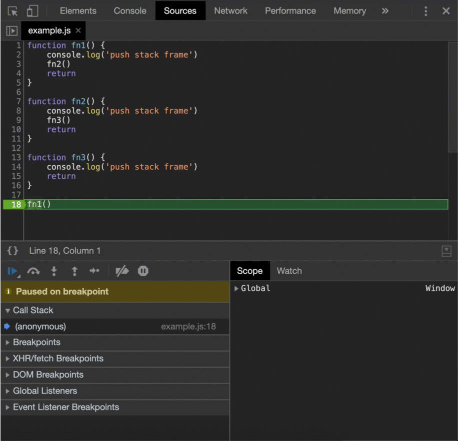
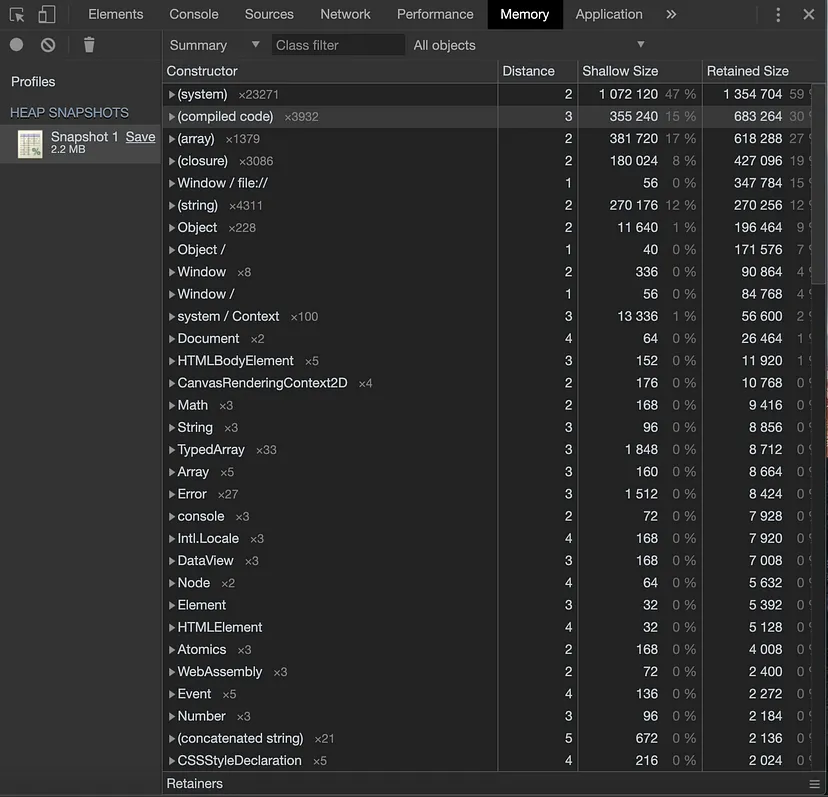
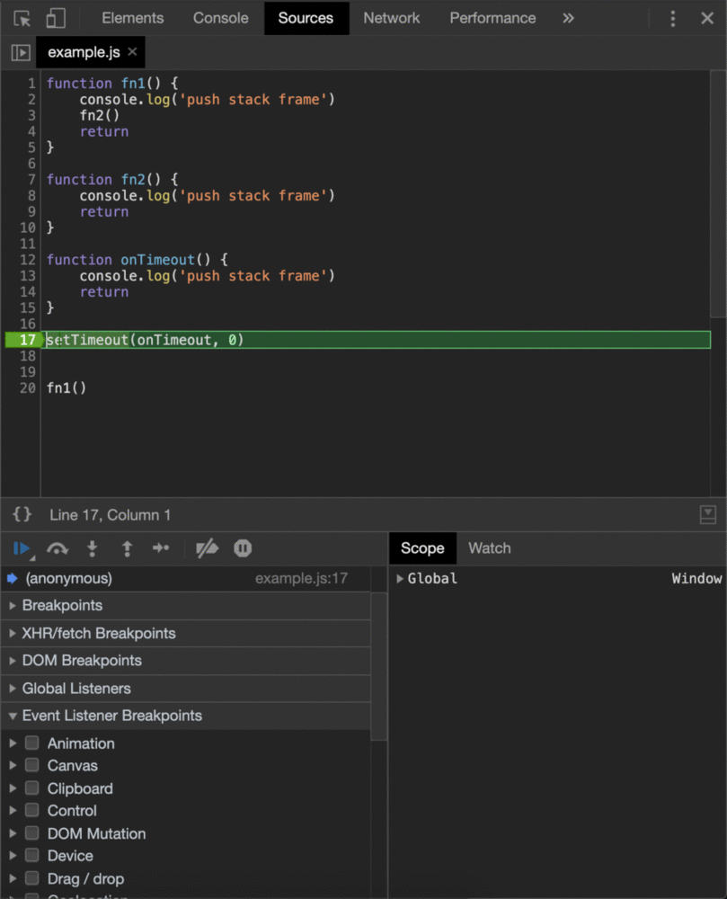
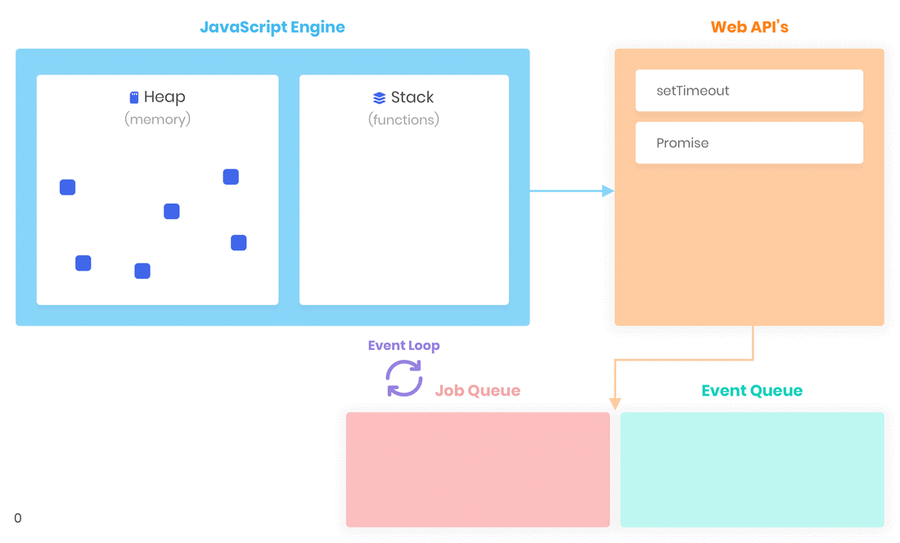
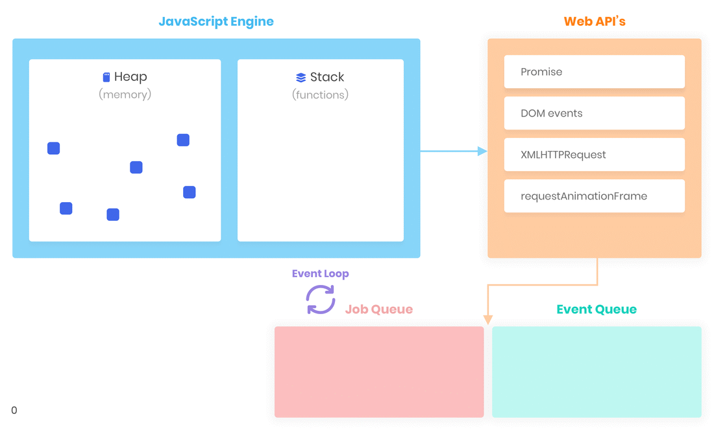

<div id="top"></div>

- [Introduction to JavaScript](#introduction-to-javascript)
  - [How does JavaScript work?](#how-does-javascript-work)
    - [Compilation](#compilation)
    - [Call Stack](#call-stack)
    - [Heap](#heap)
    - [Browser Runtime](#browser-runtime)
    - [Concurrency](#concurrency)
    - [Blocking vs Non-Blocking](#blocking-vs-non-blocking)

<br />

# Introduction to JavaScript

## How does JavaScript work?
- The JavaScript engine is a program, written in, let’s say, C++, which goes through all the JavaScript code, character by character, and “transforms” it into something that the computer’s CPU can understand and execute — machine code.
- This happens synchronously, meaning one line at a time, and in order.

<p align="right">(<a href="#top">˄</a>)</p>

### Compilation
- When your JavaScript file is loaded by the browser, V8's parser transforms it into an abstract syntax tree(AST).
- `Interpreter` produces bytecode. 
- `JIT`: V8 executes it in the main thread while TurboFan, the optimizing compiler, makes some optimizations in another thread and produces optimized machine code. This pipeline is called `just-in-time (JIT)` compilation.<br /><br />
<br /><br />
<br />

<p align="right">(<a href="#top">˄</a>)</p>

### Call Stack
- JavaScript is a single-threaded programming language with a single call stack `(aka Execution stack / stack)`. 
- It means that your code is executed synchronously.
- Whenever a function runs, it will run entirely before any other code runs.
- It uses the LIFO principle (Last-In-First-Out).
- **Stack frame**: 
  - When V8 invokes your JavaScript functions it has to store the runtime data somewhere. A **Call Stack** is a place in memory that consists of stack frames. Each stack frame corresponds to a call to a function that has not yet terminated with a return. 
  - **A stack frame is composed of:**
    - local variables
    - argument parameters
    - return address
- **Stack Overflow problem**: 
  - Recursion is one of the most common ways to create a stack-overflow problem or a lot of functions nested inside each other to keep the stack growing and growing.
  - The error will come as <span style="color:indianred">Uncaught RangeError: Maximum call stack size exceeded</span>
- Everything else is allocated dynamically in a large unstructured piece of memory called the Heap.<br /><br />
<br />

<p align="right">(<a href="#top">˄</a>)</p>

### Heap
- Sometimes V8 doesn’t know at compile time how much memory an object variable will need. 
- All the memory allocation for such data happens in the heap — an unstructured region of memory. 
- Objects on the heap live on after we exit the function that allocated the memory.
- In other words, Heap is a place to store all information and write information. That way we have a place to allocate memory, use memory and release memory.<br /><br />
<br />

<br />

- **Garbage Collector (GC)**
  - V8 has a built-in Garbage Collector (GC). 
  - Garbage collection is a form of memory management. 
  - It’s like a collector that attempts to release the memory occupied by objects that are no longer being used.

<br />

- **Memory Leak**
  - Memory leaks are pieces of memory that the application has used in the past but are not needed any longer and have not been returned to us to the poor free memory.
  - **Few memory leaks**
    - Don't have too many global variables
    - Multiple Event listener
    - setInterval which does not have clearInterval()

<p align="right">(<a href="#top">˄</a>)</p>

### Browser Runtime
- So V8 can execute JavaScript according to the standard, synchronously, using a single call stack. 
- But, We need to render the UI, handle user interactions with the UI, and handle user interactions while making network requests. But how do we achieve concurrency when all our code is synchronous? It’s possible thanks to the **browser engine**.
- **Browser Engine**: 
  - The browser engine is responsible for rendering pages with HTML and CSS. In Chrome it’s called **Blink**.
- **Blink**:
  - It’s a fork of `WebCore` which is a layout, rendering, and Document Object Model (DOM) library. 
  - Blink is implemented in C++ and exposes Web APIs like DOM elements and events, `XMLHttpRequest`, `fetch`, `setTimeout`, `setInterval` and so on, which are accessible via JavaScript.
  - Example:<br /><br />
      <br />
      - As we can see f1() and f2() functions are pushed to the stack first and then onTimeout is executed.
      - The key point is that we are registering a function to run at a later time. Whether it’s a user click or a timeout. Our asynchronous callback is executed by V8 only after the corresponding event is fired.

<p align="right">(<a href="#top">˄</a>)</p>

### Concurrency
  - **Event queue**: 
    - Once the timer expires in onTimeout, in our case immediately as we put 0ms as the delay, the event is fired and the onTimeout function is put in the `event queue (the callback queue / message queue / task queue)`. 
    - The event queue is a data structure that consists of callback functions(tasks) to be processed in the future.
    - The event queue ensures that callbacks are executed in a First-In-First-Out (FIFO).
  - **Event loop**: 
    - The event loop, a constantly running loop, checks whether the Callstack is empty. If so the first added callback from the event queue is executed and, hence moved to the callstack.
  - **Job queue**: 
    - ECMAScript 2015 introduced the concept of the job queue `(aka Micro-task queue)`. 
    - This queue is filled with promise `resolve` and `reject` functions. Callbacks in the job queue have a higher priority of execution than callbacks in the event queue. This means that the event loop will execute all of them one by one before any other callback in the event queue.
  - Example:<br />
    ```js
    const fn1 = () => console.log('fn1')
    const fn2 = () => console.log('fn2')
    const onTimeout = () => console.log('timeout')
    const onResolve1 = () => console.log('resolved1')
    const onResolve2 = () => console.log('resolved2')
    fn1();
    setTimeout(onTimeout, 0)
    Promise.resolve() {
      .then(onResolve1)
      .then(onResolve2)
    }
    fn2();
    // output:
    // fn1
    // fn2
    // resolved1
    // resolved2
    // timeout
    ```
    Output:<br />
    <br />

<p align="right">(<a href="#top">˄</a>)</p>

### Blocking vs Non-Blocking
- In simple terms, all the JavaScript code is considered blocking. While V8 is busy with processing stack frames — the browser is stuck. The UI of your app is blocked. The user won’t be able to click, navigate, or scroll. Responses from your network requests won’t be processed until V8 finishes its work.
- Example:
    ```js
    const fn1 = () => console.log('fn1')
    const onResolve = () => console.log('resolved')
    const parseImage = () => { /* long running parsing algorithm */ }
    fn1()
    Promise.resolve().then(onResolve) // or any other Web API async fn
    parseImage()
    ```
    Output:<br />
    <br /><br />

- **Web API**:
  - In the example above, the event Loop is blocked. It can’t process callbacks from the event/job queue because the call stack contains frames. `Web API` gives us the possibility to write non-blocking code via asynchronous callbacks. When calling functions like `setTimeout` or `fetch`, we are delegating all the work to C++ native code which runs in a separate thread. As soon as the operation is completed the callback is put to Event Queue. Meanwhile, V8 can continue further execution of JavaScript code. With such a concurrency model, we can handle network requests, user interactions with UI and so on without blocking the JavaScript execution thread.
  - In other words, When an asynchronous operation is initiated, the JavaScript engine hands it off to the `web API` and continues executing the rest of the code. The web API handles the operation in the background, and when it’s completed, it pushes a callback function into the callback queue. The event loop then checks the queue and, if there’s a function waiting, it’s added to the call stack and executed.
  - In other words, when we add `setTimeout` or any asynchronous operation to `call-stack`, `call-stack` immediately thinks that `setTimeout` is `web API`, as call stack does not know what to do with it, so call stack will send setTimeout to web API. Then `Web API` will start the timer and once the timer is over it will push the callback on the `event queue`. Then `event loop` will pass this callback to the `call stack` once it is empty.

<p align="right">(<a href="#top">˄</a>)</p>

