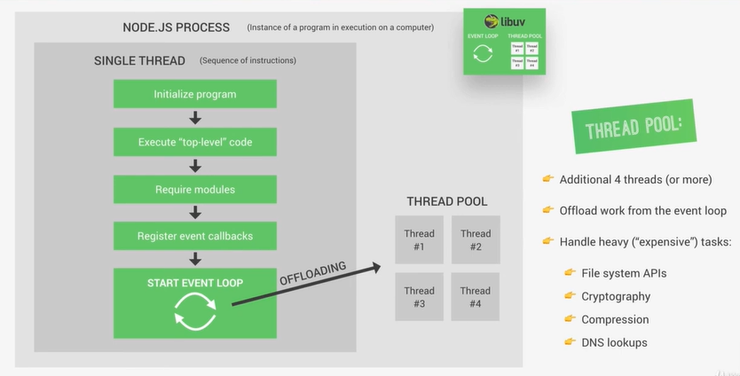
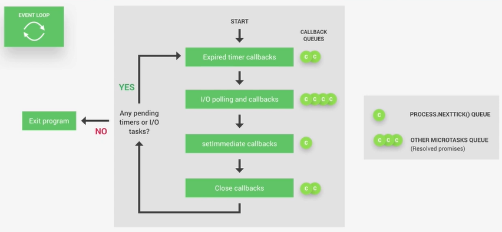

<div id="top"></div>

- [Introduction to Node](#introduction-to-node)
  - [How does node work?](#how-does-node-work)
    - [V8 Engine](#v8-engine)
    - [Libuv](#libuv)
    - [NodeJS process](#nodejs-process)
    - [Event loop](#event-loop)
    - [Callbacks Queues](#callbacks-queues)
    - [Non-blocking request](#non-blocking-request)
    - [Blocking request](#blocking-request)
    - [Thread pool](#thread-pool)
  - [Event-Driven Programming](#event-driven-programming)
    - [1. EventEmitter Module](#1-eventemitter-module)
    - [2. Events](#2-events)
    - [3. Listeners](#3-listeners)
  - [Object Oriented Programming (OOP)](#object-oriented-programming-oop)
    - [A Class](#a-class)
    - [A Property](#a-property)
    - [An Object](#an-object)
    - [A Method](#a-method)

<br />

# Introduction to Node

## How does node work?
- The node runtime has several dependencies and the most important ones is the `v8 engine` and `Libuv`.

### V8 Engine
- V8 is Google’s open-source JavaScript engine that converts JavaScript code into machine code that your computer can understand.

<p align="right">(<a href="#top">˄</a>)</p>

### Libuv
- Libuv is an open-source library built in C++.
- Libuv library provides an abstraction layer over the operating system’s I/O operations. 
- Libuv is used to handle various I/O operations such as file system access, network communication and more.
- It implements two important features 
  - **Event loop**
  - **Thread pool**

<p align="right">(<a href="#top">˄</a>)</p>

### NodeJS process
- When we use node on a computer it means that there is a node process running on that computer.
- This node process will run in just a single thread so you need to be very careful about not blocking that thread.
- **What happens in a single thread**
  - Initialize program
  - Execute "top-level" code
  - Require modules
  - Register event callbacks
  - Start event loop<br /><br />

  <br />

<p align="right">(<a href="#top">˄</a>)</p>

### Event loop
- The event loop is responsible for handling easy tasks like executing callbacks and network I/O.
- It is the heart of the node architecture.
- When we start our application the event loop starts running right away.
- The event loop checks the nature of the requests, whether they're `non-blocking requests` or `blocking requests`.
- Based on the nature of the request, the event loop does the forward processing.
- When the event loop gets a too-heavy task or too-expensive task then it automatically offloads it to the thread pool. This way node single thread did not block.
- The event loop waits for stuff to happen in the poll phase

<br />

- **Event loop phases**
  1. Expired timer callbacks
  2. I/O polling and callbacks
  3. setImmediate callbacks
  4. Close callbacks
  - Each phase has its callback queues, so for these 4 phases, we will have 4 callback queues.
  - IO means mainly stuff like networking and file access<br /><br />
    <br />

<br />

- **Don't block the event loop**
  - Don't use sync versions of functions in fs, crypto and zlib modules in your callback functions
  - Don't perform complex calculations(e.g. loops inside loops)
  - Be careful with JSON in large objects
  - Don't use too complex regular expressions(e.g. nested quantifiers)

<p align="right">(<a href="#top">˄</a>)</p>

### Callbacks Queues
- The function of the callback queue is to store all the incoming client requests and pass them sequentially to the event loop. 
- The callback queue does this using the FCFS (first come, first served) technique.
- Each event loop phase has its callback queues, so for 4 phases, we will have 4 callback queues.
    1. Expired timer callback queue
    2. I/O polling and callback queue
    3. setImmediate callback queue
    4. Close callback queue
    5. Other microtasks queue(resolved promises): `process.nextTick()` is a part of this microtasks queue

<p align="right">(<a href="#top">˄</a>)</p>

### Non-blocking request
- Non-blocking requests are requests that do not block further operations. 
- Non-blocking methods are executed asynchronously.
- Now, in the case of non-blocking requests, Loop processes the requests that do not require external resources and returns the responses to the corresponding clients.

<p align="right">(<a href="#top">˄</a>)</p>

### Blocking request
- Blocking requests are requests that are executed synchronously, causing the program to pause or block further execution until the operation is completed.
- In blocking requests, when an operation is initiated, the program will wait for that operation to finish before proceeding to the next task.

<p align="right">(<a href="#top">˄</a>)</p>

### Thread pool
- The Thread pool is responsible for heavy work like file system APIs, Cryptography, Compression and DNS lookups.
- In the case of blocking requests, the libuv uses thread pool `(aka worker pool)` and it assigns a thread to process the requests and returns the responses to the clients. 
- You can understand a thread as a worker who processes the requests. 
- By default, the number of threads is 4(We can increase it to 128), but you can increase the thread size based on your server's CPU core by below command:
  ```js
  process.env.UV_THREADPOOL_SIZE = 1;
  ```
- These are the Node.js module APIs that make use of this Thread Pool:
  - **I/O-intensive**
    - **DNS**: `dns.lookup()`, `dns.lookupService()`.
    - **File System**: All file system APIs except `fs.FSWatcher()` and those that are explicitly synchronous use libuv's thread pool.
  - **CPU-intensive**
    - **Crypto**: `crypto.pbkdf2()`, `crypto.scrypt()`, `crypto.randomBytes()`, `crypto.randomFill()`, `crypto.generateKeyPair()`.
    - **Zlib**: All `zlib` APIs except those that are explicitly synchronous use libuv's thread pool.
- If the V8 engine comes across an I/O operation, it passes that operation over to Libuv. Libuv then executes the I/O operation in the thread.
- Libuv can make use of a thread pool (multiple threads) when executing instructions in the operating system.

<p align="right">(<a href="#top">˄</a>)</p>

## Event-Driven Programming
- It is a paradigm or style of programming.
- HTTP, filesystem and timers are built around an `Event-Driven Programming (EDP)`.
- Node.js provides a range of events that are already in-built. These events can be accessed via the `events` module and the `EventEmitter` class.
- Key Components in Node.js Event-Driven Architecture:
  1. EventEmitter Module
  2. Events
  3. Listeners

<p align="right">(<a href="#top">˄</a>)</p>

### 1. EventEmitter Module
- The EventEmitter enables the creation of objects that can emit events and handle them.
- The core of Node’s asynchronous event-driven architecture is EventEmitter.
- Emitter objects send out named events, which trigger listeners that have already been registered.
- **Key aspects of the EventEmitter include:**
  - **Event Registration**
    - Objects that inherit from EventEmitter can register event listeners for specific events they are interested in. 
    - This registration involves associating a function (listener) with a particular event name.
  - **Event Emission**
    - The `emit()` method within the EventEmitter allows instances to emit events, signaling that a specific action or state change has occurred.
  - **Custom Events**: 
    - Developers can create custom events

<br />

- Example:
  ```js
  const EventEmitter = require("events");

  // 1. Create Custom EventEmitter
  const myEmitter1 = new EventEmitter();
  // Event listener for 'myEvent'
  myEmitter1.on("myEvent", () => {
    console.log("myEvent Called");
  });
  // Emitting the 'myEvent'
  myEmitter1.emit("myEvent");

  // 2. Create Custom class EventEmitter(Best Pratice): myEmitter2 class inheriting eventEmitter class
  class MyEmitter extends EventEmitter {
    constructor() {
      super();
    }
  }
  const myEmitter2 = new MyEmitter();
  // Event listener for 'customEvent'
  myEmitter2.on("customEvent", (arg1, arg2) => {
    console.log("Event received with arguments:", arg1, arg2);
  });
  // Emitting the 'customEvent'
  myEmitter2.emit("customEvent", "Hello", "World");
  /* Output:
  myEvent Called
  Event received with arguments: Hello World
  */
  ```

<p align="right">(<a href="#top">˄</a>)</p>

### 2. Events
- Events are fundamental occurrences that are recognized and handled within an application.
- **Key aspects of events include:**
  - **Event Types**:
    - Events can encompass a wide range of actions or changes, such as data updates, user interactions, system errors, or lifecycle events.
  - **Event Naming**
    - Events are typically identified by strings that represent their nature or purpose. Well-defined and descriptive event names facilitate better understanding and maintainability within the codebase.
  - **Event Payload**
    - Events can carry additional data or information, known as the event payload. This data can be passed along when emitting events and can be utilized by listeners to perform specific actions based on the event context.
- Example:
  ```js
  const http = require("http");
  const server = http.createServer((req, res) => {
    if (req.url === "/") {
      res.writeHead(200, { "Content-Type": "text/plain" });
      res.end("Welcome to the home page!");
    } else if (req.url === "/about") {
      res.writeHead(200, { "Content-Type": "text/plain" });
      res.end("About us page.\n");
    } else {
      res.writeHead(404, { "Content-Type": "text/plain" });
      res.end("Page not found!");
    }
  });

  // Listening for the 'request' event
  server.on("request", (req, res) => {
    console.log(`Request received for URL: ${req.url}`);
  });
  server.listen(3000, () => {
    console.log("Server running on port 3000");
  });
  /* Output:
    Server running on port 3000
    (After Opening browser with url localhost:3000)
    Request received for URL: /
    Request received for URL: /favicon.ico
  */
  ```

<p align="right">(<a href="#top">˄</a>)</p>

### 3. Listeners
- Listeners are functions associated with specific events that are triggered when the corresponding event is emitted. 
- **Key aspects of listeners include:**
  - **Event Binding**
    - Listeners are bound to events using the on() or addListener() method provided by EventEmitter.
  - **Execution of Listeners**
    - When an event is emitted, all registered listeners for that event are executed sequentially, allowing multiple functions to respond to the same event.
  - **Listener Parameters**
    - Listeners can receive parameters or the event payload when they are invoked
- Example:
  ```js
  const events = require("events");
  const myEmitter = new events.EventEmitter();
  // Listener 1 for 'eventA'
  myEmitter.on("eventA", () => {
    console.log("Listener 1 for eventA executed");
  });
  // Listener 2 for 'eventA'
  myEmitter.on("eventA", () => {
    console.log("Listener 2 for eventA executed");
  });
  // Emitting 'eventA'
  myEmitter.emit("eventA");
  /* Output:
    Listener 1 for eventA executed
    Listener 2 for eventA executed
  */
  ```

<br />

- **Advantages of Event-Driven Programming**
  - **Flexibility**: It is easier to alter sections of code as and when required.
  - **Suitability for graphical interfaces**: It allows the user to select tools (like radio buttons etc.) directly from the toolbar
  - **Programming simplicity**: It supports predictive coding, which improves the programmer’s coding experience.
  - **Easy to find natural dividing lines**: Natural dividing lines for unit testing infrastructure are easy to come by.
  - **A good way to model systems**: Useful method for modeling systems that must be asynchronous and reactive.
  - **Allows for more interactive programs**: It enables more interactive programming. Event-driven programming is used in almost all recent GUI apps.
  - **Using hardware interrupts**: This can be accomplished via hardware interrupts, lowering the computer’s power consumption.
  - **Allows sensors and other hardware**: It makes it simple for sensors and other hardware to communicate with software.

<br />

- **Disadvantages of Event-Driven Programming**
  - **Complex**: Simple programs become unnecessarily complex.
  - **Less logical and obvious**: The flow of the program is usually less logical and more obvious
  - **Difficult** to find error: Debugging an event-driven program is difficult
  - **Confusing**: Too many forms in a program might be confusing and/or frustrating for the programmer.
  - **Tight coupling**: The event schema will be tightly coupled with the consumers of the schema.
  - **Blocking**: Complex blocking of operations.

<p align="right">(<a href="#top">˄</a>)</p>

## Object Oriented Programming (OOP)

- It is a paradigm or style of programming.
- There are Four core concepts in Object Oriented Programming:
  - Inheritance
  - Encapsulation
  - Polymorphism
  - Abstraction
- First of all, let's ghetto know the structure of Object Oriented Programming:
  - A Class
  - An Object
  - A Method
  - A Property

<br />

### A Class
- A class is a generic template for creating more particular, concrete things.
- Classifications are commonly used to describe large groupings with similar characteristics, such as a Car or a Dog.
- A class can have multiple properties, objects and methods.

<p align="right">(<a href="#top">˄</a>)</p>

### A Property
- A simple definition of a property is that we describe the characteristics of a particular object that is created using a class. 
- These properties can be color, age, name, weight etc.

<p align="right">(<a href="#top">˄</a>)</p>

### An Object
- An object is always created from a particular class. 
- We call these objects as the instances of a class and these are generated with specific data.

<p align="right">(<a href="#top">˄</a>)</p>

### A Method
- A method defines the behavior of an object which is created from a class. 
- A method is a function that we can see inside the class we define.

- Example:
  ```js
  // creating a class 'Car'
  class Car {
    // creating a property 'color'
    color = 'red';
    
    // creating object 'tire'
    tire = {
      brand: 'bridgestone',
      size: 32
    }

    // creating a method 'isGoingForward'
    function isGoingForward() {}
  }
  ```

<p align="right">(<a href="#top">˄</a>)</p>

