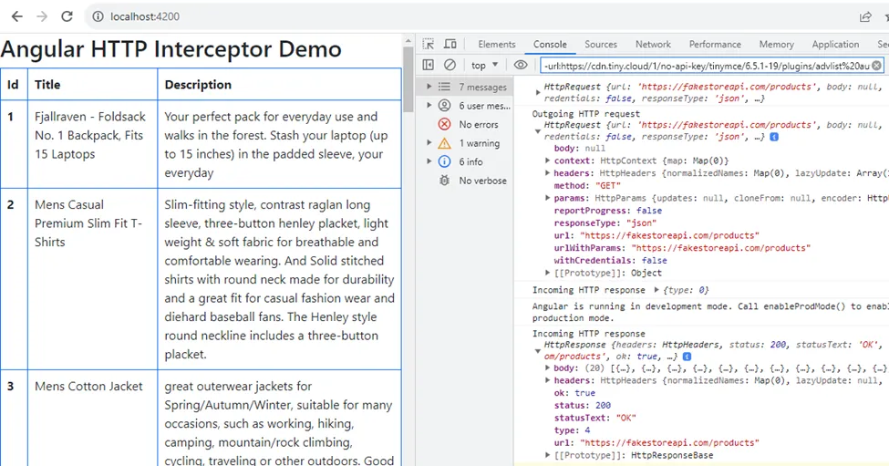
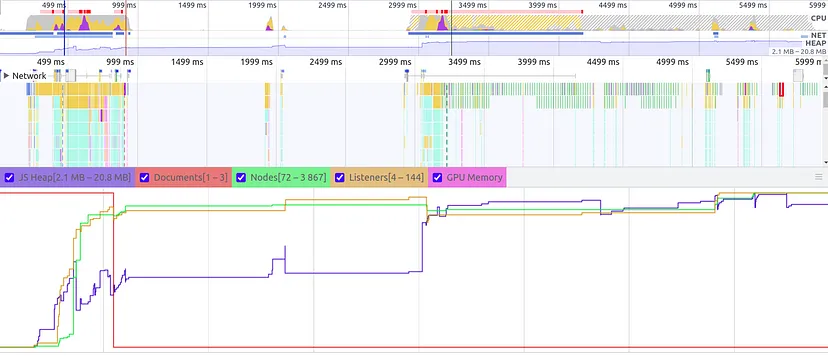
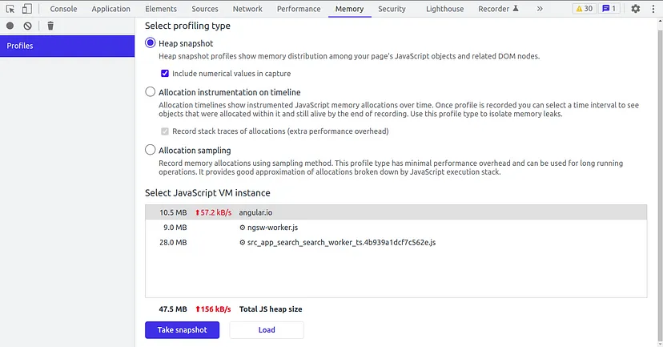

<div id="top"></div><br />

- [Basics](#basics)
  - [Latest version](#latest-version)
  - [Latest feature](#latest-feature)
  - [What cli does for you](#what-cli-does-for-you)
  - [Building blocks](#building-blocks)
  - [Angular.json](#angularjson)
- [Understanding](#understanding)
  - [Module](#module)
  - [Component](#component)
  - [Data Binding](#data-binding)
  - [Lifecycle hooks](#lifecycle-hooks)
  - [ngOnChanges vs ngDoCheck](#ngonchanges-vs-ngdocheck)
  - [Ways to share data in component](#ways-to-share-data-in-component)
  - [Standalone component/directive/pipe](#standalone-componentdirectivepipe)
  - [Get data before component get called](#get-data-before-component-get-called)
  - [Pipe: Pure/Impure](#pipe-pureimpure)
  - [Async Pipe](#async-pipe)
  - [Directive](#directive)
  - [Host binding and Host listener](#host-binding-and-host-listener)
  - [Hierarchical Injection](#hierarchical-injection)
  - [Decorator](#decorator)
  - [Change detection](#change-detection)
  - [Form](#form)
  - [Form Validators](#form-validators)
  - [Services](#services)
  - [Synchronous and Asynchronous](#synchronous-and-asynchronous)
  - [Observables](#observables)
  - [Promises](#promises)
  - [Subject](#subject)
  - [Observables vs Promises](#observables-vs-promises)
  - [Observables vs Subjects](#observables-vs-subjects)
  - [RxJS operator](#rxjs-operator)
  - [HttpClient](#httpclient)
  - [Routing](#routing)
  - [Interceptor](#interceptor)
  - [Auth guard](#auth-guard)
  - [Error Handling](#error-handling)
  - [Manage Large data](#manage-large-data)
  - [Optimize the performance](#optimize-the-performance)
  - [Handle memory leaks](#handle-memory-leaks)

<br />

# Basics

## Latest version

- Angular: 17
- React: 18
- Node: 20

<br />

## Latest feature

- New syntax for control flow in templates.
  > @if, @else if, and @else
  ```ts
  <div>
  @if (isChecked()) {
    <span>Checked</span>
  } 
  @else {
    <span>Not checked</span>
  }
  </div>
  ```
- Support for Server Side Rendering (SSR)
  > ng add @angular/ssr
- New lifecycle hooks (For third party libraries to render)
  - `afterRender`: callback to be invoked each time the application finishes rendering
  - `afterNextRender`: callback to be invoked the next time the application finishes rendering
- Dependency injection debugging in DevTools
- Build Performance with ESBuild
- required inputs
- router inputs
- experimental jest support
- standalone project support

<br />
<br />

## What cli does for you

- generate component metadata
- generate unique selector
- add component metadata
- update component files
- update component tests
- update module file
- update routing

<br />

## Building blocks

- Component
- Modules
- Templates
- Services
- Metadata
- Dependency injection
- Data Binding
- Directive

<br />

## <p id="angularjson">Angular.json</p>

- central configuration
- build settings
- environment management
- workspace concept
- customization
- critical for development

<br />
<br />

# Understanding

## Module

- place where you can group the components, directives, pipes, and services
- ex: NgModule metadata <br />

  ```ts
  @NgModule({
    declarations: [ ],  // declare components, directives, and pipes
    imports: [  ],      // declare modules, singleton-components
    exports: [  ],      // declare components, directives, and pipes
    providers: [  ],    // declare services
    bootstrap: [  ]     // declare root component
  })
  ```

  <br />

## Component

- Used to render a portion of page and provide functionality to that portion.
- A component is actually a directive with a template.
- Component is configured with selector, this selector we use as HTML tag.
- ex:
  ```ts
  import { Component } from "@angular/core";
  @Component({
    selector: "app-hero-list",
    templateUrl: "./hero-list.component.html",
    providers: [HeroService],
  })
  export class HeroListComponent {}
  ```
  <br />

## Data Binding

- `Interpolation {{ }}` : One-way Data-Binding. Display property value from Component to template.
- `Property Binding [ ]` : Passes the value from parent component to the child component.
- `Event Binding ( )`: Call the function and pass event with $event.
- `Two way Binding [( )]`: Two-way data binding (used mainly in template-driven forms) combines property and event binding in a single notation.

## Lifecycle hooks

- constructor()
- ngOnChanges()
- ngOnInit()
- ngDoCheck()
- ngAfterContentInit()
- ngAfterContentChecked()
- ngAfterViewInit()
- ngAfterViewChecked()
- ngOnDestroy()

<br />

## ngOnChanges vs ngDoCheck

- **ngOnChanges**:<br />
  Can’t detect if we change a property of an object or push an item into an array.
- **ngDoCheck**:<br />
  Detect deep changes like a property change in object or item is pushed into array even without reference change.

<br />

## Ways to share data in component

1. Using `@Input` `@Output` decorator for Parent Child Components
2. Using Services
3. Using State Management Libraries i.e Ngrx
4. Using Local Storage or Session Storage
5. Using `@ViewChild` property

<br />

1. Using `@Input` `@Output` decorator for Parent Child Components

   ```ts
   @Input() data: any;
   @Output() event: EventEmitter<any> = new EventEmitter<any>();

   public childMethod(): void {
       this.event.emit('Event data from child');
   }
   ```

   ```html
   <app-child [data]="parentData" (event)="parentMethod($event)"> </app-child>
   ```

    <br />

2. Using Services

   ```ts
   import { Injectable } from "@angular/core";
   import { BehaviorSubject } from "rxjs";

   @Injectable()
   export class DataService {
     private data$: BehaviorSubject<any> = new BehaviorSubject<any>({});

     public getData(): Observable<any> {
       return this.data$.asObservable();
     }

     public setData(data: any): void {
       this.data$.next(data);
     }
   }
   ```

    <br />

3. Using State Management Libraries i.e Ngrx

   - NgRx is a state management library<br />

   - `counter.reducer.ts`

     ```ts
     import { createReducer, on } from "@ngrx/store";
     export const counterReducer = createReducer(
       0,
       on(increment, (state) => state + 1),
       on(decrement, (state) => state - 1)
     );
     export const increment = createAction("Increment");
     export const decrement = createAction("Decrement");
     ```

   - `app.module.ts`

     ```ts
     import { StoreModule } from "@ngrx/store";
     import { counterReducer } from "./counter.reducer";
     @NgModule({
       imports: [BrowserModule, StoreModule.forRoot({ count: counterReducer })],
       bootstrap: [AppComponent],
     })
     export class AppModule {}
     ```

   - `counter.component.ts`

     ```ts
     import { Component } from "@angular/core";
     import { Store } from "@ngrx/store";
     import { increment, decrement } from "./counter.reducer";
     @Component({
       selector: "app-counter",
       template: `
         <div>Count: {{ count$ | async }}</div>
         <button (click)="increment()">Increment</button>
         <button (click)="decrement()">Decrement</button>
       `,
     })
     export class CounterComponent {
       public count$ = this.store.select("count");
       constructor(private store: Store<{ count: number }>) {}

       public increment(): void {
         this.store.dispatch(increment());
       }

       public decrement(): void {
         this.store.dispatch(decrement());
       }
     }
     ```

    <br />

4. Using Local Storage or Session Storage

   ```ts
   localStorage.setItem("data", JSON.stringify(newData));
   const data = JSON.parse(localStorage.getItem("data") || "{}");
   ```

    <br />

5. Using `@ViewChild` property

   - `child.component.ts`

     ```ts
     import { Component, Input } from "@angular/core";
     @Component({
       selector: "app-child",
     })
     export class ChildComponent {
       @Input() title: string;

       public childMethod() {
         console.log("Child method called");
       }
     }
     ```

   - `parent.component.ts`

     ```ts
     import { Component, ViewChild } from "@angular/core";
     import { ChildComponent } from "./child.component";
     @Component({
       selector: "app-parent",
       template: `
         <div>
           <button (click)="parentMethod()">Parent Method</button>
           <app-child #childComponent [title]="title"></app-child>
         </div>
       `,
     })
     export class ParentComponent {
       @ViewChild("childComponent") child: ChildComponent;

       public parentMethod() {
         console.log("Parent method called");
         this.child.childMethod();
       }
     }
     ```

<br />

## <p id="standalone-componentdirectivepipe">Standalone component/directive/pipe</p>

- **Benefits**

  - Isolation: Design to function independently, they don't want any dependency of other component or service
  - reusability: reusable
  - encapsulation
  - minimal dependency
  - clear responsibility
  - independent styling

- create

  > ng g c component_name --standalone

- ex:
  ```ts
  import { Component } from "@angular/core";
  import { CommonModule } from "@angular/common";
  @Component({
    selector: "app-my-standalone-component",
    standalone: true,
    imports: [CommonModule],
    template: "<h1>Hello, World!</h1>",
  })
  export class MyStandaloneComponent {}
  ```

<br />

## Get data before component get called

- Using router resolver
- use the `Resolve` interface and the `resolve` property of the `Route` object. This allows you to specify a service the router will call before the route is activated.
- The router will wait for the service to complete before rendering the associated component.

  - `router.resolver.ts`<br />

    ```ts
    import { Injectable } from "@angular/core";
    import { Resolve } from "@angular/router";
    import { Observable } from "rxjs";

    @Injectable({
      providedIn: "root",
    })
    export class ApiDataResolver implements Resolve<any> {
      resolve(): Observable<any> {
        // Return an Observable that represents the API request(s) you want to
        // execute before the route is activated.
      }
    }
    ```

    <br />

  - `app-routing.module.ts`<br />

    ```ts
    {
      path: 'my-route',
      component: MyComponent,
      resolve: {
        data: ApiDataResolver
      }
    }
    ```

    <br />

  - `my.component.ts`<br />

    ```ts
    import { ActivatedRoute } from "@angular/router";
    export class MyComponent {
      constructor(private route: ActivatedRoute) {
        this.route.data.subscribe((data) => {
          // The data returned by the ApiDataResolver service is available here.
        });
      }
    }
    ```

<br />

## <p id="pipe-pureimpure">Pipe: Pure/Impure</p>

- Pipes are simple functions that accept an input and return a transformed value.
- Pipes are defined using the pipe “|” symbol.
- `Built-in pipes:`
  - CurrencyPipe
  - DatePipe
  - DecimalPipe
  - JsonPipe
  - LowerCasePipe
  - UpperCasePipe
  - PercentPipe
  - SlicePipe
  - AsyncPipe
- ex:<br />

  ```html
  <p>{{ 1234.56 | currency:'CAD' }}</p>
  <!-- Output: CA$1,234.56 -->
  <p>{{ dateVal | date: 'shortTime' }}</p>
  <!-- Output: 4:38 PM -->
  <p>{{ jsonVal | json }}</p>
  <!-- Output: {a:1} -->
  <p>{{ 'ASIM' | lowercase }}</p>
  <!-- Output: asim -->
  <p>{{ 0.123456 | percent: '2.1-2' }}</p>
  <!-- Output: 12.35% -->
  ```

- **Pure Pipe**

  - `Immutable input:` Only called when Angular detects a change in the value or the parameters passed to a pipe.
  - `Caching`: Pure pipe optimizes application performances.
  - A single instance is created.

    ```ts
    @Pipe({
      name: "filterPipe",
      pure: true,
    })
    export class FilterPipe {}
    ```

    <br />

- **Impure Pipe**

  - `Mutable input`: Called for every change detection cycle no matter whether the value or parameter(s) changes.
  - `No Caching`: Impure pipe may slow down your application.
  - Multiple instances are created.
  - `Async pipe` is an example of an Impure pipe.

    ```ts
    @Pipe({
      name: "filterPipe",
      pure: false,
    })
    export class FilterPipe {}
    ```

    <br />

## Async Pipe

- `Subscription Management`: no need to manually subscribe to observable or promise
- `Automatic Data Updates`: Makes sure that template should update when asynchronous data changes.
- `Cleaner Template`: No need to handle variable and subscription.
- ex:
  - `my-data-component.component.ts`<br />
    ```ts
    @Component({
      selector: "app-my-data",
      templateUrl: "./my-data-component.component.html",
    })
    export class MyDataComponent {
      mydata$: Observable<any>;
      constructor(private dataService: DataService) {}
      ngOnInit(): void {
        this.myData$ = this.dataService.getData(); // No need to subscribe
      }
    }
    ```
    <br />
  - `my-data.component.html`<br />
    ```html
    <div *ngIf="myData$ | async; let myData">
      <span> {{ myData.name }} </span>
    </div>
    ```
    <br />

## Directive

- A class that can modify the structure of the DOM.

- **Types**

  1. **Component directive**
  2. **Structural directive** (`*ngIf`, `*ngFor`, `*ngSwitch`)

     - Modify layout by altering elements in DOM.
     - It does not have template

  3. **Attribute directive** (`[ngStyle]`, `[NgClass]`)

     - Change the behavior or appearance of existing DOM element.

<br />

- **Custom Structural Directive**:

  1. `app-not.directive.ts`<br/>

     ```ts
     import {
       Directive,
       Input,
       TemplateRef,
       ViewContainerRef,
     } from "@angular/core";
     @Directive({
       selector: "[appNot]",
     })
     export class AppNotDirective {
       constructor(
         private templateRef: TemplateRef<any>,
         private viewContainer: ViewContainerRef
       ) {}

       @Input() set appNot(condition: boolean) {
         if (!condition) {
           this.viewContainer.createEmbeddedView(this.templateRef);
         } else {
           this.viewContainer.clear();
         }
       }
     }
     ```

  2. add our directive to the declarations array in the `app.module.ts`

  3. Adding the directive
     ```html
     <h1 *appNot="true">True</h1>
     <h1 *appNot="false">False</h1>
     ```

<br />

- **Custom Attribute Directive**:

  1. `app-highlight.directive.ts`<br/>

     ```ts
     import { Directive, ElementRef } from "@angular/core";
     @Directive({
       selector: "[appHighlight]",
     })
     export class HighlightDirective {
       constructor(private eleRef: ElementRef) {
         eleRef.nativeElement.style.background = "red";
       }
     }
     ```

  2. add our directive to the declarations array in the `app.module.ts`

  3. Adding the directive
     ```html
     <h1 appHighlight>Highlight Me !</h1>
     ```

<br />

## Host binding and Host listener

- Useful in custom directives.
- `@HostBinding` lets you set properties on the element or component that hosts the directive
- `@HostListener` lets you listen for events on the host element or component.

<br />

## Hierarchical Injection

- Types

  - **ModuleInjector hierarchy**

    - for @NgModule

  - **ElementInjector hierarchy**
    - for DOM Elements like Components & Directives.

1.  Case-1 (parent level injection):

    - When we inject service into `app.module.ts` one instance of service is created and same instance will be available to all its component and their child components.
    - Here one `AppService` instance will be created for AppComponent, OneComponent, SecondComponent and their child components. No need to again pass AppService inside OneComponent and SecondComponent.

    - `app.module.ts`
      ```ts
      @NgModule({
        imports: [],
        declarations: [AppComponent, OneComponent, SecondComponent],
        providers: [AppService],
        bootstrap: [AppComponent],
      })
      class AppModule {}
      ```
    - `shared.service.ts`

      ```ts
      @Injectable()
      export class SharedService {}
      ```

     <br />

2.  Case-2 (parent + component level injection with any):

    - When we inject service into `app.module.ts` & in `SecondComponent` one instance of service is created for app.module.ts and another instance will be created for SecondComponent which will override app.module.ts.
    - Here one `AppService` instance will be created for AppComponent, OneComponent and their child components. But in SecondComponent another instance will be override AppService.
    - `app.module.ts`

      ```ts
      @NgModule({
        imports: [],
        declarations: [AppComponent, OneComponent, SecondComponent],
        providers: [AppService],
        bootstrap: [AppComponent],
      })
      class AppModule {}
      ```

    - `second.component.ts`

           ```ts
           @NgModule({
             selector: "second-component",
             providers: [AppService],
           })
           class SecondComponent {}
           ```

           - `shared.service.ts`

           ```ts
           @Injectable() // or @Injectable({providedIn: "any",})
           export class SharedService {}
           ```

      <br />

3.  Case-3 (parent + component level injection with root):

    - When we inject service into `app.module.ts` & in `SecondComponent` one instance of service is created for both as we have added `@Injectable({providedIn: 'root'})`
    - `app.module.ts`

      ```ts
      @NgModule({
        imports: [],
        declarations: [AppComponent, OneComponent, SecondComponent],
        providers: [AppService],
        bootstrap: [AppComponent],
      })
      class AppModule {}
      ```

    - `second.component.ts`

      ```ts
      @NgModule({
        selector: "second-component",
        providers: [AppService],
      })
      class SecondComponent {}
      ```

      - `shared.service.ts`

      ```ts
      @Injectable({
        providedIn: "root",
      })
      export class SharedService {}
      ```

    <br />

## Decorator

- Anything starts with `@` sign is decorator.
- syntax:

  ```ts
  @Decorator({
    selector: "app-component"
  })
  ```

- **Class decorators**, such as `@Component` and `@NgModule`

  ```ts
  @NgModule({
      imports: [],
      declarations: [],
      providers: [],
      bootstrap: []
  })

  @Component({
      selector: 'example-component',
      template: '<div>Hello world! Im an example component!</div>',
  })
  ```

  <br />

- Property decorators for properties inside classes, such as `@Input` and `@Output`

  ```ts
  @Input() data: any;
  @Output() event: EventEmitter<any> = new EventEmitter<any>();

  public childMethod(): void {
      this.event.emit('Event data from child');
  }
  ```

  <br />

- Method decorators for methods inside classes, such as `@HostListener`

  ```ts
  @HostListener('click', ['$event'])
  onHostClick(event: Event) {
    // clicked, `event` available
  }
  ```

  <br />

- Parameter decorators for parameters inside class constructors, such as `@Inject`

  ```ts
  export class ExampleComponent {
    constructor(myService: MyService) {
      // constructor(@Inject(MyService) myService) {
      console.log(myService); // MyService
    }
  }
  ```

  <br />

## Change detection

- Types
  1. Default strategy
  2. OnPush strategy

<br />

1.  Default strategy

    - Angular will run change detection traversing a component tree to update the DOM.
    - `ChangeDetectorRef` class provides a few built-in methods
      - `markForCheck()` — marks the components as it was changed, so it can be checked again for an update
      - `detach()` — excludes the view from the change detection tree, which means no check will be triggered until the view is re-attached again
      - `detectChanges()` — checks the view and its child components
      - `checkNoChanges()` — checks the view and its children and it will throw an error if some changes are detected
      - `reattach()` — reattaches a view that was previously detached so that new changes can be detected

    <br />

2.  OnPush strategy

    - Angular will run change detector only when a new reference is being passed to the component.
    - If observable is passed to onPush then Angular ChangeDetector must be called manually to update the DOM.
    - **Benefits**
      - `Faster re-redering`: Unnecessary checks in child components are not performed if the parent element is updating values which are not passed as @Input() properties
    - ex:

    ```ts
    @Component({
      selector: "app-card",
      templateUrl: "./card.component.html",
      changeDetection: ChangeDetectionStrategy.OnPush,
      styleUrls: ["./card.component.scss"],
    })
    export class CardComponent {}
    ```

    <br />

## Form

- Reactive form provide a model-driven approach to handling form inputs.
- Built around observable streams.

<br />

- **Types**
  1. Template-Driven Forms
  2. Reactive Forms

<br />

1. **Template-Driven Forms**

   - Basic form for limited fields and validation.
   - Need `FormsModule`
   - ex:

     - Add `FormModule` in `app.module.ts`
       ```ts
       ngModule({
         imports: [FormModule],
       });
       ```
     - `app.component.html`

       ```html
       <form #userForm="ngForm" (ngSubmit)="submitForm(userForm)">
         <div>
           <label>Name</label>
           <input type="text" [(ngModel)]="userDetails.name" required />
         </div>

         <button type="submit">Submit</button>
       </form>
       ```

     - `app.component.ts`

       ```ts
       import { Component } from "@angular/core";

       @Component({
         selector: "app-template-driven-form",
         templateUrl: "./template-driven-form.component.html",
       })
       export class TemplateDrivenFormComponent {
         userDetails = {
           name: "",
         };

         submitForm(form: any): void {
           if (form.valid) {
             console.log("Form data:", this.userDetails);
           }
         }
       }
       ```

       <br />

2. **Reactive Forms**

   - model-driven forms
   - Need `ReactiveFormModule`
   - ex:

     - Add `ReactiveFormModule` in `app.module.ts`
       ```ts
       ngModule({
         imports: [ReactiveFormModule],
       });
       ```
     - `app.component.html`

       ```html
       <form [formGroup]="userForm" (ngSubmit)="submitForm()">
         <div>
           <label>Name</label>
           <input type="text" formControlName="name" />
         </div>
         <button type="submit">Submit</button>
       </form>
       ```

     - `app.component.ts`

       ```ts
       import { Component } from "@angular/core";
       import { FormBuilder, FormGroup, Validators } from "@angular/forms";

       @Component({
         selector: "app-reactive-form",
         templateUrl: "./reactive-form.component.html",
       })
       export class ReactiveFormComponent {
         userForm: any;
         constructor(private formBuilder: FormBuilder) {}
         ngOnInit(): void {
           this.userForm = this.formBuilder.group({
             name: ["", Validators.required],
           });
         }
         submitForm(): void {
           if (this.userForm?.valid) {
             console.log("Form data:", this.userForm.value);
           }
         }
       }
       ```

       <br />

## Form Validators

- Built-in Validators

  - required
  - minlength
  - maxlength
  - pattern

- Custom Template-Driven Validators

  - To use our validator function in a template-driven form we need to:

    - Create a directive and attach it to the template form control.
    - Provide the directive with the validator function on the token `NG_VALIDATORS`.

  - `email-domain.directive.ts`

    ```ts
    import { NG_VALIDATORS } from "@angular/forms";
    @Directive({
      selector: "[emailDomain][ngModel]",
      providers: [
        {
          provide: NG_VALIDATORS,
          useValue: emailDomainValidator,
          multi: true,
        },
      ],
    })
    class EmailDomainValidator implements Validator {
        validate(control: AbstractControl): ValidationErrors | null {
            return emailDomainValidator()(control);
        }

        function emailDomainValidator(control: FormControl) {
            let email = control.value;
            if (email && email.indexOf("@") != -1) {
            let [_, domain] = email.split("@");
            if (domain !== "codecraft.tv") {
                return {
                emailDomain: {
                    parsedDomain: domain,
                },
                };
            }
            }
            return null;
        }
    }
    ```

  - `app.module.ts`

    ```ts
    @NgModule({
      declarations: [EmailDomainValidator],
    })
    class AppModule {}
    ```

  - `app.component.ts`

    ```html
    <input
      type="email"
      class="form-control"
      name="email"
      [(ngModel)]="model.email"
      required
      pattern="[^ @]*@[^ @]*"
      emailDomain
      #email="ngModel"
    />
    ```

    <br />

- Custom Model-Driven Validators

  ```ts
  this.email = new FormControl("", [
    Validators.required,
    Validators.pattern("[^ @]*@[^ @]*"),
    emailDomainValidator,
  ]);

  function emailDomainValidator(control: FormControl) {
    let email = control.value;
    if (email && email.indexOf("@") != -1) {
      let [_, domain] = email.split("@");
      if (domain !== "codecraft.tv") {
        return {
          emailDomain: {
            parsedDomain: domain,
          },
        };
      }
    }
    return null;
  }
  ```

    <br />

## Services

- Services gives us ability to share the common code in different components.
- Fetch data from the server.
- Create service:
  > ng g service myservice
- ex:
  ```ts
  import { Injectable } from "@angular/core";
  @Injectable()
  export class MyService {
    showTodayDate() {
      let ndate = new Date();
      return ndate;
    }
  }
  ```
- Injecting instance of service in component
  ```ts
  import { MyService } from "./my.service";
  @Component({
    selector: "app-root",
    templateUrl: "./app.component.html",
    styleUrls: ["./app.component.css"],
    providers: [MyService], // Specify the service type
  })
  export class AppComponent {
    constructor(private ms: MyService) {} // Angular Injecting instance of service
    ngOnInit() {
      this.today = this.ms.showTodayDate();
    }
  }
  ```
  <br/>

## Synchronous and Asynchronous

- **Synchronous**

  - synchronized code is blocked in nature.
  - It executes line by line code.

- **Asynchronous**
  - Asynchronous code executing in the background without blocking the execution of the code in the main thread. - Asynchronous code is non-blocking.
  - We can make HTTP requests asynchronously.
  - 2 ways to make HTTP request asynchronously.
    - `Using Observables`
    - `Using Promises`

<br />

## Observables

- Observables are not waiting for the complete data to be available.
- An Observable streams the data. When the data is available partially it will send to the client.
- Lazy: It is lazy as it emits values when time progresses.
- Cancellable
- Can retry

<br />

- Rxjs has two main causes.
  - **Observable** — Stream of Data
  - **Observer** — Which is going to use the data

<br />

- ex:
  ```ts
  import { Component, OnInit } from "@angular/core";
  import { Observable } from "rxjs";
  @Component({
    selector: "app-root",
    templateUrl: "./app.component.html",
    styleUrls: ["./app.component.css"],
  })
  export class AppComponent implements OnInit {
    title = "my-app";
    myObservable = new Observable((observer) => {
      console.log("Observable Starts");
      observer.next("1");
      observer.next("2");
      observer.next("3");
      observer.next("4");
      observer.next("5");
    });
    ngOnInit(): void {
      this.myObservable.subscribe((val) => {
        console.log(val);
      });
    }
  }
  // Output: 1,2,3,4,5
  ```

<br />

## Promises

- Promise provides us the data once the complete data is ready.
- Not lazy.
- Not cancellable.
- Cannot be retried
- Possible decisions are Reject and Resolve.

<br />

- Promises have three `main states`:
  - **Pending**: The initial state where the promise is neither resolved nor rejected.
  - **Fulfilled (Resolved)**: The state where the promise successfully resolves, and a value is available.
  - **Rejected**: The state where the promise fails to resolve, and an error is encountered.

<br />

- ex:

  ```ts
  function fetchData() {
    return new Promise((resolve, reject) => {
      // Simulate an asynchronous operation
      setTimeout(() => {
        const data = { message: "Data fetched successfully" };
        resolve(data); // Resolve the promise with the data
      }, 2000);
    });
  }

  fetchData()
    .then((data) => {
      console.log(data.message); // Output: Data fetched successfully
    })
    .catch((error) => {
      console.error("Error:", error);
    });
  ```

<br />

## Subject

- **Types**

  - `Subject`: not require initial value and emits next value
  - `BehaviorSubject`: require initial value and emits current value
  - `AsyncSubject`: emits latest value after async task completed.
  - `ReplaySubject`: It has buffer limit, if we have 5 buffer then it will hold only 5 values.

- **Subject**

  - Special type of Observable that allows values to be multicast to many Observers.
  - Subjects can emit events/values to its subscribers using the next() function.
  - you can publish changes (using next()) to a Subject and listen for changes (using subscribe()).
  - Diff between Subject from a BehaviorSubject is:
    - Subjects have no initial value.
    - Subscribers will only be notified and receive events/values after the subscription is made.
  - ex:

    ```ts
    const subject = new Subject();
    subject.next("event 0"); // 'event 0' emitted before the subscription, the subscriber will not receive that value.
    subject.subscribe((event) => console.log(event));
    subject.next("event 1");
    subject.next("event 2");
    subject.next("event 3");
    // Output: event 1, event 2, event 3
    ```

  <br />

- **BehaviorSubject**

  - Diff between Subject & BehaviorSubject is:
    - Has an initial value.
    - Subscribers will receive the last emitted value upon subscription.
  - ex:

    ```ts
    const behaviorSubject = new BehaviorSubject("event -1");
    behaviorSubject.next("event 0");
    behaviorSubject.subscribe((event) => console.log(event));
    behaviorSubject.next("event 1");
    behaviorSubject.next("event 2");
    behaviorSubject.next("event 3");
    // Output: event 0, event 1, event 2 event 3
    ```

  <br />

- **AsyncSubject**

  - Only emits the last value when it completes.
  - It will not emit any values until the subject’s complete() method is called. When completed, it will emit the last value (if any) to subscribers.
  - ex:

    ```ts
    const asyncSubject = new AsyncSubject<number>();

    asyncSubject.subscribe((e) => {
      console.log(`First Subscriber: ${e}`);
    });

    asyncSubject.next(111);
    asyncSubject.next(222);

    asyncSubject.subscribe((e) => {
      console.log(`Second Subscriber: ${e}`);
    });

    asyncSubject.next(555);
    asyncSubject.complete();
    // Output: First Subscriber: 555, Second Subscriber: 555
    ```

  <br />

- **ReplaySubject**

  - it can store and replay the last messages based on buffer size
  - ex:

    ```ts
    private chatHistorySubject = new ReplaySubject<ChatMessage>(10); // it can store and replay the last 10 messages
    addMessage(message: ChatMessage) {
      this.chatHistorySubject.next(message);
    }
    getChatHistory() {
      return this.chatHistorySubject.asObservable();
    }
    ```

  <br />

## Observables vs Promises

| Observables                                                     | Promises                                          |
| --------------------------------------------------------------- | ------------------------------------------------- |
| Emit multiple values over a period of time.                     | Emit single value at a time.                      |
| **Lazy**: Not executed until we subscribe                       | **Not Lazy**: Execute immediately after creation. |
| Cancellable                                                     | Not Cancellable                                   |
| Provide many operation like map, forEach, filter, reduce, retry | Don't provide any operations                      |
| Deliver errors to the subscribers.                              | Push errors to the child promises.                |

<br />

## Observables vs Subjects

| Observables                                                                  | Subjects                                                                                                                          |
| ---------------------------------------------------------------------------- | --------------------------------------------------------------------------------------------------------------------------------- |
| **Unicast**: Each subscribed observer has its own execution of observable.   | **Multicast**: Maintain a list of observers and notify all of them whenever a new value emitted.                                  |
| **Declarative**: Do not produce values until a subscriber subscribe to them. | **Imperative**: Produce independently of whether there are any subscribers.                                                       |
| Do not have initial value                                                    | Some Subject like BehaviorSubject has initial value.                                                                              |
| Used in handling HTTP requests                                               | Used in multicast events or share data between multiple subscribers, such as inter-component communication or event broadcasting. |

<br />

## RxJS operator

- map
- filter
- mergeMap
- forkJoin
- switchMap
- concatMap
- debounceTime
- catchError
- tap
- of
- pluck
- take
- distinctUntilChanged

<br />

- map

  - transform the data emitted by an observable
  - ex:
    ```ts
    let observable = of(1, 2, 3);
    observable.pipe(map((data) => data * 2)).subscribe((data) => {
      console.log(data);
    });
    // Output: 2, 4, 6;
    ```
    <br />

- filter

  - filter the data emitted by an observable
  - ex:
    ```ts
    let observable = of(1, 2, 3);
    observable.pipe(filter((data) => data % 2 != 0)).subscribe((data) => {
      console.log(data);
    });
    // Output: 1, 3;
    ```
    <br />

- mergeMap

  - used to merge multiple observables into a single observable.
  - ex:
    ```ts
    let observable1 = of(1, 2, 3);
    let observable2 = of(4, 5, 6);
    observable1
      .pipe(
        mergemap((value1) => observable2.pipe(map((value2) => value1 + value2)))
      )
      .subscribe((data) => {
        console.log(data);
      });
    // Output: 14, 15, 16;
    ```
    <br />

- forkJoin

  - used to wait for multiple observables to complete and then emit an array of the last values emitted by each observable.
  - ex:

    ```ts
    loadUsers() {
        let request1 = this.http.get("https://jsonplaceholder.typicode.com/todos";
        let request2 = this.http.get("https://jsonplaceholder.typicode.com/users";

        forkJoin(request1, request2).subscribe((res) => {
            console.log(result);
        });
    }
    // Output: [Array[10], Array[20]]
    ```

    <br />

- switchMap

  - used to transform the emissions from an observable by applying a given function and then flattening the result into a new observable.
  - used for handling asynchronous operations, such as making HTTP requests in Angular.
  - ex:

    ```ts
    ngonInit(): void
    let searchInput = document.getElementById('search-input');
    fromEvent (searchInput, 'keyup')
    .pipe(
        debounceTime (500), // waiting for user to stop typing
        distinctUntilChanged(), // only emit when the value changes
        switchMap(event => {
            return this.http.get(`https://api.example.com/search?q=${event.target.value}`);
        })
    )
    .subscribe(data => {
        console.log(data);
    });
    ```

    <br />

- concatMap

  - used to flatten an Observable by applying a mapping function to each value, and then concatenating the resulting Observables in the order they were emitted.
  - ex:

    ```ts
    const request$ = from([1, 2, 3]).pipe();
    concatMap((x) =>
      this.http.get(`https://jsonplaceholder.typicode.com/posts/` + x)
    );
    request$.subscribe((data) => {});
    console.log(data);
    // Output: {userId: 1, id: 1}, {userId: 1, id: 2},
    ```

    <br />

- debounceTime

  - used to control the frequency of emitted values from an Observable.
  - ex:

    ```ts
    const searchInput = document.getElementById("search-input");

    fromEvent(searchInput, "input")
      .pipe(debounceTime(300))
      .subscribe((event) => {
        // Perform search operation here
      });
    // Output: wait for 300 seconds before emitting
    ```

    <br />

- catchError

  - allows you to gracefully handle errors emitted by an Observable.
  - ex:

    ```ts
    const source = of(1, 2, 3, "oops", 5);

    source
      .pipe(
        map((value) => value * 2),
        catchError((error) => {
          console.log("Error:", error);
          return of(0); // Fallback value
        })
      )
      .subscribe((result) => console.log(result));

    // Output: 2, 4, 6, Error: oops, 0, 10
    ```

    <br />

- tap

  - allows you to perform side effects or actions on the emitted values of an Observable without modifying the values themselves.
  - ex:

    ```ts
    const source = from([1, 2, 3, 4, 5]);

    source
      .pipe(
        tap((value) => console.log("Value:", value)),
        map((value) => value * 2)
      )
      .subscribe((result) => console.log(result));

    // Output:
    // Value: 1
    // 2
    // Value: 2
    // 4
    // Value: 3
    // 6
    // Value: 4
    // 8
    // Value: 5
    // 10
    ```

    <br />

- of

  - used to create an Observable that emits a sequence of values.
  - ex:

    ```ts
    of(1, 2, 3, 4, 5).subscribe((result) => console.log(result));
    // Output: 1, 2, 3, 4, 5
    ```

    <br />

- pluck

  - allows you to extract a specific property from the emitted objects in an Observable sequence.
  - ex:

    ```ts
    const source = from([
      { name: "John", age: 30 },
      { name: "Alice", age: 25 },
      { name: "Bob", age: 35 },
    ]);

    source.pipe(pluck("name")).subscribe((result) => console.log(result));
    // Output: John, Alice, Bob
    ```

    <br />

- take

  - allows you to take a specified number of values emitted by an Observable and then complete.
  - ex:

    ```ts
    const source = interval(1000);

    source.pipe(take(5)).subscribe((result) => console.log(result));
    // Output: 0, 1, 2, 3, 4
    ```

    <br />

- distinctUntilChanged

  - filters out consecutive duplicate values emitted by an Observable.
  - ex:

    ```ts
    const source = from([1, 1, 2, 2, 3, 3, 3, 4, 5]);

    source
      .pipe(distinctUntilChanged())
      .subscribe((result) => console.log(result));
    // Output: 1, 2, 3, 4, 5
    ```

    <br />

## HttpClient

- offers a simplified client HTTP API
- include testability features, typed request and response objects, request and response interception, and error handling.
- ex:

  - Declare `HttpClientModule` in `app.module.ts`

    ```ts
    @NgModule({
    imports: [
        BrowserModule,
        // import HttpClientModule after BrowserModule.
        HttpClientModule,
      ],
    })
    ```

  - inject `HttpClient` service in `app.service.ts`

    ```ts
    import { Injectable } from "@angular/core";
    import { HttpClient } from "@angular/common/http";

    @Injectable()
    export class ConfigService {
      constructor(private http: HttpClient) {}
      getConfig() {
        return this.http.get("API_URL");
      }
    }
    ```

  <br />

## Routing

- `RouterModule` to set up the navigation in the Angular application
- ex:

  - Create `app-routing.module.ts`

    ```ts
    import { NgModule } from "@angular/core";
    import { Routes, RouterModule } from "@angular/router";

    const routes: Routes = [
      { path: "**", redirectTo: "" },
      { path: "about", component: AboutComponent, pathMatch: "full" },
    ];

    @NgModule({
      imports: [RouterModule.forRoot(routes)],
      exports: [RouterModule],
    })
    export class AppRoutingModule {}
    ```

  - Add `AppRoutingModule` in `app.module.ts`

    ```html
    @NgModule({ imports: [ AppRoutingModule, ], })
    ```

  - Add `router-outlet` in `app.component.html`

    ```html
    <router-outlet></router-outlet>
    ```

  - Use `routerLink` and `routerLinkActive` in template whenever needed

    ```html
    <a routerLink="/about" routerLinkActive="active">First Component</a>
    ```

  - Navigate from component ts file
    ```ts
    import { Router, ActivatedRoute } from '@angular/router';
    constructor(private router: Router, private route: ActivatedRoute)
    this.router.navigate(['about']);
    ```

<br />

## Interceptor

- allow developers to intercept and handle HTTP requests and responses globally
- various task adding headers, handling errors, modifying the request or response data, logging, authentication
- `HttpInterceptor` defines a single method called `intercept`, which takes two parameters: the `HttpRequest` and the `HttpHandler`.
- **Benefits**
  - Testability and reusability
  - Centralized code for cross-cutting concerns
  - Global application-level modifications
  - Error handling and logging
  - Caching and request/response manipulation
  - Security and authentication
- ex: Logging Interceptor<br/>

  - `logging.interceptor.ts`

    ```ts
    import { Injectable } from "@angular/core";
    import {
      HttpEvent,
      HttpInterceptor,
      HttpHandler,
      HttpRequest,
      HttpResponse,
    } from "@angular/common/http";
    import { Observable, tap } from "rxjs";

    @Injectable()
    export class LoggingInterceptor implements HttpInterceptor {
      constructor() {}

      intercept(
        request: HttpRequest<any>,
        next: HttpHandler
      ): Observable<HttpEvent<any>> {
        console.log("Outgoing HTTP request", request);
        return next.handle(request).pipe(
          tap((event: HttpEvent<any>) => {
            console.log("Incoming HTTP response", event);
          })
        );
      }
    }
    ```

  - `app.module.ts`

    ```ts
    import { LoggingInterceptor } from "./interceptors/logging.interceptor";

    providers: [
      {
        provide: HTTP_INTERCEPTORS,
        useClass: LoggingInterceptor,
        multi: true,
      },
    ];
    ```

  - Output: <br/>
    <br />

<br />

## Auth guard

- used to secure routing
- types of Route Guards:
  - `CanActivate` - Controls if a route can be activated
  - `CanActivateChild` - Controls if children of the route can be activated
  - `CanDeactivate` - Controls if the user can leave the route
  - `CanLoad` - Controls if the route be loaded
  - `Resolve` - Controls data resolution before the route is activated

<br />

## Error Handling

1. Handling Errors in Synchronous Code
2. Global Error Handling
3. Error Handling in Asynchronous Code
4. Handling HTTP Errors

<br />

1. Handling Errors in Synchronous Code

   - allows you to catch exceptions at the point where they occur
   - ex:

   ```ts
   try {
     // Code that may throw an exception
   } catch (error) {
     // Handle the error
   }
   ```

   <br />

2. Global Error Handling

   - Service that provides a centralised place for handling exceptions.
   - This class can then override the `handleError` method
   - ex:

   - `global-error.handler.ts`

     ```ts
     import { ErrorHandler } from "@angular/core";

     export class GlobalErrorHandler extends ErrorHandler {
       handleError(error) {
         // Custom error handling logic
         throw error;
       }
     }
     ```

   - `app.module.ts`

     ```ts
     import { ErrorHandler } from '@angular/core';
     import { GlobalErrorHandler } from './global-error.handler';

     @NgModule({
     ...
     providers: [
         {
         provide: ErrorHandler,
         useClass: GlobalErrorHandler
         },
     ],
     ...
     })
     export class AppModule { }
     ```

     <br />

3. Error Handling in Asynchronous Code

   - uses `RxJS Observables` for handling asynchronous operations
   - ex:

     ```ts
     observable.pipe(
       catchError((error) => {
         // Handle the error
         return of(defaultValue);
       })
     );
     ```

   <br />

4. Handling HTTP Errors

   - Angular provides `HTTP_INTERCEPTORS` token, which allows you to implement a global strategy for failed HTTP requests.
   - ex:

   - `http-error.interceptor.ts`

     ```ts
     @Injectable()
     export class HttpErrorInterceptor implements HttpInterceptor {
       intercept(
         request: HttpRequest<any>,
         next: HttpHandler
       ): Observable<HttpEvent<any>> {
         return next.handle(request).pipe(
           catchError((error: HttpErrorResponse) => {
             // Handle the error
             return throwError(error);
           })
         );
       }
     }
     ```

   - `app.module.ts`

     ```ts
     import { HTTP_INTERCEPTORS } from '@angular/common/http';
     import { HttpErrorInterceptor } from './http-error.interceptor';

      @NgModule({
        ...
        providers: [
            {
            provide: HTTP_INTERCEPTORS,
            useClass: HttpErrorInterceptor,
            multi: true,
            },
        ],
        ...
     })
     export class AppModule { }
     ```

     <br />

## Manage Large data

1. Virtual scrolling (angular cdk)
2. Manual rendering with pagination
3. progressive rendering - Infinite Scroll

<br />

1. Virtual scrolling (angular cdk)

   - item is only rendered if it’s within the visible boundaries of the container
   - ex:

     - `Install dependency`

       > npm i @angular/cdk

     - `app.module.ts`

       ```ts
       import { ScrollingModule } from '@angular/cdk/scrolling';
       @NgModule({
       ...
       imports: [ ScrollingModule, ...]
       })
       export class AppModule {}
       ```

     - `scroll.component.html`

       ```html
       <cdk-virtual-scroll-viewport itemSize="50">
         <div *cdkVirtualFor="let item of items">{{ item }}</div>
       </cdk-virtual-scroll-viewport>
       ```

    <br />

2. Manual rendering with pagination<br /><br />

3. progressive rendering - Infinite Scroll

   - item is only rendered if it’s within the visible boundaries of the container
   - ex:

     - `Install dependency`

       > npm i ngx-infinite-scroll

     - `app.module.ts`

       ```ts
       import { InfiniteScrollModule } from 'ngx-infinite-scroll';
       @NgModule({
       ...
       imports: [ InfiniteScrollModule, ...]
       })
       export class AppModule {}
       ```

     - `scroll.component.html`

       ```ts
       import { Component } from "@angular/core";

       @Component({
         selector: "app",
         template: `
           <div
             class="search-results"
             infiniteScroll
             [infiniteScrollDistance]="2"
             [infiniteScrollThrottle]="50"
             (scrolled)="onScroll()"
           ></div>
         `,
       })
       export class AppComponent {
         onScroll() {
           console.log("scrolled!!");
         }
       }
       ```

    <br />

## Optimize the performance

- **Lazy loading**

  - module on demand
  - can-load: auth-guard will restrict our module
  - resolve, can-active child

- **Optimize image**
- **AOT** (Ahead of time compilation)
- **Tree shaking**: remove unused code and dependency
- **bundle optimization**: use webpack
- **service worker**: implement caching for offline access
- **Change detection**: Use OnPush, Async Pipe
- **Component Optimization**: Minimize rendering with trackBy, pure pipes, and detach change detectors.
- **HTTP requests**: Bundle API calls and interceptors
- **Memory management**: Unsubscribe from observables and clean up resources.
- **Server Side Rendering** (SSR) - Pre-render pages
- **Performance auditing**: Audit with lighthouse and DevTools

<br />

## Handle memory leaks

- occurs when allocated memory is no longer needed but not released, leading to memory consumption that grows over time.
- We can isolate the complier from vendor.bundle.js
- webpack analyzer tool can show tree-map of component with size

- **Detecting Memory Leaks**

  - `DevTools-Memory panel`: Monitor memory usage and track potential memory leaks over time.<br /><br />
    <br /><br />

  - `Heap snapshots`: Capture snapshots of the JavaScript heap and compare them to identify retained objects.<br /><br />
    <br /><br />

  - `Allocation timelines`: Analyze object creation and understand how memory usage evolves.<br /><br />
    <br /><br />

- **Unsubscribe**: Unsubscribe from subscriptions using takeUntil & Subject

  ```ts
  private subscription: Subscription;

  ngOnInit() {
    this.subscription = someObservable.subscribe();
  }

  ngOnDestroy() {
    this.subscription.unsubscribe();
  }
  ```

  <br />

- **DOM Event Handlers**: Remove event listeners when the component is destroyed.

  ```ts
  ngOnInit() {
    this.onClickHandler = this.onClick.bind(this);
    document.addEventListener('click', this.onClickHandler);
  }

  ngOnDestroy() {
    document.removeEventListener('click', this.onClickHandler);
  }
  ```

  <br />

- **Retaining References**: Holding onto unnecessary references, such as storing objects in global variables or long-lived services

  ```ts
  @Injectable()
  export class DataService {
    private cachedData: any;

    // ...

    storeData(data: any) {
      this.cachedData = data; // Avoid unnecessary retention
    }
  }
  ```

  <br />

- **Use RxJS Operators**: Utilize operators like takeUntil or takeWhile to automatically unsubscribe from observables

  ```ts
  private unsubscribe$: Subject<void> = new Subject<void>();

  ngOnInit() {
    someObservable.pipe(takeUntil(this.unsubscribe$)).subscribe();
  }

  ngOnDestroy() {
    this.unsubscribe$.next();
    this.unsubscribe$.complete();
  }
  ```

  <br />

- **Angular Dependency Injection**: manage the services lifecycle, use `providedIn:root`

  ```ts
  @Injectable({
    providedIn: "root",
  })
  class TestService {}
  ```

  <br />
