<div id="top"></div><br />

- [Basics](#basics)
  - [How it works?](#how-it-works)
    - [How does the browser render a webpage?](#how-does-the-browser-render-a-webpage)
  - [Introduction to HTML](#introduction-to-html)
  - [HTML element](#html-element)
  - [Empty elements or Void Elements](#empty-elements-or-void-elements)
  - [Attributes](#attributes)
  - [Anatomy of an HTML document](#anatomy-of-an-html-document)
  - [HTML comments](#html-comments)
  - [Entity references](#entity-references)
- [Head](#head)
  - [What is the HTML head?](#what-is-the-html-head)
  - [Metadata](#metadata)
    - [Document's character encoding](#documents-character-encoding)
    - [Adding author and description](#adding-author-and-description)
    - [Other types of metadata](#other-types-of-metadata)
    - [Custom icons for your site](#custom-icons-for-your-site)
    - [Applying CSS and JavaScript to HTML](#applying-css-and-javascript-to-html)
    - [Setting the primary language of the document](#setting-the-primary-language-of-the-document)
  - [Head example](#head-example)
- [Text](#text)
  - [Lists](#lists)
    - [Unordered List](#unordered-list)
    - [Ordered List](#ordered-list)
    - [Definition List](#definition-list)
  - [Emphasis and importance](#emphasis-and-importance)
    - [Emphasis](#emphasis)
    - [Strong importance](#strong-importance)
    - [Italic, bold, underline](#italic-bold-underline)
- [Hyperlink](#hyperlink)
  - [Anatomy of a link](#anatomy-of-a-link)
  - [Supporting information with the title attribute](#supporting-information-with-the-title-attribute)
  - [Opening links in a new tab](#opening-links-in-a-new-tab)
  - [Block level links](#block-level-links)
  - [Linking project files](#linking-project-files)
  - [Document fragments](#document-fragments)
  - [Absolute versus relative URLs](#absolute-versus-relative-urls)
  - [Download attribute](#download-attribute)
  - [E-mail links](#e-mail-links)
  - [Mobile links](#mobile-links)
- [Structure](#structure)
  - [HTML layout elements](#html-layout-elements)
  - [Non-semantic wrappers](#non-semantic-wrappers)
  - [Line breaks and horizontal rules](#line-breaks-and-horizontal-rules)
- [Debugging](#debugging)
  - [Syntax errors](#syntax-errors)
  - [Logic errors](#logic-errors)
  - [DOM inspector](#dom-inspector)
- [Multimedia and embedding](#multimedia-and-embedding)
- [Images](#images)
  - [Alternative text](#alternative-text)
  - [Width and height](#width-and-height)
  - [Title](#title)
  - [Figures and figure captions](#figures-and-figure-captions)
- [Video and audio](#video-and-audio)
  - [Video element](#video-element)
  - [Other video features](#other-video-features)
  - [Displaying video text tracks](#displaying-video-text-tracks)
  - [Audio element](#audio-element)
- [Iframe](#iframe)
  - [Security concerns](#security-concerns)
  - [Use HTTPS](#use-https)
  - [Always use the sandbox attribute](#always-use-the-sandbox-attribute)
  - [Configure CSP directives](#configure-csp-directives)
  - [Embed and object element](#embed-and-object-element)
- [Adding vector graphics](#adding-vector-graphics)
  - [What are vector graphics?](#what-are-vector-graphics)
  - [What is SVG?](#what-is-svg)
  - [Adding SVG](#adding-svg)
    - [img element](#img-element)
    - [Using CSS background](#using-css-background)
    - [Using SVG tag](#using-svg-tag)
    - [Using Iframe](#using-iframe)
- [Table](#table)
  - [Table basics](#table-basics)
  - [What is a table?](#what-is-a-table)
  - [TH element](#th-element)
  - [Common styling to columns](#common-styling-to-columns)
    - [Styling with CSS](#styling-with-css)
    - [Styling with col](#styling-with-col)
  - [Table advance features](#table-advance-features)
    - [Caption tag](#caption-tag)
    - [Thead Tbody Tfoot](#thead-tbody-tfoot)
    - [Nesting tables](#nesting-tables)
  - [Tables for visually impaired users](#tables-for-visually-impaired-users)
    - [Scope attribute](#scope-attribute)
    - [Id and headers attributes](#id-and-headers-attributes)
- [Form](#form)
  - [Form basics](#form-basics)
  - [Designing your form](#designing-your-form)
  - [Form element](#form-element)
  - [The label input textarea elements](#the-label-input-textarea-elements)
  - [fieldset and legend elements](#fieldset-and-legend-elements)
  - [Form controls](#form-controls)
    - [Input field](#input-field)
    - [Text field](#text-field)
    - [Password field](#password-field)
    - [Hidden content](#hidden-content)
    - [Check box](#check-box)
    - [Radio button](#radio-button)
    - [Buttons](#buttons)
  - [Image button](#image-button)
  - [File picker](#file-picker)
  - [E-mail address field](#e-mail-address-field)
  - [Search field](#search-field)
  - [Phone number field](#phone-number-field)
  - [URL field](#url-field)
  - [Numeric field](#numeric-field)
  - [Slider controls](#slider-controls)
  - [Date and time pickers](#date-and-time-pickers)
    - [datetime-local](#datetime-local)
    - [month](#month)
    - [time](#time)
    - [week](#week)
    - [Constraining date/time values](#constraining-datetime-values)
  - [Color picker control](#color-picker-control)
  - [Textarea - Multi-line text fields](#textarea---multi-line-text-fields)
  - [Select - Drop-down controls](#select---drop-down-controls)
    - [Using optgroup in Select](#using-optgroup-in-select)
    - [Using the value attribute](#using-the-value-attribute)
    - [Multiple choice select box](#multiple-choice-select-box)
    - [Autocomplete box](#autocomplete-box)
  - [Progress bar](#progress-bar)
  - [Meter bar](#meter-bar)
- [Form validation](#form-validation)
  - [Using built-in form validation](#using-built-in-form-validation)
  - [Validating against a regular expression](#validating-against-a-regular-expression)


<br />

# Basics

## How it works?

### How does the browser render a webpage?
- When a browser sends a request to a server to fetch an HTML document, the server returns an HTML page in binary stream format which is basically a text file with the response header `Content-Type: text/html; charset=UTF-8`.
- Here text/html is a `MIME Type`(Media type) which tells the browser that it is an HTML document
- `charset=UTF-8` tells the browser that it is encoded in `UTF-8` character encoding. 
- Using this information, the browser can convert the binary format into a readable text file.<br /><br />
  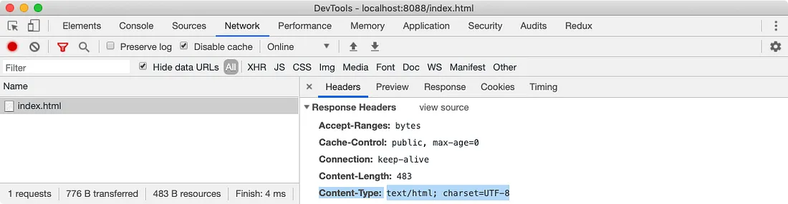<br />

<br />

- **HTML and CSS Rendering**
  - HTML is rendered incrementally. It’s better to stream the HTML response to the client instead of waiting for the whole page to be ready. (This is not the case in SPAs.)
  - CSS is render-blocking. Get the CSS to the browser as quickly as possible.

<br />

- **Parsing HTML and CSS**
  - **Parsing HTML**
    - Parsing HTML is tokenizing every bit and piece of the HTML to make something meaningful. 
    - HTML parsers are very forgiving and tend to complete a lot of things on their own, like inserting the missing closing tags and so much more.
  - **Parse CSS**
    - CSS is not like HTML. It cannot be parsed incrementally because of its cascading properties. 
    - It has to be parsed once, so keep in mind the size of the CSS you’re sending with the initial load. After parsing the CSS, we have a `CSSOM`.<br /><br />
  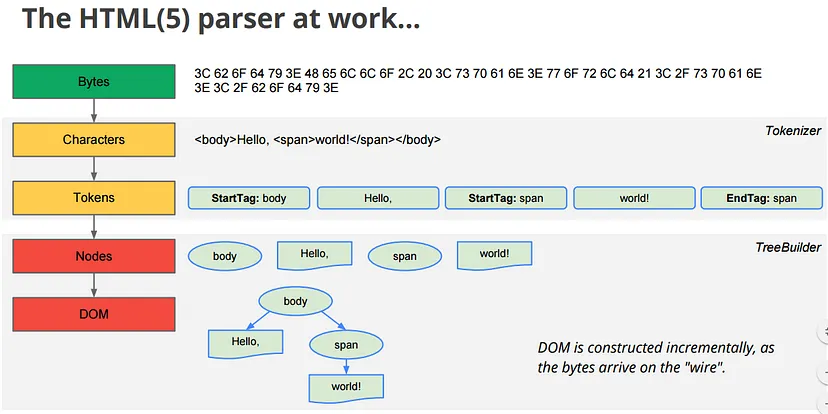<br />

<br />

- **Render Tree**
  - Render tree omits all the nodes that are not required, such as `display: none`, `<script>`, and `<meta>`.
  - The below picture gives a clear example of how the DOM and CSSOM are merged to create a render tree.<br /><br />
    <br />

<br />

- **Layout Phase**
  - In the layout phase, the exact position of the nodes and their size respective to the viewport of the browser is computed.<br /><br />
    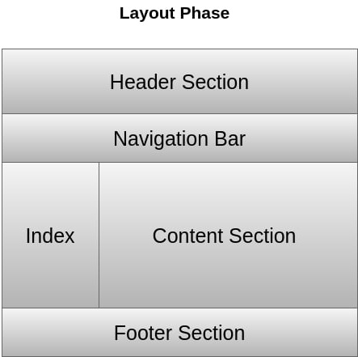<br />

<br />

- **Painting**
  - After the layout is completed, we finally start to paint the pixels onto the screen. 
  - This is where we start to see things on the browsers.<br /><br />
    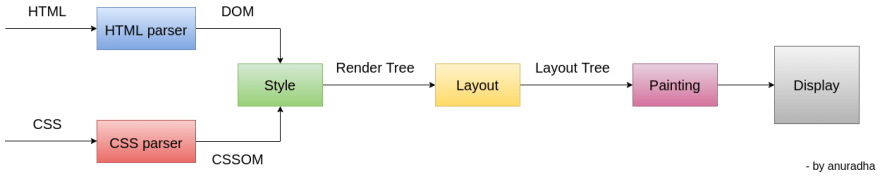<br />

<br />

- **Interactivity**
  - Whenever we encounter a `<script>`, the HTML/CSS parsing is completely stopped. 
  - We fetch the file, parse the file, run JavaScript, and then continue to parse the HTML bit by bit. If we use `document.write()` in the script, the parsing will begin again.<br /><br />
    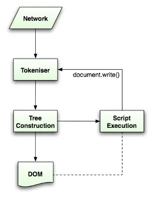<br />

## Introduction to HTML

- HTML (HyperText Markup Language) defines the structure and content of webpages. 
- It is used to structure a document into logical sections.
- We use HTML elements to create all of the paragraphs, headings, lists, images, and links that make up a typical webpage.
- With the help of HTML, we can embed content such as images and videos into a page.

<p align="right">(<a href="#top">˄</a>)</p>

## HTML element

- Almost all elements on an HTML page are just pieces of content wrapped in opening and closing HTML tags.
- Opening tags tell the browser this is the start of an HTML element. Closing tags tell the browser where an element ends.
- Anatomy of an HTML element<br /><br />
  

<p align="right">(<a href="#top">˄</a>)</p>

## Empty elements or Void Elements

- Some HTML elements do not have a closing tag. These elements just have a single tag, like `<br />` or ``.<br /><br />
  ```html
  
  ```

<p align="right">(<a href="#top">˄</a>)</p>

## Attributes

- Attributes contain extra information about the element that won't appear in the content.<br /><br />
  

<p align="right">(<a href="#top">˄</a>)</p>

## Anatomy of an HTML document
- All HTML documents have the same basic structure or boilerplate that needs to be in place before anything useful can be done.<br />
  ```html
  <!DOCTYPE html>
  <html>
    <head>
      <meta charset="utf-8" />
      <title>My test page</title>
    </head>
    <body>
      <p>This is my page</p>
    </body>
  </html>
  ```

- Output: <br />
  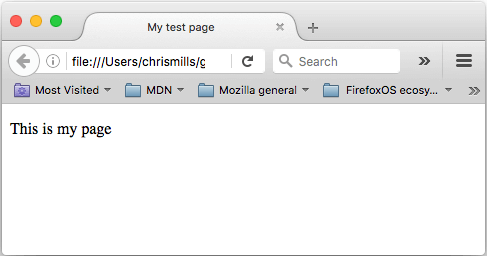

<p align="right">(<a href="#top">˄</a>)</p>

## HTML comments
- Using `<!-- comment-message -->` syntax.
  ```html
  <p>This is my page</p>
  <!-- <p>I am inside a comment!</p> -->
  ```

- Output: <br />
  

<p align="right">(<a href="#top">˄</a>)</p>

## Entity references

- In HTML, the characters <, >, ", ' and & are special characters. They are parts of the HTML syntax itself. So how do you include one of these special characters in your text?
- [List of XML and HTML character entity references](https://en.wikipedia.org/wiki/List_of_XML_and_HTML_character_entity_references)
- Code:<br />
  ```html
  <p>In HTML, you define a special character using the &lt;p&gt; element.</p>
  ```
- Output:<br />
  In HTML, you define a special character using the &lt;p&gt; element.

<p align="right">(<a href="#top">˄</a>)</p>

# Head

- The head of an HTML document is the part that is not displayed in the web browser when the page is loaded.
- It contains information such as the page `<title>`, links to CSS, links to custom favicons, and other metadata (data about the HTML, such as the author, and important keywords that describe the document).

<p align="right">(<a href="#top">˄</a>)</p>

## What is the HTML head?

- head's job is to contain metadata about the document.
- Code:<br />
  ```html
  <!DOCTYPE html>
  <html>
    <head>
      <meta charset="utf-8" />
      <title>My test page</title>
    </head>
  </html>
  ```
- Output:<br />
  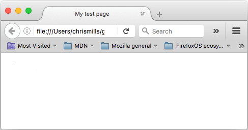

<p align="right">(<a href="#top">˄</a>)</p>

## Metadata

- Metadata is data that describes data like character encoding, author, description & icon.

<br />

### Document's character encoding
- "utf-8" is a universal character set that includes pretty much any character from any human language. This means that your web page will be able to handle displaying any language.
- If you set your character encoding to "ISO-8859-1", for example (the character set for the Latin alphabet), your page rendering may appear all messed up.

<br />

- **Correct encoding**<br />
  - Example:
    ```html
    <meta charset="utf-8" />
    ```
  - Output:<br />
    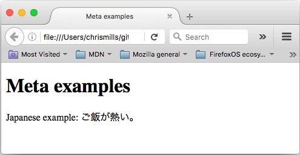

<br />

- **Bad encoding**<br />
  - Example:
    ```html
    <meta charset="ISO-8859-1" />
    ```
  - Output:<br />
    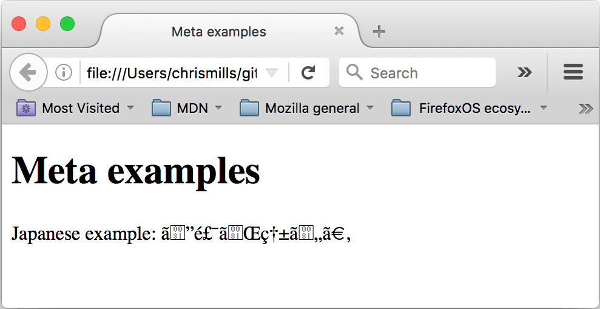

<p align="right">(<a href="#top">˄</a>)</p>

### Adding author and description

- Many `<meta>` elements include name and content attributes:
  - `name` specifies what type of information it contains.
  - `content` specifies the actual meta content.
- Example:<br />

  ```html
  <meta name="author" content="Chris Mills" />
  <meta
    name="description"
    content="The MDN Web Docs site
  provides information about Open Web technologies
  including HTML, CSS, and APIs for both Web sites and
  progressive web apps."
  />
  ```

- Output: (Google search engine)<br />
  

<p align="right">(<a href="#top">˄</a>)</p>

### Other types of metadata

- You may see other metadata as well.
- "Open Graph Data" is a metadata protocol that Facebook invented to provide richer metadata for websites.
- Example:<br />
  ```html
  <meta
    property="og:image"
    content="https://developer.mozilla.org/static/img/opengraph-logo.png"
  />
  <meta
    property="og:description"
    content="The Mozilla Developer Network (MDN) provides
  information about Open Web technologies including HTML, CSS, and APIs for both Web sites
  and HTML5 Apps. It also documents Mozilla products, like Firefox OS."
  />
  <meta property="og:title" content="Mozilla Developer Network" />
  ```
- Output: (Facebook)<br />
  

<br/>

- "Twitter" also has its own similar proprietary metadata called "Twitter Cards".
- Example:<br />
  ```html
  <meta name="twitter:title" content="Mozilla Developer Network" />
  ```

<p align="right">(<a href="#top">˄</a>)</p>

### Custom icons for your site

- An Icon will appear on the tab.
- Example:<br />
  ```html
  <link rel="icon" href="favicon.ico" type="image/x-icon" />
  ```
- Output:<br />
  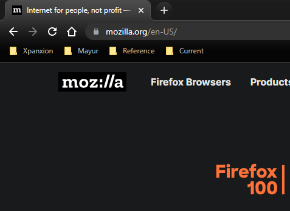

<p align="right">(<a href="#top">˄</a>)</p>

### Applying CSS and JavaScript to HTML

- The `<link>` element should always go inside the head of your document.
- Example:<br />
  ```html
  <link rel="stylesheet" href="my-css-file.css" />
  ```

<br />

- The `<script>` element should also go into the head and should include an src attribute containing the path to the JavaScript you want to load, and "defer", which instructs the browser to load the JavaScript after the page has finished parsing the HTML.
- Example:<br />
  ```html
  <script src="my-js-file.js" defer></scrip>
  ```

<p align="right">(<a href="#top">˄</a>)</p>

### Setting the primary language of the document

- Your HTML document will be indexed more effectively by search engines if its language is set and it is useful to people with visual impairments using screen readers.
- Example:<br />
  ```html
  <html lang="en-US"></html>
  ```

<br />

- You can also set subsections of your document to be recognized as different languages.
- Example:<br />
  ```html
  <p>Japanese example: <span lang="ja">ご飯が熱い。</span>.</p>
  ```

<p align="right">(<a href="#top">˄</a>)</p>

## Head example

```html
<!DOCTYPE html>
<html>
  <head lang="en-US">
    <title>Introduction</title>

    <meta charset="UTF-8" />
    <meta name="description" content="Free Web tutorials" />
    <meta name="keywords" content="HTML,CSS,XML,JavaScript" />
    <meta name="author" content="John Doe" />
    <meta name="viewport" content="width=device-width, initial-scale=1.0" />

    <link rel="icon" href="favicon.ico" type="image/x-icon" />
    <link rel="stylesheet" href="./style.css" />
    <script src="my-js-file.js" defer></script>
  </head>
</html>
```

<p align="right">(<a href="#top">˄</a>)</p>

# Text

- Structured content makes the reading experience easier and more enjoyable.
- In HTML, each paragraph has to be wrapped in a &lt;p&gt; element, like so:
  ```html
  <p>I am a paragraph, oh yes I am.</p>
  ```
- Each heading has to be wrapped in a heading element:
  ```html
  <h1>I am the title of the story.</h1>
  ```
- There are six heading elements:<br />
  &lt;h1&gt;<br />
  &lt;h2&gt;<br />
  &lt;h3&gt;<br />
  &lt;h4&gt;<br />
  &lt;h5&gt;<br />
  &lt;h6&gt;<br />
- Example:<br />
  ```html
  <h1>The Crushing Bore</h1>
  <p>By Chris Mills</p>
  <h2>Chapter 1: The dark night</h2>
  <p>
    It was a dark night. Somewhere, an owl hooted. The rain lashed down on the
    ...
  </p>
  <h2>Chapter 2: The eternal silence</h2>
  <p>
    Our protagonist could not so much as a whisper out of the shadowy figure ...
  </p>
  <h3>The specter speaks</h3>
  <p>Several more hours had passed, when all of a sudden the specter ...</p>
  ```
- Output:<br />
  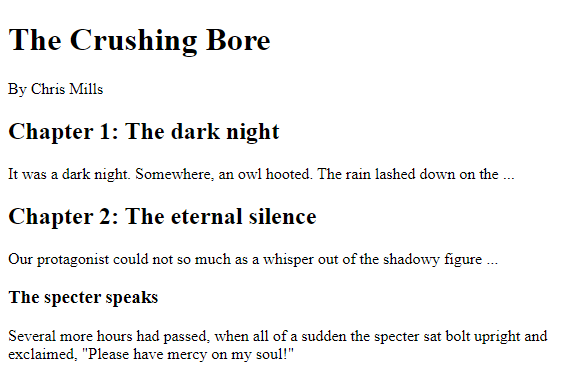

<p align="right">(<a href="#top">˄</a>)</p>

## Lists

### Unordered List
- Example:<br />
  ```html
  <ul>
    <li>milk</li>
    <li>eggs</li>
    <li>bread</li>
    <li>hummus</li>
  </ul>
  ```
- Output:<br />
  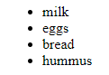

<p align="right">(<a href="#top">˄</a>)</p>

### Ordered List
- Example:<br />
  ```html
  <ol>
    <li>Drive to the end of the road</li>
    <li>Turn right</li>
    <li>Go straight across the first two roundabouts</li>
    <li>Turn left at the third roundabout</li>
    <li>The school is on your right, 300 meters up the road</li>
  </ol>
  ```
- Output:<br />
  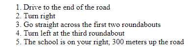

<p align="right">(<a href="#top">˄</a>)</p>

### Definition List
- Example:<br />
  ```html
  <dl>
    <dt>Definition title</dt>
    <dd>Definition description</dd>
  </dl>
  ```
- Output:<br />
  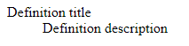

<p align="right">(<a href="#top">˄</a>)</p>

## Emphasis and importance

### Emphasis

- When we want to add emphasis in spoken language, we stress certain words, subtly altering the meaning of what we are saying. Similarly, in written language we tend to stress words by putting them in italics.
- Example:<br />
  ```html
  <p>I am <em>glad</em> you weren't <em>late</em>.</p>
  ```
- Output:<br />
  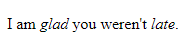

<p align="right">(<a href="#top">˄</a>)</p>

### Strong importance

- To emphasize important words, we tend to stress them in spoken language and bold them in written language.
- Example:<br />
  ```html
  <p>This liquid is <strong>highly toxic</strong>.</p>
  ```
- Output:<br />
  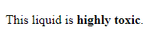

<p align="right">(<a href="#top">˄</a>)</p>

### Italic, bold, underline

- Example:<br />
  ```html
  <i>Italic text</i>, <b>Bold text</b>, <u>Underlined text</u>
  ```
- Output:<br />
  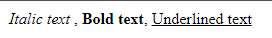

<p align="right">(<a href="#top">˄</a>)</p>

# Hyperlink

- Hyperlinks allow us to link documents to other documents or resources, link to specific parts of documents, or make apps available at a web address.

<br />

## Anatomy of a link
- Example:<br />
  ```html
  <p>
    I'm creating a link to
    <a href="https://www.mozilla.org/en-US/">the Mozilla homepage</a>.
  </p>
  ```
- Output:<br />
  <p>I'm creating a link to <a href="https://www.mozilla.org/en-US/">the Mozilla homepage</a>.</p>

<p align="right">(<a href="#top">˄</a>)</p>

## Supporting information with the title attribute
- Example:<br />
  ```html
  <p>
    I'm creating a link to
    <a
      href="https://www.mozilla.org/en-US/"
      title="The best place to find more information about Mozilla's
            mission and how to contribute"
      >the Mozilla homepage</a
    >.
  </p>
  ```
- Output:<br />
  <p>I'm creating a link to
    <a href="https://www.mozilla.org/en-US/" title="The best place to find more information about Mozilla's mission and how to contribute">
        the Mozilla homepage
    </a>.
  </p>

<p align="right">(<a href="#top">˄</a>)</p>

## Opening links in a new tab
- We can use the `target="_blank"` attribute to open a link in new tab.
  ```html
  <a href="https://www.theodinproject.com/about" target="_blank" rel="noopener noreferrer">click me</a>
  ```
- **Why do we need this added behavior for opening links in new tabs?**
  - Security reasons. 
  - The prevention of access that is caused by `noopener` prevents `phishing attacks` where the opened link may change the original webpage to a different one to trick users. This is referred to as `tabnabbing`. 
  - Adding the `noreferrer` value can be done if you wish to not let the opened link know that your webpage links to it.

<p align="right">(<a href="#top">˄</a>)</p>

## Block level links
- Example:<br />
  ```html
  <p>
    I'm creating a link to
    <a href="https://www.mozilla.org/en-US/">
      
    </a>
  </p>
  ```
- Output:<br />
  <p>I'm creating a link to
    <a href="https://www.mozilla.org/en-US/">
    
    </a>
  </p>

<p align="right">(<a href="#top">˄</a>)</p>

## Linking project files
- URLs use paths to find files.
- Reference:<br />
  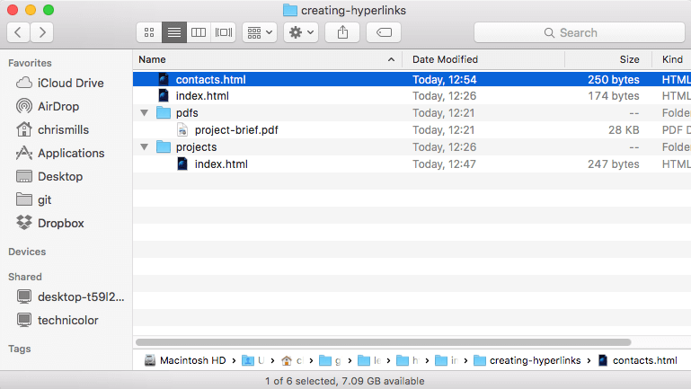

<br />

- Same directory
  ```html
  <p>Visit my <a href="contacts.html">contacts page</a>.</p>
  ```

<br />

- Moving down into subdirectories
  ```html
  <p>Visit my <a href="projects/index.html">project homepage</a>.</p>
  ```

<br />

- Moving back up into parent directories
  ```html
  <p>A link to my <a href="../pdfs/project-brief.pdf">project brief</a>.</p>
  ```

<p align="right">(<a href="#top">˄</a>)</p>

## Document fragments

- It's possible to link to a specific part of an HTML document, known as a document fragment
- First, add the id where you want to add a link
  ```html
  <h2 id="Mailing_address">Mailing address</h2>
  ```
- Link from another page
  ```html
  <p>
    Want to write us a letter? Use our
    <a href="contacts.html#Mailing_address">mailing address</a>.
  </p>
  ```
- Link from the same page
  ```html
  <p>
    The <a href="#Mailing_address">company mailing address</a> can be found at
    the bottom of this page.
  </p>
  ```

<p align="right">(<a href="#top">˄</a>)</p>

## Absolute versus relative URLs
- <b>Absolute URL</b>: Complete path <br/>
  ```
  https://www.example.com
  https://www.example.com/projects/index.html
  https://www.example.com/projects/
  ```
- <b>Relative URL</b>: Short path
  ```
  project-brief.pdf
  pdfs/project-brief.pdf
  ```

<p align="right">(<a href="#top">˄</a>)</p>


## Download attribute
- Use the download attribute to provide a default save filename
- Example: <br />
  ```html
  <a
    href="https://download.mozilla.org/?product=firefox-latest-ssl&os=win64&lang=en-US"
    download="firefox-latest-64bit-installer.exe"
  >
    Download Latest Firefox (64-bit) (English, US)
  </a>
  ```

<p align="right">(<a href="#top">˄</a>)</p>

## E-mail links
- It's possible to create links or buttons that, when clicked, open a new outgoing email message.
- Example: <br />
  ```html
  <a href="mailto:nowhere@mozilla.org">Send email to nowhere</a>
  ```

<p align="right">(<a href="#top">˄</a>)</p>

## Mobile links
- It's possible to create links or buttons that, when clicked, open a new outgoing call.
- Example: <br />
  ```html
  <a href="tel:123-456-7890">123-456-7890</a>
  ```

<p align="right">(<a href="#top">˄</a>)</p>

# Structure
- Typical website<br />
  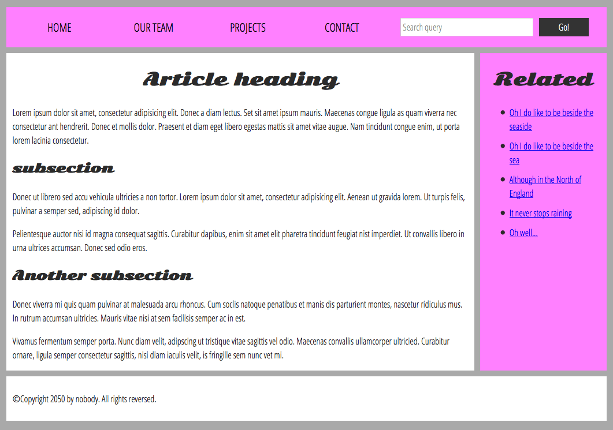

<p align="right">(<a href="#top">˄</a>)</p>

## HTML layout elements
- **header**: &lt;header&gt;
- **navigation** bar: &lt;nav&gt;
- **main content**: &lt;main&gt;, with various content subsections represented by &lt;article&gt; &lt;section&gt;, and &lt;div&gt; elements
- **sidebar**: &lt;aside&gt;, often placed inside &lt;main&gt;
- **footer**: &lt;footer&gt;

<p align="right">(<a href="#top">˄</a>)</p>

## Non-semantic wrappers
- &lt;span&gt; is an inline non-semantic element
- &lt;div&gt; is a block-level non-semantic element

<p align="right">(<a href="#top">˄</a>)</p>

## Line breaks and horizontal rules

- &lt;br&gt; creates a line break in a paragraph
- &lt;hr&gt; the thematic break element

<p align="right">(<a href="#top">˄</a>)</p>

# Debugging

## Syntax errors
- spelling or punctuation errors

## Logic errors
- The code is not what you intended it to be, meaning that the program runs incorrectly

<p align="right">(<a href="#top">˄</a>)</p>

## DOM inspector
- Right-click on the browser and Inspect the element OR Press F12 to DOM inspect.<br />
  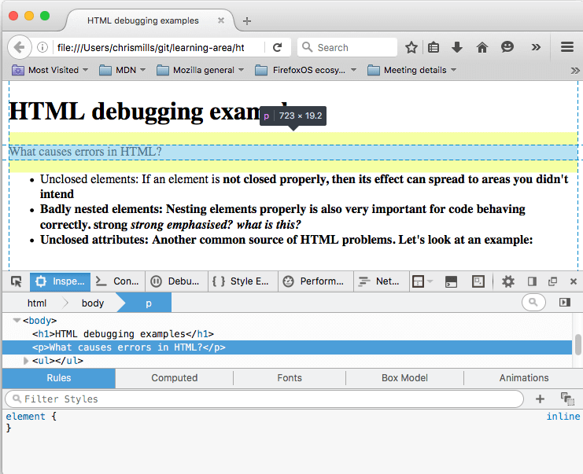

<p align="right">(<a href="#top">˄</a>)</p>

# Multimedia and embedding

# Images
- Example:<br />
  ```html
  
  ```
- Output:<br />
  

<p align="right">(<a href="#top">˄</a>)</p>

## Alternative text
- Example:<br />
  ```html
  
  ```
- Output: (when an image is not available)<br />
  

<p align="right">(<a href="#top">˄</a>)</p>

## Width and height
- Example:<br />
  ```html
  
  ```
- Output:<br />
  

<p align="right">(<a href="#top">˄</a>)</p>

## Title
- Provide supporting information if needed
- Example:<br />
  ```html
  
  ```
- Output: <br />
  

<p align="right">(<a href="#top">˄</a>)</p>

## Figures and figure captions
- Provide a semantic container for figures, and to clearly link the figure to the caption.
- Example:<br />
  ```html
  <figure>
    
    <figcaption>Mozilla homepage logo</figcaption>
  </figure>
  ```
- Output: <br />
<figure>
  
  <figcaption>Mozilla homepage logo</figcaption>
</figure>

<p align="right">(<a href="#top">˄</a>)</p>

# Video and audio

## Video element
- The &lt;video&gt; element allows you to embed a video very easily.
- Build your interface using the appropriate [JavaScript API](https://developer.mozilla.org/en-US/docs/Web/API/HTMLMediaElement)
- Example:<br />
  ```html
  <video src="rabbit320.webm" controls>
    <p>
      Your browser doesn't support HTML5 video. Here is a
      <a href="rabbit320.webm">link to the video</a> instead.
    </p>
  </video>
  ```
- Output:<br />
  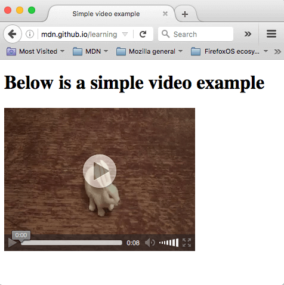

<p align="right">(<a href="#top">˄</a>)</p>

## Other video features
- Example:<br />
  ```html
  <video
    controls
    width="400"
    height="400"
    autoplay
    loop
    muted
    preload="auto"
    poster="poster.png"
  >
    <source src="rabbit320.mp4" type="video/mp4" />
    <source src="rabbit320.webm" type="video/webm" />
    <p>
      Your browser doesn't support HTML video. Here is a
      <a href="rabbit320.mp4">link to the video</a> instead.
    </p>
  </video>
  ```
- Output:<br />
  

<p align="right">(<a href="#top">˄</a>)</p>

## Displaying video text tracks
- The track element needs to `.vtt` file.
- Reference [vtt file](https://developer.mozilla.org/en-US/docs/Web/API/WebVTT_API)
- Example:<br />
  ```html
  <video controls>
    <source src="example.mp4" type="video/mp4" />
    <source src="example.webm" type="video/webm" />
    <track
      kind="subtitles"
      src="subtitles_es.vtt"
      srclang="es"
      label="Spanish"
    />
  </video>
  ```
- Output:<br />
  

<p align="right">(<a href="#top">˄</a>)</p>

## Audio element

- Example:<br />

  ```html
  <audio controls>
    <source src="viper.mp3" type="audio/mp3" />
    <source src="viper.ogg" type="audio/ogg" />
    <p>
      Your browser doesn't support HTML5 audio. Here is a
      <a href="viper.mp3">link to the audio</a> instead.
    </p>
  </audio>
  ```

- Output:<br />
  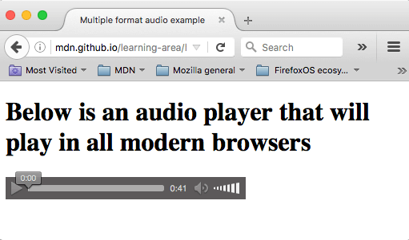

<p align="right">(<a href="#top">˄</a>)</p>

# Iframe
- &lt;iframe&gt; elements are designed to allow you to embed other web documents into the current document.
- <b>allowfullscreen</b>: fullscreen mode
- <b>sandbox</b>: works in slightly more modern browsers than the rest of the &lt;iframe&gt; features (e.g. IE 10 and above) a requests heightened security settings.
- Example:<br />
  ```html
  <head>
    <style>
      iframe {
        border: none;
      }
    </style>
  </head>
  <body>
    <iframe
      src="https://developer.mozilla.org/en-US/docs/Glossary"
      width="50%"
      height="500"
      allowfullscreen
      sandbox
    >
      <p>
        <a href="/en-US/docs/Glossary">
          Fallback link for browsers that don't support iframes
        </a>
      </p>
    </iframe>
  </body>
  ```
- Output:<br />
  

<p align="right">(<a href="#top">˄</a>)</p>

## Security concerns
- "Clickjacking" is one kind of common iframe attack where hackers embed an invisible iframe into your document (or embed your document into their own malicious website) and use it to capture users' interactions. This is a common way to mislead users or steal sensitive data.

<p align="right">(<a href="#top">˄</a>)</p>

## Use HTTPS
- HTTPS is the encrypted version of HTTP. You should serve your websites using HTTPS whenever possible:
  1. HTTPS reduces the chance that remote content has been tampered with in transit,
  2. HTTPS prevents embedded content from accessing content in your parent document, and vice versa.

<p align="right">(<a href="#top">˄</a>)</p>

## Always use the sandbox attribute
- Sandbox attributes block attackers from executing JavaScript, submitting forms, popup windows, etc. on your site.
- You should never add both "allow-scripts" and "allow-same-origin" to your sandbox attribute.<br />
- Example:
  ```html
  <!-- Sanbox will block javascript operation -->
  <iframe src="demo_iframe_sandbox.htm" sandbox></iframe>

  <!-- Sanbox with few allowed things -->
  <iframe sandbox="allow-same-origin allow-scripts allow-popups allow-forms"
    src="https://platform.twitter.com/widgets/tweet_button.html"
    style="border: 0; width:130px; height:20px;"></iframe>
  ```

<p align="right">(<a href="#top">˄</a>)</p>

## Configure CSP directives
- CSP stands for "content security policy" and provides a set of HTTP Headers (metadata sent along with your web pages when they are served from a web server) designed to improve the security of your HTML document.
- When it comes to securing &lt;iframe&gt;s, you can configure your server to send an appropriate X-Frame-Options header. This can prevent other websites from embedding your content in their web pages (which would enable clickjacking and a host of other attacks).

<p align="right">(<a href="#top">˄</a>)</p>

## Embed and object element
- Used to embed external content, such as PDFs.
- Example:<br />
  ```html
  <object data="mypdf.pdf" type="application/pdf" width="800" height="1200">
    <p>
      You don't have a PDF plugin, but you can
      <a href="mypdf.pdf">download the PDF file. </a>
    </p>
  </object>
  ```

<p align="right">(<a href="#top">˄</a>)</p>

# Adding vector graphics

## What are vector graphics?
- Two types of images: Raster images, and Vector images
  - <b>Raster images</b> are defined using a grid of pixels. <br />Example: .bmp, .png, .jpg, .gif
  - <b>Vector images</b> are defined using algorithms. <br />Example: .svg

<p align="right">(<a href="#top">˄</a>)</p>

## What is SVG?
- SVG is an XML-based language for describing vector images.
- Example:<br />
  ```html
  <svg
    version="1.1"
    baseProfile="full"
    width="300"
    height="200"
    xmlns="http://www.w3.org/2000/svg"
  >
    <rect width="100%" height="100%" fill="black" />
    <circle cx="150" cy="100" r="90" fill="blue" />
  </svg>
  ```
- Output:<br />
  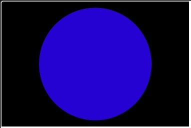

<p align="right">(<a href="#top">˄</a>)</p>

## Adding SVG
- Reduce a bit your loading time

### img element
- Example:<br />
  ```html
  
  ```

<p align="right">(<a href="#top">˄</a>)</p>

### Using CSS background
- Example:<br />
  ```html
  
  ```
  ```css
  .svg-image {
    background: url("fallback.png") no-repeat center;
    background-image: url("image.svg");
    background-size: contain;
  }
  ```

<p align="right">(<a href="#top">˄</a>)</p>

### Using SVG tag
- Example:<br />
  ```html
  <svg width="300" height="200">
    <rect width="100%" height="100%" fill="green" />
  </svg>
  ```

<p align="right">(<a href="#top">˄</a>)</p>

### Using Iframe
- Example:<br />
  ```html
  <iframe src="triangle.svg" width="500" height="500" sandbox>
    
  </iframe>
  ```

<p align="right">(<a href="#top">˄</a>)</p>

# Table

## Table basics

## What is a table?
- A table is a structured set of data made up of rows and columns.
- Example:<br />
  <br />
  

<p align="right">(<a href="#top">˄</a>)</p>

- **Creating the first table**
  - Example:<br />
    ```html
    <table border="1">
      <tr>
        <td>Hi, I'm your first cell.</td>
        <td>I'm your second cell.</td>
        <td>I'm your third cell.</td>
        <td>I'm your fourth cell.</td>
      </tr>
      <tr>
        <td>Second row, first cell.</td>
        <td>Cell 2.</td>
        <td>Cell 3.</td>
        <td>Cell 4.</td>
      </tr>
    </table>
    ```
  - Output:<br />
    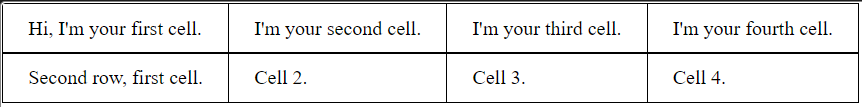

<p align="right">(<a href="#top">˄</a>)</p>

## TH element
- Example:<br />
  ```html
  <table border="1">
    <tr>
      <td>&nbsp;</td>
      <td>Knocky</td>
      <td>Flor</td>
      <td>Ella</td>
      <td>Juan</td>
    </tr>
    <tr>
      <td>Breed</td>
      <td>Jack Russell</td>
      <td>Poodle</td>
      <td>Streetdog</td>
      <td>Cocker Spaniel</td>
    </tr>
  </table>
  ```
- Output:<br />
  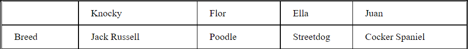

<p align="right">(<a href="#top">˄</a>)</p>

## Common styling to columns

### Styling with CSS
- Example:<br />
  ```html
  <table border="1">
    <tr>
      <th>Data 1</th>
      <th style="background-color: yellow">Data 2</th>
    </tr>
    <tr>
      <td>Calcutta</td>
      <td style="background-color: yellow">Orange</td>
    </tr>
    <tr>
      <td>Robots</td>
      <td style="background-color: yellow">Jazz</td>
    </tr>
  </table>
  ```
- Output:<br />
  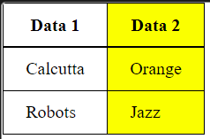

<p align="right">(<a href="#top">˄</a>)</p>

### Styling with col
- Example:<br />
  ```html
  <table border="1">
    <colgroup>
      <col />
      <col style="background-color: yellow" />
    </colgroup>
    <tr>
      <th>Data 1</th>
      <th>Data 2</th>
    </tr>
    <tr>
      <td>Calcutta</td>
      <td>Orange</td>
    </tr>
    <tr>
      <td>Robots</td>
      <td>Jazz</td>
    </tr>
  </table>
  ```
- Output:<br />
  

<p align="right">(<a href="#top">˄</a>)</p>

## Table advance features

### Caption tag

- Example:<br />
  ```html
  <table border="1">
    <caption>
      Dinosaurs in the Jurassic period
    </caption>

    …
  </table>
  ```

<p align="right">(<a href="#top">˄</a>)</p>

### Thead Tbody Tfoot
- Example:<br />
  ```html
  <table border="1">
    <caption>
      How I chose to spend my money
    </caption>
    <thead>
      <tr>
        <th>Purchase</th>
        <th>Location</th>
        <th>Date</th>
        <th>Evaluation</th>
        <th>Cost (€)</th>
      </tr>
    </thead>

    <tfoot>
      <tr>
        <td colspan="4">SUM</td>
        <td>118</td>
      </tr>
    </tfoot>

    <tbody>
      <tr>
        <td>Haircut</td>
        <td>Hairdresser</td>
        <td>12/09</td>
        <td>Great idea</td>
        <td>30</td>
      </tr>
      <tr>
        <td>Shoes</td>
        <td>Shoeshop</td>
        <td>13/09</td>
        <td>Big regrets</td>
        <td>88</td>
      </tr>
    </tbody>
  </table>
  ```

- Output:<br />
  

<p align="right">(<a href="#top">˄</a>)</p>

### Nesting tables
- Example:<br />
  ```html
  <table id="table1" border="1">
    <tbody>
      <tr>
        <th>title1</th>
        <th>title2</th>
        <th>title3</th>
      </tr>
      <tr>
        <td id="nested">
          <table id="table2" border="1" style="margin: .5rem 1rem;">
            <tbody>
              <tr>
                <td>cell1</td>
                <td>cell2</td>
                <td>cell3</td>
              </tr>
            </tbody>
          </table>
        </td>
        <td>cell2</td>
        <td>cell3</td>
      </tr>
      <tr>
        <td>cell4</td>
        <td>cell5</td>
        <td>cell6</td>
      </tr>
    </tbody>
  </table>
  ```
- Output:<br />
  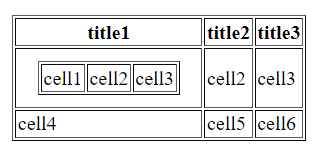

<p align="right">(<a href="#top">˄</a>)</p>

## Tables for visually impaired users

### Scope attribute
- To tell screenreaders exactly what cells the header is.
- Example:<br />
  ```html
  <thead>
    <tr>
      <th scope="col">Purchase</th>
      <th scope="col">Location</th>
      <th scope="col">Date</th>
      <th scope="col">Evaluation</th>
      <th scope="col">Cost (€)</th>
    </tr>
  </thead>
  ```

<p align="right">(<a href="#top">˄</a>)</p>

### Id and headers attributes
- An alternative to using the scope attribute is to use id and headers attributes to create associations between headers and cells.
- Example:<br />
  ```html
  <thead>
    <tr>
      <th id="purchase">Purchase</th>
      <th id="location">Location</th>
      <th id="date">Date</th>
      <th id="evaluation">Evaluation</th>
      <th id="cost">Cost (€)</th>
    </tr>
  </thead>
  <tbody>
    <tr>
      <th id="haircut">Haircut</th>
      <td headers="location haircut">Hairdresser</td>
      <td headers="date haircut">12/09</td>
      <td headers="evaluation haircut">Great idea</td>
      <td headers="cost haircut">30</td>
    </tr>
  </tbody>
  ```

<p align="right">(<a href="#top">˄</a>)</p>

# Form
- Web forms are one of the main points of interaction between a user and a website or application.
- Forms allow users to enter data, which is generally sent to a web server for processing and storage, or used on the client-side to immediately update the interface in some way.

## Form basics

## Designing your form
- Form design example:<br />
  <br />

<p align="right">(<a href="#top">˄</a>)</p>

## Form element
- The action attribute defines the location (URL) where the form's collected data should be sent when it is submitted.
- The method attribute defines which HTTP method to send the data with (usually get or post).
  ```html
  <form action="/my-handling-form-page" method="post">…</form>
  ```

<p align="right">(<a href="#top">˄</a>)</p>

## The label input textarea elements
- Example:<br />
  ```html
  <form action="/my-handling-form-page" method="post">
    <ul>
      <li>
        <label for="name">Name:</label>
        <input type="text" id="name" name="user_name" />
      </li>
      <li>
        <label for="mail">E-mail:</label>
        <input type="email" id="mail" name="user_email" />
      </li>
      <li>
        <label for="msg">Message:</label>
        <textarea id="msg" name="user_message"></textarea>
      </li>
    </ul>
  </form>
  ```
  ```css
  form {
    /* Center the form on the page */
    margin: 0 auto;
    width: 400px;
    /* Form outline */
    padding: 1em;
    border: 1px solid #ccc;
    border-radius: 1em;
  }
  ul {
    list-style: none;
    padding: 0;
    margin: 0;
  }
  form li + li {
    margin-top: 1em;
  }
  label {
    /* Uniform size & alignment */
    display: inline-block;
    width: 90px;
    text-align: right;
  }
  input, textarea {
    /* To make sure that all text fields have the same font settings
      By default, textareas have a monospace font */
    font: 1em sans-serif;

    /* Uniform text field size */
    width: 300px;
    box-sizing: border-box;

    /* Match form field borders */
    border: 1px solid #999;
  }
  input:focus, textarea:focus {
    /* Additional highlight for focused elements */
    border-color: #000;
  }
  textarea {
    /* Align multiline text fields with their labels */
    vertical-align: top;

    /* Provide space to type some text */
    height: 5em;
  }
  .button {
    /* Align buttons with the text fields */
    padding-left: 90px; /* same size as the label elements */
  }
  button {
    /* This extra margin represent roughly the same space as the space
      between the labels and their text fields */
    margin-left: 0.5em;
  }
  ```
- Output:<br />
  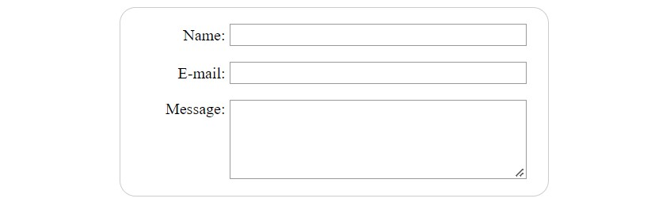<br />

<p align="right">(<a href="#top">˄</a>)</p>

## fieldset and legend elements
- fieldset element is a convenient way to create groups of widgets
- legend formally describes the purpose of the fieldset.
  ```html
  <form>
    <fieldset>
      <legend>Fruit juice size</legend>
      <p>
        <input type="radio" name="size" id="size_1" value="small" />
        <label for="size_1">Small</label>
      </p>
      <p>
        <input type="radio" name="size" id="size_2" value="medium" />
        <label for="size_2">Medium</label>
      </p>
      <p>
        <input type="radio" name="size" id="size_3" value="large" />
        <label for="size_3">Large</label>
      </p>
    </fieldset>
  </form>
  ```

<p align="right">(<a href="#top">˄</a>)</p>

## Form controls

### Input field
- Attributes
  - readonly
  - disabled
  - placeholder: text that appears inside the text input box
  - maxlength
  - minlength
  - spellcheck: spell checking

<p align="right">(<a href="#top">˄</a>)</p>

### Text field
```html
<input type="text" id="comment" name="comment" value="I'm a text field" />
```

<p align="right">(<a href="#top">˄</a>)</p>

### Password field
```html
<input type="password" id="pwd" name="pwd" />
```

<p align="right">(<a href="#top">˄</a>)</p>

### Hidden content
```html
<input type="hidden" id="timestamp" name="timestamp" value="1286705410" />
```

<p align="right">(<a href="#top">˄</a>)</p>

### Check box
```html
<input type="checkbox" id="questionOne" name="subscribe" value="yes" checked />
```

<p align="right">(<a href="#top">˄</a>)</p>

### Radio button
```html
<input type="radio" id="soup" name="meal" checked />
```

<p align="right">(<a href="#top">˄</a>)</p>

### Buttons
- **Submit**: Sends the form data to the server.
- **Reset**: Resets all form widgets to their default values.
- **Button**: Buttons that have no automatic effect
- Example:<br />
  ```html
  <button type="submit">This is a <strong>submit button</strong></button>
  <input type="submit" value="This is a submit button" />

  <button type="reset">This is a <strong>reset button</strong></button>
  <input type="reset" value="This is a reset button" />

  <button type="button">This is an <strong>anonymous button</strong></button>
  <input type="button" value="This is an anonymous button" />
  ```

<p align="right">(<a href="#top">˄</a>)</p>

## Image button
- It will submit x & y coordinates
- Example of append: http://foo.com?pos.x=123&pos.y=456
  ```html
  <input type="image" alt="Click me!" src="my-img.png" width="80" height="30" />
  ```

<p align="right">(<a href="#top">˄</a>)</p>

## File picker
- multiple file picker
  ```html
  <input type="file" name="file" id="file" accept="image/*" multiple />
  ```
- mobile device
  ```html
  <input type="file" accept="image/*;capture=camera" />
  <input type="file" accept="video/*;capture=camcorder" />
  <input type="file" accept="audio/*;capture=microphone" />
  ```

<p align="right">(<a href="#top">˄</a>)</p>

## E-mail address field
```html
<input type="email" id="email" name="email" />
<input type="email" id="email" name="email" multiple />
```

<p align="right">(<a href="#top">˄</a>)</p>

## Search field
```html
<input type="search" id="search" name="search" />
```

<p align="right">(<a href="#top">˄</a>)</p>

## Phone number field
```html
<input type="tel" id="tel" name="tel" />
```

<p align="right">(<a href="#top">˄</a>)</p>

## URL field
```html
<input type="url" id="url" name="url" />
```

<p align="right">(<a href="#top">˄</a>)</p>

## Numeric field
```html
<input type="number" name="age" id="age" min="1" max="10" step="2" />
<input type="number" name="change" id="pennies" min="0" max="1" step="0.01" />
```

<p align="right">(<a href="#top">˄</a>)</p>

## Slider controls
- Example:<br />
  ```html
  <label for="price">Choose a maximum house price: </label>
  <input
    type="range"
    name="price"
    id="price"
    min="50000"
    max="500000"
    step="100"
    value="250000"
  />
  <output class="price-output" for="price"></output>
  ```
  ```javascript
  const price = document.querySelector("#price");
  const output = document.querySelector(".price-output");

  output.textContent = price.value;

  price.addEventListener("input", () => {
    output.textContent = price.value;
  });
  ```
- Output:<br />
  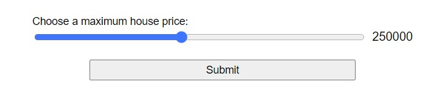<br />

<p align="right">(<a href="#top">˄</a>)</p>

## Date and time pickers
- Standard date: YYYY-MM-DD

### datetime-local
```html
<input type="datetime-local" name="datetime" id="datetime" />
```

<p align="right">(<a href="#top">˄</a>)</p>

### month
```html
<input type="month" name="month" id="month" />
```

<p align="right">(<a href="#top">˄</a>)</p>

### time
```html
<input type="time" name="time" id="time" />
```

<p align="right">(<a href="#top">˄</a>)</p>

### week
```html
<input type="week" name="week" id="week" />
```

<p align="right">(<a href="#top">˄</a>)</p>

### Constraining date/time values
```html
<label for="myDate">When are you available this summer?</label>
<input
  type="date"
  name="myDate"
  min="2013-06-01"
  max="2013-08-31"
  step="7"
  id="myDate"
/>
```

<p align="right">(<a href="#top">˄</a>)</p>

## Color picker control
```html
<input type="color" name="color" id="color" />
```

<p align="right">(<a href="#top">˄</a>)</p>

## Textarea - Multi-line text fields
- Attributes
  - cols
  - rows
  - wrap
  - resize: both/horizontal/vertical/none/block/inline

```html
<textarea cols="30" rows="8"></textarea>
```

<p align="right">(<a href="#top">˄</a>)</p>

## Select - Drop-down controls
```html
<select id="simple" name="simple">
  <option>Banana</option>
  <option selected>Cherry</option>
  <option>Lemon</option>
</select>
```

<p align="right">(<a href="#top">˄</a>)</p>

### Using optgroup in Select
```html
<select id="groups" name="groups">
  <optgroup label="fruits">
    <option>Banana</option>
    <option selected>Cherry</option>
    <option>Lemon</option>
  </optgroup>
  <optgroup label="vegetables">
    <option>Carrot</option>
    <option>Eggplant</option>
    <option>Potato</option>
  </optgroup>
</select>
```

<p align="right">(<a href="#top">˄</a>)</p>

### Using the value attribute
```html
<select id="simple" name="simple">
  <option value="banana">Big, beautiful yellow banana</option>
  <option value="cherry">Succulent, juicy cherry</option>
  <option value="lemon">Sharp, powerful lemon</option>
</select>
```

<p align="right">(<a href="#top">˄</a>)</p>

### Multiple choice select box
```html
<select id="multi" name="multi" multiple size="2">
  <optgroup label="fruits">
    <option>Banana</option>
    <option selected>Cherry</option>
    <option>Lemon</option>
  </optgroup>
  <optgroup label="vegetables">
    <option>Carrot</option>
    <option>Eggplant</option>
    <option>Potato</option>
  </optgroup>
</select>
```

<p align="right">(<a href="#top">˄</a>)</p>

### Autocomplete box
- basic example:<br />
  ```html
  <label for="myFruit">What's your favorite fruit?</label>
  <input type="text" name="myFruit" id="myFruit" list="mySuggestion" />
  <datalist id="mySuggestion">
    <option>Apple</option>
    <option>Banana</option>
    <option>Blackberry</option>
    <option>Blueberry</option>
    <option>Lemon</option>
    <option>Lychee</option>
    <option>Peach</option>
    <option>Pear</option>
  </datalist>
  ```
- For older browser<br />
  ```html
  <label for="myFruit">What is your favorite fruit? (With fallback)</label>
  <input type="text" id="myFruit" name="fruit" list="fruitList" />

  <datalist id="fruitList">
    <label for="suggestion">or pick a fruit</label>
    <select id="suggestion" name="altFruit">
      <option>Apple</option>
      <option>Banana</option>
      <option>Blackberry</option>
      <option>Blueberry</option>
      <option>Lemon</option>
      <option>Lychee</option>
      <option>Peach</option>
      <option>Pear</option>
    </select>
  </datalist>
  ```

<p align="right">(<a href="#top">˄</a>)</p>

## Progress bar
- A progress bar represents a value that changes over time up to a maximum value
- Example:<br />
  ```html
  <progress max="100" value="75">75/100</progress>
  ```
- Output:<br />
  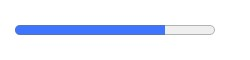<br />

<p align="right">(<a href="#top">˄</a>)</p>

## Meter bar
- A meter bar represents a fixed value in a range delimited by max and min values
- Example:<br />
  ```html
  <meter min="0" max="100" value="75" low="33" high="66" optimum="50">75</meter>
  ```
- Output:<br />
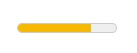<br />

<p align="right">(<a href="#top">˄</a>)</p>

# Form validation

## Using built-in form validation
- **Attributes**
  - `required`: Specifies whether a form field needs to be filled in before the form can be submitted.
  - `minlength` and `maxlength`: Specifies the minimum and maximum length of textual data (strings).
  - `min` and `max`: Specifies the minimum and maximum values of numerical input types.
  - `type`: Specifies whether the data needs to be a number, an email address, or some other specific preset type.
  - `pattern`: Specifies a regular expression that defines a pattern the entered data needs to follow.

<p align="right">(<a href="#top">˄</a>)</p>

## Validating against a regular expression
- Example: <br />
  ```html
  <form>
    <label for="choose">Would you prefer a banana or a cherry?</label>
    <input id="choose" name="i-like" required pattern="[Bb]anana|[Cc]herry" />
    <button>Submit</button>
  </form>
  ```

<p align="right">(<a href="#top">˄</a>)</p>
