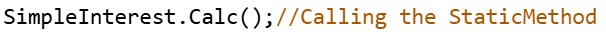
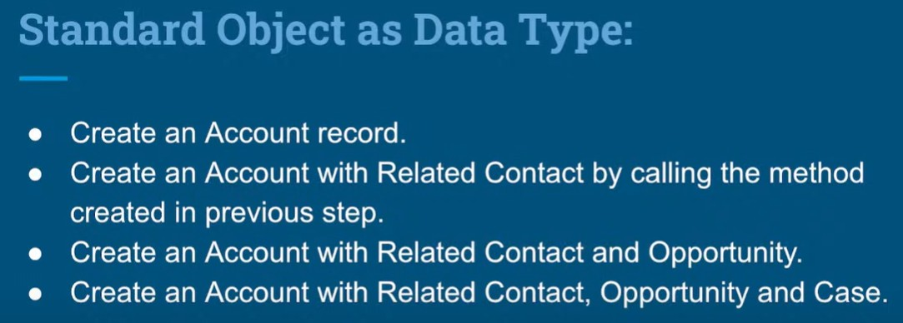
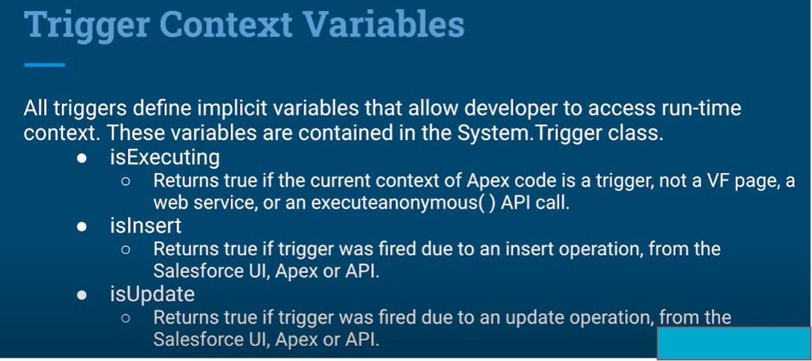
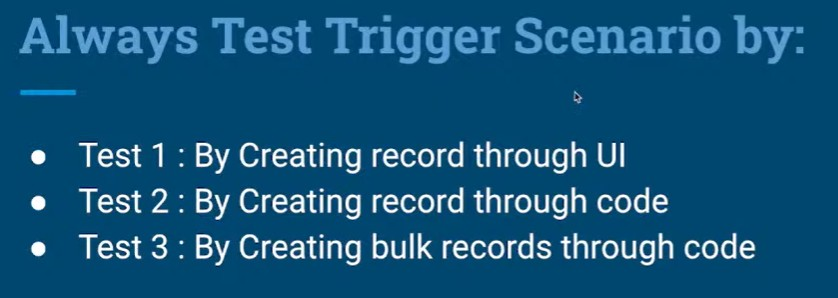

# INTRODUCTION APEX
- Object Oriented Programming Language
  - Supports classes, interfaces and inheritance
  - Uses Java like syntax 
- Strongly typed
  - Validates references to objects at compile time.
- Integrated with the database.
  - Provides direct access to records and their fields.
- Enable developers to add business logics to system events, including button clicks, related record updates, Visualforce pages and Lightning Components.
- One can call apex code through Web Service request and Triggers on Objects.

# Apex is:

### Integrated
- Provides built-in support for common Lightning Platform idioms
### Easy to Use
- Uses syntax and semantics which are easy teuse and understand.
- Apex is based on familiar Java Idioms.
### Data Focused
- Provides transactional access to the database, allows you to roll back operations.
### Rigorous
- Strongly typed language that uses direct references to schema objects such as Qbject and fields API.
### Hosted
- It is executed, and controlled entirely by Lightning Platform.
### Multi tenant Aware
- Apex runs in multi tenant environment like rest of Lightning Platform.
### Easy to Test
- Apex provides built-in support for unit test creation and execution. Test results indicate how much code is covered.
### Versioned
- One can save apex code against different versions of the API.

# Apex is included in:

- Performance Edition
- Unlimited Edition
- Developer Edition
- Enterprise Edition
- Database.com

# Use Apex when you want to:

- Create Web and Email Services.
- Perform Complex validation over more than one objects.
- Create complex business logics those cannot be implemented by FLOWS.
- Create custom logic that occurs over the entire transaction.
- Attach custom logic to another operation, such as Create/Update/Save a record, so that it occurs whenever the operation is executed, regardless it originates in Ul, VF or from API.
  
# Apex is A Case Insensitive Language
- Apex is case Insensitive but its best prcatice to use case sensitive because we use Javascript in LWC (JS is case sensitive)
# Apex Supports:

- Classes, Interfaces, Collections (List, Set, Map)
- Objects, Array notation, Expressions, Variables & Constants.
- Conditional Statements (if-else), Control Statement (for, while loop).
- Cloud Dev as it is stored, compiled and executed in cloud.
- Triggers to call methods.
- Database statements to query and search data.
- Transactions and rollbacks.
- The global access modifier which is more permissive than public, and allows access across namespaces and applications.
- Versioning of Custom Code.

# Development Tools
- Developer Console
- Salesforce Extension for Visual Studio Code

# Object Oriented Programming
- Apex is an Object Oriented Programming Language.
- An Object is a real world entity or problem.
- To represent object logically we implement a class.
- Class forms basis for Object Oriented Programming.
- A Class is a collection of variables and methods.
- Variables are attributes/properties of an Object whereas methods are behaviors of an Object.
- Once class is created then we can use it as a datatype to create an instance.

# Real World Example
 

## Syntax
 

# Class as Data Type to Create Instance
 

## Class & Method Example
 

### Calling Method using instance of an Class
 

# Constructor in Apex
 

## Rectangle Example With DefaultConstructor
 

### Calling Rectangle Methods With Constructor using Instance of an Class
 

## Rectangle Example With Parameterizedonstructor
 

### Calling Rectangle Methods With Constructor using Instance of an Class
 

# Static Vs Non-Static Methods

# Static Methods
 

### Calling Rectangle Static Method
 

- Note  : If you want to call the method without creating the instance of an Class then we have to use "Static" keyword to a method. (Use Static Method)
- IMP   : 90% Code will be implemented using Static Method.
- IMP   : In Trigger,Test Classes we have to use Static Methods.

# Non Static Methods 

 

### Calling Non-Static Method using instance of an Class
 

- Note : In Non-Static Method we have to create Instance of an Class to call the method.

## Example SimpleInterest

 

### Calling SimpleInterest Non-Static Method 
 

# Object Oriented Programming Concepts
## Encapsulation
  - Means collection of variables and methods together. Class is an
example of encapsulation.
## Abstraction
  - Hides the process and focus on what to do.
## Inheritance
  - Reusing features of a class into another class.

## Example Square Area & Perimeter
 

### Calling Square Area & Perimeter Non-Static Method using instance of an Class
 

## Using non-static method and constructor
 

### Calling non-static method with constructor
 

## Usinq static method
 

### Calling static method
 

## Using static method by passing parameters to method
 

### Calling static method by passing parameters to method
 

# Data Types in Apex
## Apex Supports following data types:
### A Primitive
- Integer, Double, String, Long, Date, ID, Boolean, and more.
### An sObject
- either as a generic sObject or as a specific sObject eg. Account...
### A Collection
- list, set, map
### A types list of values, also known as enum.
### User - defined Apex Classes
### System supplied Apex Classes

# Primitive Data types:
## Examples:
- Boolean isActive = true;
- Integer Num = 0;
- Decimal Price = 1000.50;
- String s = 'Hello World';
- ID id = '00100000009R2XWPPO';

 

 

## Examples:
 

 

 

# sObject as Data type:

## Examples:
-  Account acc = new Account();
-  Account acc = new Account(Name = 'Test');
-  Account acc = new Account();
    - acc.Name = 'Test';
    - acc.Phone = 123456;
- MyObj_c obj = new MyObj_c( );

 

## Examples:
 
 

## Examples:
 
 

# Standard Object as Data Type:
 

Missing lectures need to add

# Apex Trigger In Salesforce
## Introduction to Apex Trigger
- Triggers are initiated when a record is inserted, updated, deleted and undeleted.
- Use triggers to do operations that cannot be done by point and click tools provided
  in Salesforce.
- We can do things using triggers that we can do through Apex, including execution
- SOQL and DML or calling custom methods.
- Triggers can be created for both Standard and Custom objects.
- We can perform custom operations before or after events to records.
- By default triggers are active as you create them.

## Types of Triggers
### Before Triggers
- It is used to update or validate record values before saved to database.
### After Triggers
- It is used to access field values that are set by the system such as Ids, and to make changes in the related/other records.
  The records that fire the after trigger are read-only.

## Triggers Order Of Execution :
  

## Trigger Syntax
  

## Trigger Events
  

## Trigger Example 1
  

## Trigger Context Variables
  

  

  

  

  

## Trigger Example 2
  

### Bulkified Trigger when we use Trigger.new 
  

#### Here we can create 5 records using trigger (By Writing this in Anonymous window)
  

## Trigger & TriggerHandler (ApexClass)
- This 1st is Trigger & the Bottom is TriggerHandler Class (We have to create both files saperately for Trigger and Trigger Handler Class)
  

  

Missing Lecture Need to complete

# Asynchronous Apex | Batch Apex

## Batch Apex
- Batch Apex runs large jobs. It can process thousands or millions of records.
- It processes records asynchronously in batches.
- For Data cleansing or archiving, Batch Apex is probably best solution.

## How Batch Apex works?
- The execution logic of the batch class is called once for each batch of records that is being processed.
- Each time when a batch class is invoked, the job is placed on the Apex job queue and is executed as a discrete transaction.
- Advantages are:
  - Every transaction starts with a new set of governor limits.
  - If one batch fails to process successfully, all other successful batch transactions aren't rolled back.
    
### Syntax
- Batch Apex class must implement the Database.Batchable interface and include the following three methods:
  - start()
  - execute()
  - finish()