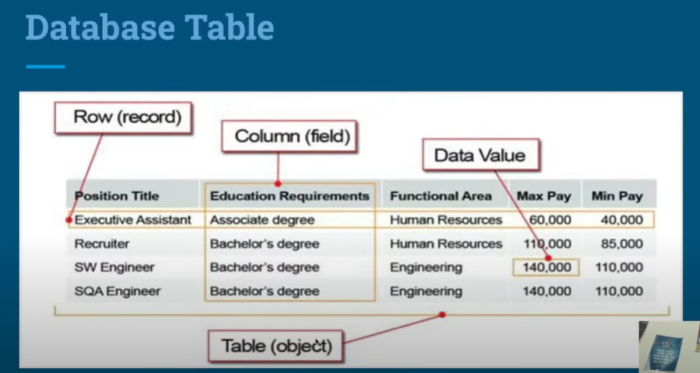
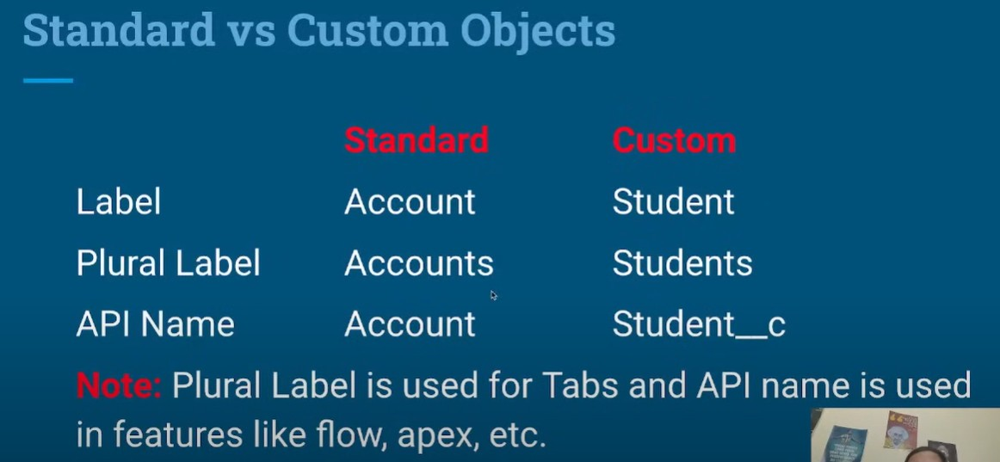
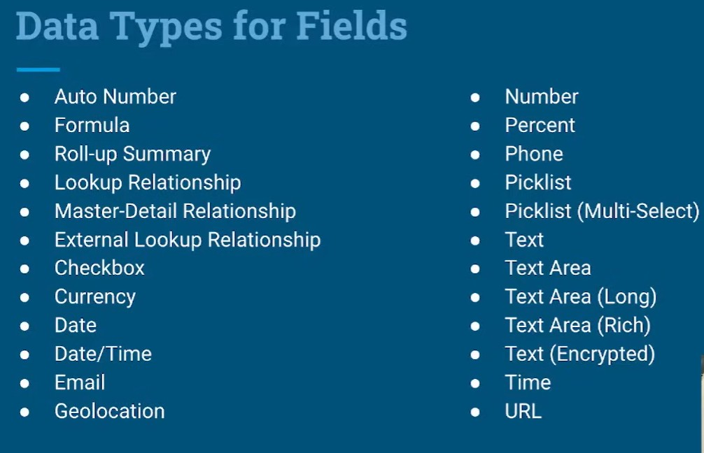

# INTRODUCTION
- Salesforce is the world's most popular CRM system.
- Many companies and customers rely on this dynamic,
  web-based, low-cost CRM platform.
- It was founded in March 1999 by Marc Benioff.
- Salesforce unites businesses marketing, sales, commerce,
  service and IT teams from anywhere with Customer 360 - one
  integrated CRM platform that powers entire suite of
  connected apps.

# CRM Overview
- Customer Relationship Management
- Broadly defined, CRM is a strategy for managing a
  company's interactions with clients and sales
  prospects and ensuring the 'Connect' sustains
  throughout the relation.
  
# SALESFORCE CRM Benefits
- Helps businesses manage their customer interactions and sales
  processes.
- Known for customer-centric approach.
- Provides tools for managing customer data, tracking sales, automating
  marketing, customer services tasks, and analyzing business performance.
- Cloud based so can be accessed from anywhere with an internet
  connection.
- It is highly customizable and can be integrated with other systems and
  applications.
- Provides industry specific solutions to help various sectors like education,
  healthcare, communication, nonprofit, financial services etc.

  
<a href="#top-of-page">(^)</a>

# Database Table 

   

# OBJECTS (Standard & Custom)
## Introduction
- An Object is very similar to a database table in the Force.com platform.
- The platform comes with a number of standard objects like Account, Contact, Case, Lead, Opportunity, etc.
- The standard objects support default apps like Salesforce Sales and Salesforce Service.
- We can create Custom Objects in Salesforce as per requirement of the project.

## Standard & Custom Objects

   

# TABS
## Introduction
- Through Tabs we can navigate around an app.
- Every tab serves as the starting point for viewing, editing & entering information for a specific object.
- When we click a tab, the corresponding home page that object appears.
- For example, if we click the Accounts tab, the Accounts tab home page appears. 
It gives you access to all of the account records. We can view details of a particular record by clicking on it on it.

## Types of Navigation (Standard & Console)

# FIELDS
- A fields is like a database column.
- There are various data types are available in Salesforce to create fields.
- By entering values in fields, we create a record in Salesforce.

## Data Type For Fields

   

## IMP 
### Which 4 Fields are created automatically while creation of Custom Object.
- Ans : Created By, Last Modified By, Owner, Student ID.

### How many ways we can able to create Tab?
- Ans : Two. 
- 1 With Custom object creation page Launch New Custom Tab Wizard after saving this custom object
- 2 Home > Search 'TAB' > New 

# RECORD
- Records are the rows(entries) in object which are uniquely identified by there ids.
- We can create records by entering values in fields available in an object.
- We can create, edit, view and delete a record in Salesforce.

# APPS
- An App is a container for all the objects, tabs and other functionality.
- It is similar to a programming project where we keep all our code files.
- In Salesforce App consists simply of a name, a logo and an ordered set of tabs.

### Types of Navigation in Apps
- Two types : 
- 1 Standard Navigation 
- 2 Console Navigation

## Text Fields
-Text, Text Area, Text Aread Long, Text Area Rich

## Picklist Fields
- Picklist
- Multi-Select Picklist

## Global Picklist Value Set
- Generic Picklist used with many object's picklist fields
  

