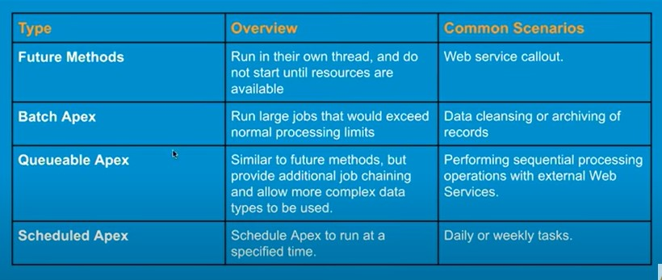

- [Apex Governor Limits](#apex-governor-limits)
- [Difference between Lookup and Master Detail Relationship](#difference-between-lookup-and-master-detail-relationship)
- [Custom Metadata \& Custom Settings](#custom-metadata--custom-settings)
- [BEST PRACTICES OF APEX CODE](#best-practices-of-apex-code)
- [Decorators available in LWC](#decorators-available-in-lwc)
- [Lifecycle hooks in LWC](#lifecycle-hooks-in-lwc)
- [Order of execution](#order-of-execution)
- [Bulkification](#bulkification)
- [BEST PRACTICES OF Test Classes](#best-practices-of-test-classes)
- [BEST PRACTICES to Write Apex Trigger](#best-practices-to-write-apex-trigger)
- [Trigger Context Variables](#trigger-context-variables)
- [INTERVIEW](#interview)
- [USER Mode or SYSTEM Mode](#user-mode-or-system-mode)
- [Question and Answers](#question-and-answers)
  - [What is Salesforce?](#what-is-salesforce)
  - [What is CRM](#what-is-crm)
  - [Editions in Salesforce?](#editions-in-salesforce)
  - [Licenses in Salesforce?](#licenses-in-salesforce)
  - [What is Object?](#what-is-object)
  - [What is Field?](#what-is-field)
  - [What is Tab?](#what-is-tab)
  - [What is App?](#what-is-app)
  - [What is Record?](#what-is-record)
  - [Standard Navigation and Console Navigation Apps?](#standard-navigation-and-console-navigation-apps)
  - [Name Datatypes to create fields?](#name-datatypes-to-create-fields)
  - [What is Lookup Relationship?](#what-is-lookup-relationship)
  - [What is Master-Detail Relationship?](#what-is-master-detail-relationship)
  - [What is Rollup Summary Field?](#what-is-rollup-summary-field)
  - [Can We convert Lookup to Master-Detail?](#can-we-convert-lookup-to-master-detail)
  - [Can we convert Master-Detail to Lookup?](#can-we-convert-master-detail-to-lookup)
  - [Many-To-Many Relationship?](#many-to-many-relationship)
  - [What is Formula Field?](#what-is-formula-field)
  - [Difference between Picklist and Multiselect Picklist?](#difference-between-picklist-and-multiselect-picklist)
  - [What is Global Picklist ValueSet?](#what-is-global-picklist-valueset)
  - [What is Field Dependency?](#what-is-field-dependency)
  - [What is Page Layout?](#what-is-page-layout)
  - [What is Related List?](#what-is-related-list)
  - [Types of Lightning Pages?](#types-of-lightning-pages)
  - [Component Visibility?](#component-visibility)
  - [What is Validation Rule?](#what-is-validation-rule)
  - [What is Feed Tracking?](#what-is-feed-tracking)
  - [What is Field History Tracking?](#what-is-field-history-tracking)
  - [What is Activity Component?](#what-is-activity-component)
  - [What is Chatter Component?](#what-is-chatter-component)
  - [What isDuplicate Rule and Matching Rule?](#what-isduplicate-rule-and-matching-rule)
    - [Duplicate Rule](#duplicate-rule)
    - [Matching Rule](#matching-rule)
  - [What is List View?](#what-is-list-view)
  - [What is Record Type?](#what-is-record-type)
  - [What is Schema Builder?](#what-is-schema-builder)
  - [What is Email Template?](#what-is-email-template)
  - [Global Action Vs Object Specific Action?](#global-action-vs-object-specific-action)
    - [Global Action :](#global-action-)
    - [Object Specific Action :](#object-specific-action-)
  - [What is Sales Proces?](#what-is-sales-proces)
  - [What is Support Process?](#what-is-support-process)
  - [What is Lead Process?](#what-is-lead-process)
  - [What is Setup Audit Trails?](#what-is-setup-audit-trails)
  - [Different ways to mke a field required?](#different-ways-to-mke-a-field-required)
  - [What is Data Import Wizard?](#what-is-data-import-wizard)
  - [What is Data Loader?](#what-is-data-loader)
    - [Operations in Data Loader?](#operations-in-data-loader)
- [Data Sharing and Security Q\&A](#data-sharing-and-security-qa)
  - [What is Sharing and Security in Salesforce?](#what-is-sharing-and-security-in-salesforce)
  - [Sharing and Security Model](#sharing-and-security-model)
  - [What is Organization Level Security?](#what-is-organization-level-security)
  - [Object Level Security](#object-level-security)
  - [Field Level Security](#field-level-security)
  - [What is Profile?](#what-is-profile)
  - [What can be controlled through a Profile?](#what-can-be-controlled-through-a-profile)
  - [Enhanced Profile User Interface?](#enhanced-profile-user-interface)
  - [What is Permission Set?](#what-is-permission-set)
  - [What can be controlled through a Permission Set?](#what-can-be-controlled-through-a-permission-set)
  - [What is Permission Set Group?](#what-is-permission-set-group)
  - [What is MUTE in permission Set Group?](#what-is-mute-in-permission-set-group)
  - [How many Profiles can be assigned to a user?](#how-many-profiles-can-be-assigned-to-a-user)
  - [How many Permission Sets can be assigned to a user?](#how-many-permission-sets-can-be-assigned-to-a-user)
  - [What is Record Level Security](#what-is-record-level-security)
  - [What is OWD?](#what-is-owd)
  - [What is Role Hierarchy?](#what-is-role-hierarchy)
  - [What is Grant Access using Hierarchies?](#what-is-grant-access-using-hierarchies)
  - [What is Sharing Rule?](#what-is-sharing-rule)
  - [Two ways to create Sharing Rule?](#two-ways-to-create-sharing-rule)
  - [What is Manual Sharing?](#what-is-manual-sharing)
  - [What is Public Group?](#what-is-public-group)
  - [Object dose not have EDIT permission but OWD is Public Read/Write?](#object-dose-not-have-edit-permission-but-owd-is-public-readwrite)
  - [View All \& Modify All?](#view-all--modify-all)
- [Reports and Dashboards](#reports-and-dashboards)
  - [What are Data Analysis Tools available in Salesforce?](#what-are-data-analysis-tools-available-in-salesforce)
  - [What is Report?](#what-is-report)
  - [What is Report Type?](#what-is-report-type)
  - [What is Report Type?](#what-is-report-type-1)
  - [Types of Reports?](#types-of-reports)
  - [What is Tabular Report?](#what-is-tabular-report)
  - [What is Summary Report?](#what-is-summary-report)
  - [What is Matrix Report?](#what-is-matrix-report)
  - [What is Joined Report?](#what-is-joined-report)
  - [Filters in reports?](#filters-in-reports)
  - [Charts can be added in which type of Reports?](#charts-can-be-added-in-which-type-of-reports)
  - [Types of Charts available in Reports?](#types-of-charts-available-in-reports)
  - [What is Bucket Field in Report?](#what-is-bucket-field-in-report)
  - [About Report Folder](#about-report-folder)
  - [Can we share a report with User or Group?](#can-we-share-a-report-with-user-or-group)
  - [Access Levels while sharing Report Folder?](#access-levels-while-sharing-report-folder)
  - [Can we place a report on Lightning Page?](#can-we-place-a-report-on-lightning-page)
  - [What is Dashboard?](#what-is-dashboard)
  - [Can we place a Dashboard on Lightning Page?](#can-we-place-a-dashboard-on-lightning-page)
  - [an we apply filters in Dashboard?](#an-we-apply-filters-in-dashboard)
  - [About Dashboard Folder:](#about-dashboard-folder)
  - [Can we share a dashboard with User or Group?](#can-we-share-a-dashboard-with-user-or-group)
  - [Access Levels while sharing Dashboard Folder?](#access-levels-while-sharing-dashboard-folder)
  - [Important About Dashboard?](#important-about-dashboard)
- [Flows](#flows)
  - [What is Process Automation?](#what-is-process-automation)
  - [What is Flow Builder?](#what-is-flow-builder)
  - [Types of FLOWS?](#types-of-flows)
  - [Flow Elements?](#flow-elements)
  - [Flow Resources?](#flow-resources)
  - [Screen Flow](#screen-flow)
  - [Record - Triggered Flow?](#record---triggered-flow)
  - [Schedule - Triggered Flow?](#schedule---triggered-flow)
  - [Platform Event - Triggered Flow?](#platform-event---triggered-flow)
  - [Autolaunched Flow?](#autolaunched-flow)
  - [What to Debug a Flow?](#what-to-debug-a-flow)
  - [Version Control](#version-control)
  - [Can we Call Apex class through Flow?](#can-we-call-apex-class-through-flow)
  - [Which annotation we use with apex class method when we call Apex class through Flow?](#which-annotation-we-use-with-apex-class-method-when-we-call-apex-class-through-flow)
  - [How to Call a Flow into another Flow?](#how-to-call-a-flow-into-another-flow)
  - [Some Important Actions that can be done through Flow?](#some-important-actions-that-can-be-done-through-flow)
  - [$Record Vs $Record Prior?](#record-vs-record-prior)
  - [What happens when flow fails?](#what-happens-when-flow-fails)
  - [Fast Field Update Vs Actions \& Related Records?](#fast-field-update-vs-actions--related-records)
  - [Can records be shared with users through flow?](#can-records-be-shared-with-users-through-flow)
  - [Can we set the order of execution of record triggered flows?](#can-we-set-the-order-of-execution-of-record-triggered-flows)
  - [What are two paths we have in Record Triggered Flow?](#what-are-two-paths-we-have-in-record-triggered-flow)
  - [From where we can validate whether Flow is scheduled or not?](#from-where-we-can-validate-whether-flow-is-scheduled-or-not)
  - [Can we debug a flow as another user?](#can-we-debug-a-flow-as-another-user)
  - [What frequency we can set in Schedule Triggered Flow?](#what-frequency-we-can-set-in-schedule-triggered-flow)
  - [Record Single Variable Vs Record Collection Variable?](#record-single-variable-vs-record-collection-variable)
    - [Record Single Variable :](#record-single-variable-)
    - [Record Collection Variable :](#record-collection-variable-)
  - [Can we pause and resume a screen flow?](#can-we-pause-and-resume-a-screen-flow)
  - [Does Flow support versioning?](#does-flow-support-versioning)
  - [Can we deactivate flow anytime?](#can-we-deactivate-flow-anytime)
- [Triggers](#triggers)
  - [What is a Trigger?](#what-is-a-trigger)
  - [What is Trigger Syntax?](#what-is-trigger-syntax)
  - [Types of Trigger?](#types-of-trigger)
    - [Before Triggers](#before-triggers)
    - [After Triggers](#after-triggers)
  - [Trigger Events?](#trigger-events)
  - [Trigger Context Variables?](#trigger-context-variables-1)
  - [Trigger.new Vs Trigger.newMap?](#triggernew-vs-triggernewmap)
  - [Trigger.old Vs Trigger.oldMap?](#triggerold-vs-triggeroldmap)
  - [Can we call a apex class through trigger?](#can-we-call-a-apex-class-through-trigger)
  - [Trigger Best Practices?](#trigger-best-practices)
  - [What is Recursive Trigger?](#what-is-recursive-trigger)
  - [Can we apply validation through trigger?](#can-we-apply-validation-through-trigger)
  - [Can a trigger call a batch class?](#can-a-trigger-call-a-batch-class)
  - [Can a trigger make a call Apex callout method?](#can-a-trigger-make-a-call-apex-callout-method)
  - [What is trigger bulkification?](#what-is-trigger-bulkification)
  - [Is there any limit on number of triggers defined on an object?](#is-there-any-limit-on-number-of-triggers-defined-on-an-object)
- [Test Class](#test-class)
  - [What is Apex Test Class?](#what-is-apex-test-class)
  - [Benefits of Apex Unit Tests?](#benefits-of-apex-unit-tests)
  - [Code Coverage requirement for Deployment?](#code-coverage-requirement-for-deployment)
  - [Important about Test Class?](#important-about-test-class)
  - [Test class syntax?](#test-class-syntax)
  - [@testSetup?](#testsetup)
  - [Common Test Utility or Data Factory Class?](#common-test-utility-or-data-factory-class)
  - [Assert in Test Class?](#assert-in-test-class)
  - [Apex Test Class Best Practices?](#apex-test-class-best-practices)
  - [@isTest(SeeAlIData=True) Annotation?](#istestseealidatatrue-annotation)
  - [Using the runAs Method?](#using-the-runas-method)
  - [Using the runAs Method?](#using-the-runas-method-1)
- [Asynchronous Apex](#asynchronous-apex)
  - [What is Asynchronous Apex?](#what-is-asynchronous-apex)
  - [Benefits of Asynchronous Processing?](#benefits-of-asynchronous-processing)
  - [Types of Asynchronous Processing?](#types-of-asynchronous-processing)
  - [Governor \& Execution Limits in Asynchronous Processing?](#governor--execution-limits-in-asynchronous-processing)
  - [Challenges of Asynchronous Processing?](#challenges-of-asynchronous-processing)
  - [What is Future Apex/Method?](#what-is-future-apexmethod)
  - [hen to use Future Methods?](#hen-to-use-future-methods)
  - [Best Practices : Future Method](#best-practices--future-method)
  - [Things to Remember while using Future Method:](#things-to-remember-while-using-future-method)
  - [What is Batch Apex?](#what-is-batch-apex)
  - [How Batch Apex works?](#how-batch-apex-works)
  - [Which methods are used in Batch Apex ?](#which-methods-are-used-in-batch-apex-)
    - [What is the use of start( ) method in Batch Apex?](#what-is-the-use-of-start--method-in-batch-apex)
    - [What is the use of execute( ) method in Batch Apex?](#what-is-the-use-of-execute--method-in-batch-apex)
    - [What is the use of finish( ) method in Batch Apex?](#what-is-the-use-of-finish--method-in-batch-apex)
  - [Batch Practices: Batch Apex](#batch-practices-batch-apex)
  - [What is Queueable Apex?](#what-is-queueable-apex)
  - [What are the benefits of Queueable Apex?](#what-are-the-benefits-of-queueable-apex)
  - [Important to Remember while using Queueable Apex:](#important-to-remember-while-using-queueable-apex)
  - [What is Scheduled Apex?](#what-is-scheduled-apex)
  - [How many ways are there to Schedule Apex?](#how-many-ways-are-there-to-schedule-apex)
  - [What is CRON Expression?](#what-is-cron-expression)
  - [Things to Remember while Scheduling Apex:](#things-to-remember-while-scheduling-apex)
- [LWC Lightning Web Component](#lwc-lightning-web-component)
  - [What is LWC?](#what-is-lwc)
  - [Lightning Web Component Files?](#lightning-web-component-files)
  - [What is LWC Module?](#what-is-lwc-module)
  - [What is use of XML File?](#what-is-use-of-xml-file)
  - [Can Aura Component contain Lightning Web component?](#can-aura-component-contain-lightning-web-component)
  - [Can a Lightning Web Component call another Lightning Web Component?](#can-a-lightning-web-component-call-another-lightning-web-component)
  - [Camel Case Vs Kebab Case?](#camel-case-vs-kebab-case)
  - [What is decorator ?](#what-is-decorator-)
  - [What is the use of @api decorator?](#what-is-the-use-of-api-decorator)
  - [What is the use of @track decorator?](#what-is-the-use-of-track-decorator)
  - [What is the use of @wire decorator?](#what-is-the-use-of-wire-decorator)
  - [Conditional Rendering in HTML?](#conditional-rendering-in-html)
  - [Rendering List in HTML?](#rendering-list-in-html)
  - [How to write expression in component?](#how-to-write-expression-in-component)
  - [How to call Controller function in component?](#how-to-call-controller-function-in-component)
  - [@AuraEnabled(cacheabIe=true)](#auraenabledcacheabietrue)
  - [What is Lifecycle Hooks?](#what-is-lifecycle-hooks)
  - [What is Lifecycle Flow?](#what-is-lifecycle-flow)
  - [What are three ways to work with Salesforce Data?](#what-are-three-ways-to-work-with-salesforce-data)
  - [ightning Data Service?](#ightning-data-service)
  - [Wire Service?](#wire-service)
  - [Wire Service Syntax?](#wire-service-syntax)
  - [Why to import References to Salesforce Objects \& Fields?](#why-to-import-references-to-salesforce-objects--fields)
  - [How to get current record id in lightning web component?](#how-to-get-current-record-id-in-lightning-web-component)
  - [How can we deploy lightning web components?](#how-can-we-deploy-lightning-web-components)
  - [Communicate with Events in LWC?](#communicate-with-events-in-lwc)
  - [Use of Lightning Message Service?](#use-of-lightning-message-service)
  - [Use of pubsub Module?](#use-of-pubsub-module)
  - [Where we can use Lightning Web Components?](#where-we-can-use-lightning-web-components)
- [Changeset](#changeset)
  - [What is change Set in Salesforce?](#what-is-change-set-in-salesforce)
  - [Types of change set](#types-of-change-set)
- [Tell me something about yourself](#tell-me-something-about-yourself)
- [My Intro](#my-intro)
- [Roles and Responsibilities of a Salesforce Developer](#roles-and-responsibilities-of-a-salesforce-developer)
  - [1. Requirement Analysis and Planning](#1-requirement-analysis-and-planning)
    - [Morning Stand-ups/Meetings :](#morning-stand-upsmeetings-)
    - [Requirement Gathering:](#requirement-gathering)
  - [2. Development and Customization](#2-development-and-customization)
    - [Coding and Development:](#coding-and-development)
    - [Customization:](#customization)
  - [3. Database Management](#3-database-management)
    - [Data Schema Design:](#data-schema-design)
    - [Data Management:](#data-management)
  - [4. Integration](#4-integration)
    - [API Development:](#api-development)
    - [Integration Tools:](#integration-tools)
  - [5. Testing and Quality Assurance](#5-testing-and-quality-assurance)
    - [Unit Testing:](#unit-testing)
    - [Testing:](#testing)
  - [6. Documentation](#6-documentation)
    - [Technical Documentation:](#technical-documentation)
    - [Process Documentation:](#process-documentation)
  - [7. Collaboration and Communication](#7-collaboration-and-communication)
    - [Team Collaboration:](#team-collaboration)
    - [Status Reporting:](#status-reporting)
  - [8. Maintenance and Support](#8-maintenance-and-support)
    - [Bug Fixing:](#bug-fixing)
    - [User Support:](#user-support)
  - [9. Continuous Learning and Improvement](#9-continuous-learning-and-improvement)
    - [Skill Enhancement:](#skill-enhancement)
    - [Training and Certification:](#training-and-certification)
    - [Tools and Technologies Commonly Used Salesforce Platform:](#tools-and-technologies-commonly-used-salesforce-platform)
    - [Development Tools:](#development-tools)
    - [Data Tools:](#data-tools)
    - [Collaboration Tools:](#collaboration-tools)
    - [Testing Tools:](#testing-tools)

# Apex Governor Limits

<table>
    <tr>
        <td>Description</td>
        <td>Synchronous Limit</td>
        <td>Asynchronous Limit</td>
    </tr>
    <tr>
        <td>Total number of SOQL queries issued1</td>
        <td>100</td>
        <td>200</td>
    </tr>
    <tr>
        <td>Total number of records retrieved by SOQL queries</td>
        <td>50,000</td>
        <td>50,000</td>
    </tr>
    <tr>
        <td>Total number of records retrieved by Database.getQueryLocator</td>
        <td>10,000</td>
        <td>10,000</td>
    </tr>
    <tr>
        <td>Total number of SOSL queries issued</td>
        <td>20</td>
        <td>20</td>
    </tr>
    <tr>
        <td>Total number of records retrieved by a single SOSL query</td>
        <td>2,000</td>
        <td>2,000</td>
    </tr>
    <tr>
        <td>Total number of DML statements issued2</td>
        <td>150</td>
        <td>150</td>
    </tr>
    <tr>
        <td>Total number of records processed as a result of DML statements, Approval.process, or database.emptyRecycleBin</td>
        <td>10,000</td>
        <td>10,000</td>
    </tr>
    <tr>
        <td>Total stack depth for any Apex invocation that recursively fires triggers due to insert, update, or delete statements3</td>
        <td>16</td>
        <td>16</td>
    </tr>
    <tr>
        <td>Total number of callouts (HTTP requests or web services calls) in a transaction</td>
        <td>100</td>
        <td>100</td>
    </tr>
    <tr>
        <td>Maximum cumulative timeout for all callouts (HTTP requests or Web services calls) in a transaction</td>
        <td>120 seconds</td>
        <td>120 seconds</td>
    </tr>
    <tr>
        <td>Maximum number of methods with the future annotation allowed per Apex invocation</td>
        <td>50</td>
        <td>0 in batch and future contexts; 50 in queueable context</td>
    </tr>
    <tr>
        <td>Maximum number of Apex jobs added to the queue with System.enqueueJob</td>
        <td>50</td>
        <td>1</td>
    </tr>
    <tr>
        <td>Total number of sendEmail methods allowed</td>
        <td>10</td>
        <td>10</td>
    </tr>
    <tr>
        <td>Total heap size4</td>
        <td>6 MB</td>
        <td>12 MB</td>
    </tr>
    <tr>
        <td>Maximum CPU time on the Salesforce servers5</td>
        <td>10,000 milliseconds</td>
        <td>60,000 milliseconds</td>
    </tr>
    <tr>
        <td>Maximum execution time for each Apex transaction</td>
        <td>10 minutes</td>
        <td>10 minutes</td>
    </tr>
    <tr>
        <td>Maximum number of push notification method calls allowed per Apex transaction</td>
        <td>10</td>
        <td>10</td>
    </tr>
    <tr>
        <td>Maximum number of push notifications that can be sent in each push notification method call</td>
        <td>2,000</td>
        <td>2,000</td>
    </tr>
    <tr>
        <td>Maximum number of EventBus.publish calls for platform events configured to publish immediately</td>
        <td>150</td>
        <td>150</td>
    </tr>
</table>

<a href="#top-of-page">(^)</a>

# Difference between Lookup and Master Detail Relationship

<table>
    <tr>
        <td>Lookup Relationships</td>
        <td>Master-Detail Relationship</td>
    </tr>
    <tr>
        <td>Loosely coupled.</td>
        <td>Strongly coupled.</td>
    </tr>
    <tr>
        <td>Roll-up summary field not available.</td>
        <td>Roll-up summary field is available.</td>
    </tr>
    <tr>
        <td>Parent record is not required when creating a child record.</td>
        <td>Parent record is required in order to save a child record.</td>
    </tr>
    <tr>
        <td>Lookup fields are not required on the page layout of the detail record but if you make them a required field, it is advised!</td>
        <td>Master-detail field is always required on the page layout of the detail record (because of the point above).</td>
    </tr>
    <tr>
        <td>Standard object record can be on the detail side of a custom object in a lookup relationship.</td>
        <td>Standard object record cannot be a child.</td>
    </tr>
    <tr>
        <td>By default record ownership of child records is not controlled by the parent.</td>
        <td>The parent controls the record ownership of child records. The owner field is not available on the detail record in master-detail relationship queues, sharing rules and manual sharing is not possible for detail records as it requires the owner field.</td>
    </tr>
    <tr>
        <td>You can have a child record without a parent.</td>
        <td>You cannot have a child record without a parent.</td>
    </tr>
    <tr>
        <td>You can have a maximum of 40 lookups on an object.</td>
        <td>You can have a maximum of two master details on an object.</td>
    </tr>
    <tr>
        <td>No cascade delete.</td>
        <td>Cascade delete.</td>
    </tr>
</table>

<a href="#top-of-page">(^)</a>

# Custom Metadata & Custom Settings

<table>
    <tr>
        <td>Custom Settings</td>
        <td>Custom Metadata Types</td>
    </tr>
    <tr>
        <td>Type</td>
        <td>Custom Settings are also similar to custom objects. You can either create a List based or hierarchy based custom setting.</td>
        <td>Custom metadata does not support Hierarchy type of data based on user profile or a specific user.</td>
    </tr>
    <tr>
        <td>Deployment</td>
        <td>Custom settings data cannot be deployed using packages or Metadata API/Change Sets.</td>
        <td>Custom metadata types data can be easily packaged and deployed. Metadata types can also be deployed via Change Sets/Metadata API.</td>
    </tr>
    <tr>
        <td>Relationship Field</td>
        <td>Custom settings do not support relationship fields.</td>
        <td>You can create lookups between Custom Metadata objects.</td>
    </tr>
    <tr>
        <td>Suffix</td>
        <td>It has a suffix of “__C” like custom object</td>
        <td>It has a suffix of “__mdt”</td>
    </tr>
    <tr>
        <td>Test Class</td>
        <td>Custom setting data is not visible in test classes.</td>
        <td>Custom metadata types are visible in test class without the “SeeAllData” annotation.</td>
    </tr>
    <tr>
        <td>DML in Apex</td>
        <td>You can perform CUD (Create, Update, Delete) operation on custom setting in apex.</td>
        <td>You cannot perform CUD (Create, Update, Delete) operation on custom metadata type in apex.</td>
    </tr>
    <tr>
        <td>SOQL</td>
        <td>You can access custom setting data using instance methods and can avoid SOQL queries to database</td>
        <td>With custom metadata types, you can issue unlimited (SOQL) queries for each Apex transaction. But method is also available.</td>
    </tr>
</table>

<a href="#top-of-page">(^)</a>

# BEST PRACTICES OF APEX CODE
- Bulkify Apex Code
- Avoid SOQL & DML Inside For Loop 
- Optimize SOQL Queries to avoid Timeout Issues
- Use Of Map Of SObject
- Use Of The Limits Apex Methods 
- Avoid Hardcoding IDs
- Use Database Methods While Doing DML Operation
- Exception Handling In Apitx Code 
- Use transactional finalizers
- Write One Trigger Per Object Per Event 
- Use Asynchronous Apex
- Security And Sharing In Apex Code
- Make Reusability Of Apex Code
- Code Coverage 
- Return Early Pattern
- Avoid Nesting Loops Within Loops 
- Don't Mix Apex, Process Builders, Workflow Rules, And Record-Triggered Flows.
- Apex Naming Conventions-https://quip.com/MW5cAPVwat8k#JCIACABQ963
- Setup Code Review Checklist And Code Review Process 

<a href="#top-of-page">(^)</a>

# Decorators available in LWC		

- There are three different decorators available in lightning web component

  1. @api

  2. @track

  3. @wire

- **@api** is used to make any JavaScript class variable to public and can be accessed outside of the Lightning web component. For Example:- Child to parent, parent to child

- **@wire** is used to call the Apex Class methods from Lightning web component or calling the Salesforce standard methods/api from the Lightning web component.

- **@track** is used to make the variable reactive. (it's not needed from the premitive variables) but is useful when the variable store the objects of obiects { "child": { "grandChild" : { } } }) or array of objects. ([, ])

<a href="#top-of-page">(^)</a>

# Lifecycle hooks in LWC

- Lifecycle hooks in Lightning Web Components (LWC) are special methods or functions that are automatically called at specific stages of a component's lifecycle. They allow developers to intervene and execute code at critical moments during a component's life, such as when it's created, rendered, updated, or destroyed. Some of the key lifecycle hooks in LWC include:

    **constructor()**: Called when a component instance is created.

    **connectedCallback()**: Invoked when a component is inserted into the DOM.

    **renderedCallback()**: Fired when a component is completely rendered on the DOM.

    **disconnectedCallback()**: Called when the element is removed from the document.

    **errorCallback()**: Invoked when there is an error during rendering.

- These hooks provide a comprehensive way to control and intervene in various phases of a component's lifecycle, and are crucial for creating responsive and robust web applications. Understanding and effectively using these hooks is pivotal for successful development in Salesforce's Lightning Web Components

<a href="#top-of-page">(^)</a>

# Order of execution 

- In Salesforce, the order of execution for triggers when saving a record with an insert, update, or upsert statement is as follows:
1. Load the original record or initialize on insert.
2. Override the old record values with the new values.
3. Execute all before triggers.
4. Run the system & user-defined validation rules.
5. Save the record but do not commit the record to the database.
6. Execute all after triggers.
7. Execute the assignment rules.
8. Execute the auto-response rules.
9. Execute the workflow rules.
10. If there are workflow field updates, then execute before and after triggers.
11. Execute the processes and flows on that record.
12. Execute the escalation rules.
13. Update the roll-up summary fields & cross-object formula fields.
14. Repeat the same process with the affected parent or grand-parent records.
15. Evaluate criteria-based sharing rules.
16. Commit all DML operations to the database.
17. Execute post-commit logic such as sending emails
18. Understanding the order of execution is crucial for developers and administrators to design efficient and reliable triggers in Salesforce
- For a more detailed understanding, you can refer to the Salesforce Developer Guide"                          
              

<a href="#top-of-page">(^)</a>

# Bulkification

- Bulkification is either the process of combining repetitive tasks in Apex. — or — Bulkification is the process of ensuring the Apex code properly handles more than one record at a time.

- In Salesforce, Trigger.new will batch up mass updates, including up to 200 records at once (as commonly happens when using tools like Data Loader). So, for example, if you do one SOQL query per record, you’ll exceed the 100 SOQL query limit.

- Bulkification in Salesforce is the practice of writing code that can efficiently handle large volumes of data. It involves combining tasks in Apex to process records in bulk, thus avoiding hitting Governor Limits. An example of bulkified code is a trigger that can update multiple records at once, instead of processing one record at a time. This approach optimizes performance and ensures that the code runs within the platform's limits. For instance, a bulkified trigger on the Account object would use a for loop to handle updates on multiple records, rather than processing them individually. This is essential for maintaining the performance and scalability of Salesforce applications.

<a href="#top-of-page">(^)</a>

# BEST PRACTICES OF Test Classes

- Unit tests must cover at least 75% of your Apex code, and all of those tests must complete successfully.
- Every trigger must have some test coverage.
- All classes and triggers must compile successfully.
- Note the following.
- When deploying Apex to a production organization, each unit test in your organization namespace is executed by default.
- Calls to System.debug aren’t counted as part of Apex code coverage.
- Test methods and test classes aren’t counted as part of Apex code coverage.
- While only 75% of your Apex code must be covered by tests, don’t focus on the percentage of code that is covered. Instead, make sure that every use case of your application is covered, including positive and negative cases, as well as bulk and single records. This approach ensures that 75% or more of your code is covered by unit tests.
- Tests don’t run in parallel in metadata deployments, package installations, or change set deployments.

<a href="#top-of-page">(^)</a>

-To write an effective test cases, a developer needs to ensure to include the below points into the test class

 • Test class must start with @isTest annotation.
 • Focus 90+ : To deploy to production at least 75% code coverage is required. But always try to focus on 90%+. We should not focus on the percentage of code coverage, We should make sure that every use case should covered including positive, negative,bulk and single record.
 • One Assert Statement per method : Always put assert statements for negative and positive tests.
     System.assert(condition, msg)
     System.assertEquals(expected, actual, msg)
     System.assertNotEquals(expected, actual, msg)
 • @testSetup to create test records once in a method and use in every test method in the test class.
 • Create TestFactory class with @isTest annotation to exclude from organization code size limit.
 • No SeeAllData=true : Always use ( seeAllData = false ) at class or method level. User, profile, organization, AsyncApexjob, Corntrigger, RecordType, ApexClass, ApexComponent, ApexPage we can access without (seeAllData=true) .
 • As apex runs in system mode so the permission and record sharing are not taken into account . So we need to use System.runAs to enforce record sharing.
 • Avoid Using Hard Coding Ids anywhere in test Class or any apex class
 • Governor limits : Using Test.startTest() gives developers a new set of governor limits for the act stage of their test. Test.stopTest() then allows them to return to their previous governor limits. Test classes must test for Governor Limits using Limits Class
 • Testing Exception : Any exceptions that are caught in the production methods should be tested by feeding the test data that throws exception. Exception Type and error message should be asserted
 • Exercise bulk trigger functionality – use at least 200 records in your tests

<a href="#top-of-page">(^)</a>

# BEST PRACTICES to Write Apex Trigger

- Here are some best practices for working With Apex triggers:

- Avoid using triggers to perform complex business logic. Triggers are intended to perform simple,
efficient actions in response to events, rather than implementing complex business logic.
Instead, you should use Apex classes and methods to encapsulate this logic and call them from
your triggers.

- Use triggers to enforce data integrity and consistency. Triggers can be used to enforce data
validation rules and ensure that data is consistent across objects. For example, you could use a
trigger to prevent the deletion of a record if it is referenced by other records.

- Use Apex Governor Limits to prevent triggers from consuming too many resources. Apex
Governor Limits are limits on the amount of resources (e.g. database queries, heap size) that
can be consumed by Apex code. You should design your triggers to be efficient and avoid
exceeding theke limits.

- Test your triggers thoroughly. It'S important to test your triggers thoroughly to ensure that they
are working as expected and not causing any unintended side effects. You should test your
triggers using both positive and negative test cases to ensure that they are robust and reliable.

- Use the @isTest annotation to specify that a class or method is a test class or method. The
@isTest annotation is used to specify that a class or method is a test class or method, which
allows Salesforce to identify it as a test and exclude it from code coverage requirements.

<a href="#top-of-page">(^)</a>

# Trigger Context Variables 
- All triggers define implicit variables that allow developers to access run-time context. These variables are contained in the System.Trigger class.

<table>
    <tr>
        <td>Variable</td>
        <td>Usage</td>
    </tr>
    <tr>
        <td>isExecuting</td>
        <td>Returns true if the current context for the Apex code is a trigger, not a Visualforce page, a Web service, or an executeanonymous() API call.</td>
    </tr>
    <tr>
        <td>isInsert</td>
        <td>Returns true if this trigger was fired due to an insert operation, from the Salesforce user interface, Apex, or the API.</td>
    </tr>
    <tr>
        <td>isUpdate</td>
        <td>Returns true if this trigger was fired due to an update operation, from the Salesforce user interface, Apex, or the API.</td>
    </tr>
    <tr>
        <td>isDelete</td>
        <td>Returns true if this trigger was fired due to a delete operation, from the Salesforce user interface, Apex, or the API.</td>
    </tr>
    <tr>
        <td>isBefore</td>
        <td>Returns true if this trigger was fired before any record was saved.</td>
    </tr>
    <tr>
        <td>isAfter</td>
        <td>Returns true if this trigger was fired after all records were saved.</td>
    </tr>
    <tr>
        <td>isUndelete</td>
        <td>Returns true if this trigger was fired after a record is recovered from the Recycle Bin. This recovery can occur after an undelete operation from the Salesforce user interface, Apex, or the API.</td>
    </tr>
    <tr>
        <td>new</td>
        <td>Returns a list of the new versions of the sObject records.This sObject list is only available in insert, update, and undelete triggers, and the records can only be modified in before triggers.</td>
    </tr>
    <tr>
        <td>newMap</td>
        <td>A map of IDs to the new versions of the sObject records.This map is only available in before update, after insert, after update, and after undelete triggers.</td>
    </tr>
    <tr>
        <td>old</td>
        <td>Returns a list of the old versions of the sObject records.This sObject list is only available in update and delete triggers.</td>
    </tr>
    <tr>
        <td>oldMap</td>
        <td>A map of IDs to the old versions of the sObject records.This map is only available in update and delete triggers.</td>
    </tr>
    <tr>
        <td>operationType</td>
        <td>Returns an enum of type System.TriggerOperation corresponding to the current operation.Possible values of the System.TriggerOperation enum are: BEFORE_INSERT, BEFORE_UPDATE, BEFORE_DELETE,AFTER_INSERT, AFTER_UPDATE, AFTER_DELETE, and AFTER_UNDELETE. If you vary your programming logic based on different trigger types, consider using the switch statement with different permutations of unique trigger execution enum states.</td>
    </tr>
    <tr>
        <td>size</td>
        <td>The total number of records in a trigger invocation, both old and new.</td>
    </tr>
</table>

<a href="#top-of-page">(^)</a>

# INTERVIEW

https://www.interviewbit.com/lwc-interview-questions/

Interview Topics
ADMIN
Sharing & Security - Object Level Security
Record Level Security
Permission Set
Profile
Role Hierarchy
Manual Sharing & Criteria based Sharing

Custom Metadata & Custom Settings
Why We use them
What are different ways to use them
Difference between them

Object & Relationships
Different Type of objects
Why we use them
What is lookup Master Detail Self Relationship

Validation Rule & Formula Field

Process Automation
Workflow Rule Process Builder
Lightning Flows
When to use them

1. Tell me about yourself
2. How to configure Object level security?
   Create, Read, Delete
3. How many Relationships in Salesforce?
4. What is Static & Dynamic Dashboard?
5. How do you access Historical data report?
6. What is OWD?
7. What is Triggers?
8. Best Practices of Triggers?
9. What are the limit for SOQL and SOSL? Async and Sync
10. What is deployment? Workbench changeset?
11. What is Custom Page Layout and Lightning Page Layout?
12. What are different types of Dashboard Components?
13. Waht is Async and Sync Apex?

<a href="#top-of-page">(^)</a>

# USER Mode or SYSTEM Mode

By default all the apex classes and triggers web services runs in system mode

If we want  run the apex  in a user mode we should use with sharing or without sharing keyword in the method and schema checks also can be done to run the apex in user mode

<a href="#top-of-page">(^)</a>

# Question and Answers

## What is Salesforce?
- Salesforce is the most popular CRM system.
- Many companies & Customers rely on this dynamic, web-based, low-cost CRM platform.
- It was founded in MARCH 1999 by Marc Benioff.
- Salesforce CRM Provides a complete feature-rich solutions for Sales, Marketing, Service, Health, Non-Profit, Education, Partner & Community Management etc.

## What is CRM
- Stats for Customer Relationship Manager
- CRM is a stratergy for managing a company's interaction with client and sales prospects and ensuring the "Connect" sustains throught the Solution.

## Editions in Salesforce?
- Personal Edition
- Group Edition
- Professional Edition
- Enterprise Edition
- Performance Edition
- Unlimited Edition
- Developer Edition
- Contact Manager Edition

## Licenses in Salesforce?
- Salesforce Users
- Salesforce Platform and Lightning Platform Users
- Chatter Plus Users(Chatter Only), Chatter Free USers, Chatter External Users.
- Customer Community, Customer Community Plus and Partner Community External USers.
- Portal USers who are a member of a Salesforce Community.

## What is Object?
- An Object is similar to a database table in salesforce where you can store information.
- Object can be Standard and Custom.

-                Stnadard    Custom
- Lable           Account     Student
- Plural Lable    Accounts    Students
- API Name        Account     Student__C   

## What is Field?
- A field is like a database column.
- There are various data types are available in Salesforce to create fields.
- By Entering values in fields, We create a record in Salesforce.
- Field can be standard as well as custom.

## What is Tab?
- Clicking on Tabs we can navigate around an app.
- Every tab service as the starting point for viewing, editing and entering information for a specific object.
- Wehen we click a tab, the corresponding home page that object appears.
- Eg Account Tab, Accounts tab home page will appears.
  
## What is App?
- An App is a container for all the objects, tabs and Oother functionality.
- It is similar to a programming project where we keep all our code files.
- In Salesorce App consist simply Name, Logo and Ordered set of Tabs.

## What is Record?
- Records are the rows(entries) in object which are uniquely identified by their ids.
- We can create records by entering values in fields avaialable in an object
- We can create, edit, view and delete a record in Salesforce.

## Standard Navigation and Console Navigation Apps?
- Standard Navigation opens one record at a time on the Page whereas in Console Navigation if you open more than one records so they are opened in sub tabs together.

## Name Datatypes to create fields?
- Auto Number                   - Number
- Formula                       - Percent
- Roll-up Summary               - Phone
- Lookup Relationship           - Picklist
- Master-Detail Relationship    - Picklist(Multiselect)
- External Lookup Relationship  - Text
- Checkbox                      - Text Area
- Currency                      - Text Area (Long)
- Date                          - Text Area (Rich)
- Date/Time                     - Text (Encrypted)
- Email                         - Time
- Geolocation                   - URL

## What is Lookup Relationship?
- Create a relationship that links one object to another object.
- The relationship field allow users to click on a lookup icon to select a value from popup lisk.
- The other is the source of the values in the list.

## What is Master-Detail Relationship?
- Creates a special type of parent-child relationship between two objects.
- One is known as child/detail where we create Master-Detail relationship and another one is known as Parent/Master.
- Required on all detail records.
- Ownership and sharing of a detail record is determined by the master record.
- If user deletes the Master record then all the detail records are delated.
- One can create roll-up summary field on the Master records so that detail records can be summarized.

## What is Rollup Summary Field?
- A read-only field that displays the SUM, MINIMUM or MAXIMUM value of a field in a related list.
- This Field also can COUNT all records available in related list.
- Rollup Summary field is always created on parent object.

## Can We convert Lookup to Master-Detail?
- Yes, but first you need to populate values in lookup field on each record available on the object.

## Can we convert Master-Detail to Lookup?
- Yes, but ifyou have create rollup summary field then you need to delete those field before converting Master-Detail to Lookup.

## Many-To-Many Relationship?
- This can be implemented with the help of Junction Object.
- Eg    Object1 : Class
-       Object2 : Student
- Junction Object : Create Lookup/Master-detail field one related to Class and another related to Student Object.

## What is Formula Field?
- A read only field that derives its value from a formula expression you define. The formula field is updated when any of the source field change.

## Difference between Picklist and Multiselect Picklist?
- Picklist - User can select on option
- Multiselect Picklist -  USer can select one or more options together.

## What is Global Picklist ValueSet?
- Global picklist value set can be used by any picklist or multiselect picklist in any object.

## What is Field Dependency?
- Create a dependent relationship that caused the values in a picklist or multiselct picklist to be dynamically filtered based on the value slected by the user in another field.
- The field that derives filtering is called the "Controlling Field". Standard and Custom checkboxex and picklist with at least one and less that 300 values can be controlling fields.
- The filed that has its values filtered is called the "dependent field". Custom picklists and multi-select picklist can be dependent fields.

## What is Page Layout?
- Page Layout is used to display field values for records. Through page layout we can control related lists as well.

## What is Related List?
- When lookup and master-detail relationship field are created then on parent object related lists will be available. through related list we can view child object records on parent object.

## Types of Lightning Pages?
- App Page
- Home Page
- Record Oage

## Component Visibility?
- Component Visibility helps to apply filter criteria to control whether component should be visible on the page or not.

## What is Validation Rule?
- To apply custom validation we can build validation Rules.
- Validation Rule fires when the defined criteria matches upon record insert, update and Delete.

## What is Feed Tracking?
- Feed tracking enables to track changes of selected fields and related record fields as well. Changes are shown in the chatter component.
- It shows old value, new value and who changed.

## What is Field History Tracking?
- Field History Tracking enables to track changes of selected fields.
- Changes are shown in the History related list.
- It shows old value, new value and who changed.

## What is Activity Component?
- Activity Component enables users to use following actions : Event, Tast, Email, Log a Call.

## What is Chatter Component?
- Chatter Component is used to track feeds, users can post content on records also they can mention other users.

## What isDuplicate Rule and Matching Rule?
### Duplicate Rule
- Prevent creation of duplicate records. 
- It shows either warning or block record creation and updation in case of duplicate. 
- We can create reports on duplicate record as well.
### Matching Rule
- Here we need to set the criteria for duplicate check.
  
## What is List View?
- List view shows list of records available under object. 
- We can choose which field to display in the list view.
- We can also apply sharing and filters on the list view.

## What is Record Type?
- Record Type helps to launch different page layouts and can show different picklist values for different layout.

## What is Schema Builder?
- Shema Builder helps to view objects in pictorial representation.
- One can see the relationship between multiple objects.
- One can create Objects and Fields through schema builder as well.

## What is Email Template?

## Global Action Vs Object Specific Action?
### Global Action : 
- One can execution operation without open any record aon object.

### Object Specific Action :
- Can be executed through records of an Object.

## What is Sales Proces?
- One cannot control Stage picklist values of Opporunity object through record type.
- So one can Create a Sales Process to Control Stage picklist values of Opportunity object for different Record Types.

## What is Support Process?
- One cannot control Status picklist values of case object through record type.
- So one can Create a Support Process to Control Status picklist values of case object for different Record Types.

## What is Lead Process?
- One cannot control Status picklist values of Lead object through record type.
- So one can Create a Lead Process to Control Status picklist values of Lead object for different Record Types.

## What is Setup Audit Trails?
- Setup Audit Trails shows a list of changes done by users in the org in different components.
- One can download past 6 months changes.

## Different ways to mke a field required?
- Field itself
- Page Layout
- Validation Rule
- Trigger

## What is Data Import Wizard?
- It helps to import data from excel/csv format into Salesforce.
- One can find this in Setup.
- One can import upto 50,000 records at a time.
- One can perform insert, update and upsert oprations.

## What is Data Loader?
- It helps to import data from excel/csv format into Salesforce.
- One has to install it in the computer through setup
- We can import upto 5,000,000 (Million) record at time.

### Operations in Data Loader?
- Insert
- Update
- Upset
- Delete
- Export
- Export All(Include deleted records as well)

<a href="#top-of-page">(^)</a>

# Data Sharing and Security Q&A

## What is Sharing and Security in Salesforce?
- Data Security is important because you need to control what a user or group of user can see in the org or app.
- Salesforce provides layered sharing model.
- You can easily assign different data sets to different group of users.
- You can control access to your whole org, any specific object, fields and records.

## Sharing and Security Model
- Organization Level Security
- Object Level Security
- Field Level Security
- Record Level Security
  
## What is Organization Level Security?
- Maintain a list of authorized users
- Set password policies
- Limit login to certain hours and locations
    -   Limit IP addresses from which users can log in
    -   Limit the times at which users can log in

## Object Level Security
- You can control object level permissions for both Standard and Custom Objects.
- You can set permissions for a particular object.
- You can give permissions to view, create, edit and delete any records of the object.
- You can control object permisiions using profiles and permission sets.

## Field Level Security
- You can restrict access to certain fields in salesforce, even if user has object level access.
- You can make a field visible to a particular user and can hide that from another user.
- You can give Read and Edit permission to a field, if you don't give both then that field will not be visible.
- Field Level Security can be controlled using Profiles and Permission Sets.

## What is Profile?
- A Profile is a collection of settings and permissions.
- Profile settings determine which data the user can see and permission determine what the user can do with that data.
- A profile can be assigned to many users but a user can have only one profile at a time.

## What can be controlled through a Profile?
- Assigned App & Assigned Connected Apps
- Object Settings
- App Permissions
- Apex Class & VF Page Access
- External Data Source Access
- Named Credential Access
- Flow Access
- Custom Permissions & Custom Metadata Type
- Custom Setting Definitions
- System Permissions

## Enhanced Profile User Interface?
- You can switch to Enhanced Profile User Interface through Setup > User Management Settings.
- If enabled then you can Browse, Search and Modify settings and permissions in a profile through a streamlined user interface.

## What is Permission Set?
- A Permission set is collection of settings and permissions that give user accesss to various tools and functions.
- Permission sets extends users functional access without changing their profile.
- Through Permission sets permission can be granted and any time it can be taken away as well.
- User can have only one profile but they can have multiple permission sets assigned.

## What can be controlled through a Permission Set?
- Assigned App & Assigned Connected Apps
- Object Settings
- App Permissions
- Apex Class & VF Page Access
- External Data Source Access
- Named Credential Access
- Flow Access
- Custom Permissions & Custom Metadata Type
- Custom Setting Definitions
- System Permissions

## What is Permission Set Group?
- Permission Set Group bundles different permission sets together based on a persona.
- A permission set group includes all the permissions available in the permission sets.
- One permission set can be included in more than one permission set groups.
- A user can be assigned one or more Permission set groups.
- Also we can assign Permission Set and PErmission Set Groups together to users.
  
## What is MUTE in permission Set Group?
- One can Mute some permission in Permission Set Groups so that they won't be giver to the user.
- If you mute particular permission in Permission Set Group then it won't impact individual Permission Set, they remain intact.
- You can anytime unmute the permissions in permission set group.

## How many Profiles can be assigned to a user?
- One

## How many Permission Sets can be assigned to a user?
- Zero or Any number of Permission Sets.

## What is Record Level Security
- You can restrict access to records for users, even if user has object level permissions.
- Eg. a user can view his own records but not others.
- You can manage Record LEvel Access in following Ways:
  - Organization-wide defaults
  - Role Hierarchies
  - Sharing Rules
  - Manual Sharing

## What is OWD?
- It Specifies the default level of access fo records.
- Org-Wide Sharing setting lock down the data to the most restrictive level.
- Here you have three acess level:
    - Private 
    - Public Read-Only
    - Public Read/Write
- You can use other Record LVel Security and Sharing tools to open up the sharing of records.
  
## What is Role Hierarchy?
- Role Hierarchy gives access for users higher in the hierarchy.
- That user can access all records owned by the users below them in the hierarchy.
- Each role in the hierarchy should represent a level of data access that a user or group of user needs.
- You can assign users to role through Role Hierarchy or USer detail page.

## What is Grant Access using Hierarchies?
- This feature controls wether the user who is above in the role hierarchy can access the records of subordinates or not.
- It is checked by default for all standard object,
- We can control it for custom objects.

## What is Sharing Rule?
- Sharing Rules are exceptions to Org-Wide defaults.
- Through sharing rules you can share records to a group of users or to roles, Roles and subordinates.
- So that they can get access to the records they dont own or cant manually see.

## Two ways to create Sharing Rule?
- Owner Based Sharing
- Criteria Based Sharing

## What is Manual Sharing?
- Manual Sharing allows owners of particular records to share them with another users.
- Manual Sharing is not automated like Org-wide defaults, Role Hierarchy or Sharing Rules.
- IT can be useful in some situation where you manually want to share a record with another user.

## What is Public Group?
- A group of users
- You can add or remove users from one public group any time.
- Following can be member of a public group:
    - Public Group
    - Roles
    - Roles and Subordinates
    - Users
- You can also control Grant Access using Hierarchies while creating public group.

## Object dose not have EDIT permission but OWD is Public Read/Write?
- User won't be able to edit the record.

## View All & Modify All?
- Grant access to all records of the object regardless of the sharing and security settings.
- View all and Modify all permissions ignore the sharing model, roles and sharig rules.

<a href="#top-of-page">(^)</a>

# Reports and Dashboards 

## What are Data Analysis Tools available in Salesforce?
- Report
- Dashboard

## What is Report?
- Its a list of records related to object that mee the criteria defined.
- One can filter, group and do maths on reports.
- One can display records graphically through charts.
- Every report is stored in a folder.
- Report folders determined how one can access reports to View, Edit or Manage.
- Report folders can be public, hidden or shared.

## What is Report Type?
- a report type is like a templated for reports.
- Report type determines which fields and records are available for use, when one is creating a report.
- This is based on relationship between a primary object and its related objects.
- Eg. With Accounts with Contact report type, Account is primary object and Contact as related object.
- Reports display those records that meed the criteria defined in report types.

## What is Report Type?
- Primary object with related object.
- Primary object with or without related object.

## Types of Reports?
- Tabular Report
  - Make a List
- Summary Report
  - Group by Rows
- Matrix Report
  - Group by Rows & Columns
- Joined Report
  - Have more than one reports together

## What is Tabular Report?
- Tabular report is the simplest report format.
- Rows display records and columns display fields.
- Filters can be applied.
- Sorting can be applied.
- Chart is not supported in this type of reports.

## What is Summary Report?
- Ths report allows the user to group records based on rows.
- We can summarize the report based on particular field.
- This report supports chart.
- Filters and Sorting can be applied.
- It displays subtotal as well for numeric fields.

## What is Matrix Report?
- This report summarize the records based on rows and columns.
- It baiscally creates a grid and show number of records based of grouping of rows and columns.
- This report also support charts.

## What is Joined Report?
- User can create multiple blocks of reports having different types of reports.
- Each block is defined as sub report and can have different report type.
- Each block has its own field, filter criteria, charts etc.

## Filters in reports?
- Standard Filter
  - Show me & Created Date
- Field Filter
  - Specific to fields
- Filter Logic
  - Boolean Conditions to control field filters
- Cross Filter
  - Filter a report by child object using With or Without conditions

## Charts can be added in which type of Reports?
- Summary, Matrix & Joined Report

## Types of Charts available in Reports?
- Bar
- Column
- Stacked Bar
- Stacked Column
- Line
- Donut
- Funnel
- Scatter Plot

## What is Bucket Field in Report?
- Bucket Field is created in report itself.
- This field is used to group values of particular field available on the object.
- It supports fields of type Picklist, Number & Text.

## About Report Folder
- Report folders determines how one can access reports to View, Edit or Manage.
- Report folders can be public, hidden, or shared.
- We can control access of contents of the folder based on Roles, Permissions, public groups, territorie and license types.

## Can we share a report with User or Group?
- Yes, We can share report folder.
- We cannot share individual report.

## Access Levels while sharing Report Folder?
- View
- Edit
- Manage

## Can we place a report on Lightning Page?
- Yes, We can place report on below lightning pages:
  - Home Page
  - App Page
  - Record Page
- Report should not be in private folder.

## What is Dashboard?
- A dashboard is a visual display of key metrics and trends for records in your org.
- Source of dashboard is Reports.
- You can place one report in multiple dashboards components on a single dashboard.
- Having multiple reports on a single dashboard page makes it a powerful visual display tool.

## Can we place a Dashboard on Lightning Page?
- Yes, We can place Dashboard on below lightning pages:
  - Home Page
  - App Page
  - Record Page
- Dashboard should not be in private folder.

## an we apply filters in Dashboard?
- Yes, We can apply.

## About Dashboard Folder:
- Dashboard folder controls who has access to its content.
- If one has access to folder then only one can access its dashboards.
- However, to view the dashboard components, one need access to underlying reports as well.

## Can we share a dashboard with User or Group?
- Yes, We can share dashboard folder.
- We cannot share individual dashboard.

## Access Levels while sharing Dashboard Folder?
- View
- Edit
- Manage

## Important About Dashboard?
- Eash Dashboard has a running user.
- Running user's security settings determine which data to display in dashboard.
- If the running user is a specific user, then all dashboard viewers sees data based the security setting of that user, regardless of their own security settings.
- Dynamic Dashboards are those for which running user is always logged in user. Here, each user views the dashboard as per their own security settings.

<a href="#top-of-page">(^)</a>

# Flows 

## What is Process Automation?
- Process Automation provides declarative tools to do automation in Salesforce.
  - Workflow Rule
  - Process builder
  - Flows
  - Approval Process

## What is Flow Builder?
- Provides declarative process automation.
- Lightning flow provides this point and click automation tool
i.e. Flow Builder
- Lightning Flow is the name of product.
- Process Builder and Flow Builder are name of the tools.
  - Use Process Builder to create Processes.
  - Use Flow Builder to create Flows.

## Types of FLOWS?
- Screen Flow
- Record - Triggered Flow
- Schedule - Triggered Flow
- Platform Event - Triggered Flow
- Autolaunched Flow

## Flow Elements?
- Screen
- Action
- Subflow
- Assignment
- Decision
- Loop
- Collection Sort
- Collection Filter
- Create Record
- Get Record
- Update Record
- Delete Record
- Roll Back Records

## Flow Resources?
- Variable
- Constant
- Formula
- Text Template
- Choice
- Collection Choice Set
- Record Choice Set
- Picklist Choice Set
- Stage

## Screen Flow
- It guides user through a business process.
- It can be launched through
  - Lightning Page,
  - Experience Cloud Sites,
  - Quick Actions
  - and more

## Record - Triggered Flow?
- Launches when a Record is
- Created
- Updated or
- Deleted
- This autolaunched flow runs in the background.

## Schedule - Triggered Flow?
- Launches at a specified time and frequency for each record in a batch.
- This autolaunched flow also runs in the background.

## Platform Event - Triggered Flow?
- Launched when a platform event message is received.
- This autolaunched flow also runs in the background.

## Autolaunched Flow?
- It is invoked by
  - Apex
  - Processes
  - REST API
  - and more...
- This autolaunched flow also runs in the background.

## What to Debug a Flow?
- Helps to test the flow execution before activating it.
- It shows step by step results and shows errors (if any).

## Version Control
- Each time you update something in flow a new version is created.
- After creating new version we need to activate the flow to run.

## Can we Call Apex class through Flow?
- Yes 

## Which annotation we use with apex class method when we call Apex class through Flow?
- @lnvocableMethod

## How to Call a Flow into another Flow?
- Sub Flow Element
    - Screen Flow can call another screen flow as sub flow.
    - Record Triggered Flow can call another Autolaunched flow as sub flow.

## Some Important Actions that can be done through Flow?
- Post to Chatter
- Send Email or Email Alert
- Send Notification
- call Sub Flow
- Call Apex Class
- Call Approval Process

## $Record Vs $Record Prior?
- Both are global variables available in Flow.
- $Record is available while record is created, updated or deleted.
 - $Record Prior is available only when record is updated.
- $Record : Provides the values of the record through which flow is triggered.
- $Record Prior : Provides old values of the record through which flow is triggered.

## What happens when flow fails?
- It gives an error message on the I-Jl.
- Also throws an email to the user who last modified it.

## Fast Field Update Vs Actions & Related Records?
- Fast Field Update : Update fields on the record that triggers the flow to run. In this case flow runs before the record is saved to the database.
- Actions & Related Records: Update any record and perform
actions, like send an email. In this case flow runs after the record is saved to the database.

## Can records be shared with users through flow?
- Yes
- For example, if you want to share account records so in flow you can create a record of AccountShare object.

## Can we set the order of execution of record triggered flows?
- Yes, through Flow Trigger Explorer

## What are two paths we have in Record Triggered Flow?
- Run Immediately
- Run Asynchronously

## From where we can validate whether Flow is scheduled or not?
- Setup > Scheduled Jobs

## Can we debug a flow as another user?
- Yes, We need to enable this setting from Process Automation Settings.

## What frequency we can set in Schedule Triggered Flow?
- Once
- Daily
- Weekly

## Record Single Variable Vs Record Collection Variable?
### Record Single Variable : 
  - Can store information in form of a single record about specified object.
### Record Collection Variable : 
  - Can store information in form of multiple records about specified object.

## Can we pause and resume a screen flow?
- Yes
- You can pause through button present on screens.
- You can resume through Setup > Paused and Failed Flow Interviews.

## Does Flow support versioning?
- Yes, when we update something in flow it always create a new version.
- We can anytime activate or deactivate any version as per
requirements.
- We can also delete existing versions, if they are not in use anymore.

## Can we deactivate flow anytime?
- Yes, we can deactivate flows any time if we don't want it to run. Later we can activate as well any version that we want to run

<a href="#top-of-page">(^)</a>

# Triggers

## What is a Trigger?
- Triggers are initiated when a record is inserted, updated, deleted and undeleted.
- We can perform custom operations before or after events to records.
- Use triggers to do operations that cannot be done by point and click tools provided in Salesforce.
- We can do things using triggers that we can do through Apex, including execution SOQL and DML or calling custom methods.
- Triggers can be created for both Standard and Custom objects.
- By default triggers are active as you create them.

## What is Trigger Syntax?
- trigger TriggerName on ObjectApiName (trigger_events){
- //write some code here or call apex class methods }

## Types of Trigger?
### Before Triggers
- It is used to update or validate record values before saved to database.
### After Triggers
- It is used to access field values that are set by the system such as Ids and to make changes in the related/other records. The records that fire the after trigger are read-only.

## Trigger Events?
- before insert
- before update
- before delete

- after insert
- after update
- after delete
- after undelete

## Trigger Context Variables?
- All triggers define implicit variable that allow developer to access run-tme context. These variable are contained in the System.Trigger class.

    - isExecuting 
      - Returns true if the current context of apex code is a trigger, not a VF page, a web service or an executeanonymous() API call.
    - isInsert
      - Returns true if trigger was fired due to an insert operation form the Salesforce UI, Apex or API.
    - isUpdate
      - Returns true if trigger was fired due to an update operation form the Salesforce UI, Apex or API.
    - isDelete
      - Returns true if trigger was fired due to an delete operation form the Salesforce UI, Apex or API.
    - isBefore
      - Returns true if the trigger was fired before any record was saved.
    - isAfter
      - Returns true if the trigger was fired after all records were saved.
    - isUndelete
      - Returns true if the trigger was fired after a record is recovered from Recycle Bin.
    - Size
      - The total number of records in a trigger invocation both old and new.

## Trigger.new Vs Trigger.newMap?
- new
  - Returns a list of new versions of sObject records.
  - This sObject list is available in Insert, Update and Undelete triggers, and the records can only be modified in before trigger.
- newMap
  - A Map of ids to the new versions of sObject records.
  - Available in after insert, before update, after update, after undelete triggers.    

## Trigger.old Vs Trigger.oldMap?
- old
  - Returns a list of old versions of sObject records.
  - Available in before update, after update, before delete, after delete triggers.
- oldMap
  - A map of ids to the old versions of sObject records.
  - Available in before update, after update, before delete, after delete triggers.

## Can we call a apex class through trigger?
- Yes, we can.
- Example :
  - trigger AccountTrigger on Account ( before insert ) {
Account TriggerHandler.beforelnsert(Trigger.New);
  }
public class AccountTriggerHandler{
public void beforelnsert(List<Account> newList){
for(Account acc : Trigger.New){
acc.Description = • Test Description';
}}}

## Trigger Best Practices?
- One Trigger per object
- bulkify your code
- Logicless trigger
- Avoid using SOQL or DML inside for loop to avoid hitting governor limits
- Avoid nested loops, try to use map instead.
- Use Static boolean variable to avoid recursive trigger

## What is Recursive Trigger?
- In some scenarios it can happen that the result of the trigger can end up calling the same trigger again and again. This situation is known as recursive trigger.
- To avoid this scenario we should create a static variable and check the value of this variable before we execute anything in the trigger.
- Example: When you update a record from Ul then trigger will be called. Now in trigger as well you applied update DML so it will call same trigger again and ends up as recursion.

## Can we apply validation through trigger?
- Yes, we can use addError( ) to apply validation through trigger.

## Can a trigger call a batch class?
- Yes, we can call a batch class in the trigger as we do in the normal apex code.

## Can a trigger make a call Apex callout method?
- Yes, we can call a callout method in Apex Trigger but the only condition is that it has to be an asynchronous callout because the trigger flow cannot wait on the response received by the callout method.

## What is trigger bulkification?
- Trigger should be able to handle single records and bulk records.
- You should write triggers that operate on collections of sObjects.
- Trigger should perform efficient SOQL and DML operations.

## Is there any limit on number of triggers defined on an object?
- We can define as many triggers on an object but it is recommended to have one trigger per object as the order of execution of different trigger is not guaranteed and any trigger can start execution first.

<a href="#top-of-page">(^)</a>

# Test Class

## What is Apex Test Class?
- The Apex testing framework enables you to write and execute tests for your Apex classes and triggers on the Lightning Platform.
- Apex unit tests ensure high quality for your Apex code and let you meet requirements for
deploying Apex.
- Apex code can only be written in a sandbox environment or a Developer org, not in production.
- Apex unit tests are required for deploying and distributing Apex.

## Benefits of Apex Unit Tests?
- Ensuring that your Apex classes and triggers work as expected.
- Having a suite of regression tests that can be rerun every time classes and triggers are updated to ensure that future updates you make to your app don't break existing
functionality.
- Meeting the code coverage requirements for deploying Apex to production or distributing Apex to customers via packages.

## Code Coverage requirement for Deployment?
- To deploy code or package it for the Lightning Platform AppExchange, at least 75% of Apex code must be covered by tests, and all those tests must pass.
- In addition, each trigger must have some coverage. Even though code coverage is a requirement for deployment, don't write tests only to meet this requirement.
- Make sure to test the common use cases in your app, including positive and negative test cases, and bulk and single-record processing.

## Important about Test Class?
- Calls to System.debug are not counted as part of Apex code coverage.
- Test methods and test classes are not counted as part of Apex code limit. So, no worries about writing long test class with more methods just to make sure that all your code branches are covered.
- Class can be deployed on 0% coverage as well, but that overall coverage of your production org after getting your code deployed should be 75%, otherwise Salesforce won't let you deploy your code.

## Test class syntax?
- @isTest
private class MyTestClass {
@isTest
static void myTestMethod() {
// code block
}
}

## @testSetup?
- Use test setup methods (methods that are annotated with @testSetup) to create test
records once and then access them in every test method in the test class.
- Test setup methods can be time-saving when you need to create reference or prerequisite data for all test methods, or a common set of records that all test methods operate on.
- If a test class contains a test setup method, the testing framework executes the test setup method first, before any test method in the class.
- Records that are created in a test setup method are available to all test methods in
the test class ana are rolled back at the end of test class execution.
- If a test method changes those records, such as record field updates or record deletions, those changes are rolled back after each test method finishes execution.
The next executing test method gets access to the original unmodified state of those
records.

## Common Test Utility or Data Factory Class?
- Create TestUtility or DataFactory class to create test records once and then access them in test methods of any of the test class.
- This class can be time-saving because when you need to write code for prerequisite data creation once for test methods those are available in different test classes.
- You can call methods defined in TestUtility or DataFactory class in Test class as and when required.

## Assert in Test Class?
- While implementing test class, in each test method we can validate the results.
- To do so we can use asserts in the code.
- We need to make sure all asserts should pass, if any of the assert fails it means either assert is not written correctly or there is some errors in the Apex Code for that you are write test method.
- Example:
  - System.assert(boolean condition, msg);
  - System.assertEquals(expected, actual, msg);

## Apex Test Class Best Practices?
- Start test class with @isTest annotation and start test methods with @isTest annotation.
- Methods of test class must be static and void.
- Name you test class as your OriginalClass + Test or TriggerName + Test
- Prepare your test data which needs to be used for test runs.
- Always write test methods with bulkify data. (either use @testSetup or Util Class)
- Use Test.startTest( ) and Test.stopTest( ) to make sure that the actual testing of your
code happens with the fresh set of governor limits. These methods help you to reset your governor limits just before your actual code of testing gets executed.
- Use assert statement to test whether the actual code is executing correctly and giving the results as expected.
- Always try to test both positive and negatives scenarios.

## @isTest(SeeAlIData=True) Annotation?
- Annotate your test class or test method with @isTest(seeAllData=true) to open up data access to
records in your organization.
- The @isTest(SeeAllData=true) annotation applies to data queries but doesn't apply to record creation or changes, including deletions.
- New and changed records are still rolled back in Apex tests even when using the annotation.
- If a test class is defined with the @isTest(SeeAllData=true) annotation, the annotation applies to all its test methods. The annotation applies if the test methods are defined with the @isTest annotation.
- If a test class is not defined with the @isTest(SeeAllData=true) annotation and any specific method is defined with @isTest(SeeAllData=true) annotation then that specific method can access all data of the org, other methods cannot.

## Using the runAs Method?
- Usually, all Apex code runs in system mode, where the permissions and record sharing of the current user aren't taken into account.
- The system method runAs enables ycu to write test methods that change the user context to an
existing user or a new user so that the user's record sharing is enforced.
- The runAs method doesn't enforce user permissions or field-level permissions, only record sharing.
- You can use runAs only in the test methods. The original system context is started again after all runAs
test methods complete.
- The runAs method ignores user license limits. You can create new users with runAs even if your
organization has not additional user licenses.

## Using the runAs Method?
- Example:
            Profile p = [SELECT ld FROM Profile WHERE Name='Standard User'];
            User u = new User( initialize all required fields here);
            System.runAs(u){
            //some code
            }

<a href="#top-of-page">(^)</a>

# Asynchronous Apex

## What is Asynchronous Apex? 
- An asynchronous process executes a task in the background.
- User doesn't have to wait for the task to finish.
- Use Asynchronous Apex for:
    - Callouts to external systems
    - Operations that require higher limits
    - Code that needs to run at a certain time.

## Benefits of Asynchronous Processing?
- Use efficiency
- Scalability
- Higher Limits

## Types of Asynchronous Processing? 
 

## Governor & Execution Limits in Asynchronous Processing?
- Asynchronous apex provides higher governor and execution limits.
- Number of SOQL is doubled from 100 to 200.
- Total heap size and maximum CPU time are similarly larger for asynchronous calls.
- As you get higher limits with async, also those governor limits are independent of the limits in the synchronous request that queued the async request initially.

## Challenges of Asynchronous Processing?
- Ensure fairness of processing
- Ensure fault tolerance

## What is Future Apex/Method?
- Future Apex runs process in a separate thread, at a later time when system resources become available.
- Use @future annotation to create future methods.
- In Synchronous processing, all method calls are made from the same thread and no additional processing can occur until the process is complete.
- Whereas in future method, methods runs synchronously in its own thread.
- This unblocks users from performing other operations.
- Provides higher governor & execution limits for processing.

## hen to use Future Methods?
- Callouts to external Web services. To make callouts from a trigger use a future or
queueable method.
- Process that needs to executed in a separate or their own thread.
- Isolating DML operations on different sObject types to prevent the mixed DML error.

## Best Practices : Future Method
- Ensure future methods execute as fast as possible.
- In case of Web service cållouts, try to bundle all callouts together from the same future method, rather that using a separate future method for each callout.
- Test that a trigger enqueuing the @future calls is able to handle a trigger collection of
200 records.
- To process large number of records synchronously, use Batch Apex instead of future
methods.

## Things to Remember while using Future Method:
- @future annotation method must be static.
- Future method can only return a void type.
- Future method can take primitive data types, array of primitive data types, or collections of
primitive data types as arguments.
- Future methods cannot take objects as arguments.
- It can happen that future methods are running in different order as they are called.
- You can't call a future method from a future method. Nor can you invoke a trigger that calls a
future method while running a future method.
- There is a limit of 50 future calls per Apex invocation.
- There is an additional limit on the number of calls in a 24-hour period.

## What is Batch Apex?
- Batch Apex runs large jobs. It can process thousands or millions of records.
- It processes records asynchronously in batches.
- For Data cleansing or archiving, Batch Apex is probably best solution.

## How Batch Apex works?
- The execution logic of the batch class is called once for each batch of records that is
being processed.
- Each time when a batch class is invoked, the job is placed on the Apex job queue and is executed as a discrete transaction.
- Advantages are:
  - Every transaction starts with a new set of governor limits.
  - If one batch fails to process successfully, all other successful batch transactions aren't rolled back.

## Which methods are used in Batch Apex ?
- Batch Apex class must implement the Database.Batchable interface and include the
following three methods:
      - start
      - execute
      - finish

### What is the use of start( ) method in Batch Apex?
- Collects the records or objects to be passed to the execute( ) method for processing.
- start( ) is called once at the beginning of a Batch Apex Job.
- It returns a Database.QueryLocator object or an Iterable that contains the records or objects passed to the job.
- When QueryLocator object is used, the governor limit for the total number of records retrieved by SOQL queries is bypassed and upto 50 million records can be queried.
- Whereas with an Iterable, governor limit by SOQL queries is enforced.

### What is the use of execute( ) method in Batch Apex?
- Perform actual processing for each batch of data passed.
- Default batch size is 200 records.
- Batches of records can execute in any order, it doesn't depends on which order they are received from the start method.
- It take a reference to the Database.BatchableContext object and A List<sObject> or a
list of parameterized types.
- When using Database.QueryLocator use the returned list.

### What is the use of finish( ) method in Batch Apex?
- Executes post-processing operations.
- Calls once after all batches are processed.
- For example, sending an email process can be implemented in finish method.

## Batch Practices: Batch Apex
- To ensure fast execution of batch jobs, minimize web service callout times.
- Tune any SOQL query to gather the records to execute as quickly as possible.
- The longer the batch job executes, the more likely other queued jobs are delayed when many jobs are in the queue.
- Use Batch Apex when more than one batch of records are there, in case of one batch, you can prefer Queueable Apex.
- Minimize the number of asynchronous requests.
- If you are planning to invoke a batch job from a trigger then you must be able to guarantee that the trigger won't add more batch jobs than the limit.

## What is Queueable Apex?
- Superset of future methods with extra features.
- Combination of future methods and Batch Apex.
- Works beyond primitive arguments.
- Called by a simple System.enqueueJob( ) method.
- enqueueJob( ) return a job ID that can be monitored.

## What are the benefits of Queueable Apex?
- Non-primitive types
- Monitoring
- Chaining Jobs

## Important to Remember while using Queueable Apex:
- The execution of a queued job counts once against the shared limit for asynchronous
Apex method executions.
- You can add up to 50 jobs to the queue with System.enqueueJob( ) in a single transaction.
- When chaining jobs, you can add only one job from an executing job with System.enqueueJob( ).
- No limit is enforced on the depth of chained jobs. Note, for Developer Edition and Trial
orgs, the maximum stack depth for chained jobs is 5 (including the initial parent queueable job).

## What is Scheduled Apex?
- You can run Apex classes at a specified time.
- Run Maintenance tasks on Daily or Weekly basis.
- Implements Schedulable interface in Apex class.

## How many ways are there to Schedule Apex?
- Using the System.Schedule( ) Method through CRON expression.
  - System.schedule(JobName, CronExpression, SchedulableClasslnstance);
- Scheduling a Job from the UI
  - Setup > Apex Classes > Schedule Apex

## What is CRON Expression?
- A CRON expression is basically a string of five or six fields that represents a set of times, normally as a schedule to execute some routine.
- Example:
    - String sch = '20 30 8 10 2 6 2022';
- 20 = Seconds
- 30 = Minutes
- 8 = Hours
- 10 = Day of Month
- 2 = Month (1 for Jan and 12 for Dec)
- 6 = Day of Week (1 for Sun and 7 for Sat)
- 2022 = Year (Optional - null or 1970 - 2099)

## Things to Remember while Scheduling Apex:
- You can only have 100 scheduled jobs at one time.
- While scheduling a class from a trigger then you must guarantee that the trigger won't
add more scheduled jobs than the limit.
- Synchronous web service callouts are not supported from scheduled Apex.
- Make an Asynchronous callout by placing the callout in a method annotated with @future(callout=true) and call this method from scheduled Apex.
- If scheduled apex executes a batch job then callouts are supported from the batch class.

<a href="#top-of-page">(^)</a>

# LWC Lightning Web Component

## What is LWC?
- LWC stands for Lightning Web Component.
- LWC is an implementation of the W3C's web component standards.
- It supports the parts of web components that works in browser and adds parts supported by Salesforce as well.
- Quick component development because developer has to use only HTML, CSS and JavaScript.

## Lightning Web Component Files?
- test. html
- test.js
- test.css
- test.js-meta.xml

## What is LWC Module?
- LWC uses modules to bundle core functionality and make it accessible to the
- JavaScript in your component file.
- The core module for lightning web component is lwc.
- Begin the module with the import statement and specify the functionality of the
module that your component uses.
- Example : import {LightningElement} from 'lwc';
- The import statement indicates the JavaScript uses the LightningElement
functionality from the Iwc module.

## What is use of XML File?
- This file defines component's configuration like where developer can use the lightning web component.
- <isExposed> true </isExposed>
- <targets>
- <target>lightning_HomePage</target>
- <target>lightning RecordPage</target>
- </targets>

## Can Aura Component contain Lightning Web component?
- Yes

## Can a Lightning Web Component call another Lightning Web Component?
- Yes

## Camel Case Vs Kebab Case?
- LWC match web standards wherever possible. The HTML standard requires that custom element names contain a hyphen.Since all LWC have a namespace that's separated from the folder name by a hyphen, component names meet the HTML standard.
- For example, the markup for the Lightning web component with the folder name widget in the default namespace c is <c-widget>.
- However, the Salesforce platform doesn't allow hyphens in tbe component folder or file names. What if a component's name has more than one word, like "mycomponent"? You can't name the folder and file my-component, but we do have a handy solution.
- Use camel case to name your component like myComponent. Camel case component folder names map to kebab-case in markup. In markup, to reference a component with the folder name myComponent, use <c-my-component>.

## What is decorator ?
- Decorators are often used in JavaScript to modify the behavior of a property or function.
- Examples:
              - @api
              - @track
              - @wire

## What is the use of @api decorator?
- Marks a field/property as public.
- HTML markup can access the component's public properties.
- All public properties are reactive. Reactive means the framework observe the property for change. When property changes value then the framework reacts and renders the component.

## What is the use of @track decorator?
- Observe changes to the properties of an object or to the elements of an array.
- Framework render the component when changes occurs.

## What is the use of @wire decorator?
- It provides a way to get and bind data from a Salesforce Org.

## Conditional Rendering in HTML?
- <template if:true={areDetailsVisible}>
- These is true block!
- <template if:false={areDetailsVisible}>
- These is false block!
- </template>

## Rendering List in HTML?
- <template for:each={contacts} for:item="contact">
- <li key={contact.ld}>
- {contact. Name}, {contact. Title}
- </li>
- </template>

## How to write expression in component?
- <!--todoltem.html-->
- <template>
- {itemName}
- </template>
- 
- // todoltem.js
- import { LightningElement, api } from 'lwc';
- export default class Todoltem extends LightningElement {
- @api itemName;
- }

## How to call Controller function in component?
- HTML
- <lightning-input type="checkbox" label="Show details"
- onchange={handleChange}></lightning-input>
- 
- //JS
- handleChange(event) {
- this.areDetailsVisible = event.target.checked;
- }

## @AuraEnabled(cacheabIe=true)
- AuraEnabled annotation exposes the method to lightning components and caches the returned list on the client.

## What is Lifecycle Hooks?
- Lightning Web Components provides methods that allow you to "hook" your code up to critical events in a component's lifecycle.
- These events include when a component is:
- Created                 = constructor( )
- Added to the DOM        = connectedCallback( )
- Rendered in the browser = renderedCallback( )
- Removed from the DOM    = disconnectedCallback( )
- Encountering errors     = errorCallback( )

## What is Lifecycle Flow?
- Constructor Called on Parent
- Public Property våiue of Parent updated
- Parent Inserted into the DOM
- connectedCallback( ) called on Parent
- Parent rendered
    - Constructor called on child
    - Public Property value of child updated
    - Child inserted into the DOM
    - connectedCallback( ) called on child
    - Child rendered
    - renderedCallback( ) called on Child
  - renderedCallback( ) called on Parent

## What are three ways to work with Salesforce Data?
- Use Base Lightning Components Built on Lightning Data service
  - lightning-record-form
  - lightning-record-view-form
  - lightning-record-edit-form
- Use Lightning Data Service Wire Adapters and Functions
  - lightning/ui*Api module
- Use Apex

## ightning Data Service?
- Lightning Data Service manages data for, changes to a record are reflected in all the technologies built on it. Whereas, data from Apex is not managed, you must refresh
the data.
- Lightning Data Service does a lot of work to make code perform well:
  - Loads record data progressively.
  - Caches results on the client.
  - Invalidates cache entries when dependent Salesforce data and metadata changes.
  - Optimizes server calls by bulkifying tha deduping requests.

## Wire Service?
- The wire service provisions an immutable stream of data to the component.
- Each value in the stream is a newer version of the value that precedes it.
- Objects passed to a component are read-only.
- To mutate the data, a component should make a shallow copy of the objects it wants to mutate.

## Wire Service Syntax?
- import { adapterld } frpm 'adapterModule';
- @wire(adapterld, adapterConfig)
- propertyOrFunction;

- adapterld (Identifier)— The identifier of the wire adapter.
- adapterModule (String)— The identifier of the module that contains the wire adapter function, in the format namespace/moduleName.
- adapterConfig (Object)— A configuration object specific to the wire adapter. Configuration object property values can be either strings or references to objects and fields imported from @salesforce/schema.
- propertyOrFunction— A private property or function that receives the stream of data from the wire service. If a property is decorated with @wire, the results are returned to the property's data property or error property. If a function is decorated with @wire, the results are returned in an object with a data property and an error property.

## Why to import References to Salesforce Objects & Fields?
- When you use a wire adapter in a lightning/ui*Api module, we strongly recommend importing references to objects and fields.
- Salesforce verifies that the objects and fields exist, prevents objects and fields from being deleted, and cascades any renamed objects and fields into your component's source code.
- It also ensures that dependent objects and fields are included in change sets and packages.
- If a component isn't aware of which object it's using, use strings instead of imported references. Use getObjectlnfo to return the object's fields.
- All wire adapters in the lightning/ui*Api modules respect object CRUD rules, field-level security, and sharing.
- If a user doesn't have access to a field, it isn't included in the response.

- import POSITION_OBJECT from '@salesforce/schema/Position c';
- import ACCOUNT_OBJECT from '@salesforce/schema/Account';
- import POSITION_LEVEL_FIELD from '@salesforce/schema/Position c.Level__c';
- import ACCOUNT_NAME_FIELD from '@salesforce/schema/Account.Name';
- import POSITION_HIRINGMANAGER_NAME_FIELD from
'@saIesforce/schema/Position_c.HiringManager_r.Name c';
- import ACCOUNT_OWNER_NAME_FIELD from
'@salesforce/schema/Account.Owner.Name';

## How to get current record id in lightning web component?
- Create a property named as recordld and decorate it with @api decorator.

## How can we deploy lightning web components?
- Lightning components can be deployed like any other component using change set, ANT migration tool, Gearset, Copado or other migration tool.

## Communicate with Events in LWC?
- Lightning web components dispatch standard DOM events.
- Components can also create and dispatch custom events.
- You can use events to communicate up the component containment hierarchy.
- Create and dispatch events in a component's JavaScript file.
- To create an event, use the CustomEvent( ) constructor. To dispatch an event, call the EventTarget.dispatchEvent( ) method.
- To listen an event use component's HTML template. to handle events, define methods in the component's JavaScript class.

## Use of Lightning Message Service?
- To communicate between components within a single lightning page or across multiple pages, use Lightning message service to communicate over a Lightning
message channel.
- The advantage over pubsub module is that message channels aren't restricted to a single page.
- Any component in a Lightning Experience application that listens for events on a message channel updates when it receives a message.
- It works between Lightning web components, Aura components, and VF Pages in any tab or in any pop-out window in Lightning Experience.

## Use of pubsub Module?
- In containers that don't support Lightning Messaging Service, use the pubsub module.
- In a publish-subscribe paitern, one component publishes an event. Other Component subscribe to receive and handle the event.
- Every component that subscribes to the event receives the event.
- The pubsub module restricts events to a single page.

## Where we can use Lightning Web Components?
- Distribute Components on AppExchange
- Lightning App Builder
- Flows
- Experience Builder
- Utility Bar
- Create Components for Outlook and Gmail Integrations
- Quick Actions
- Standalone Aura Apps
- Visualforce Pages
- Custom Tabs

<a href="#top-of-page">(^)</a>

<a href="#top-of-page">(^)</a>

# Changeset
## What is change Set in Salesforce?
- Change, Add Component and Upload, Validate and Deploy

- Use change sets to send customizations from one Salesforce org to another.
- For example, you can create and test a new object in a sandbox org, then send it to your production org using a change set.
- Change sets can contain only modifications you can make through the Setup menu.
- For example, you can't use a change set to upload a list of contact records. Change sets contain information about the org. They don't contain data, such as records.

## Types of change set
- Inbound Change Set
  - Accept Outbond Change Set
- Outbond Change Set
  - Accept Inbound Change Set

-  Eg. Setup > QuickFind > Object > Create custom Object > Create Custom Field 
- To Create ChangeSet
- Go to QuickFind > Find Outbond Change Set > new Outbond Change Set > Give Name to Change Set > Save > Add Component > Component type (Custom Obj) Add to ChangeSet > View Add Dependency > Add To ChangeSet > Upload > Target Org Production > Check in Production Successfully.
- To check Inbound ChangeSet > Select Changeset > Validate > Deploy > Deplyment Status > check the object which is deployed in other org.     

<a href="#top-of-page">(^)</a>

# Tell me something about yourself

- Your Background
- Your total experience- use adjectives like diverse, large scale projects, end to end
- Describe your role in the project- with Devs, QA team, Business Team, situational role
- Your expertise in Salesforce - as a BA. Dev or Admin
- Your experience with Salesforce clouds- Sales. Service, Marketing. Community.
- Education. Finance etc.
- Your experience with integrations
- Your experience in Project cycles- Waterfall, Agile, Hybrid etc
- Something unique about your personality

# My Intro
- My name is . My native. place is Pune.  I lived here for long. I have lots of friends & family relatives in this city. In terms of qualification I have done masters in Computer Application.

- I joined Infosys in 2016 as an Analyst & its almost 8 years with this firm. I have learned so much & always greateful.

 - I Started my Salesforce journey in 2022 January. But in the past I have used Salesforce as Business User & that got me intrested to learn about it.

- I have done my certifications Salesforce associate Certification  & platform development 1

- My recent project is on sales cloud for a food & Beverage firm. Their main product are dairy products, soups, sauces, dressings, Bakery & snacks, Sweetners etc.

- We are team of five and my primary role ( is a as Admin. However I also worked on the development tasks)/ is developer.

- So far we have implemented the Sales process which includes web to lead, Campaign management for the marketing team, product configuration, Opportunity Management with approval process & reporting requirements for the business.
All of the above where implemented using the outofbox capabilities.

- We also did. Some customization for resource & timesheet management

- What is your salary expectations? 
I am drawing LPA. Also since this is a new role and fresher position anything close to my current salary is doable. 

<a href="#top-of-page">(^)</a>

# Roles and Responsibilities of a Salesforce Developer

## 1. Requirement Analysis and Planning
### Morning Stand-ups/Meetings : 
  - Attend daily stand-up meetings or sync-up sessions with the project team to discuss progress, blockers, and plans for the day.
### Requirement Gathering: 
  - Review new requirements or changes in existing requirements from business stakeholders or project managers.

## 2. Development and Customization
### Coding and Development: 
  - Write, test, and debug custom code using Apex, Visualforce, and Lightning Components (Aura and LWC). Ensure that the code meets business requirements and adheres to best practices.
### Customization: 
  - Use Salesforce's point-and-click tools like Process Builder, Workflow Rules, Flows, and Validation Rules to implement business logic without code when possible.
  
## 3. Database Management
### Data Schema Design: 
  - Create and modify objects, fields, and relationships within Salesforce to support new features and functionalities.
### Data Management: 
  - Perform data migration tasks, data cleansing, and data updates using tools like Data Loader, Workbench, or custom scripts.

## 4. Integration
### API Development: 
  - Develop and maintain integrations with external systems using REST or SOAP APIs. This involves writing Apex classes to handle API requests and responses.
### Integration Tools: 
  - Use middleware solutions like MuleSoft or Informatica to manage complex integrations and ensure seamless data flow between systems.

## 5. Testing and Quality Assurance
### Unit Testing: 
  - Write unit tests for all custom Apex code to ensure at least 75% code coverage as required by Salesforce.
### Testing: 
  - Perform integration testing, user acceptance testing (UAT), and regression testing to ensure that new changes do not adversely affect existing functionality.

## 6. Documentation
### Technical Documentation: 
  - Document custom development work, including Apex classes, triggers, Visualforce pages, and Lightning components.
### Process Documentation: 
  - Update or create process documentation to help users understand new features or changes in workflows.

## 7. Collaboration and Communication
### Team Collaboration: 
  - Work closely with other developers, Salesforce administrators, business analysts, and project managers to ensure cohesive development efforts.
### Status Reporting: 
  - Provide regular updates on development progress, issues encountered, and solutions implemented to the project team.

## 8. Maintenance and Support
### Bug Fixing: 
  - Identify, analyze, and fix bugs reported by users or detected during testing.
### User Support: 
  - Respond to and resolve support tickets or user queries related to Salesforce functionalities and customizations.

## 9. Continuous Learning and Improvement
### Skill Enhancement: 
  - Stay up-to-date with the latest Salesforce releases, features, and best practices by attending webinars, reading documentation, and participating in the Salesforce community.
### Training and Certification: 
  - Work towards Salesforce certifications to enhance knowledge and skills.
### Tools and Technologies Commonly Used Salesforce Platform: 
  - Apex, Visualforce, Lightning Components (Aura and LWC), Salesforce APIs
### Development Tools: 
  - Salesforce Developer Console, Visual Studio Code with Salesforce Extensions, Git, Bitbucket
### Data Tools: 
  - Salesforce Data Loader, Workbench, ETL tools (e.g., MuleSoft, Informatica)
### Collaboration Tools: 
  - JIRA, Trello, Slack, Microsoft Teams, Confluence
### Testing Tools: 
  - Salesforce Test Classes, Selenium, Provar