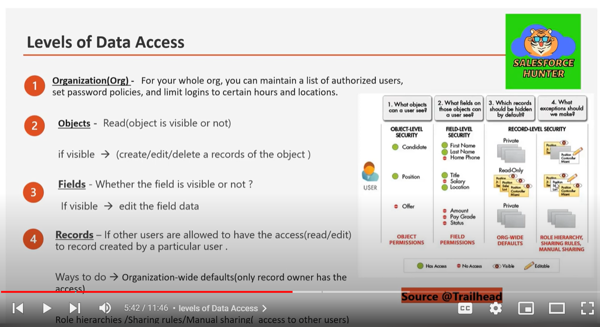
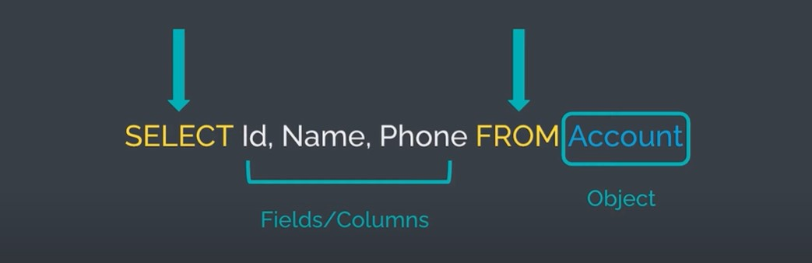
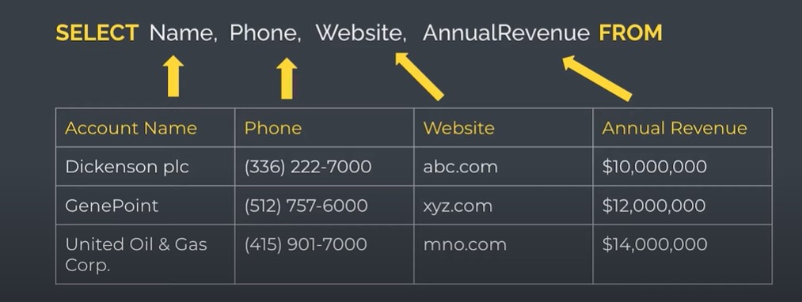

<div id=top-of-page></div>

- [INTRODUCTION](#introduction)
- [CRM Overview](#crm-overview)
- [Salesforce CRM Benefits](#salesforce-crm-benefits)
- [RELATIONSHIPS](#relationships)
  - [1.Lookup Field / Lookup Relationship](#1lookup-field--lookup-relationship)
  - [2.Master Detail Relationship](#2master-detail-relationship)
    - [Rollup Summary Field](#rollup-summary-field)
    - [How to convert Lookup to Master-Detail Relationship](#how-to-convert-lookup-to-master-detail-relationship)
    - [How to convert Master-Detail relationship into Lookup.](#how-to-convert-master-detail-relationship-into-lookup)
  - [3.Junction Object (Many To Many) Relationship](#3junction-object-many-to-many-relationship)
- [List View](#list-view)
- [Lightning Pages - Home Page, Record Page, App Page](#lightning-pages---home-page-record-page-app-page)
- [Duplicate and Matching Rule](#duplicate-and-matching-rule)
  - [DUPLICATE RULE](#duplicate-rule)
  - [MATCHING RULE](#matching-rule)
- [Activities : Task, Events, Call, Email](#activities--task-events-call-email)
- [Feed Tracking](#feed-tracking)
- [Field History Tracking](#field-history-tracking)
- [Global Actions](#global-actions)
- [View setup audit trails](#view-setup-audit-trails)
- [DATA SECURITY](#data-security)
  - [Level of Data Access](#level-of-data-access)
    - [1. Organization Level Security](#1-organization-level-security)
    - [2. Object Level Security](#2-object-level-security)
    - [3. Field Level Security](#3-field-level-security)
      - [PROFILES](#profiles)
      - [What Can be controlled through Profile?](#what-can-be-controlled-through-profile)
      - [Enhanced User Profile](#enhanced-user-profile)
      - [PERMISSION SETS](#permission-sets)
      - [PERMISSION SET GROUPS](#permission-set-groups)
      - [MUTE in Permission Set Group](#mute-in-permission-set-group)
    - [4. Record Level Security](#4-record-level-security)
- [APPROVAL PROCESS](#approval-process)
- [Dynamic Forms](#dynamic-forms)
- [Object Specific Actions/ Quick Actions](#object-specific-actions-quick-actions)
- [FLOWS](#flows)
  - [When to Use?](#when-to-use)
  - [Flow Elements](#flow-elements)
  - [Types of Flows](#types-of-flows)
    - [1. Screen Flow](#1-screen-flow)
    - [2. Record Triggered Flow](#2-record-triggered-flow)
    - [3. Schedule Triggered Flow](#3-schedule-triggered-flow)
    - [4. Platform Event Triggered Flow](#4-platform-event-triggered-flow)
    - [5. Autolaunched Flow](#5-autolaunched-flow)
- [WebToLead](#webtolead)
- [WebToCase](#webtocase)
- [EmailToCase](#emailtocase)
- [SOQL Salesforce Object Query Language](#soql-salesforce-object-query-language)
  - [What is SOQL](#what-is-soql)
  - [SOQL Statement](#soql-statement)
  - [Building SOQL](#building-soql)
  - [Salesforce Admin: Roles \& Responsibilities](#salesforce-admin-roles--responsibilities)
- [User Management:](#user-management)
  - [Salesforce Admin: Key Roles \& Responsibilities (Interview Summary)](#salesforce-admin-key-roles--responsibilities-interview-summary)
- [User Management: Creating users, assigning roles, profiles, and managing permissions.](#user-management-creating-users-assigning-roles-profiles-and-managing-permissions)
- [Data Management: Import/export data, maintain data quality, and clean up records.](#data-management-importexport-data-maintain-data-quality-and-clean-up-records)
- [Security: Configuring profiles, roles, sharing rules, and field-level security.](#security-configuring-profiles-roles-sharing-rules-and-field-level-security)
- [Customization: Creating and managing objects, fields, validation rules, and workflows.](#customization-creating-and-managing-objects-fields-validation-rules-and-workflows)
- [Automation: Using declarative tools like Flow Builder, Process Builder, and Approval Processes.](#automation-using-declarative-tools-like-flow-builder-process-builder-and-approval-processes)
- [Reports \& Dashboards: Building custom reports and dashboards to visualize key metrics.](#reports--dashboards-building-custom-reports-and-dashboards-to-visualize-key-metrics)
- [System Maintenance: Monitoring updates, performing audits, and testing features in sandbox environments.](#system-maintenance-monitoring-updates-performing-audits-and-testing-features-in-sandbox-environments)
- [Support \& Training: Assisting users, troubleshooting issues, and delivering training.](#support--training-assisting-users-troubleshooting-issues-and-delivering-training)
  - [Salesforce Developer: Key Roles \& Responsibilities (Interview Summary)](#salesforce-developer-key-roles--responsibilities-interview-summary)
- [Custom Development: Writing Apex classes, triggers, and developing Lightning Web Components (LWC).](#custom-development-writing-apex-classes-triggers-and-developing-lightning-web-components-lwc)
- [Integration: Integrating Salesforce with external systems via REST, SOAP APIs, and Platform Events.](#integration-integrating-salesforce-with-external-systems-via-rest-soap-apis-and-platform-events)
- [Apex \& Database: Writing SOQL/SOSL queries and handling batch processing.](#apex--database-writing-soqlsosl-queries-and-handling-batch-processing)
- [UI Development: Creating custom UIs using LWC and Aura, ensuring responsiveness and usability.](#ui-development-creating-custom-uis-using-lwc-and-aura-ensuring-responsiveness-and-usability)
- [Testing \& Debugging: Writing unit tests for code coverage and troubleshooting using debug logs.](#testing--debugging-writing-unit-tests-for-code-coverage-and-troubleshooting-using-debug-logs)
- [Deployments: Managing deployments through Change Sets, Salesforce DX, and version control tools (Git, Jenkins).](#deployments-managing-deployments-through-change-sets-salesforce-dx-and-version-control-tools-git-jenkins)
- [API \& Automation: Using Salesforce APIs and building automation solutions with Apex and Flows.](#api--automation-using-salesforce-apis-and-building-automation-solutions-with-apex-and-flows)
- [This provides a concise overview of each role’s responsibilities for an interview setting.](#this-provides-a-concise-overview-of-each-roles-responsibilities-for-an-interview-setting)
- [Interview Discussion](#interview-discussion)
    - [Interviewer:](#interviewer)
    - [Abhishek:](#abhishek)
    - [Interviewer:](#interviewer-1)
    - [Abhishek:](#abhishek-1)
    - [Interviewer:](#interviewer-2)
    - [Abhishek:](#abhishek-2)
    - [Interviewer:](#interviewer-3)
    - [Abhishek:](#abhishek-3)
    - [Interviewer:](#interviewer-4)
    - [Abhishek:](#abhishek-4)
    - [Interviewer:](#interviewer-5)
    - [Abhishek:](#abhishek-5)
    - [Interviewer:](#interviewer-6)
    - [Abhishek:](#abhishek-6)
    - [Interviewer:](#interviewer-7)
    - [Abhishek:](#abhishek-7)
- [Possible Interview Questions](#possible-interview-questions)
    - [1. **Can you explain your role as a Salesforce Developer/Administrator at Infosys?**](#1-can-you-explain-your-role-as-a-salesforce-developeradministrator-at-infosys)
    - [2. **What specific features of Lightning Web Components (LWC) have you worked with?**](#2-what-specific-features-of-lightning-web-components-lwc-have-you-worked-with)
    - [3. **How have you handled data integration between Salesforce and external systems?**](#3-how-have-you-handled-data-integration-between-salesforce-and-external-systems)
    - [4. **What challenges did you face when managing data quality in Salesforce?**](#4-what-challenges-did-you-face-when-managing-data-quality-in-salesforce)
    - [5. **What automation tools in Salesforce have you worked with?**](#5-what-automation-tools-in-salesforce-have-you-worked-with)
    - [6. **Can you describe a complex trigger or Apex class you’ve written?**](#6-can-you-describe-a-complex-trigger-or-apex-class-youve-written)
    - [7. **How do you manage Salesforce deployments and version control?**](#7-how-do-you-manage-salesforce-deployments-and-version-control)
    - [8. **What kind of reports and dashboards have you created in Salesforce?**](#8-what-kind-of-reports-and-dashboards-have-you-created-in-salesforce)
    - [9. **How do you ensure that your Salesforce applications are secure?**](#9-how-do-you-ensure-that-your-salesforce-applications-are-secure)
    - [10. **Can you share an instance when you received appreciation or recognition for your work?**](#10-can-you-share-an-instance-when-you-received-appreciation-or-recognition-for-your-work)
    - [11. **What certifications do you hold, and how have they contributed to your role?**](#11-what-certifications-do-you-hold-and-how-have-they-contributed-to-your-role)
    - [12. **How have you used Salesforce Data Loader or Workbench in your projects?**](#12-how-have-you-used-salesforce-data-loader-or-workbench-in-your-projects)
- [Here are more **Salesforce Admin Topic-wise** interview questions and answers to help you prepare:](#here-are-more-salesforce-admin-topic-wise-interview-questions-and-answers-to-help-you-prepare)
    - [**1. Salesforce Platform Overview**](#1-salesforce-platform-overview)
    - [**2. User and Data Security**](#2-user-and-data-security)
    - [**3. Record Management**](#3-record-management)
    - [**4. Automation and Workflow**](#4-automation-and-workflow)
    - [**5. Reports and Dashboards**](#5-reports-and-dashboards)
    - [**6. Data Management and Import/Export**](#6-data-management-and-importexport)
    - [**7. Validation and Data Quality**](#7-validation-and-data-quality)
    - [**8. Salesforce App Development**](#8-salesforce-app-development)
    - [**9. Security and Access Control**](#9-security-and-access-control)
    - [**10. Miscellaneous**](#10-miscellaneous)


# INTRODUCTION
- Salesforce is the world's most popular CRM system.
- Many companies and customers rely on this dynamic,
  web-based, low-cost CRM platform.
- It was founded in March 1999 by Marc Benioff.
- Salesforce unites businesses marketing, sales, commerce,
  service and IT teams from anywhere with Customer 360 - one
  integrated CRM platform that powers entire suite of
  connected apps.

# CRM Overview
- Customer Relationship Management
- Broadly defined, CRM is a strategy for managing a
  company's interactions with clients and sales
  prospects and ensuring the 'Connect' sustains
  throughout the relation.
  
# Salesforce CRM Benefits
- Helps businesses manage their customer interactions and sales
  processes.
- Known for customer-centric approach.
- Provides tools for managing customer data, tracking sales, automating
  marketing, customer services tasks, and analyzing business performance.
- Cloud based so can be accessed from anywhere with an internet
  connection.
- It is highly customizable and can be integrated with other systems and
  applications.
- Provides industry specific solutions to help various sectors like education,
  healthcare, communication, nonprofit, financial services etc.


# RELATIONSHIPS

## 1.Lookup Field / Lookup Relationship

- One to Many relationship between the two object(Parent - Chiild)

  - Eg. Account (Parent) to Contacts, Opportunity, Cases (Child)

- LookupFilelds are created to the child not on Parent.

  - Eg. Class -Parent (Related List)

- Student- Child (Lookup Field)
- It is **Loosely coupled**.

<div align="right"><a href="#top-of-page">(^)</a></div>

## 2.Master Detail Relationship

- One to Many Relationship between two Objects (Parent - Child)
- If Master records are deleted then all related records will be deleted.
- **Tightly Coupled**.
- Relationship field will be created on Detail side or Child side.
- We cannot create Master-Detail on **Standard Object**.

<div align="right"><a href="#top-of-page">(^)</a></div>

### Rollup Summary Field

- Rollup Summary Fileds are always created on Master Side.
- **COUNT, SUM, MIN, MAX** aggregate fuctions.
- Rollup Summary Field are Read Only fields.
- 40 Rollup Summary we can create per Object. But It's not recommended to go beyond 25.

<div align="right"><a href="#top-of-page">(^)</a></div>

### How to convert Lookup to Master-Detail Relationship

- If the Records are present on object we will not be able to create relationship among the object.
- First we have to select Parent Object for every record , then we can able to convert it to Master-Detail.
- We can't able to change Filter Logic from AND to OR.

<div align="right"><a href="#top-of-page">(^)</a></div>

### How to convert Master-Detail relationship into Lookup.

- If Rollup Summaries are present on the Master then we have to delete it first from Parent Object & Recycle bin to convert Master-Detail to Lookup.
- IF we want to delete Rollup Summary field after deletion, Go to deleted field on the same object and Erase the Field then only we can convert Master-Detail to Lookup.

<div align="right"><a href="#top-of-page">(^)</a></div>

## 3.Junction Object (Many To Many) Relationship

- We have to create one Object (Third Table) in which two Master-Detail Object Fields we have to save.
- As Salesforce Limitation, One Object we can have only Two Master-Detail Relationship, So we can not able to Create Third MAster-Detail relationship in the same Junction Object.

<div align="right"><a href="#top-of-page">(^)</a></div>

# List View

- All record and Recently Viewed.
- Shows list of records available under object.
- We can choose which fields to display in List View.
- Also We can apply Sharing & Filters on the List View.

<div align="right"><a href="#top-of-page">(^)</a></div>

# Lightning Pages - Home Page, Record Page, App Page

- Home Page, Record Page, App Page
  - Steps: Setup-> Home-> Search Lightning App Builder-> New
- We can add component to page.
- We can add, edit the homepage through gear icon> Edit Page or Lightning app builder.
- We can set component visibility by filter.
- Pages are shared with Profile and App.
- We can have different Pages for Different Profiles and Apps."

<div align="right"><a href="#top-of-page">(^)</a></div>

# Duplicate and Matching Rule

## DUPLICATE RULE

- Prevent creation of Duplicate Records.
- It shows either Warning or block record creation and updation in case of duplicates.
- We can create reports on Duplicate Records as well.

## MATCHING RULE

- Here we need to set Criteria for Duplicate Check.
- If we want to create Duplicate Rule, then we must have to create matching rule.
- Enforce record sharing rule means the duplicate records check which user can have access to.
- Bypass record sharing rule means duplicate record check in all records the user have access to.
- We can create Duplicate check through Flow and Trigger.
  - Upto 5 active matching rule are allowed per Object.
  - Upto 25 total matching rule are allowed.
  - Upto 100 Total matching rule are allowed(both active & Inactive).
  - Only one lookup Field is allowed per matching Rule.

<div align="right"><a href="#top-of-page">(^)</a></div>

# Activities : Task, Events, Call, Email

- Bydefault these activities are ON for standard Objects.
- For Custom Objects, We need to check the option **"Allow Activities"** while creation of Object.
- <div align="right"><a href="#top-of-page">(^)</a></div>

# Feed Tracking

- Feed tracking enables to **track changes** of **Selected Field and Related Record Field**
- Changes are shown in Chatter Component.
- It shows Old Value, New Value and who has change the Value. - You can select upto 20 Field for Feed Tracking for one Object. -
<div align="right"><a href="#top-of-page">(^)</a></div>

# Field History Tracking

- Field History Tracking enables to **track changes of Selected Fields**
- Changes are shown in History Related List.
- It shows Old Value, New Value and who has change the Value.
- We have to Set History Tracking on the Object.
- We have to check the option **"Track Field History"** while creating the Object or Edit and check the same option.
- We have to add Related Field History to the Page Layout, So that we can able to see the Field History Tracking.
- <div align="right"><a href="#top-of-page">(^)</a></div>

# Global Actions

- Top Right + Sign (New Event, New Task, New Contact, Log a Call, New Opportunity, New Case, New Lead, Email)

<div align="right"><a href="#top-of-page">(^)</a></div>

# View setup audit trails

- It shows list of changes done by user in differet components.
- We can download past 6 month changes.

<div align="right"><a href="#top-of-page">(^)</a></div>

# DATA SECURITY

- Data Security is important because you need to control what a user or group of user can see in the org or app.
- Salesforce Provides Layered Sharing Model.
- You can easily assign different data sets to different group of users.
- You can control access to your whole org, any specific object, field and records.

<div align="right"><a href="#top-of-page">(^)</a></div>

## Level of Data Access

1. Organization
2. Objects
3. Fields
4. Records


</br>


<div align="right"><a href="#top-of-page">(^)</a></div>

### 1. Organization Level Security

- Maintain a list of authorized users.
- Set password policies.
- Limit Login to certain hours & locations.
- Limit IP addresses from which users can login.
- Limit the times at which users can login.

<div align="right"><a href="#top-of-page">(^)</a></div>

### 2. Object Level Security

- You can Control Object Level Permissions for Standard and Custom Objects.
- You can Set Permissions for a particular Object.
- You can give permissions to View, Create, Edit and Delete any records of that object.
- You can control Object Permissions using Profiles and Permission Sets.
  - For Object we have 4 permission View, Create, Edit & Delete.
  - 1 Security 2 Sharing

<div align="right"><a href="#top-of-page">(^)</a></div>

### 3. Field Level Security

- You can Restrict access to certain fields in Salesforce, even if user has Object Level Access.
- You can make a field Visible to a particular user and can Hide that from another user.
- You can give READ or EDIT permisiion to a field, if you don't give both then tat field will not be Visible.
- Field Level Security can be controlled using Profiles and Permission Sets.
- For Field we have only 2 permission **READ & EDIT**.

<div align="right"><a href="#top-of-page">(^)</a></div>

#### PROFILES

- Profile is collection of Settings & Permissions.
- Profile settings determine which data that user can see and Permissions determine what user can do with that data.
- Profile can be assigned to many users, but a user can only have one profile at a time.
- We need to clone existing profile.
- **Profile** is used to **Restrict Object and fields.**

<div align="right"><a href="#top-of-page">(^)</a></div>

#### What Can be controlled through Profile?
- Assigned App & Assigned Connected Apps.
- Object Settings
- App Permissions
- Apex Class & VF Page Access
- External Data Source Access
- Named Credential Access
- Flow Access
- Custom Permissions & Custom Metadata Type
- Custom Setting Definitions
- System Permissions

#### Enhanced User Profile

Go to User Management Settings & activate Enhanced Profile User Interface
<div align="right"><a href="#top-of-page">(^)</a></div>

#### PERMISSION SETS

- A Permission Set is a collection of Settings and permissions that give user access to various tools and functions.
- Permission Sets extend users functional access without changing their Profile.
- Through Permission Sets Permission can be granted and any time it can be revoke as well.
- Users can have only one Profile, but they can have multiple Permission Sets assigned.
- **Permission Sets** Used to **Open-up Object and fields**.

<div align="right"><a href="#top-of-page">(^)</a></div> 

#### PERMISSION SET GROUPS
- Permission Set group bundles different permission sets together based on a persona.
- Permission set group includes all the permissions available in the permission sets.
- One permission set can be included in more than one permission set groups.
- A user can be assigned one or more Permission Set Groups.
- Also we can assign Permission Set and Permission Set Groups together to users.
- **Permission Sets Group** Used to **Open-up Object and fields**

<div align="right"><a href="#top-of-page">(^)</a></div> 

#### MUTE in Permission Set Group
What is MUTE in Permission Set Group?

- One can mute some permissions in Permission Set Groups so that they won't be given to the user.
- If you mute particular permission in Permission Set Group then it won't impact individual Permission Set, they remain intact.
- You can anytime unmute the permissions in permission set group.

<div align="right"><a href="#top-of-page">(^)</a></div>

### 4. Record Level Security

- You can restrict access to records for users, even if user has object level permissions.
  - For example, a user can view his own records but not others.
- You can manage Record Level Access in following ways:  
    1. Oganization-wide defaults  
    2. Role hierarchies   
    3. Sharing rules 
    4. Manual sharing


    #### 1. Oganization-wide defaults 
    
    - It specified the default level of access of records.
    - Org-wide sharing setting lock down the data to the most restrictive level.
    - Here you have three access level:
       - Private
       - Public Read-Only
       - Public Read/Write
    - You can use other Record Level security and sharing tools to open up the sharing of records.
    - **OWD used to Restrict Record**
  
    #### 2. Role hierarchies

    - It gives access for higher in the hierarchy.
    - That user can access all records owned by the users below them in the hierarchy.
    - Each role in the hierarchy should represent a level of Data access that a user or group of user needs.
    - **Role Hierarchy used to Openup records** 
    - Automatically assigns
  
    #### 3. Sharing Rules

    - These are exceptions to Org-Wide defaults.
    - Through sharing rules you can share records to a group of users.
      So that, they can get access to the records they don't own or can't manually see.
    - **Sharing Rules used to Openup Records**
    - Owner based(public group we have to create) and criteria based
    - Record access Cant be share through Profile n permission sets. 

    #### 4. Manual Sharing

    - It allows owners of particular records to share them with another users.
    - Manual sharing is not automated like Org-wide defaults, Role hierarchy or sharing rules.
    - It can be useful in some situation where you manually want to share a record with another user.
    - **Manual Sharing Rules used to Openup records**
    - Used to share specific record to the group of users or particular user
    - We can bypass record level security through Profile and permissions sets using viewall n modifyall 
  
<div align="right"><a href="#top-of-page">(^)</a></div> 

# APPROVAL PROCESS

- An approval process is an automated process.
- It is implemented to approve records.
- We can specifies the steps those are necessary for approval.
- It allows a step to apply to all records or just records that have certain attributes.
- In approval process we can also define who will be approving at each step.
- Approver can take steps that when a record is approved, reiected or recalled.
- We have to create email template for approve n reject. Also we have assign role to the user if not assigned. Manager or any person. It depends on criteria weather we have to approve or reject the record creation. 

<div align="right"><a href="#top-of-page">(^)</a></div> 

# Dynamic Forms
Page Setup
<div align="right"><a href="#top-of-page">(^)</a></div>

# Object Specific Actions/ Quick Actions
- Object related actions on the top right corner.
  - Object Manager-> Select Object ->Buttons, Links and Actions -> New Actions
<div align="right"><a href="#top-of-page">(^)</a></div>

# FLOWS
- Provides declarative process automation.
  - Lightning flow provides this point and click automation tool i.e. Taw Butter.
  - Lightning Flow is the name of product.
- Process Builder and Flow Builder are name of the tools.
- Use Process Builder to create Processes.
- Use Flow Builder to create Flows.

## When to Use?
- Automate a guided visual experience.
  - Screen Flow
- To build complex functionality which can run automatically in the background.
  - Record Triggered Flow
  - Scheduled Triggered Flow
- Need to call flows from apex or lightning com
  - Auto launched Flow

## Flow Elements
**Interaction**
- Screen
- Action
- Subflow

**Logic**
- Assignment
- Decision
- Loop
- Collection Sort
- Collection Filter

**Data** 
- Create Records
- Update Records
- Get Records
- Delete Records

**Resources That can be created:**
- Variable
- Constant
- Formula
- Text Template
- Choice
- Record Choice Set
- Picklist Choice Set
- Stage

## Types of Flows
1. Screen Flow
2. Record Triggered Flow
3. Schedule Triggered Flow
4. Platform Event Triggered Flow
5. Autolaunched Flow
6. Record Triggered Orchestration 
   - Record Triggered Orchestration - runs whenever a specified type of record is created or updated

### 1. Screen Flow
- It guides user through a business process
- It can be launched through
  - Lightning Page,
  - Experience Cloud Sites,
  - Quick Actions and more.
 
### 2. Record Triggered Flow
- Record - Triggered Flow
- Launches when a Record is
  - Created
  - Updated or
  - Deleted
- This autolaunched flow runs in the background.

- It actually replaces WORKFLOW and PROCESS BUILDER functionality. Because WORKFLOW and PROCESS BUILDER are used to create and update records only. But the RECORD TRIGGERED FLOW is launch when record ths Created updated and deleted.

 
### 3. Schedule Triggered Flow

- Launches at a specified time and frequency for each record in a batch.
  - This autolaunched flow also runs in the background.

### 4. Platform Event Triggered Flow

### 5. Autolaunched Flow

- It is invoked by
  - Apex
  - Processes means Process Builders
  - REST API
  - and more...
- This autolaunched flow also runs in the background.

**Migrate to Flows**
- All the process automations which are in workflow rules and process builders we can migrate to flow using this functionality. because Process builder and workflow rules are depricated.


<div align="right"><a href="#top-of-page">(^)</a></div>

**How to Add Screen Flow to Quick action and page Layout**
- Object Manager-> Select Object ->Buttons, Links and Actions -> New Actions
Then goto Specific Object PageLayout > Add >Save
- Using Section we can split the object element in screen flow

**How to Add Screen Flow to record page Layout**
- Setting Gear icon > Edit Page> Right side serch for flow> Drag Flow to Activity and chatter
  
# WebToLead
- Generate Web-To Lead form (map with standard field/custom field/record type)
- Generate Web—To Lead form (map With Campaign)
- Default Lead Creator
- Default Lead Response Template
- Default Lead Owner (User/Queue)
- Notify Default Lead Owner (User/Queue)
- Generate Web-To Lead with re-CAPTCHA  API (to avoid Spam Records)
      
- Debug your web-to lead form
- Lead Assignment Rules
- Lead Auto-Response Rules
- Place Web-To Lead form into Public Website
- Lead Convert (Account, Contact, Opportunity)
- Generate Reports
- Web-To Lead Limitations

<div align="right"><a href="#top-of-page">(^)</a></div> 

# WebToCase

<div align="right"><a href="#top-of-page">(^)</a></div> 

# EmailToCase

<div align="right"><a href="#top-of-page">(^)</a></div> 

# SOQL Salesforce Object Query Language

## What is SOQL 
- SOQL - Salesforce Object Query Language
- Query the data from Salesforce Object

##  SOQL Statement 

</br>

## Building SOQL 

</br>

## Salesforce Admin: Roles & Responsibilities
# User Management:

Creating and managing user accounts.
Assigning and managing profiles, permission sets, roles, and licenses.
Troubleshooting user access issues and login problems.
Security and Access Control:

Implementing and managing security features like profiles, roles, sharing rules, and field-level security.
Ensuring data security and access control by managing record visibility.
Data Management:

Managing data import/export using tools like Data Loader, Data Import Wizard, and Salesforce native tools.
Regular data maintenance tasks like deduplication, mass updates, and data cleaning.
Ensuring data quality and integrity across objects and records.
Customization & Configuration:

Configuring standard Salesforce objects, fields, page layouts, and record types.
Creating and managing custom objects, fields, and validation rules.
Implementing workflows, Process Builder, and flows for automation.
Reports & Dashboards:

Creating and customizing reports to meet business needs.
Building dashboards to provide a visual representation of key metrics.
Managing report folders and setting report access permissions.
Automation:

Automating business processes using declarative tools like Process Builder, Workflow Rules, and Flows.
Managing approval processes for document routing and approvals.
Salesforce Updates and Maintenance:

Monitoring Salesforce updates and releases, ensuring the org is up to date.
Testing new features in sandbox environments before deployment.
Ensuring that customizations are compatible with Salesforce releases.
Training & Support:

Providing support and training to end users to enhance adoption and effective use of Salesforce.
Creating user documentation and delivering training sessions.
Assisting users with questions, troubleshooting, and issue resolution.
AppExchange & Third-Party Integration:

Installing and managing apps from Salesforce AppExchange.
Assisting with integrating third-party applications into the Salesforce environment.
System Health Monitoring:

Monitoring system performance, managing licenses, and monitoring storage usage.
Conducting regular system audits to ensure compliance with security policies.
Salesforce Developer: Roles & Responsibilities
Custom Development:

Writing and maintaining Apex classes, triggers, and batch processes for custom development needs.
Developing Lightning Web Components (LWC) and Aura components for custom user interfaces.
Customizing Visualforce pages to extend functionality and create tailored interfaces.
Apex and Database Management:

Writing SOQL (Salesforce Object Query Language) and SOSL (Salesforce Object Search Language) queries.
Handling large data sets and managing data processing using Batch Apex, Queueable Apex, and Future methods.
Working with governor limits and ensuring efficient, scalable code.
Integration:

Integrating Salesforce with external systems via REST, SOAP APIs, and web services.
Using Platform Events, Change Data Capture (CDC), and Salesforce Connect for real-time integrations.
Setting up callouts to third-party services using HTTP requests.
Custom UI and Frontend Development:

Building custom UIs using Lightning Web Components and Aura framework.
Creating reusable components and managing complex client-side logic with JavaScript.
Ensuring a responsive and optimized user interface.
Testing and Debugging:

Writing unit tests to ensure code coverage and following best practices for deployment.
Debugging issues using debug logs, Salesforce Inspector, and other tools.
Performing error handling in Apex code and ensuring smooth user experiences.
Salesforce APIs and Tools:

Working with various Salesforce APIs (REST, SOAP, Bulk, Metadata, Tooling API).
Using Salesforce CLI and Developer Console for deployment and debugging.
Managing metadata using the Metadata API or tools like the ANT Migration Tool.
Deployments & Version Control:

Managing deployments between Salesforce environments using Change Sets, Salesforce DX, or tools like Git, Jenkins, or Copado.
Creating and deploying managed/unmanaged packages.
Collaborating with admins and stakeholders to ensure proper testing and successful deployment of solutions.
Automation & Logic:

Implementing complex business logic and workflows through custom code.
Leveraging Process Automation tools in combination with custom logic (Flows, Process Builder, and Apex).
Environment Management:

Working with multiple orgs (sandbox, developer, and production environments).
Setting up continuous integration/continuous delivery (CI/CD) pipelines.
Managing version control and automating deployments.
AppExchange Product Development:

Developing apps for Salesforce AppExchange.
Managing security reviews and packaging apps for distribution.
Key Differences Between Salesforce Admin and Developer:
Salesforce Admins focus more on declarative (point-and-click) configurations, security, and user management. They implement changes to improve system performance, handle data management, and provide user support.

Salesforce Developers focus on programmatic solutions, writing code to extend the platform’s capabilities, custom integrations, and building new functionalities using Salesforce’s development tools and frameworks (Apex, LWC, API integration).

Both roles complement each other, with Admins handling the configuration and customization side, while Developers tackle more complex, coded solutions that require higher technical expertise.

<div align="right"><a href="#top-of-page">(^)</a></div> 

## Salesforce Admin: Key Roles & Responsibilities (Interview Summary)
# User Management: Creating users, assigning roles, profiles, and managing permissions.
# Data Management: Import/export data, maintain data quality, and clean up records.
# Security: Configuring profiles, roles, sharing rules, and field-level security.
# Customization: Creating and managing objects, fields, validation rules, and workflows.
# Automation: Using declarative tools like Flow Builder, Process Builder, and Approval Processes.
# Reports & Dashboards: Building custom reports and dashboards to visualize key metrics.
# System Maintenance: Monitoring updates, performing audits, and testing features in sandbox environments.
# Support & Training: Assisting users, troubleshooting issues, and delivering training.


## Salesforce Developer: Key Roles & Responsibilities (Interview Summary)
# Custom Development: Writing Apex classes, triggers, and developing Lightning Web Components (LWC).
# Integration: Integrating Salesforce with external systems via REST, SOAP APIs, and Platform Events.
# Apex & Database: Writing SOQL/SOSL queries and handling batch processing.
# UI Development: Creating custom UIs using LWC and Aura, ensuring responsiveness and usability.
# Testing & Debugging: Writing unit tests for code coverage and troubleshooting using debug logs.
# Deployments: Managing deployments through Change Sets, Salesforce DX, and version control tools (Git, Jenkins).
# API & Automation: Using Salesforce APIs and building automation solutions with Apex and Flows.
# This provides a concise overview of each role’s responsibilities for an interview setting.


<div align="right"><a href="#top-of-page">(^)</a></div>

# Interview Discussion

Here’s an **interview discussion** based on **Abhishek Bhalerao's resume**:

### Interviewer:  
**Can you briefly summarize your experience in Salesforce?**

### Abhishek:  
I have 2.5 years of experience working as a Salesforce Developer and Administrator. Over the years, I’ve developed a strong understanding of Salesforce's security model, built Lightning Components, and worked with both Aura framework and Lightning Web Components (LWC). Additionally, I have experience in developing Apex Classes and Triggers to meet various functional requirements. I’ve worked with Salesforce standard objects like Accounts, Contacts, Leads, and Opportunities, and have built custom objects, validation rules, dashboards, and reports to address business needs【17†source】.

---

### Interviewer:  
**What experience do you have with Salesforce automation tools like Flows and Process Builder?**

### Abhishek:  
I’ve worked extensively with both Flows and Process Builder. I’ve used Flows to automate complex business processes by creating screen flows, record-triggered flows, and auto-launched flows. Process Builder was used to automate more straightforward tasks, such as field updates and approval processes. These tools helped streamline workflows, reducing manual tasks, and increasing efficiency across different departments【17†source】.

---

### Interviewer:  
**Can you elaborate on your experience with Lightning Web Components (LWC)?**

### Abhishek:  
Yes, I have hands-on experience with LWC. I’ve developed custom Lightning Web Components for various projects, handling both the client-side and server-side logic. I am proficient in the LWC bundle structure, including HTML templates, JavaScript controllers, and CSS. I’ve also used Lightning Data Service (LDS) to interact with Salesforce data, ensuring that components are lightweight and performant. I worked on integrating LWC with Apex for more complex business logic【17†source】.

---

### Interviewer:  
**How do you ensure data security in Salesforce, particularly when handling sensitive information?**

### Abhishek:  
Data security is critical, and I manage it through Salesforce's built-in security features. I use profiles, permission sets, and roles to control access at the object, field, and record levels. I also configure sharing settings and validation rules to maintain data integrity and privacy. Additionally, I am familiar with Salesforce's Field Level Security (FLS) and Shield Platform Encryption when dealing with particularly sensitive data【17†source】.

---

### Interviewer:  
**Can you describe a project where you worked on Salesforce customization, and what challenges you faced?**

### Abhishek:  
I worked on a project for a UK-based client in the food and beverage industry. The goal was to capture leads and track product status globally. My responsibilities included creating custom objects, fields, validation rules, and dashboards to support the sales cycle. One challenge was ensuring data quality and consistency across different regions, which I addressed by implementing strict validation rules and building automated flows to handle complex workflows efficiently【17†source】.

---

### Interviewer:  
**What tools do you use for deployment, and how do you manage version control in Salesforce?**

### Abhishek:  
I use various deployment tools, including Salesforce DX and Change Sets, depending on the complexity of the deployment. For version control, I rely on Git to track changes and manage code versions. In larger projects, I’ve integrated Salesforce CLI with Jenkins for CI/CD to streamline the deployment process and reduce errors when moving between sandbox and production environments【17†source】.

---

### Interviewer:  
**You’ve mentioned that you have experience with Apex development. Can you give an example of a complex Apex trigger or class you’ve developed?**

### Abhishek:  
One example was developing a complex trigger to automate the lead assignment process. Based on specific criteria like region, product interest, and lead score, the trigger automatically assigned leads to the right team. I had to ensure that the trigger adhered to Salesforce governor limits, so I optimized SOQL queries and used bulkified triggers to handle larger datasets efficiently【17†source】.

---

### Interviewer:  
**What certifications do you hold, and how do they help in your Salesforce career?**

### Abhishek:  
I have the **Salesforce Certified Administrator**, **Salesforce Certified App Builder**, **Platform Developer I**, and **Salesforce Associate** certifications. These certifications validate my skills in different aspects of Salesforce, from development and administration to advanced customization and automation. They’ve helped me stay up-to-date with Salesforce best practices and have enhanced my ability to provide solutions that meet both technical and business requirements【17†source】.

---

This interview script highlights Abhishek’s experience and skills as outlined in his resume, presenting him as a well-rounded Salesforce professional with strong hands-on experience in development and administration.

<div align="right"><a href="#top-of-page">(^)</a></div>

# Possible Interview Questions  

Here are **possible interview questions and their answers** based on **Abhishek Bhalerao's resume**:

### 1. **Can you explain your role as a Salesforce Developer/Administrator at Infosys?**
   **Answer**:  
   At Infosys, I worked as a Technology Support Specialist where I performed both developer and administrator tasks. I developed custom objects, fields, and dashboards, and created validation rules to ensure data quality. On the development side, I worked extensively with Lightning Web Components (LWC), Apex classes, and triggers to meet client-specific business requirements. I also handled automation using flows, Process Builder, and maintained security configurations like profiles and roles【17†source】.

---

### 2. **What specific features of Lightning Web Components (LWC) have you worked with?**
   **Answer**:  
   I have developed several components using LWC. This includes handling client-side logic with JavaScript, HTML templates for rendering UI, and using Lightning Data Service (LDS) for fetching and saving records without writing Apex code. I also integrated LWC with Apex when complex business logic was required. Additionally, I utilized standard SLDS classes to ensure components adhered to Salesforce's design standards【17†source】.

---

### 3. **How have you handled data integration between Salesforce and external systems?**
   **Answer**:  
   In my projects, I have worked on Salesforce integrations using REST and SOAP APIs. I utilized these APIs to send and receive data from external systems securely. Additionally, I used Salesforce Connect to bring in external data as external objects and worked on configuring Named Credentials for secure integrations【17†source】.

---

### 4. **What challenges did you face when managing data quality in Salesforce?**
   **Answer**:  
   One of the main challenges was ensuring that the data captured was consistent and error-free across different teams and regions. I addressed this by creating strict validation rules and automation flows to check data before it was saved in the system. I also used deduplication tools and regular data audits to ensure the accuracy of records【17†source】.

---

### 5. **What automation tools in Salesforce have you worked with?**
   **Answer**:  
   I’ve worked with **Flows**, **Process Builder**, and **Workflow Rules** to automate business processes. I often use Flows for complex automation scenarios like multi-step approvals and conditional routing. Process Builder has been handy for field updates and immediate task automation, while Workflow Rules are used for simpler tasks like email alerts【17†source】.

---

### 6. **Can you describe a complex trigger or Apex class you’ve written?**
   **Answer**:  
   I developed an Apex trigger to handle lead assignment based on multiple criteria like region, product interest, and score. This required optimizing SOQL queries and bulkifying the trigger to ensure it adhered to Salesforce governor limits. I also ensured the trigger handled errors gracefully and wrote test classes to achieve high code coverage【17†source】.

---

### 7. **How do you manage Salesforce deployments and version control?**
   **Answer**:  
   For deployments, I primarily use **Salesforce DX** and **Change Sets** depending on the size and scope of the project. For version control, I rely on **Git** to manage code changes and track development across environments. I have also used Jenkins for continuous integration and automated deployment, which helps maintain consistent deployment practices【17†source】.

---

### 8. **What kind of reports and dashboards have you created in Salesforce?**
   **Answer**:  
   I’ve created reports that track key performance metrics for leads, sales opportunities, and team performance. I also built custom dashboards for stakeholders to visualize data like lead conversion rates and time-to-assignment metrics. These reports helped improve decision-making and allowed teams to monitor their KPIs effectively【17†source】.

---

### 9. **How do you ensure that your Salesforce applications are secure?**
   **Answer**:  
   I use Salesforce's robust security model, starting with configuring profiles and permission sets to control access at the object and field levels. I also ensure record-level security by setting up roles, sharing rules, and OWD (Organization-Wide Defaults). Additionally, I work with FLS (Field-Level Security) to protect sensitive data and maintain best practices around secure coding in Apex【17†source】.

---

### 10. **Can you share an instance when you received appreciation or recognition for your work?**
   **Answer**:  
   I’ve received several appreciations from clients and my onshore operational manager. One instance was when I successfully handled a critical requirement under tight deadlines and received recognition for my problem-solving ability and attention to detail. This project involved developing custom validation rules and flows that significantly improved the client's sales process【17†source】.

---

### 11. **What certifications do you hold, and how have they contributed to your role?**
   **Answer**:  
   I hold four Salesforce certifications: **Salesforce Certified Administrator**, **Salesforce Certified App Builder**, **Platform Developer I**, and **Salesforce Associate**. These certifications have strengthened my technical and functional knowledge of Salesforce. They’ve helped me implement best practices in customization, development, and security within the platform【17†source】.

---

### 12. **How have you used Salesforce Data Loader or Workbench in your projects?**
   **Answer**:  
   I frequently use **Data Loader** for bulk data operations like importing, updating, and exporting large datasets. I’ve used **Workbench** for testing SOQL queries, debugging, and interacting with Salesforce APIs. Both tools have helped me manage data efficiently, especially during migrations and data clean-up tasks【17†source】.

---

These answers align with Abhishek's resume and demonstrate his expertise across various Salesforce tools, development, and administration tasks.

<div align="right"><a href="#top-of-page">(^)</a></div>

# Here are more **Salesforce Admin Topic-wise** interview questions and answers to help you prepare:

---

### **1. Salesforce Platform Overview**
**Q: What is Salesforce CRM?**
**A:** Salesforce CRM (Customer Relationship Management) is a cloud-based solution that helps businesses manage customer relationships, sales processes, marketing, and customer service.

**Q: What is the difference between Salesforce Classic and Lightning Experience?**
**A:** 
- **Salesforce Classic**: Older version with a traditional user interface.
- **Lightning Experience**: Modern UI with more features like better customization options, improved performance, and user-friendly design.

---

### **2. User and Data Security**
**Q: What are the different types of user licenses in Salesforce?**
**A:**
- **Salesforce License**: Provides full access to Salesforce features and data.
- **Salesforce Platform License**: Provides access to custom apps and objects, but no CRM features.
- **Chatter Free/Chatter External License**: Designed for collaboration-focused users.
- **Community License**: For users accessing Salesforce through Communities.

**Q: How can you reset a user's password in Salesforce?**
**A:** Navigate to **Setup > Users > Users**, find the user, click **Reset Password**, and Salesforce will send an email with the reset link.

**Q: Explain the concept of "Field-Level Security."**
**A:** Field-level security determines whether a user can view and edit individual fields within a record. It’s set via profiles and permission sets and ensures sensitive information is protected.

---

### **3. Record Management**
**Q: What are Record Types used for in Salesforce?**
**A:** Record Types allow the creation of multiple business processes, picklist values, and page layouts for different groups of users. They are used to categorize records like Leads, Opportunities, etc.

**Q: What is a Master-Detail relationship in Salesforce?**
**A:** In a Master-Detail relationship, the child record’s lifecycle is tightly tied to the parent record. Deleting the parent record deletes the child, and child records inherit the parent’s sharing rules and permissions.

**Q: What is a Lookup Relationship in Salesforce?**
**A:** A Lookup Relationship links two objects together, but unlike a Master-Detail relationship, deleting the parent does not delete the child, and sharing rules are not inherited.

---

### **4. Automation and Workflow**
**Q: What is Process Builder in Salesforce?**
**A:** Process Builder is a powerful automation tool that allows users to create processes with point-and-click functionality. It can update records, create new records, send emails, and more.

**Q: What is a Trigger in Salesforce?**
**A:** A Trigger is an Apex code that executes before or after specific database operations (Insert, Update, Delete) on records. Triggers help automate complex business logic.

**Q: Can you explain the difference between Workflow and Process Builder?**
**A:**
- **Workflow**: Simple automation for updating records, sending email alerts, creating tasks, and outbound messages.
- **Process Builder**: More complex automation with the ability to create new records, invoke flows, and perform conditional logic.

---

### **5. Reports and Dashboards**
**Q: What is the difference between a Tabular Report and a Summary Report in Salesforce?**
**A:**
- **Tabular Report**: Displays records in a simple list format with no grouping.
- **Summary Report**: Allows grouping of records and adding summary fields (e.g., count, sum).

**Q: How can you share a report with other users in Salesforce?**
**A:** A report can be shared with users by modifying the report’s sharing settings or by creating a folder and setting the appropriate sharing rules for that folder.

**Q: What is a Dashboard in Salesforce?**
**A:** Dashboards in Salesforce are visual representations of multiple reports. They provide a consolidated view of key metrics and data, which can be customized with various charts and graphs.

---

### **6. Data Management and Import/Export**
**Q: What is Data Import Wizard in Salesforce?**
**A:** The Data Import Wizard is a tool in Salesforce that allows users to easily import data for standard and custom objects. It offers a simple interface for mapping fields and can be used for importing small to medium-sized data sets.

**Q: What is Data Loader, and when would you use it?**
**A:** Data Loader is a tool for importing, exporting, updating, and deleting Salesforce data in bulk. It’s used when dealing with large data sets and provides more control over the import process than the Data Import Wizard.

**Q: What are the different data formats supported by Salesforce for data import/export?**
**A:** Salesforce supports **CSV (Comma Separated Values)** format for both data import and export.

---

### **7. Validation and Data Quality**
**Q: What are Validation Rules in Salesforce?**
**A:** Validation Rules are used to ensure that data entered into Salesforce meets certain criteria. When data fails the validation rule, an error message is displayed, and the user is prompted to correct the data.

**Q: Can you give an example of a Validation Rule?**
**A:** A simple example is a validation rule that ensures the Close Date on an Opportunity cannot be in the past:
```
CloseDate < TODAY()
```

**Q: What is a Formula Field in Salesforce?**
**A:** Formula fields are read-only fields that automatically calculate their value based on a formula expression. They can include calculations, text concatenation, or date manipulation.

---

### **8. Salesforce App Development**
**Q: What is a Visualforce page?**
**A:** Visualforce is a markup language used to create custom user interfaces in Salesforce. It works with Apex to provide interactive web pages and can be embedded in Salesforce pages or used as standalone pages.

**Q: What is Lightning Web Component (LWC)?**
**A:** LWC is a programming model for building modern web apps within Salesforce. It uses standard web technologies like HTML, CSS, and JavaScript to create reusable components that can be embedded in Lightning pages.

**Q: What is an Apex Trigger?**
**A:** An Apex Trigger is a piece of Apex code that runs before or after specific actions (insert, update, delete) on Salesforce records. It is used to automate complex business logic that can't be achieved with declarative tools.

---

### **9. Security and Access Control**
**Q: What is the difference between Profiles and Permission Sets?**
**A:**
- **Profile**: Controls the baseline permissions a user has, such as object-level access, field-level security, and page layouts.
- **Permission Set**: Provides additional permissions beyond what’s set in a profile and can be assigned to users as needed.

**Q: What are Organization-Wide Default (OWD) settings?**
**A:** OWD settings define the default access level for records in the organization. It can be set to **Public Read Only**, **Public Read/Write**, or **Private**. OWD settings help define the visibility of records between users.

**Q: What is the concept of Role Hierarchy in Salesforce?**
**A:** Role Hierarchy is a way of structuring access to records in Salesforce based on an organization’s hierarchy. Users higher in the hierarchy can access records owned by users lower in the hierarchy, provided sharing rules allow it.

---

### **10. Miscellaneous**
**Q: What is AppExchange?**
**A:** The **AppExchange** is Salesforce’s marketplace for third-party applications. It offers apps, components, and consulting services that extend the functionality of Salesforce.

**Q: What is the difference between "Queues" and "Public Groups" in Salesforce?**
**A:**
- **Queues**: Used for managing records in certain objects (e.g., Cases, Leads). Queues allow users to pick up records from a shared pool.
- **Public Groups**: A collection of users, roles, and other groups. They are used to share records or give permissions to users.

**Q: How does Salesforce handle API limits?**
**A:** Salesforce has a set of daily API limits depending on the organization’s edition. If limits are exceeded, calls to the API will be blocked until the next 24-hour period begins.

---

These are additional topic-wise questions and answers to help with your **Salesforce Admin** interview preparation. Let me know if you need further clarification or additional questions on specific topics!
<div align="right"><a href="#top-of-page">(^)</a></div>
<div align="right"><a href="#top-of-page">(^)</a></div>
<div align="right"><a href="#top-of-page">(^)</a></div>
<div align="right"><a href="#top-of-page">(^)</a></div>
<div align="right"><a href="#top-of-page">(^)</a></div>
<div align="right"><a href="#top-of-page">(^)</a></div>
<div align="right"><a href="#top-of-page">(^)</a></div>
<div align="right"><a href="#top-of-page">(^)</a></div>
<div align="right"><a href="#top-of-page">(^)</a></div>

